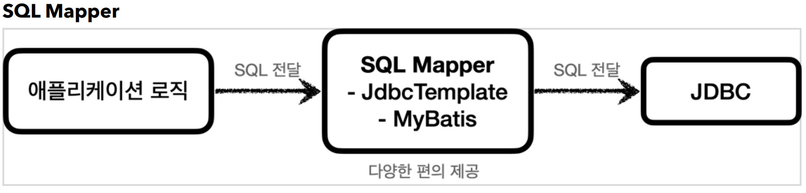
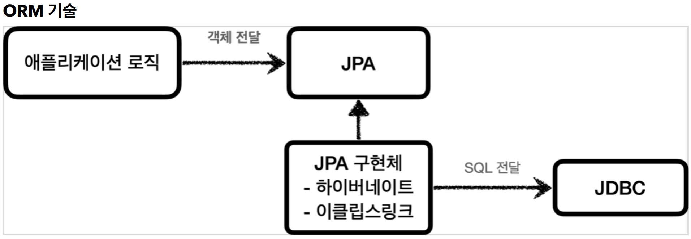
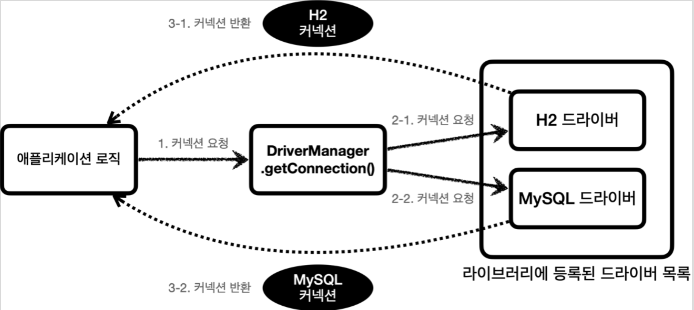
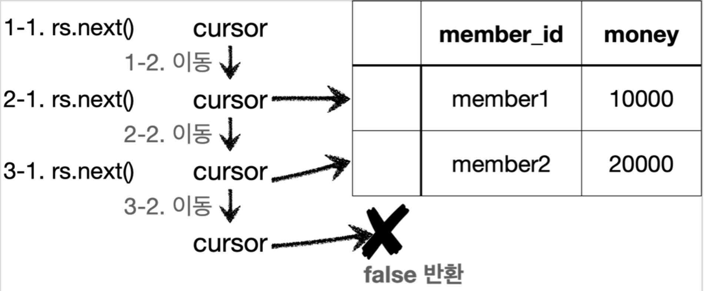

# 1. JDBC 이해

----
## JDBC 이해
#### JDBC 등장 이유
1. 데이터베이스를 다른 종류의 데이터베이스로 변경하면 애플리케이션 서버에 개발된 데이터베이스 사용
코드도 함께 변경해야 한다.
2. 개발자가 각각의 데이터베이스마다 커넥션 연결, SQL 전달, 그리고 그 결과를 응답 받는 방법을 새로
학습해야 한다.

## JDBC 표준 인터페이스
> JDBC(Java Database Connectivity)는 자바에서 데이터베이스에 접속할 수 있도록 하는 자바 API다. 
JDBC는 데이터베이스에서 자료를 쿼리하거나 업데이트하는 방법을 제공한다.

#### **JDBC 표준 인터페이스**


* `java.sql.Connection` - 연결
* `java.sql.Statement` - SQL을 담은 내용
* `java.sql.ResultSet` - SQL 요청 응답

####  JDBC 인터페이스를 각각의 DB에 맞도록 구현해서 라이브러리로 제공하는데, 이것을 JDBC 드라이버라 한다. 예를 들어서 MySQL DB에 접근할 수 있는 것은 MySQL JDBC 드라이버라 하고, Oracle DB에 접근할 수 있는 것은 Oracle JDBC 드라이버라 한다.
> 참고 - 표준화의 한계  
> JDBC의 등장으로 많은 것이 편리해졌지만, 각각의 데이터베이스마다 SQL, 데이터타입 등의 일부 사용법
다르다. ANSI SQL이라는 표준이 있기는 하지만 일반적인 부분만 공통화했기 때문에 한계가 있다. 
대표적으로 실무에서 기본으로 사용하는 페이징 SQL은 각각의 데이터베이스마다 사용법이 다르다.
> 결국 데이터베이스를 변경하면 JDBC 코드는 변경하지 않아도 되지만 SQL은 해당 데이터베이스에 맞도록
변경해야한다.  
> 참고로 JPA(Java Persistence API)를 사용하면 이렇게 각각의 데이터베이스마다 다른 SQL을 정의해야
하는 문제도 많은 부분 해결할 수 있다.

## JDBC와 최신 데이터 접근 기술
#### JDBC를 편리하게 사용하는 다양한 기술이 존재한다. 대표적으로 SQL Mapper와ORM 기술로 나눌 수 있다.

#### SQL Mapper

* SQL Mapper
  * 장점: JDBC를 편리하게 사용하도록 도와준다.
    * SQL 응답 결과를 객체로 편리하게 변환해준다.
    * JDBC의 반복 코드를 제거해준다.
* 단점: 개발자가 SQL을 직접 작성해야한다.
    * 대표 기술: 스프링 JdbcTemplate, MyBatis

#### ORM 기술



* ORM 기술
  * ORM은 객체를 관계형 데이터베이스 테이블과 매핑해주는 기술이다. 이 기술 덕분에 개발자는
반복적인 SQL을 직접 작성하지 않고, ORM 기술이 개발자 대신에 SQL을 동적으로 만들어
실행해준다. 추가로 각각의 데이터베이스마다 다른 SQL을 사용하는 문제도 중간에서 해결해준다.
  * 대표 기술: JPA, 하이버네이트, 이클립스링크
  * JPA는 자바 진영의 ORM 표준 인터페이스이고, 이것을 구현한 것으로 하이버네이트와 이클립스 링크
등의 구현 기술이 있다.

#### **SQL Mapper vs ORM 기술**
#### SQL Mapper와 ORM 기술 둘다 각각 장단점이 있다.
#### 쉽게 설명하자면 SQL Mapper는 SQL만 직접 작성하면 나머지 번거로운 일은 SQL Mapper가 대신 해결해준다. SQL Mapper는 SQL만 작성할 줄 알면 금방 배워서 사용할 수 있다.  
#### ORM기술은 SQL 자체를 작성하지 않아도 되어서 개발 생산성이 매우 높아진다. 편리한 반면에 쉬운 기술은 아니므로 실무에서 사용하려면 깊이있게 학습해야 한다.

> **중요**  
> 이런 기술들도 내부에서는 모두 JDBC를 사용한다. 따라서 JDBC를 직접 사용하지는 않더라도, JDBC가
어떻게 동작하는지 기본 원리를 알아두어야 한다. 그래야 해당 기술들을 더 깊이있게 이해할 수 있고, 
무엇보다 문제가 발생했을 때 근본적인 문제를 찾아서 해결할 수 있다 **JDBC는 자바 개발자라면 꼭
알아두어야 하는 필수 기본 기술**이다.

## 데이터베이스 연결

```java
Connection connection = DriverManager.getConnection(URL, USERNAME, PASSWORD);
```

#### 데이터베이스에 연결하려면 JDBC가 제공하는 `DriverManager.getConnection(..)` 를 사용하면 된다. 
#### 이렇게 하면 라이브러리에 있는 데이터베이스 드라이버를 찾아서 해당 드라이버가 제공하는 커넥션을 반환해준다. 여기서는 H2 데이터베이스 드라이버가 작동해서 실제 데이터베이스와 커넥션을 맺고 그 결과를 반환해준다.

## JDBC DriverManager 연결 이해

#### **DriverManager 커넥션 요청 흐름**



#### JDBC가 제공하는 DriverManager 는 라이브러리에 등록된 DB 드라이버들을 관리하고, 커넥션을 획득하는 기능을 제공한다.
1. 애플리케이션 로직에서 커넥션이 필요하면 `DriverManager.getConnection()` 을 호출한다.
2. `DriverManager` 는 라이브러리에 등록된 드라이버 목록을 자동으로 인식한다. 이 드라이버들에게
순서대로 다음 정보를 넘겨서 커넥션을 획득할 수 있는지 확인한다.
   * URL: 예) `jdbc:h2:tcp://localhost/~/test`
   * 이름, 비밀번호 등 접속에 필요한 추가 정보
   * 여기서 각각의 드라이버는 URL 정보를 체크해서 본인이 처리할 수 있는 요청인지 확인한다. 예를
들어서 URL이 `jdbc:h2` 로 시작하면 이것은 h2 데이터베이스에 접근하기 위한 규칙이다. 따라서 H2 
드라이버는 본인이 처리할 수 있으므로 실제 데이터베이스에 연결해서 커넥션을 획득하고 이 커넥션을
클라이언트에 반환한다. 반면에 URL이 `jdbc:h2` 로 시작했는데 MySQL 드라이버가 먼저 실행되면
이 경우 본인이 처리할 수 없다는 결과를 반환하게 되고, 다음 드라이버에게 순서가 넘어간다.
3. 이렇게 찾은 커넥션 구현체가 클라이언트에 반환된다.

#### 우리는 H2 데이터베이스 드라이버만 라이브러리에 등록했기 때문에 H2 드라이버가 제공하는 H2 커넥션을 제공받는다. 물론 이 H2 커넥션은 JDBC가 제공하는 `java.sql.Connection` 인터페이스(`JDBC`)를 구현하고 있다.
<br></br>

## JDBC 개발 - 등록

```java
public Member save(Member member) throws SQLException {
    String sql = "insert into member(member_id, money) values(?, ?)";
    
    Connection con = null;
    PreparedStatement pstmt = null;
    
    try {
        con = getConnection();
        pstmt = con.prepareStatement(sql);
        pstmt.setString(1, member.getMemberId());
        pstmt.setInt(2, member.getMoney());
        pstmt.executeUpdate();
        return member;
    } catch (SQLException e) {
        log.error("db error", e);
        throw e;
    } finally {
        close(con, pstmt, null);
    }
}
```

#### **커넥션 획득**
* `getConnection()` : 이전에 만들어둔 `DBConnectionUtil` 를 통해서 데이터베이스 커넥션을 획득한다.  


#### **save() - SQL 전달**
* `sql` : 데이터베이스에 전달할 SQL을 정의한다. 여기서는 데이터를 등록해야 하므로 `insert sql` 을
준비했다.
* `con.prepareStatement(sql)` : 데이터베이스에 전달할 SQL과 파라미터로 전달할 데이터들을
준비한다.
  * `sql : insert into member(member_id, money) values(?, ?)"`
  * `pstmt.setString(1, member.getMemberId())` : SQL의 첫번째 `?` 에 값을 지정한다. 문자이므로
`setString` 을 사용한다.
  * `pstmt.setInt(2, member.getMoney())` : SQL의 두번째 `?` 에 값을 지정한다. `Int` 형 숫자이므로
`setInt` 를 지정한다.
* `pstmt.executeUpdate()` : `Statement` 를 통해 준비된 SQL을 커넥션을 통해 실제 데이터베이스에
전달한다. 참고로 `executeUpdate()` 은 `int` 를 반환하는데 영향받은 DB row 수를 반환한다. 여기서는
하나의 row를 등록했으므로 1을 반환한다.
<br></br>

#### **리소스 정리**
#### 쿼리를 실행하고 나면 리소스를 정리해야 한다. 여기서는 `Connection` , `PreparedStatement` 를 사용했다. 리소스를 정리할 때는 항상 역순으로 해야한다. `Connection` 을 먼저 획득하고 `Connection` 을 통해 `PreparedStatement` 를 만들었기 때문에 리소스를 반환할 때는 `PreparedStatement` 를 먼저 종료하고, 그 다음에 `Connection` 을 종료하면 된다. 참고로 여기서 사용하지 않은 `ResultSet` 은 결과를 조회할 때 사용한다.  

> 주의  
> 리소스 정리는 꼭! 해주어야 한다. 따라서 예외가 발생하든, 하지 않든 항상 수행되어야 하므로 `finally`
구문에 주의해서 작성해야한다. 만약 이 부분을 놓치게 되면 커넥션이 끊어지지 않고 계속 유지되는 문제가
발생할 수 있다. 이런 것을 리소스 누수라고 하는데, 결과적으로 커넥션 부족으로 장애가 발생할 수 있다.    


> 참고  
> PreparedSta`tement 는 `Statement` 의 자식 타입인데, `?` 를 통한 파라미터 바인딩을 가능하게 해준다.
> 참고로 SQL Injection 공격을 예방하려면 `PreparedStatement` 를 통한 파라미터 바인딩 방식을
사용해야 한다.

<br></br>

## JDBC 개발 - 조회

```java
public Member findById(String memberId) throws SQLException {
    String sql = "select * from member where member_id = ?";
    Connection con = null;
    PreparedStatement pstmt = null;
    ResultSet rs = null;
    
    try {
        con = getConnection();
        pstmt = con.prepareStatement(sql);
        pstmt.setString(1, memberId);
        
        rs = pstmt.executeQuery();
        
        if (rs.next()) {
            Member member = new Member();
            member.setMemberId(rs.getString("member_id"));
            member.setMoney(rs.getInt("money"));
            return member;
        } else {
            throw new NoSuchElementException("member not found memberId=" + memberId);
        }
    } catch (SQLException e) {
        log.error("db error", e);
        throw e;
    } finally {
        close(con, pstmt, rs);
    }
}
```
#### **findById() - 쿼리 실행**
* `sql` : 데이터 조회를 위한 select SQL을 준비한다.
* `rs = pstmt.executeQuery()` 데이터를 변경할 때는 `executeUpdate()` 를 사용하지만, 데이터를
조회할 때는 `executeQuery()` 를 사용한다. `executeQuery()` 는 결과를 `ResultSet` 에 담아서 반환한다.

#### **ResultSet**
* `ResultSet` 은 다음과 같이 생긴 데이터 구조이다. 보통 select 쿼리의 결과가 순서대로 들어간다. 
  * 예를 들어서 `select member_id, money` 라고 지정하면 `member_id` , `money` 라는 이름으로
데이터가 저장된다.
  * 참고로 `select *` 을 사용하면 테이블의 모든 컬럼을 다 지정한다.
* `ResultSet` 내부에 있는 커서( `cursor` )를 이동해서 다음 데이터를 조회할 수 있다.
* `rs.next()` : 이것을 호출하면 커서가 다음으로 이동한다. **참고로 최초의 커서는 데이터를 가리키고 있지
않기 때문에 `rs.next()` 를 최초 한번은 호출해야 데이터를 조회할 수 있다.**
  * `rs.next()` 의 결과가 `true` 면 커서의 이동 결과 데이터가 있다는 뜻이다.
  * `rs.next()` 의 결과가 `false` 면 더이상 커서가 가리키는 데이터가 없다는 뜻이다.
* `rs.getString("member_id")` : 현재 커서가 가리키고 있는 위치의 `member_id` 데이터를 `String`
타입으로 반환한다.
* `rs.getInt("money")` : 현재 커서가 가리키고 있는 위치의 `money` 데이터를 `int` 타입으로 반환한다.



* 1-1 에서 `rs.next()` 를 호출한다.
* 1-2 의 결과로 `cursor` 가 다음으로 이동한다. 이 경우 `cursor` 가 가리키는 데이터가 있으므로 `true` 를
반환한다.
* 2-1 에서 `rs.next()` 를 호출한다.
* 2-2 의 결과로 `cursor` 가 다음으로 이동한다. 이 경우 `cursor` 가 가리키는 데이터가 있으므로 `true` 를
반환한다.
* 3-1 에서 `rs.next()` 를 호출한다.
* 3-2 의 결과로 `cursor` 가 다음으로 이동한다. 이 경우 `cursor` 가 가리키는 데이터가 없으므로 `false` 를
반환한다.
----  

###### References: 김영한 - [스프링 DB 1편 - 데이터 접근 핵심 원리]
