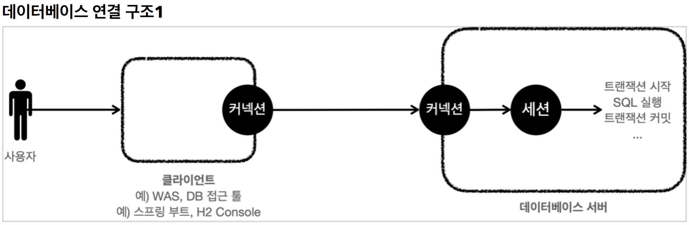
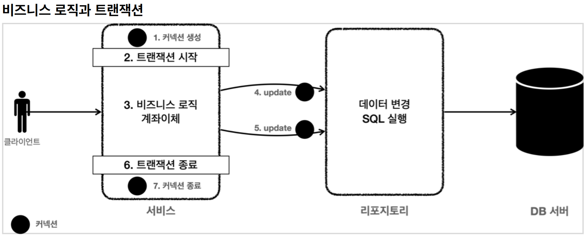

# 3. 트랜잭션 이해

----

## 트랜잭션 - 개념 이해
#### 데이터를 저장할 때 단순히 파일에 저장해도 되는데, 데이터베이스에 저장하는 이유는 무엇일까?
#### 여러가지 이유가 있지만, 가장 대표적인 이유는 바로 데이터베이스는 트랜잭션이라는 개념을 지원하기 때문이다.
#### 트랜잭션을 이름 그대로 번역하면 거래라는 뜻이다. 이것을 쉽게 풀어서 이야기하면, 데이터베이스에서 트랜잭션은 하나의 거래를 안전하게 처리하도록 보장해주는 것을 뜻한다. 그런데 하나의 거래를 안전하게 처리하려면 생각보다 고려해야 할 점이 많다. 

#### 모든 작업이 성공해서 데이터베이스에 정상 반영하는 것을 커밋( `Commit` )이라 하고, 작업 중 하나라도 실패해서 거래 이전으로 되돌리는 것을 롤백( `Rollback` )이라 한다.

## 트랜잭션 ACID
> 트랜잭션은 ACID(http://en.wikipedia.org/wiki/ACID)라 하는 원자성(Atomicity), 일관성
(Consistency), 격리성(Isolation), 지속성(Durability)을 보장해야 한다.

* **원자성**: 트랜잭션 내에서 실행한 작업들은 마치 하나의 작업인 것처럼 모두 성공 하거나 모두 실패해야
한다.
* **일관성**: 모든 트랜잭션은 일관성 있는 데이터베이스 상태를 유지해야 한다. 예를 들어 데이터베이스에서
정한 무결성 제약 조건을 항상 만족해야 한다. 
* **격리성**: 동시에 실행되는 트랜잭션들이 서로에게 영향을 미치지 않도록 격리한다. 예를 들어 동시에 같은
데이터를 수정하지 못하도록 해야 한다. 격리성은 동시성과 관련된 성능 이슈로 인해 트랜잭션 격리 수준
(Isolation level)을 선택할 수 있다. 
* **지속성**: 트랜잭션을 성공적으로 끝내면 그 결과가 항상 기록되어야 한다. 중간에 시스템에 문제가 발생해도 데이터베이스 로그 등을 사용해서 성공한 트랜잭션 내용을 복구해야 한다.
<br>

#### 트랜잭션은 원자성, 일관성, 지속성을 보장한다. **문제는 격리성인데 트랜잭션 간에 격리성을 완벽히 보장하려면 트랜잭션을 거의 순서대로 실행해야 한다.** 이렇게 하면 동시 처리 성능이 매우 나빠진다. 이런 문제로 인해 ANSI 표준은 트랜잭션의 격리 수준을 4단계로 나누어 정의했다. 
<br>


#### **트랜잭션 격리 수준 - Isolation level**
* READ UNCOMMITED(커밋되지 않은 읽기) 
* **READ COMMITTED(커밋된 읽기)**
* REPEATABLE READ(반복 가능한 읽기) 
* SERIALIZABLE(직렬화 가능)

## 데이터베이스 연결 구조와 DB 세션



* 사용자는 웹 애플리케이션 서버(WAS)나 DB 접근 툴 같은 클라이언트를 사용해서 데이터베이스 서버에
접근할 수 있다. 클라이언트는 데이터베이스 서버에 연결을 요청하고 커넥션을 맺게 된다. 이때
데이터베이스 서버는 내부에 세션이라는 것을 만든다. 그리고 앞으로 해당 커넥션을 통한 모든 요청은 이 세션을 통해서 실행하게 된다.
* 쉽게 이야기해서 개발자가 클라이언트를 통해 SQL을 전달하면 현재 커넥션에 연결된 세션이 SQL을
실행한다.
* 세션은 트랜잭션을 시작하고, 커밋 또는 롤백을 통해 트랜잭션을 종료한다. 그리고 이후에 새로운
트랜잭션을 다시 시작할 수 있다.
* 사용자가 커넥션을 닫거나, 또는 DBA(DB 관리자)가 세션을 강제로 종료하면 세션은 종료된다.

## **트랜잭션 사용법**
* 데이터 변경 쿼리를 실행하고 데이터베이스에 그 결과를 반영하려면 커밋 명령어인 `commit` 을 호출하고, 
결과를 반영하고 싶지 않으면 롤백 명령어인 `rollback` 을 호출하면 된다.
* 커**밋을 호출하기 전까지는 임시로 데이터를 저장**하는 것이다. 따라서 해당 트랜잭션을 시작한 세션(사용자)
에게만 변경 데이터가 보이고 다른 세션(사용자)에게는 변경 데이터가 보이지 않는다.
* 세션2에서 세션1이 아직 커밋하지 않은 변경 데이터가 보이다면, 세션1이 롤백 했을 때 심각한 문제가
발생할 수 있다. 따라서 커밋 전의 데이터는 다른 세션에서 보이지 않는다.

#### 트랜잭션 - 자동 커밋, 수동 커밋
#### 자동 커밋
* 자동 커밋으로 설정하면 각각의 쿼리 실행 직후에 자동으로 커밋을 호출한다. 따라서 커밋이나 롤백을 직접
호출하지 않아도 되는 편리함이 있다. 하지만 **쿼리를 하나하나 실행할 때 마다 자동으로 커밋**이 되어버리기
때문에 우리가 원하는 트랜잭션 기능을 제대로 사용할 수 없다.
* 따라서 `commit` , `rollback` 을 직접 호출하면서 트랜잭션 기능을 제대로 수행하려면 자동 커밋을 끄고
수동 커밋을 사용해야 한다. 
* `set autocommit true; //자동 커밋 모드 설정`

#### **수동 커밋**
```java
set autocommit false; //수동 커밋 모드 설정
insert into member(member_id, money) values ('data3',10000);
insert into member(member_id, money) values ('data4',10000);
commit; //수동 커밋
```
* 보통 자동 커밋 모드가 기본으로 설정된 경우가 많기 때문에, **수동 커밋 모드로 설정하는 것을 트랜잭션을
시작**한다고 표현할 수 있다.
수동 커밋 설정을 하면 이후에 꼭 `commit` , `rollback` 을 호출해야 한다

#### 트랜잭션 - 예제
* 계좌 이체에서 문제가 발생하면 롤백을 호출해서 트랜잭션을 시작하기 전 단계로 데이터를 복구해야 한다.

#### 정리
* **원자성**: 트랜잭션 내에서 실행한 작업들은 마치 하나의 작업인 것처럼 모두 성공 하거나 모두 실패해야
한다.     
트랜잭션의 원자성 덕분에 여러 SQL 명령어를 마치 하나의 작업인 것 처럼 처리할 수 있었다. 성공하면
한번에 반영하고, 중간에 실패해도 마치 하나의 작업을 되돌리는 것 처럼 간단히 되돌릴 수 있다.
* 오토 커밋  
만약 오토 커밋 모드로 동작하는데, 계좌이체 중간에 실패하면 어떻게 될까? 쿼리를 하나 실행할 때 마다
바로바로 커밋이 되어버리기 때문에 memberA 의 돈만 2000원 줄어드는 심각한 문제가 발생한다.
* 트랜잭션 시작  
따라서 이런 종류의 작업은 꼭 수동 커밋 모드를 사용해서 수동으로 커밋, 롤백 할 수 있도록 해야 한다. 보통 이렇게 자동 커밋 모드에서 수동 커밋 모드로 전환 하는 것을 트랜잭션을 시작한다고 표현한다.
<br>

## DB 락 - 개념 이해

#### 세션이 트랜잭션을 시작하고 데이터를 수정하는 동안에는 커밋이나 롤백 전까지 다른 세션에서 해당 데이터를 수정할 수 없게 막아야 한다.

* 로우의 값을 변경하려면 먼저 해당 로우의 락을 먼저 획득해야 한다.
* 락이 없으면 락이 돌아올 때 까지 대기한다.
  * 무한정 대기하지는 않고, 락 대기 시간을 넘어가면 락 타임아웃 오류가 발생한다. (대기 시간 설정 가능) 
* 일반적인 조회는 락을 사용하지 않는다.
> **조회 시점에 락이 필요한 경우는 언제일까?**  
> 트랜잭션 종료 시점까지 해당 데이터를 다른 곳에서 변경하지 못하도록 강제로 막아야 할 때 사용한다.
예를 들어서 애플리케이션 로직에서 `memberA` 의 금액을 조회한 다음에 이 금액 정보로 애플리케이션에서 어떤 계산을 수행한다. 그런데 이 계산이 돈과 관련된 매우 중요한 계산이어서 **계산을 완료할 때 까지
`memberA` 의 금액을 다른곳에서 변경하면 안된다.** 이럴 때 조회 시점에 락을 획득하면 된다.

<br>

## 트랜잭션 - 적용



* 트랜잭션은 비즈니스 로직이 있는 서비스 계층에서 시작해야 한다. 비즈니스 로직이 잘못되면 해당
비즈니스 로직으로 인해 문제가 되는 부분을 함께 롤백해야 하기 때문이다.
* 그런데 트랜잭션을 시작하려면 커넥션이 필요하다. 결국 서비스 계층에서 커넥션을 만들고, 트랜잭션 커밋 이후에 커넥션을 종료해야 한다.
* 애플리케이션에서 DB 트랜잭션을 사용하려면 트랜잭션을 사용하는 동안 같은 커넥션을 유지해야한다. 
그래야 같은 세션을 사용할 수 있다.

#### 애플리케이션에서 같은 커넥션을 유지하려면 어떻게 해야할까? 가장 단순한 방법은 커넥션을 파라미터로 전달해서 같은 커넥션이 사용되도록 유지하는 것이다.

```java
/**
 * 트랜잭션 - 파라미터 연동, 풀을 고려한 종료
 */
@Slf4j
@RequiredArgsConstructor
public class MemberServiceV2 {
    private final DataSource dataSource;
    private final MemberRepositoryV2 memberRepository;
    
    public void accountTransfer(String fromId, String toId, int money) throws SQLException {
        Connection con = dataSource.getConnection();
        try {
            con.setAutoCommit(false); //트랜잭션 시작
            //비즈니스 로직
            bizLogic(con, fromId, toId, money);
            con.commit(); //성공시 커밋
        } catch (Exception e) {
            con.rollback(); //실패시 롤백
            throw new IllegalStateException(e);
        } finally {
            release(con);
        }
    }
    
    private void bizLogic(Connection con, String fromId, String toId, int money) throws SQLException {
            Member fromMember = memberRepository.findById(con, fromId);
            Member toMember = memberRepository.findById(con, toId);
            
            memberRepository.update(con, fromId, fromMember.getMoney() - money);
            validation(toMember);
            memberRepository.update(con, toId, toMember.getMoney() + money);
    }

    private void validation(Member toMember) {
        if (toMember.getMemberId().equals("ex")) {
            throw new IllegalStateException("이체중 예외 발생");
        }
    }
    
    private void release(Connection con) {
        if (con != null) {
            try {
                con.setAutoCommit(true); //커넥션 풀 고려
                con.close();
            } catch (Exception e) {
                log.info("error", e);
            }
        }
    }
}
```
* `Connection con = dataSource.getConnection();`
  * 트랜잭션을 시작하려면 커넥션이 필요하다.
* `con.setAutoCommit(false);` //트랜잭션 시작
  * 트랜잭션을 시작하려면 자동 커밋 모드를 꺼야한다. 이렇게 하면 커넥션을 통해 세션에 `set 
autocommit false` 가 전달되고, 이후부터는 수동 커밋 모드로 동작한다. 이렇게 자동 커밋 모드를
수동 커밋 모드로 변경하는 것을 트랜잭션을 시작한다고 보통 표현한다.
* `bizLogic(con, fromId, toId, money);`
  * 트랜잭션이 시작된 커넥션을 전달하면서 비즈니스 로직을 수행한다.
  * 이렇게 분리한 이유는 트랜잭션을 관리하는 로직과 실제 비즈니스 로직을 구분하기 위함이다.
  * `memberRepository.update(con..)` : 비즈니스 로직을 보면 리포지토리를 호출할 때 커넥션을
전달하는 것을 확인할 수 있다.
* `con.commit(); //성공시 커밋`
  * 비즈니스 로직이 정상 수행되면 트랜잭션을 커밋한다.
* `con.rollback(); //실패시 롤백`
  * `catch(Ex){..}` 를 사용해서 비즈니스 로직 수행 도중에 예외가 발생하면 트랜잭션을 롤백한다.
* `release(con);`
  * `finally {..}` 를 사용해서 커넥션을 모두 사용하고 나면 안전하게 종료한다. 그런데 커넥션 풀을
사용하면 `con.close()` 를 호출 했을 때 커넥션이 종료되는 것이 아니라 풀에 반납된다. 현재 수동
커밋 모드로 동작하기 때문에 풀에 돌려주기 전에 기본 값인 자동 커밋 모드로 변경하는 것이
안전하다.

#### 문제
* 애플리케이션에서 DB 트랜잭션을 적용하려면 서비스 계층이 매우 지저분해지고, 생각보다 매우 복잡한
코드를 요구한다. 
*  커넥션을 유지하도록 코드를 변경하는 것도 쉬운 일은 아니다.


----  

###### References: 김영한 - [스프링 DB 1편 - 데이터 접근 핵심 원리]
