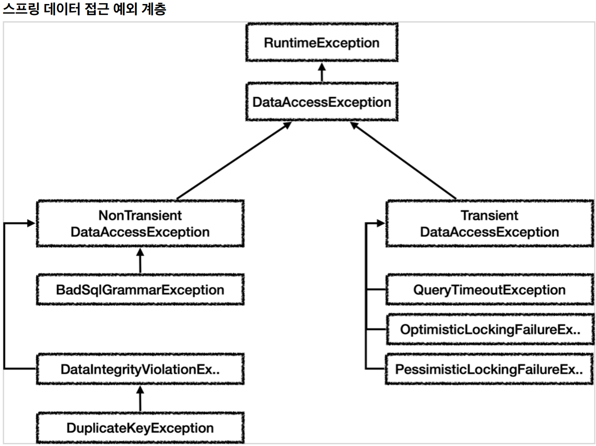

# 6. 스프링과 문제 해결 - 예외 처리, 반복

----
## 체크 예외와 인터페이스
#### **체크 예외 코드에 인터페이스 도입시 문제점 - 인터페이스**
```java
public interface MemberRepositoryEx {
    Member save(Member member) throws SQLException;
    Member findById(String memberId) throws SQLException;
    void update(String memberId, int money) throws SQLException;
    void delete(String memberId) throws SQLException;
}
```
#### **체크 예외 코드에 인터페이스 도입시 문제점 - 구현 클래스**
```java
@Slf4j
public class MemberRepositoryV3 implements MemberRepositoryEx {
    public Member save(Member member) throws SQLException {
        String sql = "insert into member(member_id, money) values(?, ?)";
    }
}
```
* 인터페이스의 구현체가 체크 예외를 던지려면, 인터페이스 메서드에 먼저 체크 예외를 던지는 부분이 선언
되어 있어야 한다. 그래야 구현 클래스의 메서드도 체크 예외를 던질 수 있다.
  * 쉽게 이야기 해서 `MemberRepositoryV3` 가 `throws SQLException` 를 하려면
`MemberRepositoryEx` 인터페이스에도 `throws SQLException` 이 필요하다.
* 참고로 구현 클래스의 메서드에 선언할 수 있는 예외는 부모 타입에서 던진 예외와 같거나 하위 타입이어야
한다.
  * 예를 들어서 인터페이스 메서드에 `throws Exception` 를 선언하면, 구현 클래스 메서드에 `throws 
SQLException` 는 가능하다. `SQLException` 은 `Exception` 의 하위 타입이기 때문이다.
<br>

#### **특정 기술에 종속되는 인터페이스**
#### 구현 기술을 쉽게 변경하기 위해서 인터페이스를 도입하더라도 `SQLException` 과 같은 특정 구현 기술에 종속적인 체크 예외를 사용하게 되면 인터페이스에도 해당 예외를 포함해야 한다. 하지만 이것은 우리가 원하던 순수한 인터페이스가 아니다. JDBC 기술에 종속적인 인터페이스일 뿐이다. 인터페이스를 만드는 목적은 구현체를 쉽게 변경하기 위함인데, 이미 인터페이스가 특정 구현 기술에 오염이 되어 버렸다. 향후 JDBC가 아닌 다른 기술로 변경한다면 인터페이스 자체를 변경해야 한다.
<br>

#### **런타임 예외와 인터페이스**
#### 런타임 예외는 이런 부분에서 자유롭다. 인터페이스에 런타임 예외를 따로 선언하지 않아도 된다. 따라서 인터페이스가 특정 기술에 종속적일 필요가 없다.
<br>

#### 예외 변환
```java
catch (SQLException e) {
    throw new MyDbException(e);
}
```
* 이 코드에서 핵심은 `SQLException` 이라는 체크 예외를 `MyDbException` 이라는 런타임 예외로 변환해서
던지는 부분이다.
<br>


## 데이터 접근 예외 직접 만들기
#### 데이터베이스 오류에 따라서 특정 예외는 복구하고 싶을 수 있다.
#### 예를 들어서 회원 가입시 DB에 이미 같은 ID가 있으면 ID 뒤에 숫자를 붙여서 새로운 ID를 만들어야 한다고 가정해보자.
#### ID를 `hello` 라고 가입 시도 했는데, 이미 같은 아이디가 있으면 `hello12345` 와 같이 뒤에 임의의 숫자를 붙여서 가입하는 것이다.

#### 데이터를 DB에 저장할 때 같은 ID가 이미 데이터베이스에 저장되어 있다면, 데이터베이스는 오류 코드를 반환하고, 이 오류 코드를 받은 JDBC 드라이버는 `SQLException` 을 던진다. 그리고 `SQLException` 에는 데이터베이스가 제공하는 `errorCode` 라는 것이 들어있다.
<br>

#### 서비스 계층에서는 예외 복구를 위해 키 중복 오류를 확인할 수 있어야 한다. 그래야 새로운 ID를 만들어서 다시 저장을 시도할 수 있기 때문이다. 이러한 과정이 바로 예외를 확인해서 복구하는 과정이다. 
#### 리포지토리는 `SQLException` 을 서비스 계층에 던지고 서비스 계층은 이 예외의 오류 코드를 확인해서 키 중복 오류( `23505` )인 경우 새로운 ID를 만들어서 다시 저장하면 된다.
#### 그런데 `SQLException` 에 들어있는 오류 코드를 활용하기 위해 `SQLException` 을 서비스 계층으로 던지게 되면, 서비스 계층이 `SQLException` 이라는 JDBC 기술에 의존하게 되면서, 지금까지 우리가 고민했던 서비스 계층의 순수성이 무너진다. 
<br>

#### 이 문제를 해결하려면 앞서 배운 것 처럼 리포지토리에서 예외를 변환해서 던지면 된다.
#### `SQLException` -> `MyDuplicateKeyException`
<br>

## 남은 문제
* SQL ErrorCode는 각각의 데이터베이스 마다 다르다. 결과적으로 데이터베이스가 변경될 때 마다
ErrorCode도 모두 변경해야 한다.
  * 예) 키 중복 오류 코드
    * H2: `23505`
    * MySQL: `1062`
* 데이터베이스가 전달하는 오류는 키 중복 뿐만 아니라 락이 걸린 경우, SQL 문법에 오류 있는 경우 등등
수십 수백가지 오류 코드가 있다. 이 모든 상황에 맞는 예외를 지금처럼 다 만들어야 할까? 추가로 앞서
이야기한 것 처럼 데이터베이스마다 이 오류 코드는 모두 다르다.

## 스프링 예외 추상화 이해



* 스프링은 데이터 접근 계층에 대한 수십 가지 예외를 정리해서 일관된 예외 계층을 제공한다.
* 각각의 예외는 특정 기술에 종속적이지 않게 설계되어 있다. 따라서 서비스 계층에서도 스프링이 제공하는
예외를 사용하면 된다. 예를 들어서 JDBC 기술을 사용하든, JPA 기술을 사용하든 스프링이 제공하는
예외를 사용하면 된다.
* JDBC나 JPA를 사용할 때 발생하는 예외를 스프링이 제공하는 예외로 변환해주는 역할도 스프링이
제공한다.
  <br>

* 예외의 최고 상위는 `org.springframework.dao.DataAccessException` 이다. 그림에서 보는 것 처럼
런타임 예외를 상속 받았기 때문에 스프링이 제공하는 데이터 접근 계층의 모든 예외는 런타임 예외이다.
* `DataAccessException` 은 크게 2가지로 구분하는데 `NonTransient` 예외와 `Transient` 예외이다.
  * `Transient` 는 일시적이라는 뜻이다. `Transient` 하위 예외는 동일한 SQL을 다시 시도했을 때
성공할 가능성이 있다.
    * 예를 들어서 쿼리 타임아웃, 락과 관련된 오류들이다. 이런 오류들은 데이터베이스 상태가
좋아지거나, 락이 풀렸을 때 다시 시도하면 성공할 수 도 있다.
  * `NonTransient` 는 일시적이지 않다는 뜻이다. 같은 SQL을 그대로 반복해서 실행하면 실패한다.
    * SQL 문법 오류, 데이터베이스 제약조건 위배 등이 있다.

## 스프링이 제공하는 예외 변환기
#### 스프링은 데이터베이스에서 발생하는 오류 코드를 스프링이 정의한 예외로 자동으로 변환해주는 변환기를 제공한다.
<br>

#### 스프링이 제공하는 SQL 예외 변환기
```java
SQLExceptionTranslator exTranslator = new SQLErrorCodeSQLExceptionTranslator(dataSource);
DataAccessException resultEx = exTranslator.translate("select", sql, e);
```
* `translate()` 메서드의 첫번째 파라미터는 읽을 수 있는 설명이고, 두번째는 실행한 sql, 마지막은 발생된
`SQLException` 을 전달하면 된다. 이렇게 하면 적절한 스프링 데이터 접근 계층의 예외로 변환해서
반환해준다.
* 예제에서는 SQL 문법이 잘못되었으므로 `BadSqlGrammarException` 을 반환하는 것을 확인할 수 있다.
  * 눈에 보이는 반환 타입은 최상위 타입인 `DataAccessException` 이지만 실제로는
`BadSqlGrammarException` 예외가 반환된다.
  * 참고로 `BadSqlGrammarException` 은 최상위 타입인 `DataAccessException` 를 상속 받아서
만들어진다.
* 스프링 SQL 예외 변환기는 SQL ErrorCode를 `sql-error-codes.xml` 파일에 대입해서 어떤 스프링 데이터 접근 예외로
전환해야 할지 찾아낸다. 예를 들어서 H2 데이터베이스에서 `42000` 이 발생하면 `badSqlGrammarCodes`
이기 때문에 `BadSqlGrammarException` 을 반환한다.

## JDBC 반복 문제 해결 - JdbcTemplate
#### **JDBC 반복 문제**
* 커넥션 조회, 커넥션 동기화
* PreparedStatement 생성 및 파라미터 바인딩
* 쿼리 실행
* 결과 바인딩
* 예외 발생시 스프링 예외 변환기 실행
* 리소스 종료
#### 스프링은 JDBC의 반복 문제를 해결하기 위해 JdbcTemplate 이라는 템플릿을 제공한다.
#### JdbcTemplate 은 JDBC로 개발할 때 발생하는 반복을 대부분 해결해준다. 그 뿐만 아니라 지금까지 학습했던, 트랜잭션을 위한 커넥션 동기화는 물론이고, 예외 발생시 스프링 예외 변환기도 자동으로 실행해준다.
```java
private final JdbcTemplate template;

@Override
public Member findById(String memberId) {
    String sql = "select * from member where member_id = ?";
    return template.queryForObject(sql, memberRowMapper(), memberId);
}
```
----  

###### References: 김영한 - [스프링 DB 1편 - 데이터 접근 핵심 원리]
