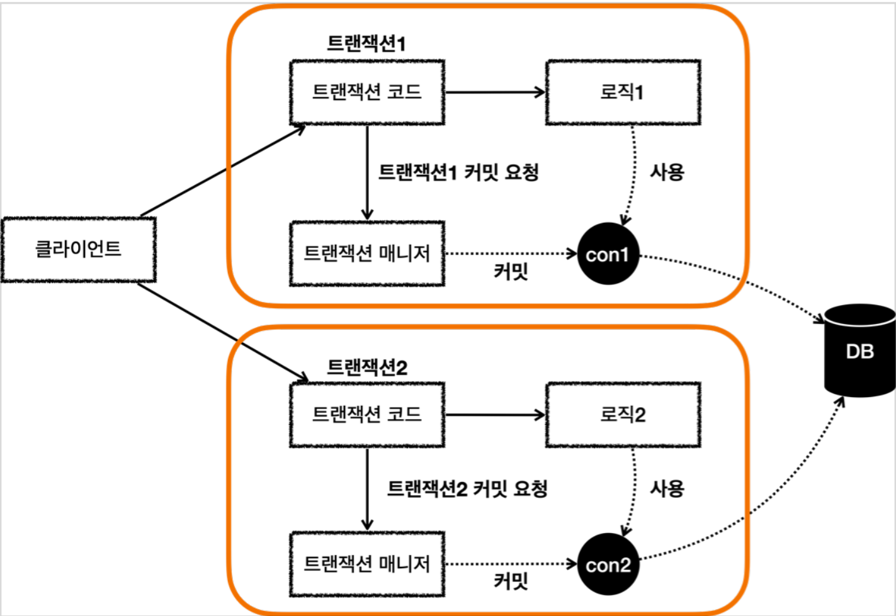
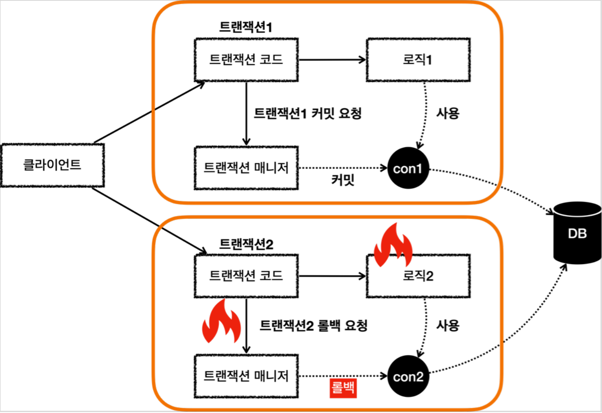
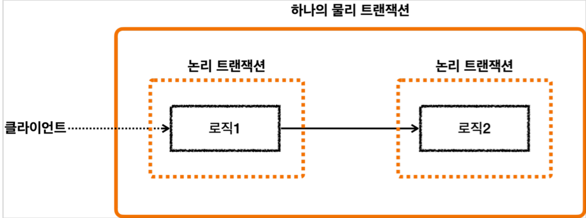
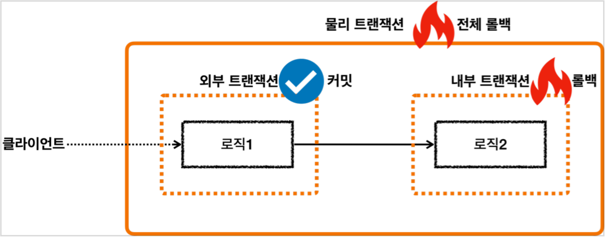
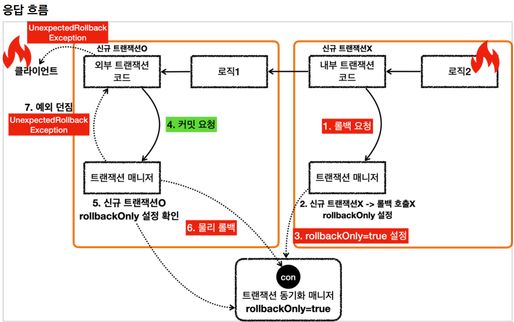

# 10. 스프링 트랜잭션 전파1 - 기본

----
## 트랜잭션 두 번 사용

 
* 트랜잭션이 각각 수행되면서 사용되는 DB 커넥션도 각각 다르다.
* 이 경우 트랜잭션을 각자 관리하기 때문에 전체 트랜잭션을 묶을 수 없다. 예를 들어서 트랜잭션1이
커밋하고, 트랜잭션2가 롤백하는 경우 트랜잭션1에서 저장한 데이터는 커밋되고, 트랜잭션2에서 저장한
데이터는 롤백된다.
 

## 전파 기본
#### 트랜잭션을 각각 사용하는 것이 아니라, 트랜잭션이 이미 진행중인데, 여기에 추가로 트랜잭션을 수행하면 어떻게 될까?
#### 기존 트랜잭션과 별도의 트랜잭션을 진행해야 할까? 아니면 기존 트랜잭션을 그대로 이어 받아서 트랜잭션을 수행해야 할까?
#### 이런 경우 어떻게 동작할지 결정하는 것을 트랜잭션 전파(`propagation`)라 한다.
#### 참고로 스프링은 다양한 트랜잭션 전파 옵션을 제공한다
 

#### 외부 트랜잭션이 수행중인데, 내부 트랜잭션이 추가로 수행됨

* 외부 트랜잭션이 수행중이고, 아직 끝나지 않았는데, 내부 트랜잭션이 수행된다.
* 외부 트랜잭션이라고 이름 붙인 것은 둘 중 상대적으로 밖에 있기 때문에 외부 트랜잭션이라 한다. 처음 시작된 트랜잭션으로 이해하면 된다.
* 내부 트랜잭션은 외부에 트랜잭션이 수행되고 있는 도중에 호출되기 때문에 마치 내부에 있는 것 처럼 보여서 내부 트랜잭션이라 한다.
* 스프링 이 경우 외부 트랜잭션과 내부 트랜잭션을 묶어서 하나의 트랜잭션을 만들어준다. 내부 트랜잭션이
외부 트랜잭션에 참여하는 것이다. 이것이 기본 동작이고, 옵션을 통해 다른 동작방식도 선택할 수 있다. 

#### **물리 트랜잭션, 논리 트랜잭션**

* 스프링은 이해를 돕기 위해 논리 트랜잭션과 물리 트랜잭션이라는 개념을 나눈다.
* 논리 트랜잭션들은 하나의 물리 트랜잭션으로 묶인다.
* 물리 트랜잭션은 우리가 이해하는 실제 데이터베이스에 적용되는 트랜잭션을 뜻한다. 실제 커넥션을 통해서
트랜잭션을 시작( `setAutoCommit(false)`) 하고, 실제 커넥션을 통해서 커밋, 롤백하는 단위이다.
* 논리 트랜잭션은 트랜잭션 매니저를 통해 트랜잭션을 사용하는 단위이다.
* 이러한 논리 트랜잭션 개념은 트랜잭션이 진행되는 중에 내부에 추가로 트랜잭션을 사용하는 경우에 나타난다. 단순히 트랜잭션이 하나인 경우 둘을 구분하지는 않는다.

## **원칙**
* **모든 논리 트랜잭션이 커밋되어야 물리 트랜잭션이 커밋된다.**
* **하나의 논리 트랜잭션이라도 롤백되면 물리 트랜잭션은 롤백된다.**

 

## **트랜잭션 전파 흐름**
## **요청흐름**

#### **요청 흐름 - 외부 트랜잭션**
1. `txManager.getTransaction()` 를 호출해서 외부 트랜잭션을 시작한다.
2. 트랜잭션 매니저는 데이터소스를 통해 커넥션을 생성한다.
3. 생성한 커넥션을 수동 커밋 모드( `setAutoCommit(false)` )로 설정한다. - 물리 트랜잭션 시작
4. 트랜잭션 매니저는 트랜잭션 동기화 매니저에 커넥션을 보관한다.
5. 트랜잭션 매니저는 트랜잭션을 생성한 결과를 `TransactionStatus` 에 담아서 반환하는데, 여기에 신규
트랜잭션의 여부가 담겨 있다. `isNewTransaction` 를 통해 신규 트랜잭션 여부를 확인할 수 있다. 
트랜잭션을 처음 시작했으므로 신규 트랜잭션이다.( `true` )
6. 로직1이 사용되고, 커넥션이 필요한 경우 트랜잭션 동기화 매니저를 통해 트랜잭션이 적용된 커넥션을
획득해서 사용한다.

#### **요청 흐름 - 내부 트랜잭션**
7. `txManager.getTransaction()` 를 호출해서 내부 트랜잭션을 시작한다.
8. 트랜잭션 매니저는 트랜잭션 동기화 매니저를 통해서 기존 트랜잭션이 존재하는지 확인한다.
9. 기존 트랜잭션이 존재하므로 기존 트랜잭션에 참여한다. 기존 트랜잭션에 참여한다는 뜻은 사실
아무것도 하지 않는다는 뜻이다.
   * 이미 기존 트랜잭션인 외부 트랜잭션에서 물리 트랜잭션을 시작했다. 그리고 물리 트랜잭션이 시작된
커넥션을 트랜잭션 동기화 매니저에 담아두었다.
   * 따라서 이미 물리 트랜잭션이 진행중이므로 그냥 두면 이후 로직이 기존에 시작된 트랜잭션을
자연스럽게 사용하게 되는 것이다.
   * 이후 로직은 자연스럽게 트랜잭션 동기화 매니저에 보관된 기존 커넥션을 사용하게 된다.
10.  트랜잭션 매니저는 트랜잭션을 생성한 결과를 `TransactionStatus` 에 담아서 반환하는데, 여기에서
`isNewTransaction` 를 통해 신규 트랜잭션 여부를 확인할 수 있다. 여기서는 기존 트랜잭션에 참여했기
때문에 신규 트랜잭션이 아니다. ( `false` )
11.  로직2가 사용되고, 커넥션이 필요한 경우 트랜잭션 동기화 매니저를 통해 외부 트랜잭션이 보관한
커넥션을 획득해서 사용한다.

## **응답흐름**

#### **응답 흐름 - 내부 트랜잭션**
12. 로직2가 끝나고 트랜잭션 매니저를 통해 내부 트랜잭션을 커밋한다.
13. 트랜잭션 매니저는 커밋 시점에 신규 트랜잭션 여부에 따라 다르게 동작한다. 이 경우 신규 트랜잭션이
아니기 때문에 실제 커밋을 호출하지 않는다. 이 부분이 중요한데, 실제 커넥션에 커밋이나 롤백을 호출하면
물리 트랜잭션이 끝나버린다. 아직 트랜잭션이 끝난 것이 아니기 때문에 실제 커밋을 호출하면 안된다. 물리
트랜잭션은 외부 트랜잭션을 종료할 때 까지 이어져야한다.
#### **응답 흐름 - 외부 트랜잭션**
14. 로직1이 끝나고 트랜잭션 매니저를 통해 외부 트랜잭션을 커밋한다.
15. 트랜잭션 매니저는 커밋 시점에 신규 트랜잭션 여부에 따라 다르게 동작한다. 외부 트랜잭션은 신규
트랜잭션이다. 따라서 DB 커넥션에 실제 커밋을 호출한다.
16. 트랜잭션 매니저에 커밋하는 것이 논리적인 커밋이라면, 실제 커넥션에 커밋하는 것을 물리 커밋이라
할 수 있다. 실제 데이터베이스에 커밋이 반영되고, 물리 트랜잭션도 끝난다.
 

### **핵심 정리**
* 여기서 핵심은 트랜잭션 매니저에 커밋을 호출한다고해서 항상 실제 커넥션에 물리 커밋이 발생하지는
않는다는 점이다.
* 신규 트랜잭션인 경우에만 실제 커넥션을 사용해서 물리 커밋과 롤백을 수행한다. 신규 트랜잭션이 아니면
실제 물리 커넥션을 사용하지 않는다.
* 이렇게 트랜잭션이 내부에서 추가로 사용되면 트랜잭션 매니저에 커밋하는 것이 항상 물리 커밋으로
이어지지 않는다. 그래서 이 경우 논리 트랜잭션과 물리 트랜잭션을 나누게 된다. 또는 외부 트랜잭션과 내부
트랜잭션으로 나누어 설명하기도 한다.
* 트랜잭션이 내부에서 추가로 사용되면, 트랜잭션 매니저를 통해 논리 트랜잭션을 관리하고, 모든 논리
트랜잭션이 커밋되면 물리 트랜잭션이 커밋된다고 이해하면 된다.
 

## **내부 롤백**

#### **응답 흐름 - 내부 트랜잭션**
1. 로직2가 끝나고 트랜잭션 매니저를 통해 내부 트랜잭션을 롤백한다. (로직2에 문제가 있어서 롤백한다고
가정한다.)
2. 트랜잭션 매니저는 롤백 시점에 신규 트랜잭션 여부에 따라 다르게 동작한다. 이 경우 신규 트랜잭션이
아니기 때문에 실제 롤백을 호출하지 않는다. 이 부분이 중요한데, 실제 커넥션에 커밋이나 롤백을 호출하면
물리 트랜잭션이 끝나버린다. 아직 트랜잭션이 끝난 것이 아니기 때문에 실제 롤백을 호출하면 안된다. 물리
트랜잭션은 외부 트랜잭션을 종료할 때 까지 이어져야한다.
3. 내부 트랜잭션은 물리 트랜잭션을 롤백하지 않는 대신에 트랜잭션 동기화 매니저에
`rollbackOnly=true` 라는 표시를 해둔다.

#### **응답 흐름 - 외부 트랜잭션**
4. 로직1이 끝나고 트랜잭션 매니저를 통해 외부 트랜잭션을 커밋한다.
5. 트랜잭션 매니저는 커밋 시점에 신규 트랜잭션 여부에 따라 다르게 동작한다. 외부 트랜잭션은 신규
트랜잭션이다. 따라서 DB 커넥션에 실제 커밋을 호출해야 한다. 이때 먼저 트랜잭션 동기화 매니저에 롤백
전용( `rollbackOnly=true` ) 표시가 있는지 확인한다. 롤백 전용 표시가 있으면 물리 트랜잭션을 커밋하는
것이 아니라 롤백한다. 
6. 실제 데이터베이스에 롤백이 반영되고, 물리 트랜잭션도 끝난다.
7. 트랜잭션 매니저에 커밋을 호출한 개발자 입장에서는 분명 커밋을 기대했는데 롤백 전용 표시로 인해
실제로는 롤백이 되어버렸다. 
* 이것은 조용히 넘어갈 수 있는 문제가 아니다. 시스템 입장에서는 커밋을 호출했지만 롤백이 되었다는
것은 분명하게 알려주어야 한다.
* 예를 들어서 고객은 주문이 성공했다고 생각했는데, 실제로는 롤백이 되어서 주문이 생성되지 않은
것이다.
* 스프링은 이 경우 `UnexpectedRollbackException` 런타임 예외를 던진다. 그래서 커밋을
시도했지만, 기대하지 않은 롤백이 발생했다는 것을 명확하게 알려준다.

#### **정리**
* 논리 트랜잭션이 하나라도 롤백되면 물리 트랜잭션은 롤백된다.
* 내부 논리 트랜잭션이 롤백되면 롤백 전용 마크를 표시한다.
* 외부 트랜잭션을 커밋할 때 롤백 전용 마크를 확인한다. 롤백 전용 마크가 표시되어 있으면 물리 트랜잭션을
롤백하고, `UnexpectedRollbackException` 예외를 던진다.
----  

###### References: 김영한 - [스프링 DB 2편 - 데이터 접근 활용 기술]
