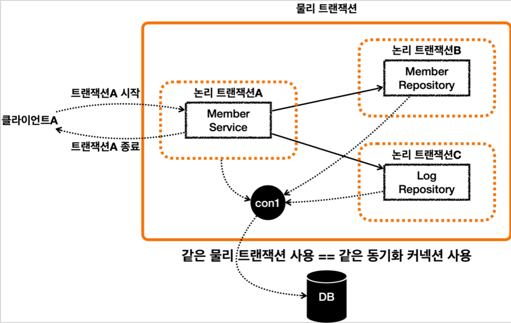
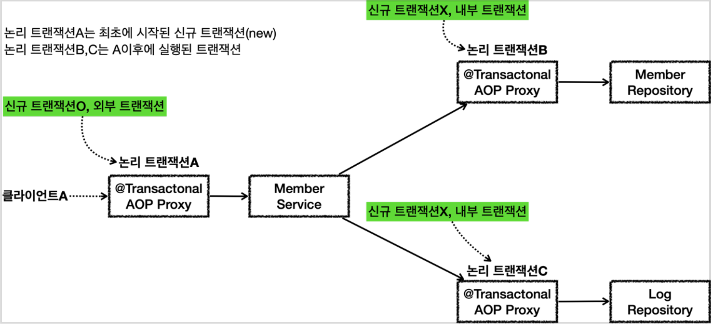
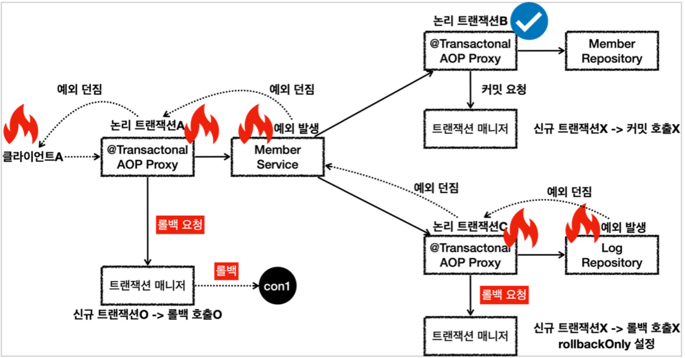
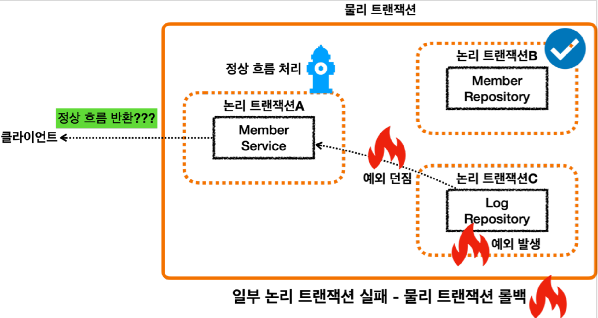
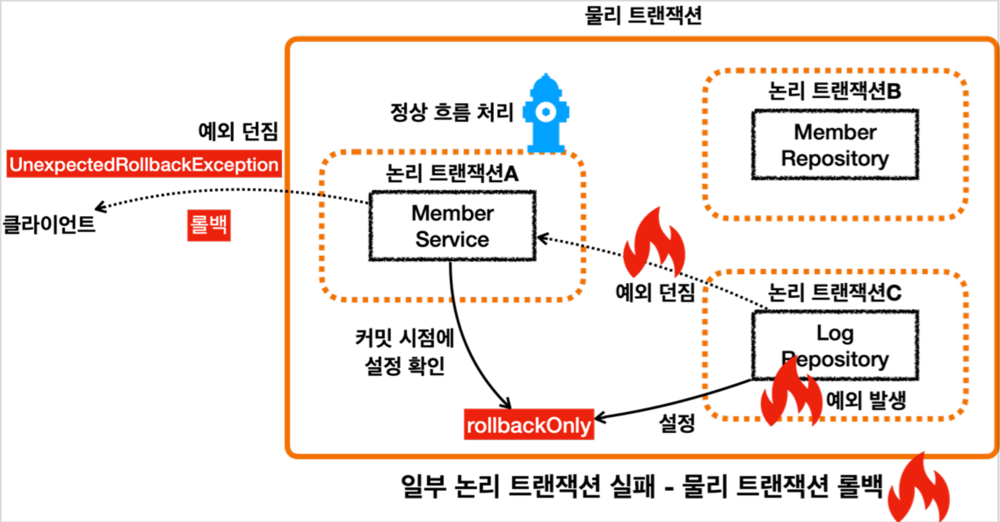
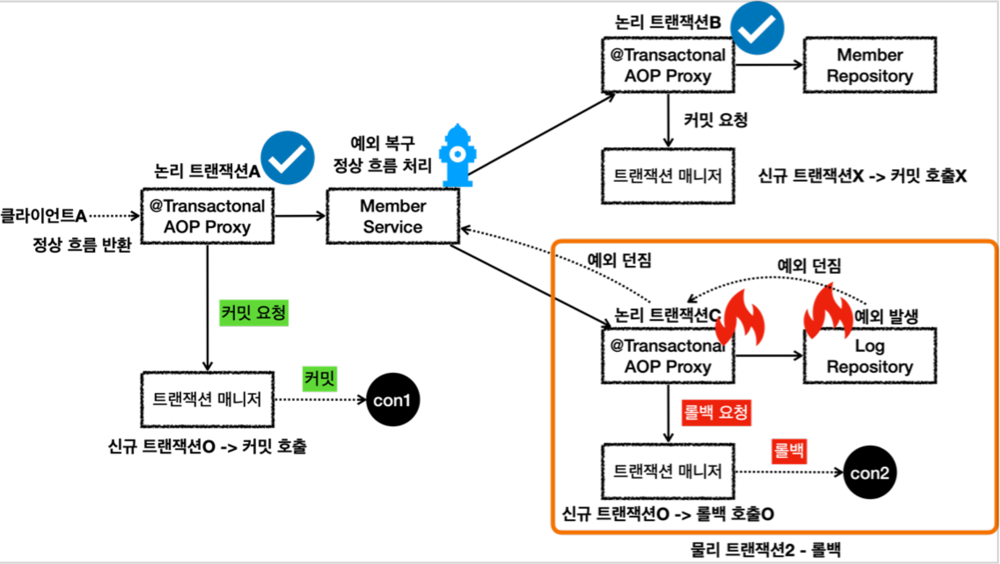
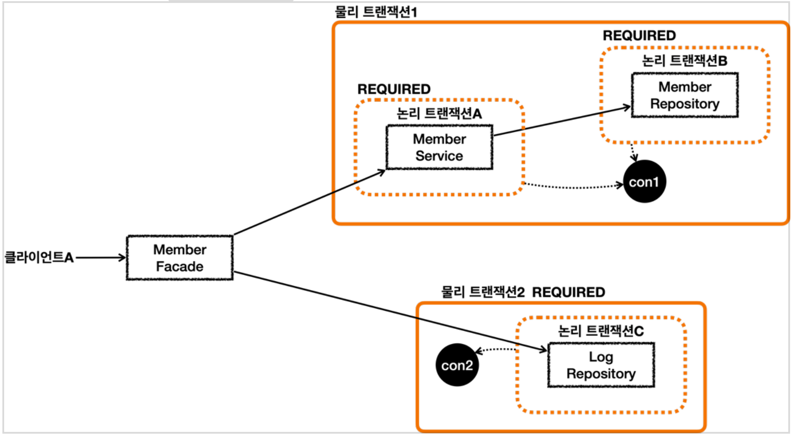

# 11. 스프링 트랜잭션 전파2 - 활용

----

## 전파 커밋
#### 스프링은 `@Transactional` 이 적용되어 있으면 기본으로 `REQUIRED` 라는 전파 옵션을 사용한다.
#### 이 옵션은 기존 트랜잭션이 없으면 트랜잭션을 생성하고, 기존 트랜잭션이 있으면 기존 트랜잭션에 참여한다. 참여한다는 뜻은 해당 트랜잭션을 그대로 따른다는 뜻이고, 동시에 같은 동기화 커넥션을 사용한다는 뜻이다.

#### **신규 트랜잭션**

* 이 경우 외부에 있는 신규 트랜잭션만 실제 물리 트랜잭션을 시작하고 커밋한다.
* 내부에 있는 트랜잭션은 물리 트랜잭션 시작하거나 커밋하지 않는다.

## 전파 롤백
#### **흐름**

* 클라이언트A가 MemberService 를 호출하면서 트랜잭션 AOP가 호출된다.
  * 여기서 신규 트랜잭션이 생성되고, 물리 트랜잭션도 시작한다.
* `MemberRepository` 를 호출하면서 트랜잭션 AOP가 호출된다.
  * 이미 트랜잭션이 있으므로 기존 트랜잭션에 참여한다.
* `MemberRepository` 의 로직 호출이 끝나고 정상 응답하면 트랜잭션 AOP가 호출된다.
  * 트랜잭션 AOP는 정상 응답이므로 트랜잭션 매니저에 커밋을 요청한다. 이 경우 신규 트랜잭션이
아니므로 실제 커밋을 호출하지 않는다.
* `LogRepository` 를 호출하면서 트랜잭션 AOP가 호출된다.
  * 이미 트랜잭션이 있으므로 기존 트랜잭션에 참여한다.
* `LogRepository` 로직에서 런타임 예외가 발생한다. 예외를 던지면 트랜잭션 AOP가 해당 예외를 받게
된다.
  * 트랜잭션 AOP는 런타임 예외가 발생했으므로 트랜잭션 매니저에 롤백을 요청한다. 이 경우 신규
트랜잭션이 아니므로 물리 롤백을 호출하지는 않는다. 대신에 `rollbackOnly` 를 설정한다.
  * `LogRepository` 가 예외를 던졌기 때문에 트랜잭션 AOP도 해당 예외를 그대로 밖으로 던진다.
* `MemberService` 에서도 런타임 예외를 받게 되는데, 여기 로직에서는 해당 런타임 예외를 처리하지 않고
밖으로 던진다.
  * 트랜잭션 AOP는 런타임 예외가 발생했으므로 트랜잭션 매니저에 롤백을 요청한다. 이 경우 신규
트랜잭션이므로 물리 롤백을 호출한다.
  * 참고로 이 경우 어차피 롤백이 되었기 때문에, `rollbackOnly` 설정은 참고하지 않는다.
  * `MemberService` 가 예외를 던졌기 때문에 트랜잭션 AOP도 해당 예외를 그대로 밖으로 던진다.
* 클라이언트A는 `LogRepository` 부터 넘어온 런타임 예외를 받게 된다.
 

#### **정리**
#### 회원과 회원 이력 로그를 처리하는 부분을 하나의 트랜잭션으로 묶은 덕분에 문제가 발생했을 때 회원과 회원 이력 로그가 모두 함께 롤백된다. 따라서 데이터 정합성에 문제가 발생하지 않는다.
 

## 복구 REQUIRED
#### **회원 가입을 시도한 로그를 남기는데 실패하더라도 회원 가입은 유지되어야 한다.**

* 단순하게 생각해보면 `LogRepository` 에서 예외가 발생하면 그것을 `MemberService` 에서 예외를 잡아서
처리하면 될 것 같다.
* 이렇게 하면 `MemberService` 에서 정상 흐름으로 바꿀 수 있기 때문에 `MemberService` 의 트랜잭션 AOP
에서 커밋을 수행할 수 있다.
* **하지만 이 방법은 실패한다.**

* 내부 트랜잭션에서 `rollbackOnly` 를 설정하기 때문에 결과적으로 정상 흐름 처리를 해서 외부
트랜잭션에서 커밋을 호출해도 물리 트랜잭션은 롤백된다.
* 그리고 `UnexpectedRollbackException` 이 던져진다.
 

#### **정리**
* 논리 트랜잭션 중 하나라도 롤백되면 전체 트랜잭션은 롤백된다.
* 내부 트랜잭션이 롤백 되었는데, 외부 트랜잭션이 커밋되면 `UnexpectedRollbackException` 예외가
발생한다.
* `rollbackOnly` 상황에서 커밋이 발생하면 `UnexpectedRollbackException` 예외가 발생한다.
 

## 복구 REQUIRES_NEW
#### **회원 가입을 시도한 로그를 남기는데 실패하더라도 회원 가입은 유지되어야 한다.**
#### 이 요구사항을 만족하기 위해서 로그와 관련된 물리 트랜잭션을 별도로 분리해보자. 바로 `REQUIRES_NEW`를 사용하는 것이다.
#### `REQUIRES_NEW` 는 항상 새로운 트랜잭션을 만든다. 따라서 해당 트랜잭션 안에서는 DB 커넥션도 별도로 사용하게 된다.

* `LogRepository` 에서 예외가 발생한다. 예외를 던지면 `LogRepository` 의 트랜잭션 AOP가 해당 예외를
받는다.
* `REQUIRES_NEW` 를 사용한 신규 트랜잭션이므로 물리 트랜잭션을 롤백한다. 물리 트랜잭션을 롤백했으므로
`rollbackOnly` 를 표시하지 않는다. 여기서 `REQUIRES_NEW` 를 사용한 물리 트랜잭션은 롤백되고 완전히
끝이 나버린다.
* 이후 트랜잭션 AOP는 전달 받은 예외를 밖으로 던진다.
* 예외가 `MemberService` 에 던져지고, `MemberService` 는 해당 예외를 복구한다. 그리고 정상적으로
리턴한다.
* 정상 흐름이 되었으므로 `MemberService` 의 트랜잭션 AOP는 커밋을 호출한다.
* 커밋을 호출할 때 신규 트랜잭션이므로 실제 물리 트랜잭션을 커밋해야 한다. 이때 `rollbackOnly` 를
체크한다.
* `rollbackOnly` 가 없으므로 물리 트랜잭션을 커밋한다.
* 이후 정상 흐름이 반환된다.

 

#### **결과적으로 회원 데이터는 저장되고, 로그 데이터만 롤백 되는 것을 확인할 수 있다.**
 

#### **정리**
* 논리 트랜잭션은 하나라도 롤백되면 관련된 물리 트랜잭션은 롤백되어 버린다.
* 이 문제를 해결하려면 `REQUIRES_NEW` 를 사용해서 트랜잭션을 분리해야 한다.
* 참고로 예제를 단순화 하기 위해 `MemberService` 가 `MemberRepository` , `LogRepository` 만
호출하지만 실제로는 더 많은 리포지토리들을 호출하고 그 중에 `LogRepository` 만 트랜잭션을
분리한다고 생각해보면 이해하는데 도움이 될 것이다.
 

#### **주의**
* `REQUIRES_NEW` 를 사용하면 하나의 HTTP 요청에 동시에 2개의 데이터베이스 커넥션을 사용하게 된다. 
따라서 성능이 중요한 곳에서는 이런 부분을 주의해서 사용해야 한다.
* `REQUIRES_NEW` 를 사용하지 않고 문제를 해결할 수 있는 단순한 방법이 있다면, 그 방법을 선택하는 것이
더 좋다.
 

#### 예를 들면 다음과 같이 `REQUIRES_NEW` 를 사용하지 않고 구조를 변경하는 것이다.

#### 이렇게 하면 HTTP 요청에 동시에 2개의 커넥션을 사용하지는 않는다. 순차적으로 사용하고 반환하게 된다.
물론 구조상 `REQUIRES_NEW` 를 사용하는 것이 더 깔끔한 경우도 있으므로 각각의 장단점을 이해하고
적절하게 선택해서 사용하면 된다.

----  

###### References: 김영한 - [스프링 DB 2편 - 데이터 접근 활용 기술]
