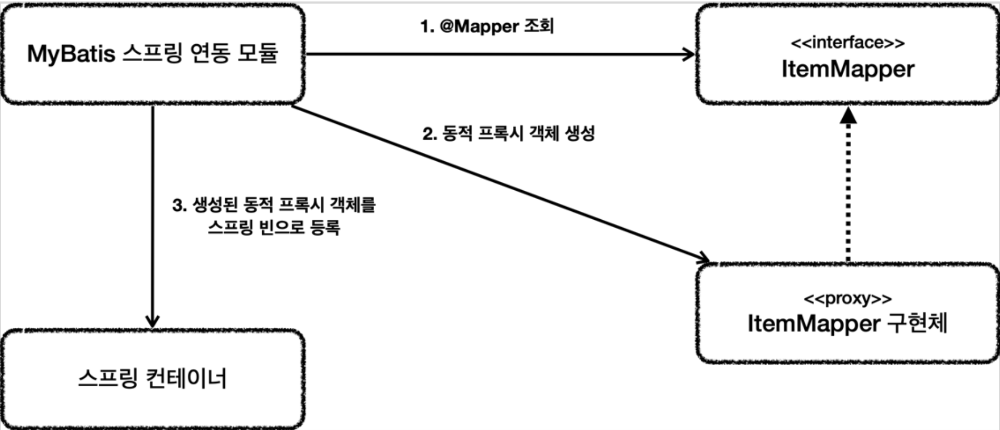

# 4. 데이터 접근 기술 - MyBatis

----

## MyBatis 소개
#### MyBatis는 앞서 설명한 JdbcTemplate보다 더 많은 기능을 제공하는 SQL Mapper 이다.
#### 기본적으로 JdbcTemplate이 제공하는 대부분의 기능을 제공한다.
#### JdbcTemplate과 비교해서 MyBatis의 가장 매력적인 점은 SQL을 XML에 편리하게 작성할 수 있고 또 **동적 쿼리를 매우 편리하게 작성**할 수 있다는 점이다. 
 
#### ItemMapper
```java
@Mapper
public interface ItemMapper {
    
    void save(Item item);
    
    void update(@Param("id") Long id, @Param("updateParam") ItemUpdateDto updateParam);
    
    Optional<Item> findById(Long id);
    
    List<Item> findAll(ItemSearchCond itemSearch);
}
``` 
* 마이바티스 매핑 XML을 호출해주는 매퍼 인터페이스이다.
* 이 인터페이스에는 `@Mapper` 애노테이션을 붙여주어야 한다. 그래야 MyBatis에서 인식할 수 있다.
* 이 인터페이스의 메서드를 호출하면 다음에 보이는 xml 의 해당 SQL을 실행하고 결과를 돌려준다.
* `ItemMapper` 인터페이스의 구현체에 대한 부분은 뒤에 별도로 설명한다.<br>


#### 이제 같은 위치에 실행할 SQL이 있는 XML 매핑 파일을 만들어주면 된다.
#### 참고로 자바 코드가 아니기 때문에 `src/main/resources` 하위에 만들되, 패키지 위치는 맞추어 주어야 한다.

`src/main/resources/hello/itemservice/repository/mybatis/ItemMapper.xml`
```xml
<?xml version="1.0" encoding="UTF-8"?>
<!DOCTYPE mapper PUBLIC "-//mybatis.org//DTD Mapper 3.0//EN"
 "http://mybatis.org/dtd/mybatis-3-mapper.dtd">
<mapper namespace="hello.itemservice.repository.mybatis.ItemMapper">
    <insert id="save" useGeneratedKeys="true" keyProperty="id">
        insert into item (item_name, price, quantity)
        values (#{itemName}, #{price}, #{quantity})
    </insert>
    
    <update id="update">
        update item
        set item_name=#{updateParam.itemName},
            price=#{updateParam.price},
            quantity=#{updateParam.quantity}
        where id = #{id}
    </update>
    
    <select id="findById" resultType="Item">
        select id, item_name, price, quantity
        from item
        where id = #{id}
    </select>
    
    <select id="findAll" resultType="Item">
    select id, item_name, price, quantity
    from item
        <where>
            <if test="itemName != null and itemName != ''">
                and item_name like concat('%',#{itemName},'%')
            </if>
            <if test="maxPrice != null">
                and price &lt;= #{maxPrice}
            </if>
        </where>
    </select>
</mapper>
```

> `ItemMapper` 매퍼 인터페이스의 구현체가 없는데 어떻게 동작한 것일까?

#### 설정 원리

1. 애플리케이션 로딩 시점에 MyBatis 스프링 연동 모듈은 `@Mapper` 가 붙어있는 인터페이스를 조사한다.
2. 해당 인터페이스가 발견되면 동적 프록시 기술을 사용해서 `ItemMapper` 인터페이스의 구현체를
만든다.
3. 생성된 구현체를 스프링 빈으로 등록한다.

#### 매퍼 구현체
* 마이바티스 스프링 연동 모듈이 만들어주는 `ItemMapper` 의 구현체 덕분에 인터페이스 만으로 편리하게
XML의 데이터를 찾아서 호출할 수 있다.
* 원래 마이바티스를 사용하려면 더 번잡한 코드를 거쳐야 하는데, 이런 부분을 인터페이스 하나로 매우
깔끔하고 편리하게 사용할 수 있다.
* 매퍼 구현체는 예외 변환까지 처리해준다. MyBatis에서 발생한 예외를 스프링 예외 추상화인
`DataAccessException` 에 맞게 변환해서 반환해준다. JdbcTemplate이 제공하는 예외 변환 기능을
여기서도 제공한다고 이해하면 된다.
<br>

#### 정리
* 매퍼 구현체 덕분에 마이바티스를 스프링에 편리하게 통합해서 사용할 수 있다.
* 매퍼 구현체를 사용하면 스프링 예외 추상화도 함께 적용된다.
* 마이바티스 스프링 연동 모듈이 많은 부분을 자동으로 설정해주는데, 데이터베이스 커넥션, 트랜잭션과
관련된 기능도 마이바티스와 함께 연동하고, 동기화해준다.

## MyBatis - 동적 쿼리

#### 마이바티스가 제공하는 최고의 기능이자 마이바티스를 사용하는 이유는 바로 동적 SQL 기능 때문이다.
동적 쿼리를 위해 제공되는 기능은 다음과 같다.
* `if`
* `choose (when, otherwise)`
* `trim (where, set)`
* `foreach`
#### if
```xml
<select id="findActiveBlogWithTitleLike" resultType="Blog">
 SELECT * FROM BLOG
 WHERE state = ‘ACTIVE’
 <if test="title != null">
    AND title like #{title}
 </if>
</select>
해당 조건에 따라 값을 추가할지 말지 판단한다.
```

#### <where> 사용
```xml
<select id="findActiveBlogLike" resultType="Blog">
 SELECT * FROM BLOG
 <where>
    <if test="state != null">
        state = #{state}
    </if>
    <if test="title != null">
        AND title like #{title}
    </if>
    <if test="author != null and author.name != null">
        AND author_name like #{author.name}
    </if>
 </where>
</select>
```
#### `<where>` 는 문장이 없으면 `where` 를 추가하지 않는다. 문장이 있으면 `where` 를 추가한다. 만약 `and` 가 먼저 시작된다면 `and` 를 지운다.


----  

###### References: 김영한 - [스프링 DB 2편 - 데이터 접근 활용 기술]
