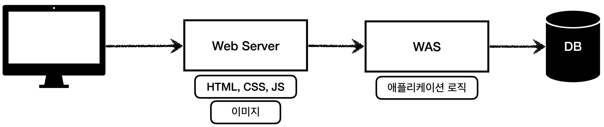
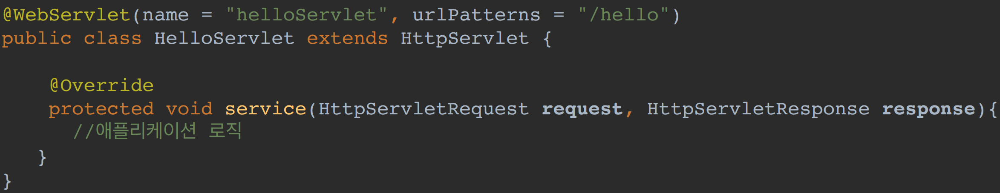
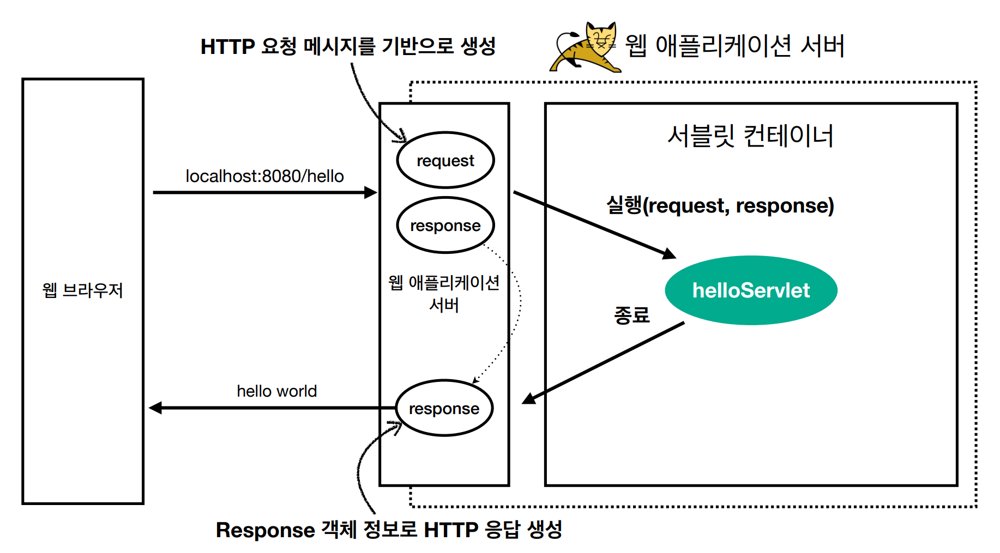
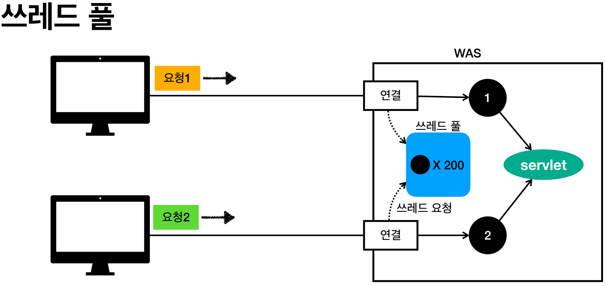

# 1. 웹 애플리케이션 이해

----

## 웹 서버, 웹 애플리케이션 서버

#### 웹 - HTTP 기반
* HTTP 메시지에 모든 것을 전송
  * HTML, TEXT
  * IMAGE, 음성, 영상, 파일
  * JSON, XML(API)  
  
#### 웹 서버(Web Server)
* HTTP 기반으로 동작
* 정적 리소스 제공, 기타 부가기능
* 정적(파일) HTML, CSS, JS, 이미지, 영상

#### 웹 애플리케이션 서버(WAS - Web Application Server)
* HTTP 기반으로 동작
* 웹 서버 기능 포함 + (정적 리소스 제공 가능)
* **프로그램 코드를 실행해서 애플리케이션 로직 수행**
  * **동적 HTML, HTTP API(JSON)**
  * **서블릿, JSP, 스프링 MVC**
* ex) Tomcat

#### 웹 vs 웹 애플리케이션 서버(WAS)
* 웹: 정적 리소스(파일) vs WAS: 애플리케이션 로직
* 둘의 경계는 모호함
* 자바는 서블릿 컨테이너 기능을 제공하면 WAS
* WAS는 애플리케이션 코드를 실행하는데 더 특화

#### 웹 시스템 구성 - WEB, WAS, DB
* 정적 리소슨 웹 서버가 처리
* WAS는 중요한 애플리케이션 로직 처리 전담
  

## 서블릿
* 웹에서는 통신하는 HTTP 규약을 지켜야함 &rarr; 이것을 쉽게 해주는 것

#### 서블릿 특징

* urlPartterns(/hello)의 URL이 호출되면 서블릿 코드가 실행
* HTTP request 정보를 편리하게 사용하는 HttpServletRequest
* HTTP 응답 정보를 편리하게 제공할 수 있는 HttpServletResponse

#### 서블릿 - HTTP 요청, 응답 흐름
* Http 요청
  * WAS는 Request, Response 객체를 새로 만들어서 서블릿 객체 호출
   * 개발자는 Request 객체에서 HTTP 요청 정보를 편리하게 꺼내서 사용
   * 개발자는 Response 객체에 HTTP 응답 정보를 편리하게 입력
   * WAS는 Response 객체에 담겨있는 내용으로 HTTP 응답 정보를 생성

#### 서블릿 컨테이너
* WAS를 서블릿 컨테이너라고 한다.(Tomcat)
* 서블릿 컨테이너는 서블릿 객체를 생성, 초기화, 호출 종료하는 생명주기 관리
* 서블릿 객체는 **싱글톤으로 관리**
  * 모든 고객 요청은 동일한 서블릿 객체 인스턴스에 접근
  * **공유 변수 사용 주의**
* JSP도 서블릿으로 변환 되어서 사용
* 동시 요청을 위한 멀티 쓰레드 처리 지원

## 동시 요청 - 멀티 쓰레드

#### 쓰레드
* 애플리케이션 코드를 하나하나 순차적으로 실행하는 것은 쓰레드
* 자바 메인 메서드를 처음 실행하면 main이라는 이름의 쓰레드가 실행
* 쓰레드가 없다면 자바 애플리케이션 실행이 불가능
* 쓰레드는 한번에 하나의 코드 라인만 수행
* 동시 처리가 필요하면 쓰레드를 추가로 생성

#### 요청 마다 쓰레드 생성 - 장단점
* 장점: 
  * 동시 요청 처리 가능
  * 리소스가 혀용할 때 까지 처리가능
  * 하나의 쓰레드가 지연 되어도, 나머지 쓰레드는 정상 동작
* 단점:
  * 쓰레드는 생성 비용이 매우 비싸다.
    * 고객의 요청이 올 때 마다 쓰레드를 생성하면, 응답 속도가 늦어진다.
  * 쓰레는 컨텍스트 스위칭 비용이 발생한다.
  * 쓰레드 생성에 제한이 없다
    * 메모리 임계점을 넘어서 서버가 죽을 수도 있다.

#### 쓰레드 풀
> 미리 갯수를 정해서 쓰레드를 만들어 놓고 요청하면 하나씩 주는 시스템
* 요청마다 쓰레드 생성의 단점 보완

* 특징
  * 필요한 쓰레드를 풀에 보관하고 관리한다.
  * 쓰레 풀에 생성 가능한 쓰레드의 최대치를 관리한다. (톰캠은 최대 200개 기본)
* 사용
  * 쓰레드가 필요하면, 이미 생성되어 있는 쓰레드를 쓰레드 풀에서 꺼내서 사용한다.
  * 사용을 종료하면 쓰레드 풀에 해당 쓰레드를 반납한다.
  * 쓰레드 풀에 쓰레드가 다 사용 중이어서 쓰레드가 없다면?
    * 기다리게 하거나 요청을 거절한다.
* 장점
  * 쓰레드가 미리 생성되어 있으므로, 쓰레드를 생성하고 종료하는 비용(CPU)이 절약되고, 응답 시간이 빠르다.
  * 생성 가능한 쓰레드의 최대치가 있으므로 너무 많은 요청이 들어와도 기존 요청은 안전하게 처리할 수 있다.

#### WAS의 멀티 쓰레드 지원
* 멀티 쓰레드에 대한 부분은 WAS가 처리
* **개발자가 멀티 쓰레드 관련 코드를 신경쓰지 않아도 됨**
* 개발자는 마치 **싱글 쓰레드 프로그래밍을 하듯이 편리하게 소스 코드를 개발**
* 멀티 쓰레드 환경이므로 싱글톤 객체(서블릿, 스프링 빈)은 주의해서 사용
  
## HTML, HTTP API, CSR, SSR
#### 정적 리소스(웹 서버)
* 고정된 HTML 파일, CSS, JS, 이미지, 영상 등을 제공
* 주로 웹 브라우저

#### HTML 페이지(WAS)
* 동적으로 필요한 HTML 파일을 생성해서 전달(JSP, 타임리프)
* 웹 브라우저: HTML 해석

#### HTTP API
* HTML이 아니라 데이터를 전달
* 주로 JSON 형식 사용
* 다양한 시스템에서 호출
* 데이터만 주고 받음, UI 화면이 필요하면, 클라이언트가 별도 처리
* 앱, 웹 클라이언트, 서버 to 서버

#### 서버사이드 렌더링, 클라이언트 사이드 렌더
* SSR - 서버 사이드 렌더링
  * HTML 최종 결과를 서버에서 만들어서 웹 브라우저에 전달
  * 주로 정적인 화면에 사용
  * 관련기술: JSP, 타임리프 -> 백엔드 개발자
* CSR - 클라이언트 사이드 렌더링
  * HTML 결과를 자바스크립트를 사용해 웹 브라우저에서 동적으로 생성해서 적용
  * 주로 동적인 화면에 사용, 웹 환경을 마치 앱 처럼 필요한 부분부분 변경할 수 있음
  * 예) 구글 지도, Gmail, 구글 캘린더
  * 관련기술: React, Vue.js -> 웹 프론트엔드 개발자
* 참고
  * React, Vue.js를 CSR + SSR 동시에 지원하는 웹 프레임워크도 있음
  * SSR을 사용하더라도, 자바스크립트를 사용해서 화면 일부를 동적으로 변경 가능

----  

###### References: 김영한 - [스프링 MVC 1편 - 백엔드 웹 개발 핵심 기술]
