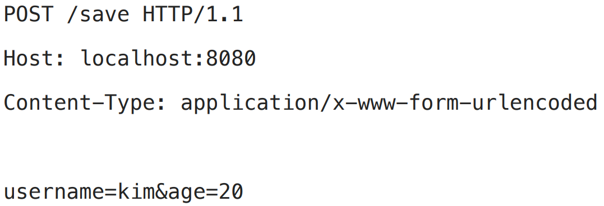

# 2. 서블릿

----

## 스프링 부트 서블릿 환경 구성
#### `@ServletComponentScan`
> 스프링 부트는 서블릿을 직접 등록해서 사용할 수 있도록 `@ServletComponentScan`을 지원한다.

#### 서블릿 등록
```java
@WebServlet(name = "helloServlet", urlPatterns = "/hello")
public class HelloServlet extends HttpServlet {
    @Override
    protected void service(HttpServletRequest request, HttpServletResponse response) throws ServletException, IOException {
        System.out.println("HelloServlet.service");
        System.out.println("request = " + request);
        System.out.println("response = " + response);
        String username = request.getParameter("username");
        System.out.println("username = " + username);
        response.setContentType("text/plain");
        response.setCharacterEncoding("utf-8");
        response.getWriter().write("hello " + username);
    }
}
```

* `@WebServlet` 서블릿 애노테이션
  * name: 서블릿 이름
  * urlPatterns: URL 매핑

#### HTTP 요청을 통해 매핑된 URL이 호출되면 서블릿 컨테이너는 다음 메서드를 실행한다.
#### `protected void service(HttpServletRequest request, HttpServletResponse response)`


## HTTPServletRequest - 개요
#### **HTTPServletRequest** 역할
> ##### HTTP 요청 메시지를 개발자가 직접 파싱해서 사용해도 되지만, 매우 불편할 것이다. 서블릿은 개발자가 HTTP 요청 메시지를 편리하게 사용할 수 있도록 개발자 대신에 HTTP 요청 메시지를 파싱한다. 그리고 그 결과를 `HttpServletRequest` 객체에 담아서 제공한다.


## HTTP 요청 메시지



* START LINE
  * HTTP 메소드
  * URL
  * 쿼리 스트링
  * 스키마, 프로토콜
* 헤더
  * 헤더 조회
* 바디
  * form 파라미터 형식 조회
  * message body 데이터 직접 조회

#### **임시 저장소 기능**
* 해당 HTTP 요청이 시작부터 끝날 때 까지 유지되는 임시 저장소 기능
  * 저장: `request.setAttribute(name, value)`
  * 조회: `request.getAttribute(name)`
#### 세션 관리 기능
* `request.getSession(create: true)`


## HTTP 요청 데이터 - 개요

* **GET - 쿼리 파라미터**
  * /url?username=hello&age=20
  * **메시지 바디 없이,** **URL의 쿼리 파라미터**에 데이터를 포함해서 전달
  * 예) 검색, 필터, 페이징등에서 많이 사용하는 방식
* **POST - HTML Form**
  * content-type: application/x-www-form-urlencoded
  * **메시지 바디에 쿼리 파리미터** 형식으로 전달 username=hello&age=20
  * 예) 회원 가입, 상품 주문, HTML Form 사용
* **HTTP message body**에 데이터를 직접 담아서 요청
  * HTTP API에서 주로 사용, JSON, XML, TEXT
* 데이터 형식은 주로 JSON 사용
  * POST, PUT, PATCH

#### HTTP 요청 데이터 - GET 쿼리 파라미터
> 메시지 바디 없이, **URL의 쿼리 파라미터**를 사용해서 데이터를 전달
* 쿼리 파라미터는 URL에 다음과 같이 `?` 를 시작으로 보낼 수 있다. 추가 파라미터는 `&` 로 구분하면 된다.
* `http://localhost:8080/request-param?username=hello&age=20`

#### 쿼리 파라미터 조회 방법
```java
String username = request.getParameter("username"); //단일 파라미터 조회
Enumeration<String> parameterNames = request.getParameterNames(); //파라미터 이름들 모두 조회
Map<String, String[]> parameterMap = request.getParameterMap(); //파라미터를 Map으로 조회
String[] usernames = request.getParameterValues("username"); //복수 파라미터 조회
```

#### HTTP 요청 데이터 - POST HTML Form
* 특징:
  * content-type: `application/x-www-form-urlencoded`
  * 메시지 바디에 쿼리 파리미터 형식으로 데이터를 전달한다. `username=hello&age=20`

#### `html form`예시
```html
<form action="/request-param" method="post">
  username: <input type="text" name="username" />
  age: <input type="text" name="age" />
  <button type="submit">전송</button>
</form>
```
* 요청 URL:` http://localhost:8080/request-param`
* content-type: `application/x-www-form-urlencoded`
* message body: `username=hello&age=20`

`application/x-www-form-urlencoded` 형식은 앞서 GET에서 살펴본 쿼리 파라미터 형식과 같다. 
따라서 **쿼리 파라미터 조회 메서드를 그대로 사용**하면 된다.
클라이언트(웹 브라우저) 입장에서는 두 방식에 차이가 있지만, 서버 입장에서는 둘의 형식이 동일하므로,
`request.getParameter()` 로 편리하게 구분없이 조회할 수 있다.

#### 참고
> content-type은 HTTP 메시지 바디의 데이터 형식을 지정한다.
> **GET URL 쿼리 파라미터 형식**으로 클라이언트에서 서버로 데이터를 전달할 때는 HTTP 메시지 바디를 사용하지 않기 때문에 content-type이 없다.
> **POST HTML Form 형식**으로 데이터를 전달하면 HTTP 메시지 바디에 해당 데이터를 포함해서 보내기
때문에 바디에 포함된 데이터가 어떤 형식인지 content-type을 꼭 지정해야 한다. 이렇게 폼으로 데이터를 전송하는 형식을 `application/x-www-form-urlencoded` 라 한다.

#### HTTP 요청 데이터 - API 메시지 바디 - JSON
#### **JSON 형식 전송**
* POST `http://localhost:8080/request-body-json`
* content-type: **application/json**
* message body: `{"username": "hello", "age": 20}`
* 결과: `messageBody = {"username": "hello", "age": 20}`

```java
/**
 * http://localhost:8080/request-body-json
 *
 * JSON 형식 전송
 * content-type: application/json
 * message body: {"username": "hello", "age": 20}
 *
 */
@WebServlet(name = "requestBodyJsonServlet", urlPatterns = "/request-body-json")
public class RequestBodyJsonServlet extends HttpServlet {
    @Override
    protected void service(HttpServletRequest request, HttpServletResponse response) throws ServletException, IOException {
        ServletInputStream inputStream = request.getInputStream();
        String messageBody = StreamUtils.copyToString(inputStream, StandardCharsets.UTF_8);
        System.out.println("messageBody = " + messageBody);
        response.getWriter().write("ok");
    }
}
```

#### 참고
> JSON 결과를 파싱해서 사용할 수 있는 자바 객체로 변환하려면 Jackson, Gson 같은 JSON 변환
라이브러리를 추가해서 사용해야 한다. 스프링 부트로 Spring MVC를 선택하면 기본으로 Jackson 
라이브러리( `ObjectMapper` )를 함께 제공한다.

## HttpServletResponse - 기본 사용법
#### HttpServletResponse 역할
#### **HTTP 응답 메시지 생성**
* HTTP 응답코드 지정
* 헤더 생성
* 바디 생성

#### 편의 기능 제공
* Content-Type, 쿠키, Redirect

#### HttpServletResponse - 기본 사용법
```java
/**
 * http://localhost:8080/response-header
 *
 */
@WebServlet(name = "responseHeaderServlet", urlPatterns = "/response-header")
public class ResponseHeaderServlet extends HttpServlet {
    @Override
    protected void service(HttpServletRequest request, HttpServletResponse response) throws ServletException, IOException {
    //[status-line]
    response.setStatus(HttpServletResponse.SC_OK); //200
    //[response-headers]
    response.setHeader("Content-Type", "text/plain;charset=utf-8");
    response.setHeader("Cache-Control", "no-cache, no-store, must-revalidate");
    response.setHeader("Pragma", "no-cache");
    response.setHeader("my-header","hello");
    //[Header 편의 메서드]
    content(response);
    cookie(response);
    redirect(response);
    //[message body]
    PrintWriter writer = response.getWriter();
    writer.println("ok");
    }
}
```

#### Content 편의 메서드
```java
private void content(HttpServletResponse response) {
    //Content-Type: text/plain;charset=utf-8
    //Content-Length: 2
    //response.setHeader("Content-Type", "text/plain;charset=utf-8");
    response.setContentType("text/plain");
    response.setCharacterEncoding("utf-8");
    //response.setContentLength(2); //(생략시 자동 생성)
}
```
#### 쿠키 편의 메서드
```java
private void cookie(HttpServletResponse response) {
    //Set-Cookie: myCookie=good; Max-Age=600;
    //response.setHeader("Set-Cookie", "myCookie=good; Max-Age=600");
    Cookie cookie = new Cookie("myCookie", "good");
    cookie.setMaxAge(600); //600초
    response.addCookie(cookie);
}
```

#### redirect 편의 메서드

```java
private void redirect(HttpServletResponse response) throws IOException {
    //Status Code 302
    //Location: /basic/hello-form.html
    //response.setStatus(HttpServletResponse.SC_FOUND); //302
    //response.setHeader("Location", "/basic/hello-form.html");
    response.sendRedirect("/basic/hello-form.html");
}
```
## HTTP 응답 데이터 - 단순 텍스트, HTML

* 단순 텍스트 응답
  * 앞에서 살펴봄 ( `writer.println("ok");` )
* HTML 응답
* HTTP API - MessageBody JSON 응답


----  

###### References: 김영한 - [스프링 MVC 1편 - 백엔드 웹 개발 핵심 기술]
