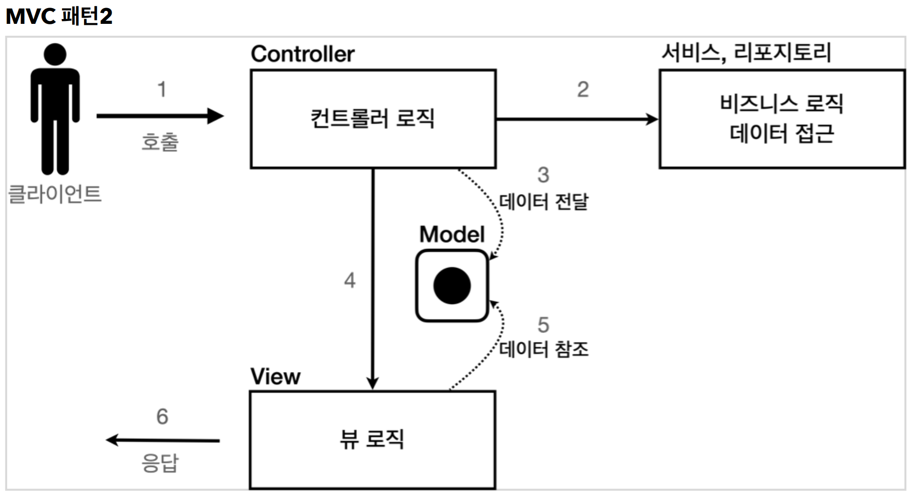

# 3. 서블릿, JSP, MVC 패턴

----

> ##### 템플릿 엔진에는 JSP, Thymeleaf, Freemarker, Velocity등이 있다. 템플릿 엔진을 사용하면 HTML 문서에서 필요한 곳만 코드를 적용해서 동적으로 변경할 수 있다.

## MVC 패턴 - 개요

#### 너무 많은 역할
> ##### 하나의 서블릿이나 JSP만으로 비즈니스 로직과 뷰 렌더링까지 모두 처리하게 되면, 너무 많은 역할을 하게되고, 결과적으로 유지보수가 어려워진다. 비즈니스 로직을 호출하는 부분에 변경이 발생해도 해당 코드를 손대야 하고, UI를 변경할 일이 있어도 비즈니스 로직이 함께 있는 해당 파일을 수정해야 한다. HTML 코드 하나 수정해야 하는데, 수백줄의 자바 코드가 함께 있다고 상상해보라! 또는 비즈니스 로직을 하나 수정해야 하는데 수백 수천줄의 HTML 코드가 함께 있다고 상상해보라.

#### 변경의 라이프 사이클
> ##### 사실 이게 정말 중요한데, 진짜 문제는 둘 사이에 변경의 라이프 사이클이 다르다는 점이다. 예를 들어서 UI를 일부 수정하는 일과 비즈니스 로직을 수정하는 일은 각각 다르게 발생할 가능성이 매우 높고 대부분 서로에게 영향을 주지 않는다. 이렇게 변경의 라이프 사이클이 다른 부분을 하나의 코드로 관리하는 것은 유지보수하기 좋지 않다. (물론 UI가 많이 변하면 함께 변경될 가능성도 있다.)


## Model View Controller
> ##### MVC 패턴은 지금까지 학습한 것 처럼 하나의 서블릿이나, JSP로 처리하던 것을 컨트롤러(Controller)와 뷰(View)라는 영역으로 서로 역할을 나눈 것을 말한다. 웹 애플리케이션은 보통 이 MVC 패턴을 사용한다.

**컨트롤러**: HTTP 요청을 받아서 **파라미터를 검증하고, 비즈니스 로직(서비스에서 호출)을 실행**한다. 그리고 뷰에 전달할 결과 데이터를 조회해서 **모델**에 담는다.

**모델**: **뷰에 출력할 데이터를 담아둔다.** 뷰가 필요한 데이터를 컨트롤러에서 모델에 담아서 전달해주는 덕분에 뷰는 비즈니스 로직이나 데이터 접근을 몰라도 되고, 화면을 렌더링 하는 일에 집중할 수 있다.

**뷰**: 모델에 담겨있는 데이터를 사용해서 화면을 그리는 일에 집중한다. 여기서는 **HTML을 생성**하는 부분을
말한다.



## MVC 패턴 - 적용
#### 서블릿을 컨트롤러로 사용하고, JSP를 뷰로 사용해서 MVC 패턴을 적용해보자.
#### Model은 HttpServletRequest 객체를 사용한다. request는 내부에 데이터 저장소를 가지고 있는데, `request.setAttribute()` , `request.getAttribute()` 를 사용하면 데이터를 보관하고, 조회할 수 있다.
```java
@WebServlet(name = "mvcMemberSaveServlet", urlPatterns = "/servlet-mvc/members/save")
public class MvcMemberSaveServlet extends HttpServlet {
    private MemberRepository memberRepository = MemberRepository.getInstance();
    @Override
    protected void service(HttpServletRequest request, HttpServletResponse response) throws ServletException, IOException {
        String username = request.getParameter("username");
        int age = Integer.parseInt(request.getParameter("age"));
        Member member = new Member(username, age);
        System.out.println("member = " + member);
        memberRepository.save(member);
        //Model에 데이터를 보관한다.
        request.setAttribute("member", member);
        String viewPath = "/WEB-INF/views/save-result.jsp";
        RequestDispatcher dispatcher = request.getRequestDispatcher(viewPath);
        dispatcher.forward(request, response);
    }
}
```

HttpServletRequest를 Model로 사용한다.
request가 제공하는 `setAttribute()` 를 사용하면 request 객체에 데이터를 보관해서 뷰에 전달할 수
있다.
뷰는 `request.getAttribute()` 를 사용해서 데이터를 꺼내면 된다.

## MVC 패턴 - 한계

#### **MVC 컨트롤러의 단점**

**포워드 중복**  
View로 이동하는 코드가 항상 중복 호출되어야 한다. 물론 이 부분을 메서드로 공통화해도 되지만, 해당
메서드도 항상 직접 호출해야 한다.
``` java
RequestDispatcher dispatcher = request.getRequestDispatcher(viewPath);
dispatcher.forward(request, response);
```
**ViewPath에 중복**  
```java 
String viewPath = "/WEB-INF/views/new-form.jsp";
```

* prefix: /WEB-INF/views/
* suffix: .jsp  
그리고 만약 jsp가 아닌 thymeleaf 같은 다른 뷰로 변경한다면 전체 코드를 다 변경해야 한다.  

**사용하지 않는 코드**

다음 코드를 사용할 때도 있고, 사용하지 않을 때도 있다. 특히 response는 현재 코드에서 사용되지
않는다.
`HttpServletRequest request, HttpServletResponse response`  

그리고 이런 `HttpServletRequest` , `HttpServletResponse` 를 사용하는 코드는 테스트 케이스를
작성하기도 어렵다.  

**정리하면 공통 처리가 어렵다는 문제가 있다.**  
이 문제를 해결하려면 컨트롤러 호출 전에 먼저 공통 기능을 처리해야 한다. 소위 **수문장 역할**을 하는 기능이
필요하다. **프론트 컨트롤러(Front Controller) 패턴**을 도입하면 이런 문제를 깔끔하게 해결할 수 있다.
(입구를 하나로!)
스프링 MVC의 핵심도 바로 이 프론트 컨트롤러에 있다.

#### **redirect vs forward**
> ##### 리다이렉트는 실제 클라이언트(웹 브라우저)에 응답이 나갔다가, 클라이언트가 redirect 경로로 다시 요청한다. 따라서 클라이언트가 인지할 수 있고, URL 경로도 실제로 변경된다. 반면에 포워드는 서버 내부에서 일어나는 호출이기 때문에 클라이언트가 전혀 인지하지 못한다.


----  

###### References: 김영한 - [스프링 MVC 1편 - 백엔드 웹 개발 핵심 기술]
