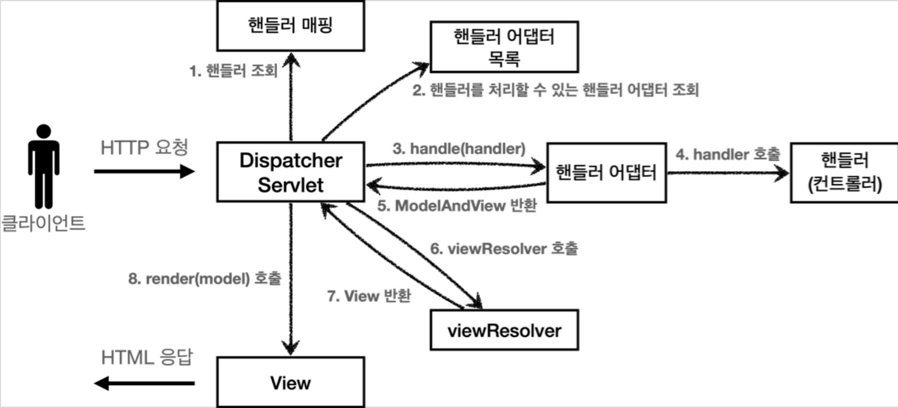

# 5. 스프링 MVC - 구조 이해

----
## 스프링 MVC 전체 구조


#### DispacherServlet 서블릿 등록

* `DispacherServlet` 도 부모 클래스에서 `HttpServlet` 을 상속 받아서 사용하고, 서블릿으로 동작한다.
  * DispatcherServlet FrameworkServlet HttpServletBean HttpServlet
* 스프링 부트는 `DispacherServlet` 을 서블릿으로 자동으로 등록하면서 **모든 경로**( `urlPatterns="/"` )에 대해서 매핑한다.
  * 참고: 더 자세한 경로가 우선순위가 높다. 그래서 기존에 등록한 서블릿도 함께 동작한다.

#### 요청 흐름
* 서블릿이 호출되면 `HttpServlet` 이 제공하는 `serivce()` 가 호출된다.
* 스프링 MVC는 `DispatcherServlet` 의 부모인 `FrameworkServlet` 에서 `service()` 를 오버라이드
해두었다.
* `FrameworkServlet.service()` 를 시작으로 여러 메서드가 호출되면서
* `DispacherServlet.doDispatch()` 가 호출된다.

`DispacherServlet.doDispatch()`
```java
protected void doDispatch(HttpServletRequest request, HttpServletResponse response) throws Exception {
    HttpServletRequest processedRequest = request;
    HandlerExecutionChain mappedHandler = null;
    ModelAndView mv = null;

    // 1. 핸들러 조회
    mappedHandler = getHandler(processedRequest);
    if (mappedHandler == null) {
      noHandlerFound(processedRequest, response);
      return;
    }

    // 2. 핸들러 어댑터 조회 - 핸들러를 처리할 수 있는 어댑터
    HandlerAdapter ha = getHandlerAdapter(mappedHandler.getHandler());

    // 3. 핸들러 어댑터 실행 -> 4. 핸들러 어댑터를 통해 핸들러 실행 -> 5. ModelAndView 반환
    mv = ha.handle(processedRequest, response, mappedHandler.getHandler());
    processDispatchResult(processedRequest, response, mappedHandler, mv, dispatchException);
}

private void processDispatchResult(HttpServletRequest request,
HttpServletResponse response, HandlerExecutionChain mappedHandler, ModelAndView mv, Exception exception) throws Exception {
  // 뷰 렌더링 호출
  render(mv, request, response);
}

protected void render(ModelAndView mv, HttpServletRequest request, HttpServletResponse response) throws Exception {
    View view;
    String viewName = mv.getViewName();

    // 6. 뷰 리졸버를 통해서 뷰 찾기, 7. View 반환
    view = resolveViewName(viewName, mv.getModelInternal(), locale, request);

    // 8. 뷰 렌더링
    view.render(mv.getModelInternal(), request, response);
}
```

#### springMVC 구조


#### 동작 순서
1. **핸들러 조회**: 핸들러 매핑을 통해 요청 URL에 매핑된 핸들러(컨트롤러)를 조회한다.
2. **핸들러 어댑터 조회**: 핸들러를 실행할 수 있는 핸들러 어댑터를 조회한다.
3. **핸들러 어댑터 실행**: 핸들러 어댑터를 실행한다.
4. **핸들러 실행**: 핸들러 어댑터가 실제 핸들러를 실행한다.
5. **ModelAndView 반환**: 핸들러 어댑터는 핸들러가 반환하는 정보를 ModelAndView로 변환해서
반환한다.
6. **viewResolver 호출**: 뷰 리졸버를 찾고 실행한다.

7. **View 반환**: 뷰 리졸버는 뷰의 논리 이름을 물리 이름으로 바꾸고, 렌더링 역할을 담당하는 뷰 객체를
반환한다.

8. **뷰 렌더링**: 뷰를 통해서 뷰를 렌더링 한다.


## 핸들러 매핑과 핸들러 어댑터

* **HandlerMapping(핸들러 매핑)**
  * 핸들러 매핑에서 컨트롤러를 찾을 수 있어야 한다.
  * 예) 스프링 빈의 이름으로 핸들러를 찾을 수 있는 핸들러 매핑이 필요하다.
* **HandlerAdapter(핸들러 어댑터)**
  * 핸들러 매핑을 통해서 찾은 핸들러를 실행할 수 있는 핸들러 어댑터가 필요하다.
  * 예) Controller 인터페이스를 실행할 수 있는 핸들러 어댑터를 찾고 실행해야 한다.

* ex) `@RequestMapping`


## 뷰 리졸버

**1. 핸들러 어댑터 호출**

핸들러 어댑터를 통해 `new-form` 이라는 논리 뷰 이름을 획득한다.

**2. ViewResolver 호출**

`new-form` 이라는 뷰 이름으로 viewResolver를 순서대로 호출한다.
`BeanNameViewResolver` 는 `new-form` 이라는 이름의 스프링 빈으로 등록된 뷰를 찾아야 하는데 없다.
`InternalResourceViewResolver` 가 호출된다.

**3. InternalResourceViewResolver**

이 뷰 리졸버는 `InternalResourceView` 를 반환한다.

**4. 뷰 - InternalResourceView**

`InternalResourceView` 는 JSP처럼 포워드 `forward()` 를 호출해서 처리할 수 있는 경우에 사용한다.

**5. view.render()**

`view.render()` 가 호출되고 `InternalResourceView` 는 `forward()` 를 사용해서 JSP를 실행한다.

#### 참고
> 다른 뷰는 실제 뷰를 렌더링하지만, JSP의 경우 `forward()` 통해서 해당 JSP로 이동(실행)해야 렌더링이
된다. JSP를 제외한 나머지 뷰 템플릿들은 `forward()` 과정 없이 바로 렌더링 된다.
> Thymeleaf 뷰 템플릿을 사용하면 `ThymeleafViewResolver` 를 등록해야 한다. 최근에는 라이브러리만
추가하면 스프링 부트가 이런 작업도 모두 자동화해준다.

## 스프링 MVC- 시작하기
#### **@RequestMapping**

> 스프링은 애노테이션을 활용한 매우 유연하고, 실용적인 컨트롤러를 만들었는데 이것이 바로
`@RequestMapping` 애노테이션을 사용하는 컨트롤러이다.

```java
@Controller
@RequestMapping("/springmvc/v1/members/new-form")
public class SpringMemberFormControllerV1 {

    @RequestMapping
    public ModelAndView process() {
      return new ModelAndView("new-form");
    }

}
```

* `@Controller`:
  * 스프링이 자동으로 스프링 빈으로 등록한다.
  * 스프링 MVC에서 애노테이션 기반 컨트롤러로 인식한다.
* `@RequestMapping`: 요청 정보를 매핑한다. 해당 URL이 호출되면 이 메서드가 호출된다. 애노테이션을 기반으로 동작하기 때문에, 메서드의 이름은 임의로 지으면 된다.
* `ModelAndView`: 모델과 뷰 정보를 담아서 반환하면 된다.


## 스프링 MVC - 실용적인 방식

```java
/**
 * v3
 * Model 도입
 * ViewName 직접 반환
 * @RequestParam 사용
 * @RequestMapping -> @GetMapping, @PostMapping
 */
@Controller
@RequestMapping("/springmvc/v3/members")
public class SpringMemberControllerV3 {
    private MemberRepository memberRepository = MemberRepository.getInstance();
    
    @GetMapping("/new-form")
    public String newForm() {
        return "new-form";
    }
    
    @PostMapping("/save")
    public String save( 
      @RequestParam("username") String username,    
      @RequestParam("age") int age, Model model) {
        Member member = new Member(username, age);
        memberRepository.save(member);
        model.addAttribute("member", member);
        return "save-result";
    }

    @GetMapping
    public String members(Model model) { 
        List<Member> members = memberRepository.findAll();
        model.addAttribute("members", members);
        return "members";
    }
}
```
#### **Model 파라미터**
* `save()` , `members()` 를 보면 Model을 파라미터로 받는 것을 확인할 수 있다.

#### **ViewName 직접 반환**
* 뷰의 논리 이름을 반환할 수 있다.

#### **@RequestParam 사용**
* 스프링은 HTTP 요청 파라미터를 `@RequestParam` 으로 받을 수 있다.
*  `@RequestParam("username")` 은 `request.getParameter("username")` 와 거의 같은 코드라 생각하면 된다.
* 물론 GET 쿼리 파라미터, POST Form 방식을 모두 지원한다

#### **@RequestMapping -> @GetMapping, @PostMapping** 
`@RequestMapping` 은 URL만 매칭하는 것이 아니라, HTTP Method도 함께 구분할 수 있다.
예를 들어서 URL이 `/new-form` 이고, HTTP Method가 GET인 경우를 모두 만족하는 매핑을 하려면
다음과 같이 처리하면 된다.   
```java
 @RequestMapping(value = "/new-form", method = RequestMethod.GET)
  -> @GetMapping("/new-form")
 ```

----  

###### References: 김영한 - [스프링 MVC 1편 - 백엔드 웹 개발 핵심 기술]
