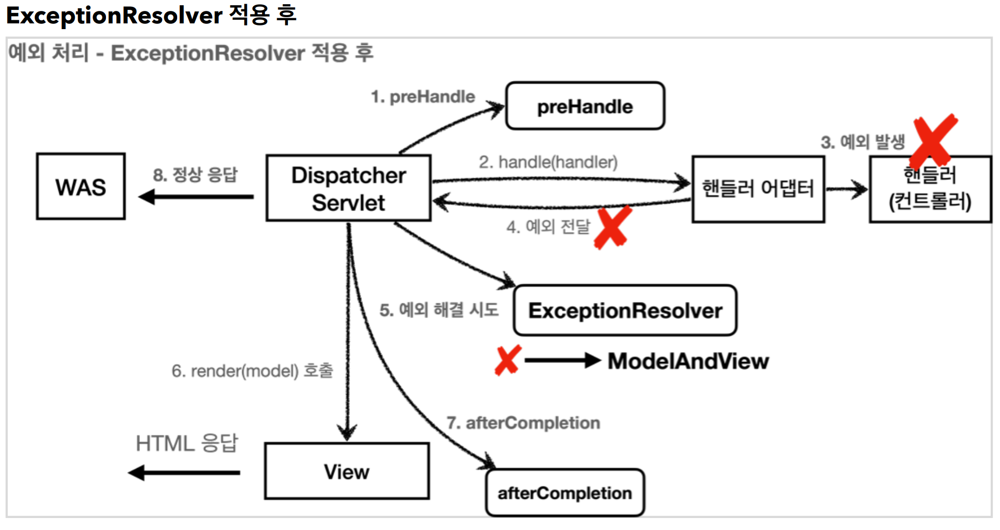

# 9. API 예외 처리

----

## API 예외 처리 - 시작

#### API 예외 처리는 어떻게 해야할까?<br>

#### HTML 페이지의 경우 지금까지 설명했던 것 처럼 4xx, 5xx와 같은 오류 페이지만 있으면 대부분의 문제를 해결할 수 있다.
#### 그런데 API의 경우에는 생각할 내용이 더 많다. 오류 페이지는 단순히 고객에게 오류 화면을 보여주고 끝이지만, API는 각 오류 상황에 맞는 오류 응답 스펙을 정하고, JSON으로 데이터를 내려주어야 한다.

## API 예외 처리 - 스프링 부트 기본 오류 처리
#### 스프링 부트가 제공하는 `BasicErrorController` 는 HTML 페이지를 제공하는 경우에는 매우 편리하다. 
#### 4xx, 5xx 등등 모두 잘 처리해준다. 그런데 API 오류 처리는 다른 차원의 이야기이다. API 마다, 각각의 컨트롤러나 예외마다 서로 다른 응답 결과를 출력해야 할 수도 있다. 예를 들어서 회원과 관련된 API에서 예외가 발생할 때 응답과, 상품과 관련된 API에서 발생하는 예외에 따라 그 결과가 달라질 수 있다. 
#### 결과적으로 매우 세밀하고 복잡하다

## API 예외 처리 - HandlerExceptionResolver 시작
> 예외가 발생해서 서블릿을 넘어 WAS까지 예외가 전달되면 HTTP 상태코드가 500으로 처리된다. 
발생하는 예외에 따라서 400, 404 등등 다른 상태코드로 처리하고 싶다.  
> 오류 메시지, 형식등을 API마다 다르게 처리하고 싶다.
<br>

#### **HandlerExceptionResolver**
스프링 MVC는 컨트롤러(핸들러) 밖으로 예외가 던져진 경우 예외를 해결하고, 동작을 새로 정의할 수 있는
방법을 제공한다. 컨트롤러 밖으로 던져진 예외를 해결하고, 동작 방식을 변경하고 싶으면
`HandlerExceptionResolver` 를 사용하면 된다. 줄여서 `ExceptionResolver` 라 한다.



* `ExceptionResolver` 가 `ModelAndView` 를 반환하는 이유는 마치 try, catch를 하듯이, Exception 을 처리해서 정상 흐름 처럼 변경하는 것이 목적이다. 이름 그대로 `Exception` 을 Resolver(해결)하는 것이 목적이다.

#### 반환 값에 따른 동작 방식
`HandlerExceptionResolver` 의 반환 값에 따른 `DispatcherServlet` 의 동작 방식은 다음과 같다.  
* **빈 ModelAndView**: `new ModelAndView()` 처럼 빈 `ModelAndView` 를 반환하면 뷰를 렌더링 하지
않고, 정상 흐름으로 서블릿이 리턴된다.
* **ModelAndView 지정**: `ModelAndView` 에 `View` , `Model` 등의 정보를 지정해서 반환하면 뷰를 렌더링
한다.
* **null**: `null` 을 반환하면, 다음 `ExceptionResolver` 를 찾아서 실행한다. 만약 처리할 수 있는
`ExceptionResolver` 가 없으면 예외 처리가 안되고, 기존에 발생한 예외를 서블릿 밖으로 던진다.

#### **ExceptionResolver 활용**
* 예외 상태 코드 변환
  * 예외를 `response.sendError(xxx)` 호출로 변경해서 서블릿에서 상태 코드에 따른 오류를
처리하도록 위임
  * 이후 WAS는 서블릿 오류 페이지를 찾아서 내부 호출, 예를 들어서 스프링 부트가 기본으로 설정한 `/error` 가 호출됨
* 뷰 템플릿 처리
  * `ModelAndView` 에 값을 채워서 예외에 따른 새로운 오류 화면 뷰 렌더링 해서 고객에게 제공
* API 응답 처리
  * `response.getWriter().println("hello");` 처럼 HTTP 응답 바디에 직접 데이터를 넣어주는
것도 가능하다. 여기에 JSON 으로 응답하면 API 응답 처리를 할 수 있다.

## API 예외 처리 - 스프링이 제공하는 ExceptionResolver

#### 스프링 부트가 기본으로 제공하는 ExceptionResolver 는 다음과 같다.
#### `HandlerExceptionResolverComposite` 에 다음 순서로 등록
1. `ExceptionHandlerExceptionResolver`
2. `ResponseStatusExceptionResolver`
3. `DefaultHandlerExceptionResolver` -> 우선 순위가 가장 낮다.

#### **ExceptionHandlerExceptionResolver**
#### `@ExceptionHandler` 을 처리한다. API 예외 처리는 대부분 이 기능으로 해결한다.
#### **ResponseStatusExceptionResolver**
#### HTTP 상태 코드를 지정해준다.
#### `예) @ResponseStatus(value = HttpStatus.NOT_FOUND)`
#### **DefaultHandlerExceptionResolver**
#### 스프링 내부 기본 예외를 처리한다.
<br>

## API 예외 처리 - @ExceptionHandler

#### **API 예외처리의 어려운 점**
* `HandlerExceptionResolver` 를 떠올려 보면 `ModelAndView` 를 반환해야 했다. 이것은 API 응답에는 필요하지 않다.
* API 응답을 위해서 `HttpServletResponse` 에 직접 응답 데이터를 넣어주었다. 이것은 매우 불편하다. 
스프링 컨트롤러에 비유하면 마치 과거 서블릿을 사용하던 시절로 돌아간 것 같다.
* 특정 컨트롤러에서만 발생하는 예외를 별도로 처리하기 어렵다. 예를 들어서 회원을 처리하는 컨트롤러에서
발생하는 `RuntimeException` 예외와 상품을 관리하는 컨트롤러에서 발생하는 동일한
`RuntimeException` 예외를 서로 다른 방식으로 처리하고 싶다면 어떻게 해야할까?

#### **@ExceptionHandler**
#### 스프링은 API 예외 처리 문제를 해결하기 위해 `@ExceptionHandler` 라는 애노테이션을 사용하는 매우 편리한 예외 처리 기능을 제공하는데, 이것이 바로 `ExceptionHandlerExceptionResolver` 이다. 
#### 스프링은 `ExceptionHandlerExceptionResolver` 를 기본으로 제공하고, 기본으로 제공하는 `ExceptionResolver` 중에 우선순위도 가장 높다. 실무에서 API 예외 처리는 대부분 이 기능을 사용한다.

#### **@ExceptionHandler**
#### `@ExceptionHandler` 애노테이션을 선언하고, 해당 컨트롤러에서 처리하고 싶은 예외를 지정해주면 된다. 
#### 해당 컨트롤러에서 예외가 발생하면 이 메서드가 호출된다. 참고로 지정한 예외 또는 그 예외의 자식 클래스는 모두 잡을 수 있다.
```java
@ExceptionHandler(IllegalArgumentException.class)
public ErrorResult illegalExHandle(IllegalArgumentException e) {
  log.error("[exceptionHandle] ex", e);
  return new ErrorResult("BAD", e.getMessage());
}
```

## API 예외 처리 - @ControllerAdvice
#### `@ExceptionHandler` 를 사용해서 예외를 깔끔하게 처리할 수 있게 되었지만, 정상 코드와 예외 처리 코드가 하나의 컨트롤러에 섞여 있다. `@ControllerAdvice` 또는 `@RestControllerAdvice` 를 사용하면 둘을 분리할 수 있다.

#### **@ControllerAdvice**
* `@ControllerAdvice` 는 대상으로 지정한 여러 컨트롤러에 `@ExceptionHandler` , `@InitBinder` 기능을
부여해주는 역할을 한다.
* `@ControllerAdvice` 에 대상을 지정하지 않으면 모든 컨트롤러에 적용된다. (글로벌 적용)
* `@RestControllerAdvice` 는 `@ControllerAdvice` 와 같고, `@ResponseBody` 가 추가되어 있다.
`@Controller` , `@RestController` 의 차이와 같다.

```JAVA
@Slf4j
@RestControllerAdvice
public class ExControllerAdvice {
  
  @ResponseStatus(HttpStatus.BAD_REQUEST)
  @ExceptionHandler(IllegalArgumentException.class)
  public ErrorResult illegalExHandle(IllegalArgumentException e) {
    log.error("[exceptionHandle] ex", e);
    return new ErrorResult("BAD", e.getMessage());
  }
  
  @ExceptionHandler
  public ResponseEntity<ErrorResult> userExHandle(UserException e) {
    log.error("[exceptionHandle] ex", e);
    ErrorResult errorResult = new ErrorResult("USER-EX", e.getMessage());
    return new ResponseEntity<>(errorResult, HttpStatus.BAD_REQUEST);
  }
  
  @ResponseStatus(HttpStatus.INTERNAL_SERVER_ERROR)
  @ExceptionHandler
  public ErrorResult exHandle(Exception e) {
    log.error("[exceptionHandle] ex", e);
    return new ErrorResult("EX", "내부 오류");
  }
}
```
----  

###### References: 김영한 - [스프링 MVC 2편 - 백엔드 웹 개발 활용 기술]
