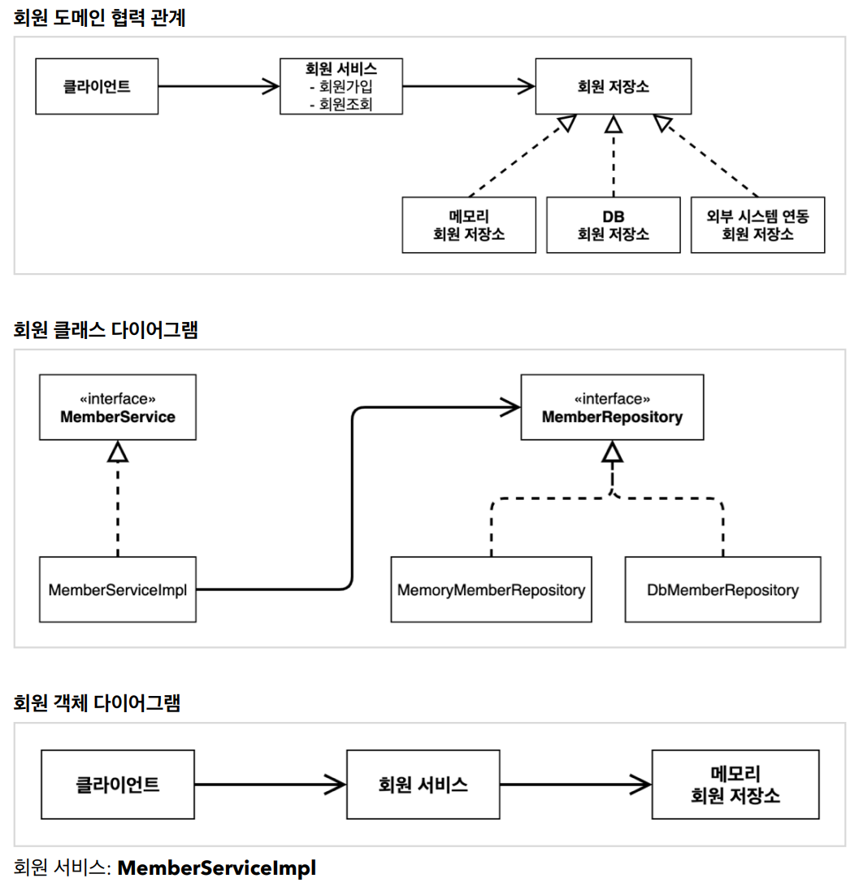
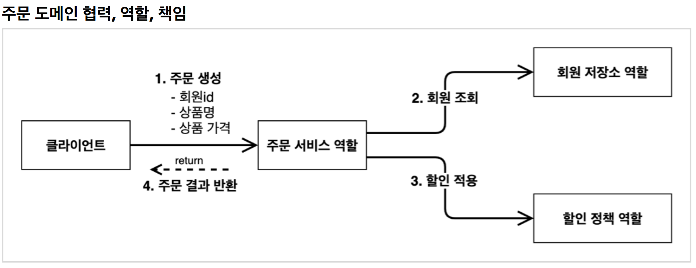
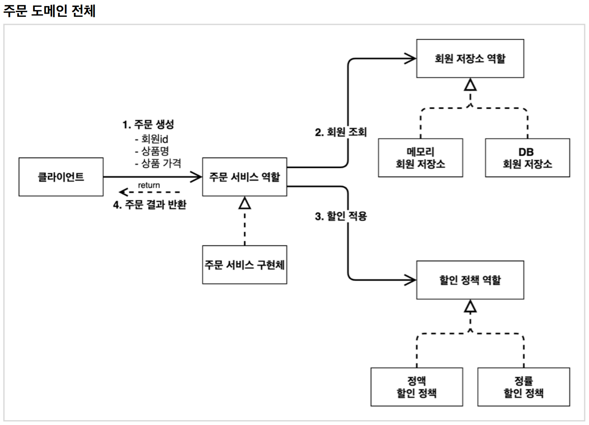
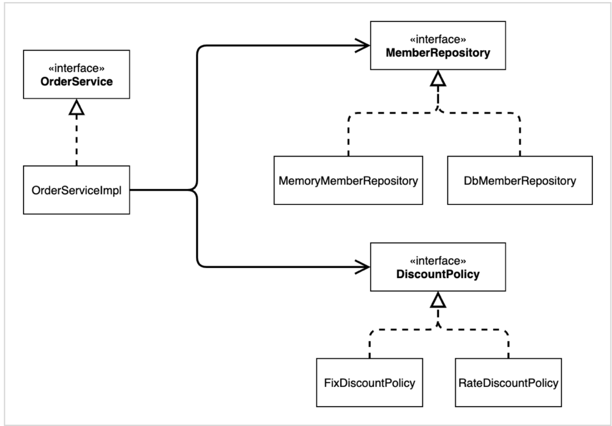
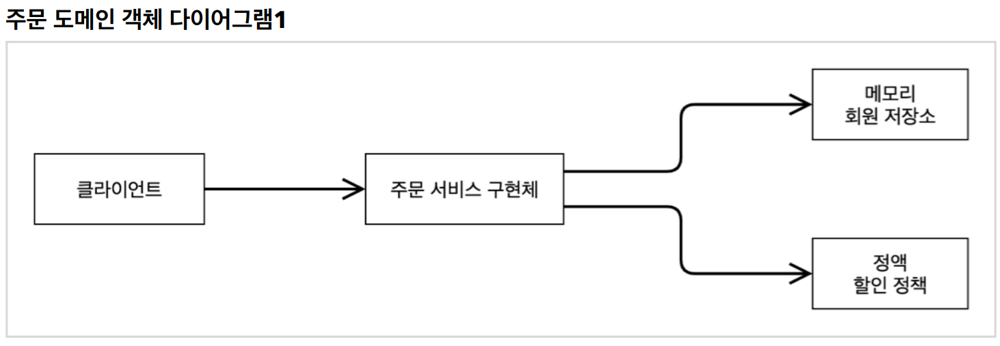
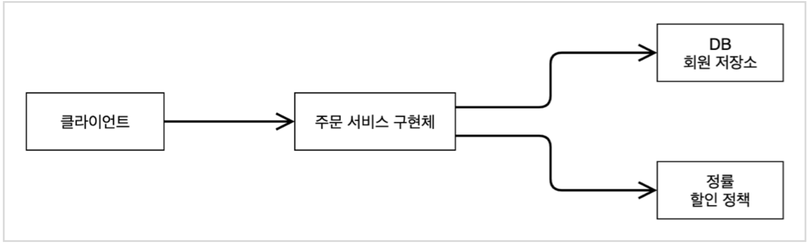

# 스프링 핵심 원리 이해1 - 예제 만들기

----

#### 프로젝트 생성

#### 비즈니스 요구사항과 설계

* 회원
  * 회원을 가입하고 조회할 수 있다.
  * 회원은 일반과 VIP 두 가지 등급이 있다.
  * 회원 데이터는 자체 DB를 구축할 수 있고, 외부 시스템과 연동할 수 있다. (미확정)
* 주문과 할인 정책
  * 회원은 상품을 주문할 수 있다.
  * 회원 등급에 따라 할인 정책을 적용할 수 있다.
  * 할인 정책은 모든 VIP는 1000원을 할인해주는 고정 금액 할인을 적용해달라. (나중에 변경 될 수 있다.)
  * 할인 정책은 변경 가능성이 높다. 회사의 기본 할인 정책을 아직 정하지 못했고, 오픈 직전까지 고민을 미루고 싶다. 최악의 경우 할인을 적용하지 않을 수 도 있다. (미확정)

#### 회원 도메인 설계

#### 회원 도메인 개발
#### 회원 도메인 실행과 테스트
#### 주문과 할인 도메인 설계

##### 주문 도메인 클래스 다이어그램

#### 주문과 할인 도메인 개발
#### 주문과 할인 도메인 실행과 테스트

----  

###### References: 김영한 - [스프링 핵심 원리 - 기본편]
