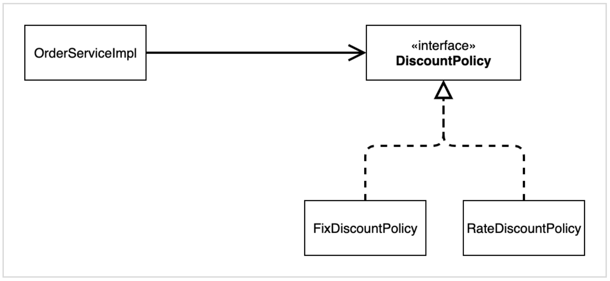
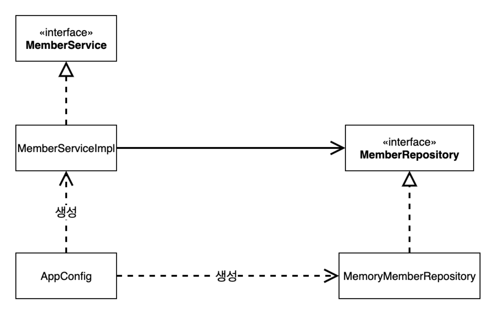

# 스프링 핵심 원리 이해2 - 객체 지향 원리 적용

----

#### 새로운 할인 정책 개발
##### RateDiscountPolicy 추가


##### 할인 정책을 애플리케이션에 적용해보자
* 할인 정책을 변경하려면 `OrderServiceImpl`코드를 고쳐야 한다.
* 문제점 발견
  * 구체(구현) 클래스에도 의존하고 있다.  
  * DIP 위반

#### 관심사 분리
##### AppConfig 등장
* 애플리케이션의 전체 동작 방식을 구성(Config)하기 위해, **구현 객체를 생성**하고, **연결**하는 책임을 가지는 별도의 설정 클래스
```java
public class AppConfig {
    public MemberService memberService() {
        return new MemberServiceImpl(memberRepository());
    }
    public OrderService orderService() {
        return new OrderServiceImpl(
                memberRepository(),
                discountPolicy());
    }
    public MemberRepository memberRepository() {
        return new MemoryMemberRepository();
    }
    public DiscountPolicy discountPolicy() {
        return new FixDiscountPolicy();
    }
}
```
* AppConfig는 애플리케이션의 실제 동작에 필요한 **구현 객체를 생성**한다.
  * `MemberServiceImpl`
  * `MemoryMemberRepository`
  * `OrderServiceImpl`
  * `FixDiscountPolicy`
* AppConfig는 생성한 객체 인스턴스의 참조(레퍼런스)를 **생성자를 통해서 주입(연결)** 해준다.
  * `MemberServiceImpl` &rarr;  `MemoryMemberRepository`
  * `OrderServiceImpl` &rarr; `MemoryMemberRepository, FixDiscountPolicy`



* 객체의 생성과 연결은 `AppConfig`가 담당한다.
* **DIP 완성:** `MemberServiceImpl`은 `MemberRepository`인 추상에만 의존하면 된다. 이제 구체 클래스를 몰라도 된다.
* **관심사의 분리**: 객체를 생성하고 연결하는 역할과 실행하는 역할이 명확히 분리되었다.
* `appCofig` 객체는 `memoryMemberRepository`객체를 생성하고 그 참조값을 `memberServiceImpl`을 생성하면서 생성자로 전달한다.
* 클라이언트인 `meberServiceImpl`입장에서 보면 의존관계를 마치 외부에서 주입해주는 것 같다고 해서 DI(Dependency Injection) 우리말로 의존관계 주입 또는 의존성 주입이라 한다.

##### 테스트 코드에서 appConfig로 의존관계 주입 예)
```java
@BeforeEach
 public void beforeEach() {
     AppConfig appConfig = new AppConfig();
     memberService = appConfig.memberService();
     orderService = appConfig.orderService();
 }
```

#### 의존관계 주입 DI(Dependency Injection)
##### 정적인 클래스 의존관계
* 클래스가 사용하는 import 코드만 보고 의존관계를 쉽게 판단할 수 있다. 정적인 의존관계는 애플리케이션을 실행하지 않아도 분석할 수 있다.
##### 동적인 객체 인스턴스 의존 관계
* 애플리케이션 실행 시점에 실제 생성된 객체 인스턴스의 참조가 연결된 의존 관계다.
* 애플리케이션 실행 시점(런타임)에 외부에서 실제 구현 객체를 생성하고 클라이언트에 전달해서 클라이언트와 서버의 실제 의존관계가 연결 되는 것을 의존관계 주입이라 한다.
* 객체 인스턴스를 생성하고, 그 참조값을 전달해서 연결된다.
* 의존관계 주입을 사용하면 클라이언트 코드를 변경하지 않고, 클라이언트가 호출하는 대상의 타입 인스턴스를 변경할 수 있다.
* 의존관계 주입을 사용하면 정적인 클래스 의존관계를 변경하지 않고, 동적인 객체 인스턴스 의존관계를 쉽게 변경할 수 있다.

#### IoC 컨테이너, DI 컨테이너
* AppConfig 처럼 객체를 생성하고 관리하면서 의존관계를 연결해 주는 것을
* IoC 컨테이너 또는 DI 컨테이너라 한다.
* 의존관계 주입에 초점을 맞추어 최근에는 주로 DI 컨테이너라 한다.
* 또는 어샘블러, 오브젝트 팩토리 등으로 불리기도 한다.

#### 스프링으로 전환하기
```java
@Configuration
public class AppConfig {
    @Bean
    public MemberService memberService() {
        return new MemberServiceImpl(memberRepository());
    }
    @Bean
    public OrderService orderService() {
        return new OrderServiceImpl(memberRepository(), discountPolicy());
    }
    @Bean
    public MemberRepository memberRepository() {
        return new MemoryMemberRepository();
    }
    @Bean
    public DiscountPolicy discountPolicy() {
        return new RateDiscountPolicy();
    }
}
```
* AppConfig에 설정을 구성한다는 뜻의 @Configuration 을 붙여준다.
* 각 메서드에 @Bean 을 붙여준다. 이렇게 하면 스프링 컨테이너에 스프링 빈으로 등록한다.
```java
public class OrderApp {
    public static void main(String[] args) {
        // AppConfig appConfig = new AppConfig();
        // MemberService memberService = appConfig.memberService();
        // OrderService orderService = appConfig.orderService();
        ApplicationContext applicationContext = new AnnotationConfigApplicationContext(AppConfig.class);
        MemberService memberService = applicationContext.getBean("memberService", MemberService.class);
        OrderService orderService = applicationContext.getBean("orderService", OrderService.class);
        long memberId = 1L;
        Member member = new Member(memberId, "memberA", Grade.VIP);
        memberService.join(member);
        Order order = orderService.createOrder(memberId, "itemA", 10000);
        System.out.println("order = " + order);
    }
}
```
#### 스프링 컨테이너
* `ApplicationContext`를 스프링 컨테이너라 한다.
* 기존에는 개발자가 `AppConfig`를 사용해서 직접
 객체를 생성하고 DI를 했지만, 이제부터는 스프링 컨테이너를 통해서 사용한다.
* 스프링 컨테이너는 `@Configuration`이 붙은 `AppConfig`를 설정(구성) 정보로 사용한다. 여기서 `@Bean`이라 적힌 메서드를 모두 호출해서 반환된 객체를 스프링 컨테이너에 등록한다.
이렇게 스프링 컨테이너에 등록된 객체를 스프링 빈이라 한다.
* 스프링 빈은 `@Bean`이 붙은 메서드의 명을 스프링 빈의 이름으로 사용한다.(`memberService`,`orderService`)
* 이전에는 개발자가 필요한 객체를 `AppConfig`를 사용해서 직접 조회 했지만,
이제부터는 스프링 컨테이너를 통해서 필요한 스프링 빈(객체)를 찾아야 한다. 스프링 빈은
`applicationContext.getBean()`메서드를 사용해서 찾을 수 있다.
* 기존에는 개발자가 직접 자바코드로 모든 것을 했다면 이제부터는 스프링 컨테이너에 객체를 스프링 빈으로 등록하고, 스프링 컨테이너에서 스프링 빈을 찾아서 사용하도록 변경되었다.


----  

###### References: 김영한 - [스프링 핵심 원리 - 기본편]
