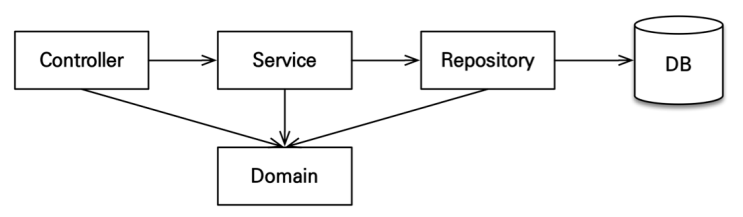

# [스프링 부트와 JPA] 스프링 부트와 JPA 활용1 - 웹 애플리케이션 개발

# 목차  
1. [프로젝트 환경설정]
2. [도메인 분석 설계]
3. [애플리케이션 구현 준비]
4. [회원 도메인 개발]
5. [상품 도메인 개발]
6. [주문 도메인 개발]
7. [웹 계층 개발]
----
# 1. 프로젝트 환경설정
## 프로젝트 생성
- 스프링 부트 스타터로 생성
- Gradle-Groovy
- web, thymeleaf, jpa, h2, lombok, validation
## View 환경 설정
- thymeleaf 템플릿 엔진 사용
- 스프링 부트 thymeleaf viewName 매핑
  - `resources:templates/ + {ViewName} + .html`
## H2 데이터 베이스
- 모든 로그 출력은 가급적 로거를 통해 남겨야 한다.
   ```java
            logging.level:
              org.hibernate.SQL: debug  
   ```
- 쿼리 파라미터 로그 남기기
- `implementation 'com.github.gavlyukovskiy:p6spy-spring-boot-starter:1.5.6'`

# 2. 도메인 분석 설계
## 요구사항 분석
## 모메인 모델과 테이블 설계


## 엔티티 클래스 개발
- 실무에서는 `@Getter`는 열고 `@Setter`는 꼭 필요한 경우에만 사용
  - 별도의 메서드를 제공하는게 가장 이상적
- 실무에서는 `@ManyToMany` 사용 X
- 값 타입은 변경 불가능하게 설계
  - `@Setter`를 제거하고, 생성자에서 값을 모두 초기화해서 변경 불가능한 클래스를 만들자.
  - 기본 생성자를 `protected`로 설정
- **모든 연관관계는 지연 로딩으로 설정**
  - 즉시 로딩은 N + 1 문제 자주 발생
  - 연관된 엔티티를 함께 조회해야 하면 `fetch join`를 사용
- **컬렉션은 필드에서 초기화 하자**
  - ```java
     @OneToMany(mappedBy = "parent")
     private List<Category> child = new ArrayList<>();  
    ```
- **CaseCade Type 설정**
  - 연관된 엔티티를 같이 persist를 해준다. (persist 전파)
- **연관 관계 편의 메서드 생성**
  - 연관관계 편의 메서드는 객체 간의 연관관계를 설정하기 위해 사용되는 메서드이며, 보통 양방향 연관관계에서 사용됩니다. 
  - 양방향 연관관계에서는 양쪽 객체에 참조를 설정해줘야 하는데 이를 편하게 메소드를 정의한다.
  - 핵심적으로 컨트롤하는 쪽이 좋다!
- 예시 코드
```java
@Entity
@Table(name = "orders")
@Getter
@Setter
public class Order {
    @Id
    @GeneratedValue
    @Column(name = "order_id")
    private Long id;

    private LocalDateTime orderDate;

    @Enumerated(EnumType.STRING)
    private OrderStatus status;

    @OneToMany(mappedBy = "order", cascade = CascadeType.ALL)
    private List<OrderItem> orderItems = new ArrayList<>();

    @ManyToOne(fetch = FetchType.LAZY)
    @JoinColumn(name = "member_id")
    private Member member;

    @OneToOne(fetch = FetchType.LAZY, cascade = CascadeType.ALL)
    @JoinColumn(name = "delivery_id")
    private Delivery delivery;

    // 연관 관계 메서드
    public void setMember(Member member) {
        this.member = member;
        member.getOrders().add(this);
    }

    public void addOrderItem(OrderItem orderItem) {
        orderItems.add(orderItem);
        orderItem.setOrder(this);
    }

    public void setDelivery(Delivery delivery) {
        this.delivery = delivery;
        delivery.setOrder(this);
    }
}
```

## 3. 애플리케이션 구현

### 애플리케이션 아키텍처


### 레포지토리 개발
- `@Repository`: 스프링 빈으로 등록, JPA 예외를 스프링 기반 예외로 예외 변환
- `@PersistenceContext`: 엔티티 매니저(Entity Manager) 주입

### 서비스 개발
- `@Service`
- `@Transactional`: 트랜잭션, 영속성 컨텍스트
  - `readOnly=true`: 데이터의 변경이 없는 읽기 전용 메서드에 사용, 영속성 컨텍스트를 플러시 하지 않으므로 약간의 성능 향상(읽기 전용에는 다 적용)
  - 데이터베이스 드라이버가 지원하면 DB에서 성능 향상
  - 읽기가 많은 레포지토리면 전체에 걸어넣고 쓰기 작업이 필요한 로직에만 `readOnly=false` 걸고 사용
- `@Autowired`: 생성자 Injection 많이 사용, 생성자가 하나면 생략 가능

### 참고
- 회원 로직에 중복 회원 검증 로직에서 실무에서는 멀티 쓰레드 상황을 고려해서 회원 테이블의 회원명 컬럼에 **유니크 제약 조건**을 추가하는 것이 안전하다.
- 주문 서비스의 주문과 주문 최소 메서드를 보면 비즈니스 로직 대부분이 텐티티에 있다. 서비스 계층은 단순히 엔티티에 필요한 요청을 위임하는 역할을 한다. 이처럼 엔티티가 비즈니스 로직을 가지고 객체 지향의 특성을 적극 활용하는 것을 도메인 모델 패턴이라 한다. 반대로 엔티티에는 비즈니스 로직이 거의 없고 서비스 계층에서 대부분의 비즈니스 로직을 처리하는 것을 트랜잭션 스크립트 패턴이라 한다.

### 생성자 주입
- 필드 주입(@Autowired)보다 생성자 주입 방식을 권장
- 변경 불가능한 안전한 객체 생성 가능
  - `final` 키워드를 추가하면 컴파일 시점에 `memberRepository`를 설정하지 않는 오류를 체크할 수 있다.
    - `lombok` 을 사용하면 `@RequiredArgsConstructor`을 통해 final이 붙은 것의 private한 생성자를 만들어 준다.
    - ```java
      @RequiredArgsConstructor
      public class MemberService {
        private final MemberRepository memberRepository;
        ...
      }
      ```

### 테스트
- `@RunWith(SpringRunner.class)`: 스프링과 테스트 통합
- `@SpringBootTest`: 스프링 부트 띄우고 테스트(이게 없으면 @Autowired 다 실패)
- `@Transactional`: 반복 가능한 테스트 지원, 각각의 테스트를 실행할 때마다 트랜잭션을 시작하고 **테스트가 끝나면 트랜잭션을 강제로 롤백** (이 어노테이션이 테스트 케이스에서 사용될 때만 반복)

### 테스트 케이스를 위한 설정
- 테스트는 격리된 환경에서 실행하고, 끝나면 데이터를 초기화하는 것이 좋다. 그런 면에서 메모리 DB를 사용하는 것이 가장 이상적이다.
- 추가로 테스트 케이스를 위한 스프링 환경과, 일반적으로 애플리케이션을 실행하는 환겨은 보통 다르므로 설정 파일을 다르게 사용하자
- `test/resources/application.yml`
  - ```java
    spring:
      logging.level:
        org.hibernate.SQL: debug
    ```
  - 스프링 부트는 datasource 설정이 없으면, 기본적으로 메모리 DB를 사용하고, driver-class도 현재 등록된 라이브러리를 보고 찾아준다. 추가로 `ddl-auto`도 `create-drop` 모드로 동작한다. 따라서 데이터 소스나, JPA 관련된 별도의 추가 설정을 하지 않아도 된다.

## 웹 계층 개발
```java
@GetMapping(value = "/members")
 public String list(Model model) {
   List<Member> members = memberService.findMembers();
   model.addAttribute("members", members);
   return "members/memberList";
 }
```
- 조회한 상품을 뷰에 전달하기 위해 스프링 MVC가 제공하는 모델( Model ) 객체에 보관
- 실행할 뷰 이름을 반환

### 폼 객체 vs 엔티티 직접 사용
- 실무에서 **엔티티는 핵심 비즈니스 로직만 가지고 있고, 화면을 위한 로직은 없어야 한다.**
- 화면이나 API에 맞는 폼 객체나 DTO를 사용하자

### 변경 감지와 병합(merge)
#### 준영속 엔티티?
- 영속성 컨텍스트가 더는 관리하지 않는 엔티티를 말한다.
#### 준영속 엔티티를 수정하는 2가지 방법
- 변경 감지 기능 사용 (dirty check)
- 병합(merge) 사용

#### 변경 감지 기능 사용
```java
@Transactional
void update(Item itemParam) { //itemParam: 파리미터로 넘어온 준영속 상태의 엔티티
  Item findItem = em.find(Item.class, itemParam.getId()); //같은 엔티티를 조회한다.
  findItem.setPrice(itemParam.getPrice()); //데이터를 수정한다.
}
```
- 영속성 컨텍스트(Transaction)에서 엔티티를 다시 조회한 후에 데이터를 수정하는 방법
- 트랜잭션 안에서 엔티티를 다시 조회, 변경할 값 선택 트랜잭션 커밋 시점에 변경 감지(Dirty Checking)이 동작해서 데이터베이스에 UPDATE SQL 실행

#### 병합 사용
```java
@Transactional
void update(Item itemParam) { //itemParam: 파리미터로 넘어온 준영속 상태의 엔티티
    Item mergeItem = em.merge(itemParam);
}
```
- 병합은 준영속 상태의 엔티티를 영속 상태로 변경할 때 사용하는 기능이다.
> 주의: 변경 감지 기능을 사용하면 원하는 속성만 선택해서 변경할 수 있지만, 병합을 사용하면 **모든 속성이
변경된다**. 병합시 값이 없으면 null 로 업데이트 할 위험도 있다. (병합은 모든 필드를 교체한다.)

### 실무에서 사용 -> 변경 감지
- 컨트롤러에서 어설프게 엔티티를 생성하지 마세요.
- 트랜잭션이 있는 서비스 계층에 식별자( id )와 변경할 데이터를 명확하게 전달하세요.(파라미터 or dto)
- 트랜잭션이 있는 서비스 계층에서 영속 상태의 엔티티를 조회하고, 엔티티의 데이터를 직접 변경하세요.
- 트랜잭션 커밋 시점에 변경 감지가 실행됩니다.

----


* 개발환경

  * IDE: IntelliJ
  * Spring Boot 2.7.7
  * JAVA 11
  * Gradle
  * Spring Web 
  * Thymeleaf
  * Spring Data Jpa
  * Thymeleaf
  * H2 1.4.200
  * Spring Boot Test
  * Tomcat
