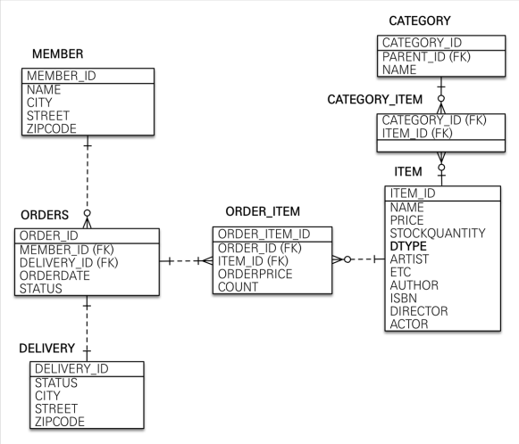
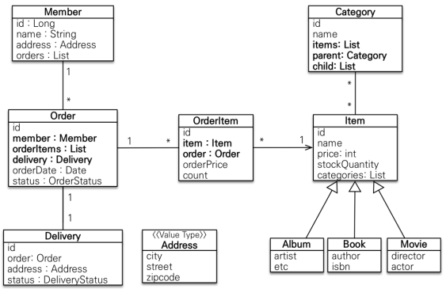

# [스프링 부트와 JPA] 스프링 부트와 JPA 활용1 - 웹 애플리케이션 개발

# 목차  
1. [프로젝트 환경설정]
2. [도메인 분석 설계]
3. [애플리케이션 구현 준비]
4. [회원 도메인 개발]
5. [상품 도메인 개발]
6. [주문 도메인 개발]
7. [웹 계층 개발]
----
# 1. 프로젝트 환경설정
## 프로젝트 생성
- 스프링 부트 스타터로 생성
- Gradle-Groovy
- web, thymeleaf, jpa, h2, lombok, validation
## View 환경 설정
- thymeleaf 템플릿 엔진 사용
- 스프링 부트 thymeleaf viewName 매핑
  - `resources:templates/ + {ViewName} + .html`
## H2 데이터 베이스
- 모든 로그 출력은 가급적 로거를 통해 남겨야 한다.
   ```java
            logging.level:
              org.hibernate.SQL: debug  
   ```
- 쿼리 파라미터 로그 남기기
- `implementation 'com.github.gavlyukovskiy:p6spy-spring-boot-starter:1.5.6'`

# 2. 도메인 분석 설계
## 요구사항 분석
## 모메인 모델과 테이블 설계



## 엔티티 클래스 개발
- 실무에서는 `@Getter`는 열고 `@Setter`는 꼭 필요한 경우에만 사용
  - 별도의 메서드를 제공하는게 가장 이상적
- 실무에서는 `@ManyToMany` 사용 X
- 값 타입은 변경 불가능하게 설계
  - `@Setter`를 제거하고, 생성자에서 값을 모두 초기화해서 변경 불가능한 클래스를 만들자.
  - 기본 생성자를 `protected`로 설정
- **모든 연관관계는 지연 로딩으로 설정**
  - 즉시 로딩은 N + 1 문제 자주 발생
  - 연관된 엔티티를 함께 조회해야 하면 `fetch join`를 사용
- **컬렉션은 필드에서 초기화 하자**
  - ```java
     @OneToMany(mappedBy = "parent")
     private List<Category> child = new ArrayList<>();  
    ```
- **CaseCade Type 설정**
  - 연관된 엔티티를 같이 persist를 해준다. (persist 전파)
- **연관 관계 편의 메서드 생성**
  - 연관관계 편의 메서드는 객체 간의 연관관계를 설정하기 위해 사용되는 메서드이며, 보통 양방향 연관관계에서 사용됩니다. 
  - 양방향 연관관계에서는 양쪽 객체에 참조를 설정해줘야 하는데 이를 편하게 메소드를 정의한다.
  - 핵심적으로 컨트롤하는 쪽이 좋다!
- 예시 코드
```java
@Entity
@Table(name = "orders")
@Getter
@Setter
public class Order {
    @Id
    @GeneratedValue
    @Column(name = "order_id")
    private Long id;

    private LocalDateTime orderDate;

    @Enumerated(EnumType.STRING)
    private OrderStatus status;

    @OneToMany(mappedBy = "order", cascade = CascadeType.ALL)
    private List<OrderItem> orderItems = new ArrayList<>();

    @ManyToOne(fetch = FetchType.LAZY)
    @JoinColumn(name = "member_id")
    private Member member;

    @OneToOne(fetch = FetchType.LAZY, cascade = CascadeType.ALL)
    @JoinColumn(name = "delivery_id")
    private Delivery delivery;

    // 연관 관계 메서드
    public void setMember(Member member) {
        this.member = member;
        member.getOrders().add(this);
    }

    public void addOrderItem(OrderItem orderItem) {
        orderItems.add(orderItem);
        orderItem.setOrder(this);
    }

    public void setDelivery(Delivery delivery) {
        this.delivery = delivery;
        delivery.setOrder(this);
    }
}
```
----

* 개발환경

  * IDE: IntelliJ
  * Spring Boot 2.7.7
  * JAVA 11
  * Gradle
  * Spring Web 
  * Thymeleaf
  * Spring Data Jpa
  * Thymeleaf
  * H2 1.4.200
  * Spring Boot Test
  * Tomcat
