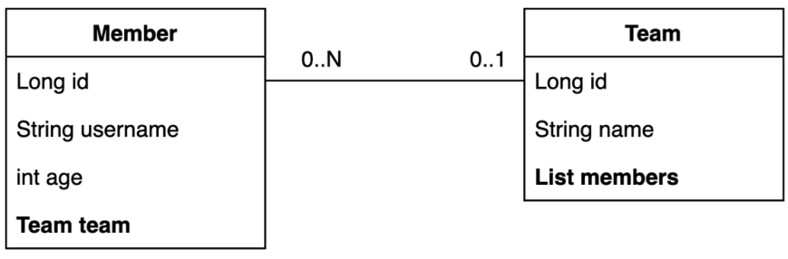
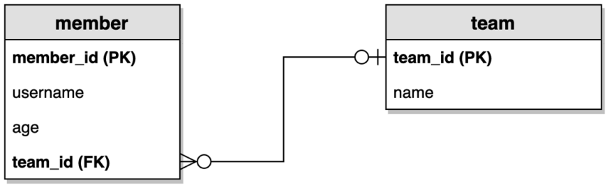
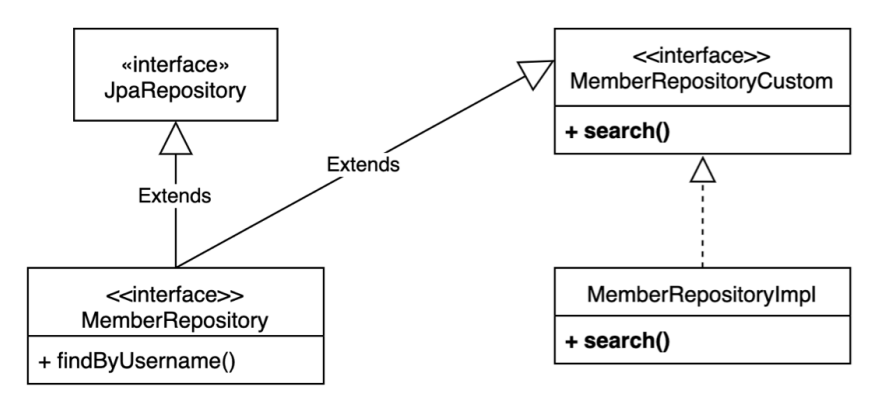

# [스프링 부트와 JPA] 실전! Querydsl

# 목차  
1. 예제 도메인 모델
2. 공통 인터페이스 기능
3. 쿼리 메소드 기능
4. 확장 기능
5. 스프링 데이터 JPA 분석
6. 나머지 기능들

----

# 1. 예제 도메인 모델 
> 스프링 JPA랑 동일

## 엔티티 클래스


## ERD


# 2. Querydsl 기본 문법
## 기초 사용
```java
@SpringBootTest
@Transactional
public class QuerydslBasicTest {
    @PersistenceContext
    EntityManager em;
    JPAQueryFactory queryFactory;
    
    @BeforeEach
    public void before() {
      queryFactory = new JPAQueryFactory(em);
      //…
    }
    
    @Test
    public void startQuerydsl2() {
      //member1을 찾아라.
      QMember m = new QMember("m");
      Member findMember = queryFactory
              .select(m)
              .from(m)
              .where(m.username.eq("member1"))
              .fetchOne();
      assertThat(findMember.getUsername()).isEqualTo("member1");
    }
}
```
- `EntityManager`로 `JPAQueryFactory` 생성
- Querydsl은 JPQL 빌더
- JPQL: 문자(실행 시점 오류), Querydsl: 코드(컴파일 시점 오류)
- JPQL: 파라미터 바인딩 직접, Querydsl: 파라미터 바인딩 자동 처리
> JPAQueryFactory를 필드로 제공하면 동시성 문제는 어떻게 될까?   
> 동시성 문제는 JPAQueryFactory를 생성할 때 제공하는 EntityManager(em)에 달려있다.   
> 스프링 프레임워크는 여러 쓰레드에서 동시에 같은
EntityManager에 접근해도, 트랜잭션 마다 별도의 영속성 컨텍스트를 제공하기 때문에, 동시성 문제는 걱정하지 않아도 된다.

## 기본 Q-Type 활용
### Q클래스 인스턴스를 사용하는 2가지 방법
```java
QMember qMember = new QMember("m"); //별칭 직접 지정
QMember qMember = QMember.member; //기본 인스턴스 사용
```
### 기본 인스턴스를 static import와 함께 사용
```java
import static study.querydsl.entity.QMember.*;
@Test
public void startQuerydsl3() {
     //member1을 찾아라.
     Member findMember = queryFactory
     .select(member)
     .from(member)
     .where(member.username.eq("member1"))
     .fetchOne();
     
     assertThat(findMember.getUsername()).isEqualTo("member1");
}
```

## 검색 조건 쿼리
### 기본 검색 쿼리
```java
@Test
public void search() {
     Member findMember = queryFactory
     .selectFrom(member)
     .where(
             member.username.eq("member1"),
             member.age.eq(10)
     )
     .fetchOne();
     
     assertThat(findMember.getUsername()).isEqualTo("member1");
}
```
- 검색 조건은 `.and()`, `.or()`를 메서드 체인으로 연결할 수 있다.
- `where()` 에 파라미터로 검색조건을 추가하면 AND 조건이 추가됨
- 이 경우 null 값은 무시 메서드 추출을 활용해서 동적 쿼리를 깔끔하게 만들 수 있음
### 모든 검색 조건 제공
```java
member.username.eq("member1") // username = 'member1'
member.username.ne("member1") //username != 'member1'
member.username.eq("member1").not() // username != 'member1'
member.username.isNotNull() //이름이 is not null
member.age.in(10, 20) // age in (10,20)
member.age.notIn(10, 20) // age not in (10, 20)
member.age.between(10,30) //between 10, 30
member.age.goe(30) // age >= 30
member.age.gt(30) // age > 30
member.age.loe(30) // age <= 30
member.age.lt(30) // age < 30
member.username.like("member%") //like 검색
member.username.contains("member") // like ‘%member%’ 검색
member.username.startsWith("member") //like ‘member%’ 검색
...
```
## 결과 조회
- `fetch()`: 리스트 조회, 데이터 없으면 빈 리스트 반환
- `fetchOne()`: 단 건 조회
  - 결과가 없으면: `null`
  - 결과가 둘 이상이면: `NonUniqueResultException`
- `fetchFirst()`: `limit(1).fetchOne()`
- `fetchResults()`: 페이징 정보 포함, total count 쿼리 추가 실행
- `fetchCount()`: count 쿼리로 변경해서 count 수 조회
```java
//List
List<Member> fetch = queryFactory
 .selectFrom(member)
 .fetch();
//단 건
Member findMember1 = queryFactory
 .selectFrom(member)
 .fetchOne();
//처음 한 건 조회
Member findMember2 = queryFactory
 .selectFrom(member)
 .fetchFirst();
//페이징에서 사용
QueryResults<Member> results = queryFactory
 .selectFrom(member)
 .fetchResults();
//count 쿼리로 변경
long count = queryFactory
 .selectFrom(member)
 .fetchCount();
```
## 정렬
```java
/**
 * 회원 정렬 순서
 * 1. 회원 나이 내림차순(desc)
 * 2. 회원 이름 올림차순(asc)
 * 단 2에서 회원 이름이 없으면 마지막에 출력(nulls last)
 */
@Test
public void sort() {
   em.persist(new Member(null, 100));
   em.persist(new Member("member5", 100));
   em.persist(new Member("member6", 100));
   
   List<Member> result = queryFactory
           .selectFrom(member)
           .where(member.age.eq(100))
           .orderBy(member.age.desc(), member.username.asc().nullsLast())
           .fetch();
   
   Member member5 = result.get(0);
   Member member6 = result.get(1);
   Member memberNull = result.get(2);
   assertThat(member5.getUsername()).isEqualTo("member5");
   assertThat(member6.getUsername()).isEqualTo("member6");
   assertThat(memberNull.getUsername()).isNull();
}
```
- `desc()`, `asc()`: 일반 정렬
- `nullsLast()`, `nullsFirst()`: null 데이터 순서 부여

## 페이징
### 조회 건수 제한
```java
@Test
public void paging1() {
   List<Member> result = queryFactory
           .selectFrom(member)
           .orderBy(member.username.desc())
           .offset(1) //0부터 시작(zero index)
           .limit(2) //최대 2건 조회
           .fetch();
   
   assertThat(result.size()).isEqualTo(2);
}
```
### 전체 조회 수
```java
@Test
public void paging2() {
   QueryResults<Member> queryResults = queryFactory
           .selectFrom(member)
           .orderBy(member.username.desc())
           .offset(1)
           .limit(2)
           .fetchResults();
   
   assertThat(queryResults.getTotal()).isEqualTo(4);
   assertThat(queryResults.getLimit()).isEqualTo(2);
   assertThat(queryResults.getOffset()).isEqualTo(1);
   assertThat(queryResults.getResults().size()).isEqualTo(2);
}
```
- `count` 쿼리가 실행되니 성능상 주의!
> 참고: 실무에서 페이징 쿼리를 작성할 때, 데이터를 조회하는 쿼리는 여러 테이블을 조인해야 하지만,
count 쿼리는 조인이 필요 없는 경우도 있다.   
> 그런데 이렇게 **자동화된 count 쿼리**는 원본 쿼리와 같이 모두 조인을 해버리기 때문에 성능이 안나올 수 있다. count 쿼리에 조인이 필요없는 성능 최적화가 필요하다면,
count 전용 쿼리를 별도로 작성해야 한다.

## 집합
### 집합 함수
```java
/**
 * JPQL
 * select
 * COUNT(m), //회원수
 * SUM(m.age), //나이 합
 * AVG(m.age), //평균 나이
 * MAX(m.age), //최대 나이
 * MIN(m.age) //최소 나이
 * from Member m
 */
@Test
public void aggregation() {
   List<Tuple> result = queryFactory
           .select(member.count(),
                   member.age.sum(),
                   member.age.avg(),
                   member.age.max(),
                   member.age.min())
           .from(member)
           .fetch();
   
   Tuple tuple = result.get(0);
   
   assertThat(tuple.get(member.count())).isEqualTo(4);
   assertThat(tuple.get(member.age.sum())).isEqualTo(100);
   assertThat(tuple.get(member.age.avg())).isEqualTo(25);
   assertThat(tuple.get(member.age.max())).isEqualTo(40);
   assertThat(tuple.get(member.age.min())).isEqualTo(10);
}
```

### GroupBy 사용
```java
/**
 * 팀의 이름과 각 팀의 평균 연령을 구해라.
 */
@Test
public void group() throws Exception {
   List<Tuple> result = queryFactory
           .select(team.name, member.age.avg())
           .from(member)
           .join(member.team, team)
           .groupBy(team.name)
           .fetch();
   
   Tuple teamA = result.get(0);
   Tuple teamB = result.get(1);
   
   assertThat(teamA.get(team.name)).isEqualTo("teamA");
   assertThat(teamA.get(member.age.avg())).isEqualTo(15);
   assertThat(teamB.get(team.name)).isEqualTo("teamB");
   assertThat(teamB.get(member.age.avg())).isEqualTo(35);
}
```

## 조인 - 기본 조인
### 기본 조인
- 조인의 기본 문법은 첫 번째 파라미터에 조인 대상을 지정하고, 두 번째 파라키터에 별칭(alias)으로 사용할 Q 타입을 지정하면 된다.

`join(조인 대상, 별칭으로 사용할 Q타입)`

```java
/**
 * 팀 A에 소속된 모든 회원
 */
@Test
public void join() throws Exception {
   QMember member = QMember.member;
   QTeam team = QTeam.team;
   
   List<Member> result = queryFactory
           .selectFrom(member)
           .join(member.team, team)
           .where(team.name.eq("teamA"))
           .fetch();
   
   assertThat(result)
           .extracting("username")
           .containsExactly("member1", "member2");
}
```
- `join(), innerJoin()`: 내부 조인 (inner join)
- `leftJoin()`: left 외부 조인 (left outer join)
- `rightJoin()`: right 외부 조인 (right outer join)
- JPQL의 `on` 과 성능 최적화를 위한 `fetch` 조인 제공

## 세타 조인
### 연관관계가 없는 필드로 조인
```java
/**
 * 세타 조인(연관관계가 없는 필드로 조인)
 * 회원의 이름이 팀 이름과 같은 회원 조회
 */
@Test
public void theta_join() throws Exception {
   em.persist(new Member("teamA"));
   em.persist(new Member("teamB"));
   
   List<Member> result = queryFactory
           .select(member)
           .from(member, team)
           .where(member.username.eq(team.name))
           .fetch();
   
   assertThat(result)
           .extracting("username")
           .containsExactly("teamA", "teamB");
}
```
- from 절에 여러 엔티티를 선택해서 세타 조인
- 외부 조인 불가능 -> 조인 on을 사용하면 외부 조인 가능

## 조인 - on절
### 1. 조인 대상 필터링
ex) 회원과 팀을 조인하면서, 팀 이름이 teamA인 팀만 조인, 회원은 모두 조회
```java
/**
 * 예) 회원과 팀을 조인하면서, 팀 이름이 teamA인 팀만 조인, 회원은 모두 조회
 * JPQL: SELECT m, t FROM Member m LEFT JOIN m.team t on t.name = 'teamA'
 * SQL: SELECT m.*, t.* FROM Member m LEFT JOIN Team t ON m.TEAM_ID=t.id and t.name='teamA'
 */
@Test
public void join_on_filtering() throws Exception {
   List<Tuple> result = queryFactory
           .select(member, team)
           .from(member)
           .leftJoin(member.team, team).on(team.name.eq("teamA"))
           .fetch();
   
   for (Tuple tuple : result) {
        System.out.println("tuple = " + tuple);
   }
}
```
### 결과
```java
t=[Member(id=3, username=member1, age=10), Team(id=1, name=teamA)]
t=[Member(id=4, username=member2, age=20), Team(id=1, name=teamA)]
t=[Member(id=5, username=member3, age=30), null]
t=[Member(id=6, username=member4, age=40), null]
```
### 2. 연관관계 없는 엔티티 외부 조인
ex) 회원의 이름과 팀의 이름이 같은 대상 **외부 조인**
```java
/**
 * 2. 연관관계 없는 엔티티 외부 조인
 * 예) 회원의 이름과 팀의 이름이 같은 대상 외부 조인
 * JPQL: SELECT m, t FROM Member m LEFT JOIN Team t on m.username = t.name
 * SQL: SELECT m.*, t.* FROM Member m LEFT JOIN Team t ON m.username = t.name
 */
@Test
public void join_on_no_relation() {
   em.persist(new Member("teamA"));
   em.persist(new Member("teamB"));
   
   List<Tuple> result = queryFactory
           .select(member, team)
           .from(member)
           .leftJoin(team).on(member.username.eq(team.name))
           .fetch();
   
   for (Tuple tuple : result) {
        System.out.println("t=" + tuple);
   }
}
```
- 하이버네이트 5.1부터 on 을 사용해서 서로 관계가 없는 필드로 외부 조인하는 기능이 추가되었다. 물론 내부 조인도 가능하다.
- 주의! 문법을 잘 봐야 한다. **leftJoin()** 부분에 일반 조인과 다르게 엔티티 하나만 들어간다.
  - 일반조인: `leftJoin(member.team, team)`
  - on조인: `from(member).leftJoin(team).on(xxx)`


### 결과
```java
t=[Member(id=3, username=member1, age=10), null]
t=[Member(id=4, username=member2, age=20), null]
t=[Member(id=5, username=member3, age=30), null]
t=[Member(id=6, username=member4, age=40), null]
t=[Member(id=7, username=teamA, age=0), Team(id=1, name=teamA)]
t=[Member(id=8, username=teamB, age=0), Team(id=2, name=teamB)]
```

## 조인 - 페치 조인
페치 조인은 SQL에서 제공하는 기능은 아니다.   
SQL 조인을 활용해서 연관된 엔티티를 SQL 한번에 조회하는 기능이다.    
주로 성능 최적화에 사용하는 방법이다.

### 페치 조인
```java
@Test
public void fetchJoinUse() throws Exception {
   em.flush();
   em.clear();
   
   Member findMember = queryFactory
           .selectFrom(member)
           .join(member.team, team).fetchJoin()
           .where(member.username.eq("member1"))
           .fetchOne();
   
   boolean loaded = emf.getPersistenceUnitUtil().isLoaded(findMember.getTeam());
   assertThat(loaded).as("페치 조인 적용").isTrue();
}
```
- `join(), leftJoin()` 등 조인 기능 뒤에 `fetchJoin()` 이라고 추가하면 된다.

## 서브 쿼리
`com.querydsl.jpa.JPAExpressions` 사용

### 서브 쿼리 eq 사용
```java
/**
 * 나이가 가장 많은 회원 조회
 */
@Test
public void subQuery() throws Exception {
   QMember memberSub = new QMember("memberSub");
   
   List<Member> result = queryFactory
           .selectFrom(member)
           .where(member.age.eq(
                   JPAExpressions
                           .select(memberSub.age.max())
                           .from(memberSub)
           ))
           .fetch();
   
   assertThat(result).extracting("age")
            .containsExactly(40);
}
```
### 서브 쿼리 goe 사용
```java
/**
 * 나이가 평균 나이 이상인 회원
 */
@Test
public void subQueryGoe() throws Exception {
   QMember memberSub = new QMember("memberSub");
   
   List<Member> result = queryFactory
   .selectFrom(member)
   .where(member.age.goe(
           JPAExpressions
                   .select(memberSub.age.avg())
                   .from(memberSub)
   ))
   .fetch();
   
   assertThat(result).extracting("age")
            .containsExactly(30,40);
}
```

### 서브쿼리 여러 건 처리 in 사용
```java
/**
 * 서브쿼리 여러 건 처리, in 사용
 */
@Test
public void subQueryIn() throws Exception {
   QMember memberSub = new QMember("memberSub");
   
   List<Member> result = queryFactory
   .selectFrom(member)
   .where(member.age.in(
           JPAExpressions
                   .select(memberSub.age)
                   .from(memberSub)
                   .where(memberSub.age.gt(10))
   ))
   .fetch();
   
   assertThat(result).extracting("age")
            .containsExactly(20, 30, 40);
}
```
### select 절에 subquery
```java
List<Tuple> fetch = queryFactory
   .select(member.username,
           JPAExpressions
                   .select(memberSub.age.avg())
                   .from(memberSub)
   )
   .from(member)
   .fetch();

for (Tuple tuple : fetch) {
   System.out.println("username = " + tuple.get(member.username));
   System.out.println("age = " + 
          tuple.get(JPAExpressions
                            .select(memberSub.age.avg())
                            .from(memberSub)));
}
```
### static import 활용
```java
import static com.querydsl.jpa.JPAExpressions.select;
List<Member> result = queryFactory
         .selectFrom(member)
         .where(member.age.eq(
                 select(memberSub.age.max())
                          .from(memberSub)
         ))
         .fetch();
```
#### from 절의 서브쿼리 한계
JPA JPQL 서브쿼리의 한계점으로 from 절의 서브쿼리(인라인 뷰)는 지원하지 않는다. 당연히 Querydsl
도 지원하지 않는다. 하이버네이트 구현체를 사용하면 select 절의 서브쿼리는 지원한다. Querydsl도 하
이버네이트 구현체를 사용하면 select 절의 서브쿼리를 지원한다.
#### from 절의 서브쿼리 해결방안
1. 서브쿼리를 join으로 변경한다. (가능한 상황도 있고, 불가능한 상황도 있다.)
2. 애플리케이션에서 쿼리를 2번 분리해서 실행한다.
3. nativeSQL을 사용한다.

## Case 문
#### select, 조건절(where), order by에서 사용 가능
### 단순한 조건
```java
List<String> result = queryFactory
 .select(member.age
         .when(10).then("열살")
         .when(20).then("스무살")
         .otherwise("기타"))
 .from(member)
 .fetch();
```
## 복잡한 조건
```java
List<String> result = queryFactory
         .select(new CaseBuilder()
                 .when(member.age.between(0, 20)).then("0~20살")
                 .when(member.age.between(21, 30)).then("21~30살")
                 .otherwise("기타"))
         .from(member)
         .fetch();
```

#### orderBy에서 Case 문 함께 사용하기 예제
예를 들어서 다음과 같은 임의의 순서로 회원을 출력하고 싶다면?
1. 0 ~ 30살이 아닌 회원을 가장 먼저 출력
2. 0 ~ 20살 회원 출력
3. 21 ~ 30살 회원 출력
```java
NumberExpression<Integer> rankPath = new CaseBuilder()
         .when(member.age.between(0, 20)).then(2)
         .when(member.age.between(21, 30)).then(1)
         .otherwise(3);
List<Tuple> result = queryFactory
         .select(member.username, member.age, rankPath)
         .from(member)
         .orderBy(rankPath.desc())
         .fetch();
for (Tuple tuple : result) {
   String username = tuple.get(member.username);
   Integer age = tuple.get(member.age);
   Integer rank = tuple.get(rankPath);
   System.out.println("username = " + username + " age = " + age + " rank = " + rank);
}
```
Querydsl은 자바 코드로 작성하기 때문에 rankPath 처럼 복잡한 조건을 변수로 선언해서 select 절,
orderBy 절에서 함께 사용할 수 있다.
## 상수, 문자 더하기
`Expressions.constant(xxx)` 사용
```java
Tuple result = queryFactory
         .select(member.username, Expressions.constant("A"))
         .from(member)
         .fetchFirst();
```
### 문자 더하기 concat
```java
String result = queryFactory
         .select(member.username.concat("_").concat(member.age.stringValue()))
         .from(member)
         .where(member.username.eq("member1"))
         .fetchOne();
```
>  참고: member.age.stringValue() 부분이 중요한데, 문자가 아닌 다른 타입들은 `stringValue()`로 문자로 변환할 수 있다. 이 방법은 ENUM을 처리할 때도 자주 사용한다.

# 3. 중급 문법
## 프로젝션과 결과 반환 - 기본
프로젝션: select 대상 지정

### 프로젝션 대상이 하나
```java
List<String> result = queryFactory
         .select(member.username)
         .from(member)
         .fetch();
```
- 프로젝션 대상이 하나면 타입을 명확하게 지정할 수 있음
- 프로젝션 대상이 둘 이상이면 튜플이나 DTO로 조회

### 튜플 조회   
프로젝션 대상이 둘 이상일 때 사용   
`com.querydsl.core.Tuple`
```java
List<Tuple> result = queryFactory
         .select(member.username, member.age)
         .from(member)
         .fetch();

for (Tuple tuple : result) {
    String username = tuple.get(member.username);
    Integer age = tuple.get(member.age);
    System.out.println("username=" + username);
    System.out.println("age=" + age);
}
```
## 프로젝션과 결과 반환 - DTO 조회
순수 JPA에서 DTO 조회
### MemberDto
```java
@Data
public class MemberDto {
   private String username;
   private int age;
   
   public MemberDto() {
   }
   
   public MemberDto(String username, int age) {
       this.username = username;
       this.age = age;
   }
}
```
### 순수 JPA에서 DTO 조회 코드
```java
List<MemberDto> result = em.createQuery(
       "select new study.querydsl.dto.MemberDto(m.username, m.age) " +
                "from Member m", MemberDto.class)
       .getResultList();
```
- 순수 JPA에서 DTO를 조회할 때는 new 명령어를 사용해야함
- DTO의 package이름을 다 적어줘야해서 지저분함
- 생성자 방식만 지원함

## Querydsl 빈 생성(Bean population)
- 프로퍼티 접근
- 필드 직접 접근
- 생성자 사용

### 프로퍼티 접근 - Setter
```java
List<MemberDto> result = queryFactory
       .select(Projections.bean(MemberDto.class,
               member.username,
               member.age))
       .from(member)
       .fetch();
```
### 필드 직접 접근
```java
List<MemberDto> result = queryFactory
         .select(Projections.fields(MemberDto.class,
                 member.username,
                 member.age))
         .from(member)
         .fetch();
```
### 별칭이 다를 때
```java
List<UserDto> fetch = queryFactory
    .select(Projections.fields(UserDto.class,
            member.username.as("name"),
            ExpressionUtils.as(
                    JPAExpressions
                            .select(memberSub.age.max())
                            .from(memberSub), "age")
            )
    ).from(member)
    .fetch();
```
- 프로퍼티나, 필드 접근 생성 방식에서 이름이 다를 때 해결 방안
- `ExpressionUtils.as(source,alias)` : 필드나, 서브 쿼리에 별칭 적용
- `username.as("memberName")` : 필드에 별칭 적용

### 생성자 사용
```java
List<MemberDto> result = queryFactory
         .select(Projections.constructor(MemberDto.class,
                 member.username,
                 member.age))
         .from(member)
         .fetch();
}
```

## 프로젝션과 결과 반환 - @QueryProjection
### 생성자 + @QueryProjection
```java
@Data
public class MemberDto {
    private String username;
    private int age;

    public MemberDto() {
    }

    @QueryProjection
    public MemberDto(String username, int age) {
        this.username = username;
        this.age = age;
    }
}
```
- `./gradlew compileQuerydsl`
- `QMemberDto` 생성 확인

### @QueryProjection 활용
```java
List<MemberDto> result = queryFactory
         .select(new QMemberDto(member.username, member.age))
         .from(member)
         .fetch();
```
- 이 방법은 컴파일러로 타입을 체크할 수 있으므로 가장 안전한 방법이다.   
- 다만 DTO에 QueryDSL 어노테이션을 유지해야 하는 점과 DTO까지 Q 파일을 생성해야 하는 단점이 있다.

## 동적 쿼리 - BooleanBuilder 사용
### 동적 쿼리를 해결하는 두가지 방식
- BooleanBuilder
- Where 다중 파라미터 사용
### BooleanBuilder
```java
@Test
public void 동적쿼리_BooleanBuilder() throws Exception {
    String usernameParam = "member1";
    Integer ageParam = 10;
    
    List<Member> result = searchMember1(usernameParam, ageParam);
    Assertions.assertThat(result.size()).isEqualTo(1);
}

private List<Member> searchMember1(String usernameCond, Integer ageCond) {
    BooleanBuilder builder = new BooleanBuilder();
    if (usernameCond != null) {
        builder.and(member.username.eq(usernameCond));
    }
    if (ageCond != null) {
        builder.and(member.age.eq(ageCond));
    }
    return queryFactory
            .selectFrom(member)
            .where(builder)
            .fetch();
}
```
## 동적 쿼리 - where 다중 파라미터 사용
```java
@Test
public void 동적쿼리_WhereParam() throws Exception {
    String usernameParam = "member1";
    Integer ageParam = 10;
    
    List<Member> result = searchMember2(usernameParam, ageParam);
    Assertions.assertThat(result.size()).isEqualTo(1);
}
private List<Member> searchMember2(String usernameCond, Integer ageCond) {
   return queryFactory
            .selectFrom(member)
            .where(usernameEq(usernameCond), ageEq(ageCond))
            .fetch();
}

private BooleanExpression usernameEq(String usernameCond) {
    return usernameCond != null ? member.username.eq(usernameCond) : null;
}

private BooleanExpression ageEq(Integer ageCond) {
    return ageCond != null ? member.age.eq(ageCond) : null;
}
```
- where 조건에 null 값은 무시된다.
- 메서드를 다른 쿼리에서도 재활용 할 수 있다.
- 쿼리 자체의 가독성이 높아진다.
### 조합 가능
```java
private BooleanExpression allEq(String usernameCond, Integer ageCond) {
    return usernameEq(usernameCond).and(ageEq(ageCond));
}
```
- `null` 체크는 주의해서 처리해야함
- `BooleanExpression` 사용

## 수정, 삭제 벌크 연산
### 쿼리 한번으로 대량 데이터 수정
```java
long count = queryFactory
       .update(member)
       .set(member.username, "비회원")
       .where(member.age.lt(28))
       .execute();
```
- 주의: JPQL 배치와 마찬가지로, 영속성 컨텍스트에 있는 엔티티를 무시하고 실행되기 때문에 배치 쿼리를
  실행하고 나면 영속성 컨텍스트를 초기화 하는 것이 안전하다.

## SQL function 호출하기
SQL function은 JPA와 같이 Dialect에 등록된 내용만 호출할 수 있다.
```java
queryFactory
      .select(member.username)
      .from(member)
      .where(member.username.eq(
              Expressions.stringTemplate(
                      "function('lower', {0})", member.username)
            )
      )
```
- 소문자로 변경해서 비교해라
`.where(member.username.eq(member.username.lower()))`
- lower 같은 ansi 표준 함수들은 querydsl이 상당부분 내장하고 있다. 따라서 다음과 같이 처리해도 결과
  는 같다.

# 4. 실무 활용 - 순수 JPA와 Querydsl
- 동적쿼리 Builder 적용
- 동적쿼리 Where 적용
- 조회 API 컨트롤러 개발
## JPAQueryFactory 스프링 빈 등록
```java
@Bean
JPAQueryFactory jpaQueryFactory(EntityManager em) {
    return new JPAQueryFactory(em);
}
```
## 동적 쿼리와 성능 최적화 조회 - Builder 사용
#### 회원 검색 조건
```java
@Data
public class MemberSearchCondition {
   //회원명, 팀명, 나이(ageGoe, ageLoe)
   private String username;
   private String teamName;
   private Integer ageGoe;
   private Integer ageLoe;
}
```
### 동적쿼리 - Builder 사용
```java
//Builder 사용
//회원명, 팀명, 나이(ageGoe, ageLoe)
public List<MemberTeamDto> searchByBuilder(MemberSearchCondition condition) {
 
    BooleanBuilder builder = new BooleanBuilder();

    if (hasText(condition.getUsername())) {
        builder.and(member.username.eq(condition.getUsername()));
    }
    
    if (hasText(condition.getTeamName())) {
        builder.and(team.name.eq(condition.getTeamName()));
    }
    
    if (condition.getAgeGoe() != null) {
        builder.and(member.age.goe(condition.getAgeGoe()));
    }
    
    if (condition.getAgeLoe() != null) {
        builder.and(member.age.loe(condition.getAgeLoe()));
    }
    
    return queryFactory
        .select(new QMemberTeamDto(
                member.id,
                member.username,
                member.age,
                team.id,
                team.name)
        )
        .from(member)
        .leftJoin(member.team, team)
        .where(builder)
        .fetch();
}
```

## 동적 쿼리와 성능 최적화 조회 - Where절 파라미터 사용
```java
//회원명, 팀명, 나이(ageGoe, ageLoe)
public List<MemberTeamDto> search(MemberSearchCondition condition) {
   return queryFactory
           .select(new QMemberTeamDto(
                   member.id,
                   member.username,
                   member.age,
                   team.id,
                   team.name)
            )
           .from(member)
           .leftJoin(member.team, team)
           .where(usernameEq(condition.getUsername()),
                  teamNameEq(condition.getTeamName()),
                  ageGoe(condition.getAgeGoe()),
                  ageLoe(condition.getAgeLoe())
            )
           .fetch();
}

private BooleanExpression usernameEq(String username) {
    return isEmpty(username) ? null : member.username.eq(username);
}

private BooleanExpression teamNameEq(String teamName) {
    return isEmpty(teamName) ? null : team.name.eq(teamName);
}

private BooleanExpression ageGoe(Integer ageGoe) {
    return ageGoe == null ? null : member.age.goe(ageGoe);
}

private BooleanExpression ageLoe(Integer ageLoe) {
    return ageLoe == null ? null : member.age.loe(ageLoe);
}
```
- **where 절에 파라미터 방식을 사용하면 조건 재사용 가능**

## 조회 API 컨트롤러 개발
### 프로파일 설정
`src/main/resources/application.yml`
```java
spring:
  profiles:
    active: local
```
## 실무 활용 - 사용자 정의 레포지토리
1. 사용자 정의 인터페이스 작성
2. 사용자 정의 인터페이스 구현
3. 스프링 데이터 레포지토리에 사용자 정의 인터페이스 상속
#### 사용자 정의 레포지토리 구성


#### 1. 사용자 정의 인터페이스 작성
```java
public interface MemberRepositoryCustom {
    List<MemberTeamDto> search(MemberSearchCondition condition);
}
```
#### 2. 사용자 정의 인터페이스 구현
```java
public class MemberRepositoryImpl implements MemberRepositoryCustom {
 
    private final JPAQueryFactory queryFactory;
 
    public MemberRepositoryImpl(EntityManager em) {
        this.queryFactory = new JPAQueryFactory(em);
    }
    
    @Override
    //회원명, 팀명, 나이(ageGoe, ageLoe)
    public List<MemberTeamDto> search(MemberSearchCondition condition) {
        return queryFactory
                .select(new QMemberTeamDto(
                        member.id,
                        member.username,
                        member.age,
                        team.id,
                        team.name)
                )
                .from(member)
                .leftJoin(member.team, team)
                .where(usernameEq(condition.getUsername()),
                        teamNameEq(condition.getTeamName()),
                        ageGoe(condition.getAgeGoe()),
                        ageLoe(condition.getAgeLoe()))
                .fetch();
    }
 
 private BooleanExpression usernameEq(String username) {
    return isEmpty(username) ? null : member.username.eq(username);
 }
 
 private BooleanExpression teamNameEq(String teamName) {
    return isEmpty(teamName) ? null : team.name.eq(teamName);
 }
 
 private BooleanExpression ageGoe(Integer ageGoe) {
    return ageGoe == null ? null : member.age.goe(ageGoe);
 }
 
 private BooleanExpression ageLoe(Integer ageLoe) {
    return ageLoe == null ? null : member.age.loe(ageLoe);
 }
}
```
#### 3. . 스프링 데이터 리포지토리에 사용자 정의 인터페이스 상속
```java
public interface MemberRepository extends JpaRepository<Member, Long>,
MemberRepositoryCustom {
    List<Member> findByUsername(String username);
}
```

## 스프링 데이터 페이징 활용 1 - Querydsl 페이징 연동
- 스프링 데이터의 Page, Pageable을 활용해보자.
- 전체 카운트를 한번에 조회하는 단순한 방법
- 데이터 내용과 전체 카운트를 별도로 조회하는 방법

#### searchPageSimple(), fetchResults() 사용
```java
/**
 * 단순한 페이징, fetchResults() 사용
 */
@Override
public Page<MemberTeamDto> searchPageSimple(MemberSearchCondition condition,
Pageable pageable) {
    
    QueryResults<MemberTeamDto> results = queryFactory
            .select(new QMemberTeamDto(
                    member.id,
                    member.username,
                    member.age,
                    team.id,
                    team.name))
            .from(member)
            .leftJoin(member.team, team)
            .where(usernameEq(condition.getUsername()),
                    teamNameEq(condition.getTeamName()),
                    ageGoe(condition.getAgeGoe()),
                    ageLoe(condition.getAgeLoe()))
            .offset(pageable.getOffset())
            .limit(pageable.getPageSize())
            .fetchResults();
    
    List<MemberTeamDto> content = results.getResults();
    long total = results.getTotal();
    
    return new PageImpl<>(content, pageable, total);
}
```
- Querydsl이 제공하는 `fetchResults()` 를 사용하면 내용과 전체 카운트를 한번에 조회할 수 있다.(실제
  쿼리는 2번 호출)
- `fetchResult()` 는 카운트 쿼리 실행시 필요없는 `order by` 는 제거한다.
### 데이터 내용과 전체 카운트를 별도로 조회하는 방법
#### searchPageComplex()
```java
/**
 * 복잡한 페이징
 * 데이터 조회 쿼리와, 전체 카운트 쿼리를 분리
 */
@Override
public Page<MemberTeamDto> searchPageComplex(MemberSearchCondition condition,
Pageable pageable) {
    List<MemberTeamDto> content = queryFactory
            .select(new QMemberTeamDto(
                    member.id,
                    member.username,
                    member.age,
                    team.id,
                    team.name)
            )
            .from(member)
            .leftJoin(member.team, team)
            .where(usernameEq(condition.getUsername()),
                    teamNameEq(condition.getTeamName()),
                    ageGoe(condition.getAgeGoe()),
                    ageLoe(condition.getAgeLoe()))
            .offset(pageable.getOffset())
            .limit(pageable.getPageSize())
            .fetch();
    
    long total = queryFactory
            .select(member)
            .from(member)
            .leftJoin(member.team, team)
            .where(usernameEq(condition.getUsername()),
                    teamNameEq(condition.getTeamName()),
                    ageGoe(condition.getAgeGoe()),
                    ageLoe(condition.getAgeLoe()))
            .fetchCount();
    
    return new PageImpl<>(content, pageable, total);
}
```
- 전체 카운트를 조회 하는 방법을 최적화 할 수 있으면 이렇게 분리하면 된다. (예를 들어서 전체 카운트를 조회할 때 조인 쿼리를 줄일 수 있다면 상당한 효과가 있다.)
- 코드를 리펙토링해서 내용 쿼리과 전체 카운트 쿼리를 읽기 좋게 분리하면 좋다.

## 스프링 데이터 페이징 활용2- CountQuery 최적화
#### PageableExecutionUtils.getPage()로 최적화
```java
JPAQuery<Member> countQuery = queryFactory
         .select(member)
         .from(member)
         .leftJoin(member.team, team)
         .where(usernameEq(condition.getUsername()),
                 teamNameEq(condition.getTeamName()),
                 ageGoe(condition.getAgeGoe()),
                 ageLoe(condition.getAgeLoe()));

// return new PageImpl<>(content, pageable, total);
return PageableExecutionUtils.getPage(content, pageable, 
        countQuery::fetchCount);
```
- 스프링 데이터 라이브러리가 제공
- count 쿼리가 생략 가능한 경우 생략해서 처리
  - 페이지 시작이면서 컨텐츠 사이즈가 페이지 사이즈보다 작을 때
  - 마지막 페이지 일 때 (offset + 컨텐츠 사이즈를 더해서 전체 사이즈 구함, 더 정확히는 마지막 페이지
    이면서 컨텐츠 사이즈가 페이지 사이즈보다 작을 때)
## 스프링 데이터 페이징 활용3 - 컨트롤러 개발
```java
@RestController
@RequiredArgsConstructor
public class MemberController {
    
    private final MemberJpaRepository memberJpaRepository;
    private final MemberRepository memberRepository;
    
    @GetMapping("/v1/members")
    public List<MemberTeamDto> searchMemberV1(MemberSearchCondition condition)
    {
        return memberJpaRepository.search(condition);
    }
    
    @GetMapping("/v2/members")
    public Page<MemberTeamDto> searchMemberV2(MemberSearchCondition condition,
                                              Pageable pageable) {
        return memberRepository.searchPageSimple(condition, pageable);
    }
    
    @GetMapping("/v3/members")
    public Page<MemberTeamDto> searchMemberV3(MemberSearchCondition condition, 
                                              Pageable pageable) {
        return memberRepository.searchPageComplex(condition, pageable);
    }
```
`http://localhost:8080/v3/members?size=5&page=2`
### 스프링 데이터 정렬(Sort)
스프링 데이터 JPA는 자신의 정렬(Sort)을 Querydsl의 정렬(OrderSpecifier)로 편리하게 변경하는 기능을 제공한다.
#### 스프링 데이터 Sort를 Querydsl의 OrderSpecifier로 변환
```java
JPAQuery<Member> query = queryFactory
        .selectFrom(member);

for (Sort.Order o : pageable.getSort()) {
    PathBuilder pathBuilder = new PathBuilder(member.getType(),
member.getMetadata());
   query.orderBy(new OrderSpecifier(o.isAscending() ? Order.ASC : Order.DESC,
            pathBuilder.get(o.getProperty())));
}
List<Member> result = query.fetch();
```
>참고: 정렬( Sort )은 조건이 조금만 복잡해져도 Pageable 의 Sort 기능을 사용하기 어렵다. 루트 엔티티
범위를 넘어가는 동적 정렬 기능이 필요하면 스프링 데이터 페이징이 제공하는 Sort 를 사용하기 보다는 파라미터를 받아서 직접 처리하는 것을 권장한다.

### Querydsl fetchResults() , fetchCount() Deprecated(향후 미지원)
Querydsl의 `fetchCount() , fetchResult()` 는 개발자가 작성한 select 쿼리를 기반으로 count용 쿼
리를 내부에서 만들어서 실행합니다.   
그런데 이 기능은 강의에서 설명드린 것 처럼 select 구문을 단순히 count 처리하는 용도로 바꾸는 정도입
니다. 따라서 단순한 쿼리에서는 잘 동작하지만, **복잡한 쿼리에서는 제대로 동작하지 않습니다**.    
Querydsl은 향후 `fetchCount() , fetchResult()` 를 지원하지 않기로 결정했습니다.    
참고로 Querydsl의 변화가 빠르지는 않기 때문에 당장 해당 기능을 제거하지는 않을 것입니다.
   
따라서 count 쿼리가 필요하면 다음과 같이 별도로 작성해야 합니다.

#### 수정된 searchPageComplex2
```java
public Page<MemberTeamDto> searchPageComplex(MemberSearchCondition condition,
Pageable pageable){
    
        List<MemberTeamDto> content=queryFactory
                .select(new QMemberTeamDto(
                        member.id.as("memberId"),
                        member.username,
                        member.age,
                        team.id.as("teamId"),
                        team.name.as("teamName")))
                .from(member)
                .leftJoin(member.team, team)
                .where(
                        usernameEq(condition.getUsername()),
                        teamNameEq(condition.getTeamName()),
                        ageGoe(condition.getAgeGoe()),
                        ageLoe(condition.getAgeLoe())
                )
                .offset(pageable.getOffset())
                .limit(pageable.getPageSize())
                .fetch();
        
        JPAQuery<Long> countQuery=queryFactory
                .select(member.count())
                .from(member)
                .leftJoin(member.team,team)
                .where(
                        usernameEq(condition.getUsername()),
                        teamNameEq(condition.getTeamName()),
                        ageGoe(condition.getAgeGoe()),
                        ageLoe(condition.getAgeLoe())
                );
        
        return PageableExecutionUtils.getPage(content, pageable, 
        countQuery::fetchOne);
}
```
- select 쿼리와는 별도로 count 쿼리를 작성하고 `fetch()` 를 사용
----


* 개발환경

  * IDE: IntelliJ
  * Spring Boot 2.7.7
  * JAVA 11
  * Gradle
  * Spring Web 
  * Thymeleaf
  * Spring Data Jpa
  * Thymeleaf
  * H2 1.4.200
  * Spring Boot Test
  * Tomcat
