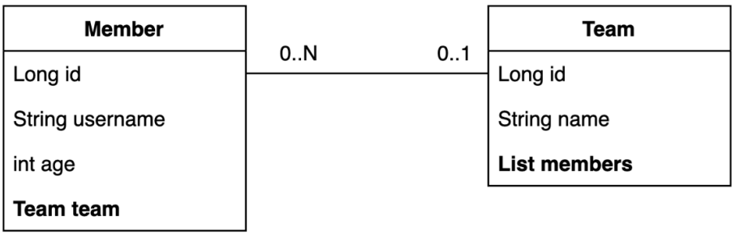
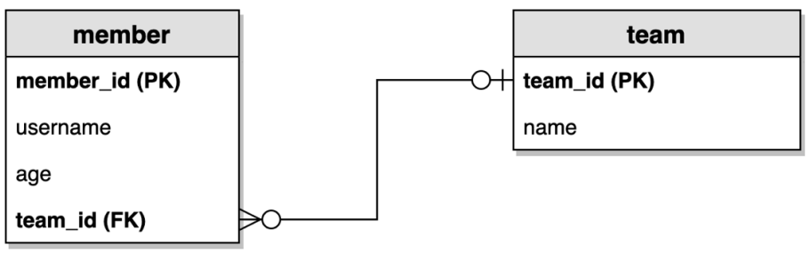
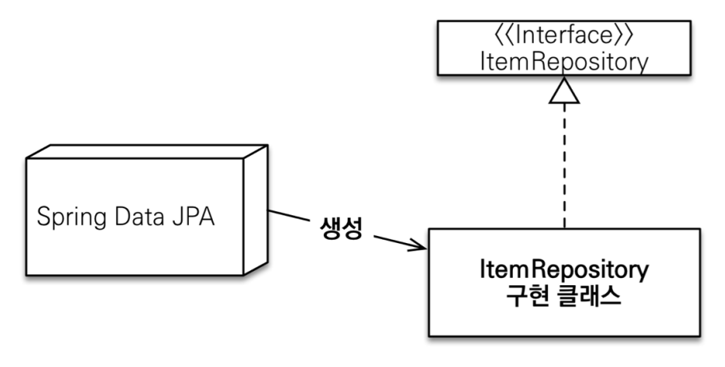
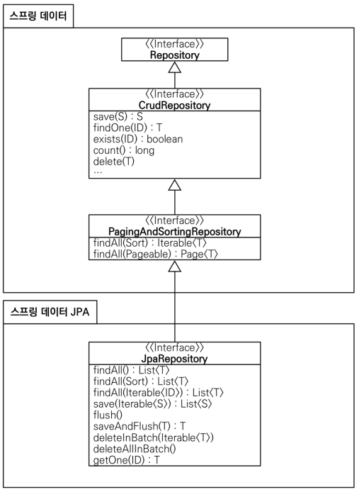

# [스프링 부트와 JPA] 실전! 스프링 데이터 JPA

# 목차  
1. 예제 도메인 모델
2. 공통 인터페이스 기능
3. 쿼리 메소드 기능
4. 확장 기능
5. 스프링 데이터 JPA 분석
6. 나머지 기능들

----

# 1. 예제 도메인 모델
## 엔티티 클래스

## ERD

### Member Entity
```java
@Entity
@Getter @Setter
@NoArgsConstructor(access = AccessLevel.PROTECTED)
@ToString(of = {"id", "username", "age"})
public class Member {
    @Id
    @GeneratedValue
    @Column(name = "member_id")
    private Long id;
    private String username;
    private int age;
    
    @ManyToOne(fetch = FetchType.LAZY)
    @JoinColumn(name = "team_id")
    private Team team;
    public Member(String username) {
        this(username, 0);
    }
    
    public Member(String username, int age) {
        this(username, age, null);
    }
    
    public Member(String username, int age, Team team) {
        this.username = username;
        this.age = age;
        if (team != null) {
            changeTeam(team);
        }
    }
    
    public void changeTeam(Team team) {
      this.team = team;
      team.getMembers().add(this);
    }
}
```
### lombok 설명
- `@Setter`: 실무에서는 사용하지 않기
- `@NoArgsConstructor AccessLevel.PROTECTED`: 기본 생성자를 막고 싶은데, JPA 스팩상 PROTECTED로 열어두어야 함
- `@ToString`은 가급적 내부 필드만(연관관계X)
- `changeTeam()`으로 양방향 연관관계 한번에 처리(연관관계 편의 메소드)

# 2. 공통 인터페이스 기능
## 공통 인터페이스 설정
>  참고: <span style="color:red">**JPA에서 수정은 변경감지 기능**</span>을 사용하면 된다.   
> 트랜잭션 안에서 엔티티를 조회한 다음에 데이터를 변경하면, 트랜잭션 종료 시점에 변경감지 기능이 작동
해서 변경된 엔티티를 감지하고 UPDATE SQL을 실행한다.

### 스프링 데이터 JPA가 구현 클래스를 대신 생성

- `org.springframework.data.repository.Repository` 를 구현한 클래스는 스캔 대상
  - `MemberRepository` 인터페이스가 동작한 이유
  - 실제 출력해보기(Proxy)
  - `memberRepository.getClass()` -> `class com.sun.proxy.$ProxyXXX`
- `@Repository` 애노테이션 생략 가능
  - 컴포넌트 스캔을 스프링 데이터 JPA가 자동으로 처리
  - JPA 예외를 스프링 예외로 변환하는 과정도 자동으로 처리

## 공통 인터페이스 적용
### 스프링 데이터 JPA 기반 MemberRepository
```java
public interface MemberRepository extends JpaRepository<Member, Long> {}
```

## 공통 인터페이스 분석
- JpaRepository 인터페이스: 공통 CRUD 제공
- 제네릭은 <엔티티 타입, 식별자 타입> 설정

## 공통 인터페이스 구성


### 주요 메서드
- save(S) : 새로운 엔티티는 저장하고 이미 있는 엔티티는 병합한다.
- delete(T) : 엔티티 하나를 삭제한다. 내부에서 EntityManager.remove() 호출
- findById(ID) : 엔티티 하나를 조회한다. 내부에서 EntityManager.find() 호출
- getOne(ID) : 엔티티를 프록시로 조회한다. 내부에서 EntityManager.getReference() 호출
- findAll(…) : 모든 엔티티를 조회한다. 정렬( Sort )이나 페이징( Pageable ) 조건을 파라미터로 제공할
  수 있다.

# 3. 쿼리 메소드 기능

## 쿼리 메소드 기능 3가지
- 메소드 이름으로 쿼리 생성
- 메소드 이름으로 JPA NamedQuery 호출
- `@Query` 어노테이션을 사용해서 레포지토리 인터페이스에 쿼리 직접 정의

## 메소드 이름으로 쿼리 생성
### 순수 JPA 레포지토리
```java
public List<Member> findByUsernameAndAgeGreaterThan(String username, int age) {
    return em.createQuery("select m from Member m where m.username = :username and m.age > :age")
             .setParameter("username", username)
             .setParameter("age", age)
             .getResultList();
}
```
### 스프링 JPA 레포지토리
```java
public interface MemberRepository extends JpaRepository<Member, Long> {
    List<Member> findByUsernameAndAgeGreaterThan(String username, int age);
}
```
- 스프링 데이터 JPA는 메소드 이름을 분석해서 JPQL을 생성하고 실행

#### 기능 추가 설명
- 조회: find…By, read…By, query…By, get…By
- COUNT: count…By 반환타입 `long`
- EXISTS: exists…By 반환타입 `boolean`
- 삭제: delete…By, remove…By 반환타입 `long`
- DISTINCT: findDistinct, findMemberDistinctBy
- LIMIT: findFirst3, findFirst, findTop, findTop3

> 참고: 이 기능은 엔티티의 필드명이 변경되면 인터페이스에 정의한 메서드 이름도 꼭 함께 변경해야 한다.   
그렇지 않으면 애플리케이션을 시작하는 시점에 오류가 발생한다.   
> 이렇게 애플리케이션 로딩 시점에 오류를 인지할 수 있는 것이 스프링 데이터 JPA의 매우 큰 장점이다.

## JPA NamedQuery

### Member Entity에 NamedQuery 정의
```java
@Entity
@NamedQuery(
   name="Member.findByUsername",
   query="select m from Member m where m.username = :username")
public class Member {
    ...
}
```
### 스프링 데이터 JPA로 NamedQuery 호출
```java
public interface MemberRepository extends JpaRepository<Member, Long> { 
    //** 여기 선언한 Member 도메인 클래스
    List<Member> findByUsername(@Param("username") String username);
}
```
- 스프링 데이터 JPA는 선언한 "도메인 클래스 + .(점) + 메서드 이름"으로 Named 쿼리를 찾아서 실행
- 만약 실행할 Named 쿼리가 없으면 메서드 이름으로 쿼리 생성 전략을 사용한다.

## `@Query` 레포지토리 메소드에 쿼리 정의하기

### 메소드에 JPQL 작성
```java
public interface MemberRepository extends JpaRepository<Member, Long> {
    @Query("select m from Member m where m.username= :username and m.age = :age")
    List<Member> findUser(@Param("username") String username, @Param("age") int age);
}
```
- JPA Named 쿼리처럼 애플리케이션 실행 시점에 문법 오류를 발견할 수 있음(매우 큰 장점!)
> 참고: 실무에서는 메소드 이름으로 쿼리 생성 기능은 파라미터가 증가하면 메서드 이름이 매우 지저분해진
다. 따라서 `@Query` 기능을 자주 사용하게 된다.

### `@Query`, 값, DTO 조회하기

#### 단순히 값 하나 조회
```java
@Query("select m.username from Member m")
List<String> findUsernameList();
```
#### DTO로 직접 조회
```java
@Query("select new study.datajpa.dto.MemberDto(m.id, m.username, t.name) " +
        "from Member m join m.team t")
List<MemberDto> findMemberDto();
```

## 파라미터 바인딩
```java
@Query("select m from Member m where m.username = :name")
Member findMembers(@Param("name") String username);
```
### 컬렉션 파리미터 바인딩
```java
// Collection 타입으로 in절 지원
@Query("select m from Member m where m.username in :names")
List<Member> findByNames(@Param("names") List<String> names);
```

## 반환타입
> 스프링 데이터 JPA는 유연한 반환 타입 지원
```java
List<Member> findByUsername(String name); //컬렉션
Member findByUsername(String name); //단건
Optional<Member> findByUsername(String name); //단건 Optional
```
#### 조회 결과가 많거나 없으면?
- 컬렉션
  - 결과 없음: 빈 컬렉션 반환
- 단건 조회
  - 결과 없음: null 반환
  - 결과가 2건 이상: `javax.persistence.NonUniqueResultException` 예외 발생

## 스프링 데이터 JPA 페이징과 정렬
### 특별한 반환 타입
- Page: 추가 count 쿼리 결과를 포함하는 페이징
- Slice: 추가 count 쿼리 없이 다음 페이지만 확인 가능(내부적으로 limit + 1 조회)
- List: 추가 count 쿼리 없이 결과만 반환
```java
Page<Member> findByUsername(String name, Pageable pageable); //count 쿼리 사용
Slice<Member> findByUsername(String name, Pageable pageable); //count 쿼리 사용 안함
List<Member> findByUsername(String name, Pageable pageable); //count 쿼리 사용 안함
List<Member> findByUsername(String name, Sort sort);
```
### 페이지를 유지하면서 엔티티를 DTO로 변환하기
```java
Page<Member> page = memberRepository.findByAge(10, pageRequest);
Page<MemberDto> dtoPage = page.map(m -> new MemberDto());
```

## 벌크성 수정 쿼리
### JPA
```java
public int bulkAgePlus(int age) {
    int resultCount = em.createQuery(
                         "update Member m set m.age = m.age + 1" +
                         "where m.age >= :age")
                         .setParameter("age", age)
                         .executeUpdate();
    return resultCount;
}
```

### 스프링 데이터 JPA
```java
@Modifying(clearAutomatically = true)
@Query("update Member m set m.age = m.age + 1 where m.age >= :age")
int bulkAgePlus(@Param("age") int age);
```
- 벌크성 수정, 삭제 쿼리는 `@Modifying` 어노테이션을 사용
  - 사용하지 않으면 다음 예외 발생
  - `org.hibernate.hql.internal.QueryExecutionRequestException: Not supported for DML operations`
- 벌크성 쿼리를 실행하고 나서 영속성 컨텍스트 초기화: `@Modifying(clearAutomatically = true)`
  (이 옵션의 기본값은 false )
  - 이 옵션 없이 회원을 `findById` 로 다시 조회하면 영속성 컨텍스트에 과거 값이 남아서 문제가 될 수
    있다. 만약 다시 조회해야 하면 꼭 영속성 컨텍스트를 초기화 하자.
  - <span style="color:yellowgreen">**벌크성 수정은 DB에 바로 때리기 때문에 영속성 컨텍스트에서는 모른다!!**</span>

> 참고: 벌크 연산은 영속성 컨텍스트를 무시하고 실행하기 때문에, 영속성 컨텍스트에 있는 엔티티의 상태와
DB에 엔티티 상태가 달라질 수 있다.   
> 
> 권장하는 방안    
> 1. 영속성 컨텍스트에 엔티티가 없는 상태에서 벌크 연산을 먼저 실행한다.
> 2. 부득이하게 영속성 컨텍스트에 엔티티가 있으면 벌크 연산 직후 영속성 컨텍스트를 초기화 한다.


## `@EntityGraph`
- 연관된 엔티티들을 SQL 한번에 조회하는 방법
- member -> team은 지연 로딩 관계이다. (N+1 문제 발생)
- 연관된 엔티티를 한번에 조회하려면 페치 조인이 필요하다.
```java
//공통 메서드 오버라이드
@Override
@EntityGraph(attributePaths = {"team"})
List<Member> findAll();

//JPQL + 엔티티 그래프
@EntityGraph(attributePaths = {"team"})
@Query("select m from Member m")
List<Member> findMemberEntityGraph();

//메서드 이름으로 쿼리에서 특히 편리하다.
@EntityGraph(attributePaths = {"team"})
List<Member> findByUsername(String username)
```

### EntityGraph 정리
- 사실상 페치 조인(fetch join)의 간편 버전
- left outer join 사용

# 4. 확장 기능 
## 사용자 정의 레포지토리 구현
- 스프링 데이터 JPA 리포지토리는 인터페이스만 정의하고 구현체는 스프링이 자동 생성
- 스프링 데이터 JPA가 제공하는 인터페이스를 직접 구현하면 구현해야 하는 기능이 너무 많음
- 다양한 이유로 인터페이스의 메서드를 직접 구현하고 싶다면?
  - JPA 직접 사용( EntityManager )
  - 스프링 JDBC Template 사용
  - MyBatis 사용
  - 데이터베이스 커넥션 직접 사용 등등...
  - Querydsl 사용

### 사용자 정의 인터페이스
```java
public interface MemberRepositoryCustom {
    List<Member> findMemberCustom();
}
```

### 사용자 정의 인터페이스 구현 클래스
```java
@RequiredArgsConstructor
public class MemberRepositoryImpl implements MemberRepositoryCustom {
  
    private final EntityManager em;
  
    @Override
    public List<Member> findMemberCustom() {
      return em.createQuery("select m from Member m")
              .getResultList();
    }
}
```

### 사용자 정의 인터페이스 상속
```java
public interface MemberRepository
          extends JpaRepository<Member, Long>, MemberRepositoryCustom {
}
```

### 사용자 정의 구현 클래스
- 규칙: 리포지토리 인터페이스 이름 + `Impl` ex) `MemberRepositoryImpl`, `MemberRepositoryCustomImpl`
- 스프링 데이터 JPA가 인식해서 스프링 빈으로 등록

## Auditing
- 엔티티를 생성, 변경할 때 변경한 사람과 시간을 추적하고 싶으면?
  - 등록일
  - 수정일
  - 등록자
  - 수정자
#### JPA 주요 이벤트 어노테이션
- `@PrePersist`, `@PostPersist`
- `@PreUpdate`, `@PostUpdate`

### 스프링 데이터 JPA 사용
#### 설정
- `@EnableJpaAuditing` -> 스프링 부트 설정 클래스에 적용
- `@EntityListeners(AuditingEntityListener.class)` -> 엔티티에 적용
#### 사용 어노테이션
- `@CreatedDate`
- `@LastModifiedDate`
- `@CreatedBy`
- `@LastModifiedBy`

### 등록자 수정자를 처리해주는 `AuditorAware` 스프링 빈 등록
```java
@EnableJpaAuditing
@SpringBootApplication
public class DataJpaApplication {
     public static void main(String[] args) {
        SpringApplication.run(DataJpaApplication.class, args);
     }
     @Bean
     public AuditorAware<String> auditorProvider() {
        // 여기에서는 UUID를 사용했지만 
        // 실무에서는 세션 정보나, 스프링 시큐리티 로그인 정보에서 ID를 받음
        return () -> Optional.of(UUID.randomUUID().toString());
     }
}
```
### 등록일, 수정일
```java
@EntityListeners(AuditingEntityListener.class)
@MappedSuperclass
public class BaseTimeEntity {
    
   @CreatedDate
   @Column(updatable = false)
   private LocalDateTime createdDate;
   
   @LastModifiedDate
   private LocalDateTime lastModifiedDate;
}
```
### 등록자, 수정자 + BaseTimeEntity
```java
@EntityListeners(AuditingEntityListener.class)
@MappedSuperclass
public class BaseEntity extends BaseTimeEntity {
    
   @CreatedBy
   @Column(updatable = false)
   private String createdBy;
   
   @LastModifiedBy
   private String lastModifiedBy;
}
```
> 참고: 저장시점에 등록일, 등록자는 물론이고, 수정일, 수정자도 같은 데이터가 저장된다.    
> 데이터가 중복 저장되는 것 같지만, 이렇게 해두면 변경 컬럼만 확인해도 마지막에 업데이트한 유저를 확인 할 수 있으므로 유지보수 관점에서 편리하다.   
> 이렇게 하지 않으면 변경 컬럼이 null 일때 등록 컬럼을 또 찾아야 한다.   
> 참고로 저장시점에 저장데이터만 입력하고 싶으면 `@EnableJpaAuditing(modifyOnCreate = false)` 옵션을 사용하면 된다.

## 웹 확장 - 페이징과 정렬
### MemberController
```java
@GetMapping("/members")
public Page<Member> list(Pageable pageable) {
    Page<Member> page = memberRepository.findAll(pageable);
    return page;
}
```
- 파라미터로 `Pageable`을 받을 수 있다
- `Pageable` 은 인터페이스, 실제는 `org.springframework.data.domain.PageRequest` 객체 생성
### 요청 파라미터
- ex) `/members?page=0&size=3&sort=id,desc&sort=username,desc`
- page: 현재 페이지, **0부터 시작한다**
- size: 한 페이지에 노출할 데이터 건수
- sort: 정렬 조건을 정의한다
### 기본값
- 글로벌 설정
```java
spring.data.web.pageable.default-page-size=20 /# 기본 페이지 사이즈/
spring.data.web.pageable.max-page-size=2000 /# 최대 페이지 사이즈/
```
- 개별 설정 -> `@PageableDefault` 어노테이션을 사용
```java
@RequestMapping(value = "/members_page", method = RequestMethod.GET)
public String list(@PageableDefault(size = 12, sort = "username",
                      direction = Sort.Direction.DESC) Pageable pageable) {
   ...
}
```
### Page 내용을 DTO로 반환하기
- 엔티티 반환 X -> DTO로 반환
- Page는 `map()`을 지원해서 내부 데이터를 다른 것으로 변경할 수 있다
#### MemberDTO
```java
@Data
public class MemberDto {
   private Long id;
   private String username;
   
   // DTO는 엔티티를 받을 수 있다.
   public MemberDto(Member m) {
       this.id = m.getId();
       this.username = m.getUsername();
   }
}
```

#### `Page.map()` 사용
```java
@GetMapping("/members")
public Page<MemberDto> list(Pageable pageable) {
   Page<Member> page = memberRepository.findAll(pageable);
   Page<MemberDto> pageDto = page.map(MemberDto::new);
   return pageDto;
}
```

#### `Page.map()` 코드 최적화
```java
@GetMapping("/members")
public Page<MemberDto> list(Pageable pageable) {
    return memberRepository.findAll(pageable).map(MemberDto::new);
}
```

# 5. 스프링 데이터 JPA 분석
## 스프링 데이터 JPA 구현체 분석
- 스프링 데이터 JPA가 제공하는 공통 인터페이스의 구현체
- `org.springframework.data.jpa.repository.support.SimpleJpaRepository`
```java
@Repository
@Transactional(readOnly = true)
public class SimpleJpaRepository<T, ID> ...{
    
   @Transactional
   public <S extends T> S save(S entity) {
       if (entityInformation.isNew(entity)) {
           em.persist(entity);
           return entity;
       } else {
           return em.merge(entity);
       }
   }
   ...
}
```
- `@Repository` 적용: JPA 예외를 스프링이 추상화한 예외로 변환
- `@Transactional` 트랜잭션 적용
  - JPA의 모든 변경은 트랜잭션 안에서 동작
  - 스프링 데이터 JPA는 변경(등록, 수정, 삭제) 메서드를 트랜잭션 처리
  - 서비스 계층에서 트랜잭션을 시작하지 않으면 리파지토리에서 트랜잭션 시작
  - 서비스 계층에서 트랜잭션을 시작하면 리파지토리는 해당 트랜잭션을 전파 받아서 사용
  - 그래서 스프링 데이터 JPA를 사용할 때 트랜잭션이 없어도 데이터 등록, 변경이 가능했음(사실은 트랜잭션이 리포지토리 계층에 걸려있는 것임)
- `@Transactional(readOnly = true)`
  - 데이터를 단순히 조회만 하고 변경하지 않는 트랜잭션에서 `readOnly = true` 옵션을 사용하면 플러시를 생략해서 약간의 성능 향상을 얻을 수 있음

### <span style="color:red">**save( ) 메서드**</span>
- 새로운 엔티티면 저장( persist )
- 새로운 엔티티가 아니면 병합( merge )

## 새로운 엔티티를 구별하는 방법
- 새로운 엔티티를 판단하는 기본 전략
  - 식별자가 객체일 때 `null`로 판단
  - 식별자가 자바 기본 타입일 때 `0`으로 판단
  - `Persistable` 인터페이스를 구현해서 판단 로직 변경
- JPA 식별자 생성 전략이 `@GenerateValue`면 `save()` 호출 시점에 식별자 (Long id)가 없으므로 새로운 엔티티로 인식해서 정상 동작한다.
- 하지만 <span style="color:red">식별자가 직접 할당</span>이면 이미 식별자가 있는 상태로 `save()`를 호출한다. -> `merge()`가 호출된다!! 
- -> 이 경우 DB에서 값을 확인하고 없으면 새로운 엔티티로 인지하므로 매우 비효율적!!
- -> 따라서 `Persistable`을 사용해서 새로운 엔티티 여부를 직접 구현하게 하는 것이 효과적
> 참고: `@CreatedDate`을 조합하면 새로운 엔티티 여부를 편리하게 확인할 수 있다.
### `Persistable` 인터페이스
```java
public interface Persistable<ID> {
    ID getId();
    boolean isNew();
}
```
### `Persistable` 구현
```java
@Entity
@EntityListeners(AuditingEntityListener.class)
@NoArgsConstructor(access = AccessLevel.PROTECTED)
// 구현
public class Item implements Persistable<String> {
    
    @Id
    private String id;
    
    @CreatedDate
    private LocalDateTime createdDate;
    
    public Item(String id) {
        this.id = id;
    }
    
    // 구현
    @Override
    public String getId() {
        return id;
    }
    
    // 구현
    @Override
    public boolean isNew() {
        return createdDate == null;
    }
}
```


----


* 개발환경

  * IDE: IntelliJ
  * Spring Boot 2.7.7
  * JAVA 11
  * Gradle
  * Spring Web 
  * Thymeleaf
  * Spring Data Jpa
  * Thymeleaf
  * H2 1.4.200
  * Spring Boot Test
  * Tomcat
