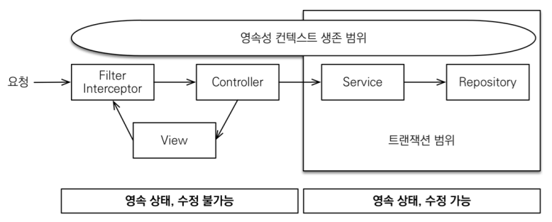
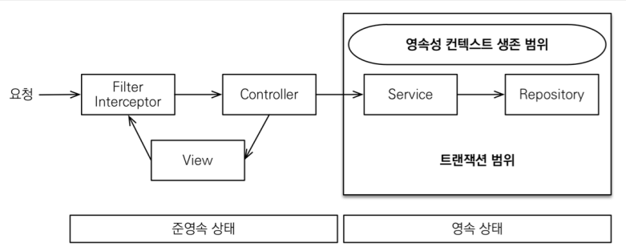

# [스프링 부트와 JPA] 실전! 스프링 부트와 JPA 활용2 - API 개발과 성능 최적화

# 목차  
1. API 개발 기본
2. API 개발 고급 - 지연 로딩과 조회 성능 최적화
3. API 개발 고급 - 컬렉션 조회 최적화
4. API 개발 고급 - 실무 필수 최적화

----

# 1. API 개발 기본
### 참고: 엔티티를 외부에 노출하지 말 것!
- 실무에서는 `member` 엔티티의 데이터가 필요한 API가 계속 증가하게 된다. 
- 어떤 API는 `name` 필드가 필요 하지만, 어떤 API는 `name` 필드가 필요 없을 수 있다. 
- 결론적으로 엔티티 대신에 API 스펙에 맞는  <span style="color:red">**별도의 DTO를 노출**</span>해야 한다.

```java
@GetMapping("/api/v2/members")
public Result membersV2() {
    
    List<Member> findMembers = memberService.findMembers();
    
    //엔티티 -> DTO 변환
    List<MemberDto> collect = findMembers.stream()
    .map(m -> new MemberDto(m.getName()))
    .collect(Collectors.toList());
    
    return new Result(collect);
}

// Result 클래스로 컬렉션을 감싸서 향후 필요한 필드를 추가할 수 있다.
@Data
@AllArgsConstructor
static class Result<T> {
    private T data;
}

@Data
@AllArgsConstructor
static class MemberDto {
    private String name;
}
```

# 2. API 개발 고급 - 지연 로딩과 조회 성능 최적화
> **주의**: 지연 로딩(LAZY)을 피하기 위해 즉시 로딩(EARGR)으로 설정하면 안된다!  
> 즉시 로딩 때문에 연관관계가 필요 없는 경우에도 데이터를 항상 조회해서 성능 문제가 발생할 수 있다. 즉시 로딩으로 설정하면 성능
튜닝이 매우 어려워 진다.  
> 항상 지연 로딩을 기본으로 하고, 성능 최적화가 필요한 경우에는 페치 조인(fetch join)을 사용해라!

#### 간단한 주문 조회 v2: 엔티티를 DTO로 변환
- 쿼리가 총 1 + N + N번 실행된다. (v1과 쿼리수 결과는 같다.)
  - `order` 조회 1번(`order` 조회 결과 수가 N이 된다.)
  - `order` -> `member` 지연 로딩 조회 N 번
  - `order` -> `delivery` 지연 로딩 조회 N 번
  - 예) order의 결과가 4개면 최악의 경우 1 + 4 + 4번 실행된다.(최악의 경우)
    - 지연로딩은 영속성 컨텍스트에서 조회하므로, 이미 조회된 경우 쿼리를 생략한다.

### 엔티티를 DTO로 변환 -  <span style="color:red">페치 조인 최적화</span>
```java
public List<Order> findAllWithMemberDelivery() {
  return em.createQuery(
            "select o from Order o" +
            " join fetch o.member m" +
            " join fetch o.delivery d", Order.class)
            .getResultList();
}
```
- 엔티티를 페치 조인을 사용해서 쿼리 1번에 조회
- 페치 조인으로 `order->memeber`, `order->delivery`는 이미 조회 된 상태이므로 지연로딩X

### JPA에서 DTO로 바로 조회
```java
@Repository
@RequiredArgsConstructor
public class OrderSimpleQueryRepository {
    
    private final EntityManager em;
    
    public List<OrderSimpleQueryDto> findOrderDtos() {
      return em.createQuery(
                  "select new 
                  jpabook.jpashop.repository.order.simplequery.OrderSimpleQueryDto(o.id, m.name, o.orderDate, o.status, d.address)" +
                          " from Order o" +
                          " join o.member m" +
                          " join o.delivery d", OrderSimpleQueryDto.class)
                  .getResultList();
    }
}
```
- 일반적인 SQL을 사용할 때 처럼 원하는 값을 선택해서 조회
- `new` 명령어를 사용해서 JPQL의 결과를 DTO로 즉시 변환
- SELECT 절에서 원하는 데이터를 직접 선택하므로 DB -> 애플리케이션 네트웍 용량 최적화
- 레포지토리 재사용성 떨어짐, API 스펙에 맞춘 코드가 레포지토리에 들어가는 단점

## 정리
1. 우선 엔티티를 DTO로 변환하는 방법을 선택한다
2. 필요하면 <span style="color:red">**페치 조인**</span>으로 성능을 최적화 한다. -> 대부분의 성능 이슈 해결 가능
3. 그래도 안되면 DTO로 직접 조회하는 방법을 사용한다
4. 최후의 방법은 JPA가 제공하는 네이티브 SQL이나 스프링 JDBC Template을 사용해서 SQL을 직접 사용한다.

# 3. API 개발 고급 - 컬렉션 조회 최적화
#### 엔티티를 DTO로 변환 - 페치 조인 최적화
```java
public List<Order> findAllWithItem() {
    return em.createQuery(
            "select distinct o from Order o" +
                    " join fetch o.member m" +
                    " join fetch o.delivery d" +
                    " join fetch o.orderItems oi" +
                    " join fetch oi.item i", Order.class)
            .getResultList();
}
```
##### 정리
- 페치 조인으로 SQL 한번만 실행
- <span style="color:red">**distinct**</span>를 사용한 이유는 1대다 조인이 있으므로 데이터베이스 row가 증가한다(join -> 데이터 뻥튀기)
- `order`엔티티의 조회 수도 증가하게 된다.
- JPA의 `distinct`는 SQL에 `distinct`를 추가하고, 더해서 같은 엔티티가 조회되면, 애플리케이션에서 중복을 걸러준다.

##### 단점
- 페이징이 불가능하다
>참고: 컬렉션 페치 조인을 사용하면 페이징이 불가능하다. 하이버네이트는 경고 로그를 남기면서 모든 데이
터를 DB에서 읽어오고, 메모리에서 페이징 해버린다(매우 위험하다). 자세한 내용은 자바 ORM 표준 JPA
프로그래밍의 페치 조인 부분을 참고하자.  


> 참고: 컬렉션 페치 조인은 1개만 사용할 수 있다. 컬렉션 둘 이상에 페치 조인을 사용하면 안된다. 데이터가
부정합하게 조회될 수 있다. 자세한 내용은 자바 ORM 표준 JPA 프로그래밍을 참고하자.

## 페이징과 한계 돌파
- 컬렉션을 페치 조인하면 페이징이 불가능하다.
  - 컬렉션을 페치 조인하면 일대다 조인이 발생 -> 데이터가 예측할 수 없이 증가
  - 일대다에서는 일을 기준으로 페이징을 하는 것이 목적이다. 하지만 데이터는 다를 기준으로 row가 생성된다.

### `hibernate.default_batch_fetch_size , @BatchSize`
- 먼저 **xxxToOne** 관계를 모두 페치 조인한다.
- 컬렉션은 지연 로딩으로 조회한다.
- 지연 로딩 최적화를 위해 `hibernate.default_batch_fetch_size , @BatchSize` 를 적용한다.
  - hibernate.default_batch_fetch_size: 글로벌 설정
  - @BatchSize: 개별 최적화
  - 이 옵션을 사용하면 컬렉션이나, 프록시 객체를 한꺼번에 설정한 size 만큼 IN 쿼리로 조회한다.

#### 먼저 **xxxToOne** 관계를 모두 페치 조인한다.
```java
/**
 * V3.1 엔티티를 조회해서 DTO로 변환 페이징 고려
 * - ToOne 관계만 우선 모두 페치 조인으로 최적화
 * - 컬렉션 관계는 hibernate.default_batch_fetch_size, @BatchSize로 최적화
 */
@GetMapping("/api/v3.1/orders")
public List<OrderDto> ordersV3_page(
        @RequestParam(value = "offset", defaultValue = "0") int offset,
        @RequestParam(value = "limit", defaultValue = "100") int limit) {
            // ToOne 관계만 우선 모두 페치 조인으로 최적화
            List<Order> orders = orderRepository.findAllWithMemberDelivery(offset, limit);
            // stream을 돌면서 Dto로 변환하는 과정에서 지연 로딩 프록시 객체 조회
            // 프록시 객체를 한꺼번에 설정한 size 만큼 IN 쿼리로 조회
            List<OrderDto> result = orders.stream()
                    .map(o -> new OrderDto(o))
                    .collect(toList());
            return result;
}
```
### 장점
- 쿼리 호출 수가 `1 + N` -> `1 + 1`로 최적화 된다.
- 조인보다 DB 데이터 전송량이 최적화 된다. (중복 조회되는 데이터가 없다)
- 페치 조인 방식과 비교해서 쿼리 호출 수는 증가, BUT DB 데이터 전송량 감소
- 페이징 가능
### 결론
- ToOne 관계는 페치 조인해도 페이징에 영향을 주지 않는다. 따라서 ToOne 관계는 페치조인으로 쿼
  리 수를 줄이고 해결하고, 나머지는 hibernate.default_batch_fetch_size 로 최적화 하자.

> 참고: default_batch_fetch_size 의 크기는 적당한 사이즈를 골라야 하는데, 100~1000 사이를 선택
하는 것을 권장한다. 이 전략을 SQL IN 절을 사용하는데, 데이터베이스에 따라 IN 절 파라미터를 1000으
로 제한하기도 한다. 1000으로 잡으면 한번에 1000개를 DB에서 애플리케이션에 불러오므로 DB에 순간
부하가 증가할 수 있다. 하지만 애플리케이션은 100이든 1000이든 결국 전체 데이터를 로딩해야 하므로
메모리 사용량이 같다. 1000으로 설정하는 것이 성능상 가장 좋지만, 결국 DB든 애플리케이션이든 순간 부
하를 어디까지 견딜 수 있는지로 결정하면 된다.

> 참고: 하이버네이트 6.2 부터는 `where in` 대신에 `array_contains` 를 사용한다.
> -> 성능 최적화 (SQL 구문 캐시)

## 정리
1. 엔티티 조회 방식으로 우선 접근
   1. 페치조인으로 쿼리 수를 최적화
   2. 컬렉션 최적화
      1. 페이징 필요 `hibernate.default_batch_fetch_size , @BatchSize` 로 최적화
      2. 페이징 필요 X 페치 조인 사용
2. 엔티티 조회 방식으로 해결이 안되면 DTO 조회 방식 사용
3. DTO 조회 방식으로 해결이 안되면 NativeSQL or 스프링 JdbcTemplate

> 참고: 엔티티 조회 방식은 페치 조인이나, hibernate.default_batch_fetch_size , @BatchSize 같이
코드를 거의 수정하지 않고, 옵션만 약간 변경해서, 다양한 성능 최적화를 시도할 수 있다. 반면에 DTO를 직
접 조회하는 방식은 성능을 최적화 하거나 성능 최적화 방식을 변경할 때 많은 코드를 변경해야 한다.

> 참고: 개발자는 성능 최적화와 코드 복잡도 사이에서 줄타기를 해야 한다. 항상 그런 것은 아니지만, 보통 성
능 최적화는 단순한 코드를 복잡한 코드로 몰고간다.
> 엔티티 조회 방식은 JPA가 많은 부분을 최적화 해주기 때문에, 단순한 코드를 유지하면서, 성능을 최적화 할
수 있다.
> 반면에 DTO 조회 방식은 SQL을 직접 다루는 것과 유사하기 때문에, 둘 사이에 줄타기를 해야 한다.


# 4. API 개발 고급 - 실무 필수 최적화
## OSIV와 성능 최적화
- Open Session In View: 하이버네이트
- Open EntityManager In View: JPA
- (관례상 OSIV라 한다.)

## OSIV ON

- `spring.jpa.open-in-view` : true 기본값   
- 이 기본값을 뿌리면서 애플리케이션 시작 시점에 warn 로그를 남기는 것은 이유가 있다.   
- **OSIV 전략은 트랜잭션 시작처럼 최초 데이터베이스 커넥션 시작 시점부터 API 응답이 끝날 때 까지 영속성
컨텍스트와 데이터베이스 커넥션을 유지한다.**
- 그래서 지금까지 `View Template이나 API 컨트롤러에서` <span style="color:red">**지연 로딩**</span>이 가능했던 것이다.
- 지연 로딩은 영속성 컨텍스트가 살아있어야 가능하고, 영속성 컨텍스트는 기본적으로 데이터베이스 커넥션
을 유지한다. 이것 자체가 큰 장점이다.
- 그런데 이 전략은 **너무 오랜시간동안 데이터베이스 커넥션 리소스를 사용**하기 때문에, 실시간 트래픽이 중
요한 애플리케이션에서는 **커넥션이 모자랄 수 있다**. 이것은 결국 **장애**로 이어진다.
- 예를 들어서 컨트롤러에서 외부 API를 호출하면 **외부 API 대기 시간 만큼** 커넥션 리소스를 반환하지 못하
고, 유지해야 한다.

## OSIV OFF

- `spring.jpa.open-in-view`: false OSIV 종료
- OSIV를 끄면 트랜잭션을 종료할 때 영속성 컨텍스트를 닫고, 데이터베이스 커넥션도 반환한다. 따라서 커넥션 리소스를 낭비하지 않는다.
- OSIV를 끄면 **모든 지연로딩을 트랜잭션 안에서 처리**해야 한다. 따라서 지금까지 작성한 많은 지연 로딩 코
  드를 트랜잭션 안으로 넣어야 하는 단점이 있다. 
- 그리고 **view template에서 지연로딩이 동작하지 않는다**.
- 결론적으로 <span style="color:red">**트랜잭션이 끝나기 전에 지연 로딩을 강제로 호출**</span>해 두어야 한다.

### 커맨드와 쿼리 분리
<span style="color:red">**고객 서비스의 실시간 API는 OSIV를 끄고</span>, ADMIN 처럼 커넥션을 많이 사용하지 않는 곳에
서는 OSIV를 켠다.**
- 보통 비즈니스 로직은 특정 엔티티 몇 개를 등록하거나 수정하는 것이므로 성능이 크게 문제가 되지 않는다.
- 그런데 복잡한 화면을 출력하기 위한 쿼리는 화면에 맞추어 성능을 최적화 하는 것이 중요하다. 하지만 그 복
  잡성에 비해 핵심 비즈니스에 큰 영향을 주는 것은 아니다.
- 그래서 크고 복잡한 애플리케이션을 개발한다면, 이 둘의 <span style="color:red">**관심사를 명확하게 분리**</span>하는 선택은 유지보수 관
  점에서 충분히 의미 있다.
#### ex)
- OrderService: 핵심 비즈니스 로직
- OrderQueryService: 화면이나 API에 맞춘 서비스 (주로 읽기 전용 트랜잭션 사용)

## 결론의 결론
- 엔티티 조회 -> 페치 조인 사용 최적화 -> 페이징 (batchSize 조절) -> DTO 반환
- OSIV는 끄고 관심사를 명확하게 분리하자!
----


* 개발환경

  * IDE: IntelliJ
  * Spring Boot 2.7.7
  * JAVA 11
  * Gradle
  * Spring Web 
  * Thymeleaf
  * Spring Data Jpa
  * Thymeleaf
  * H2 1.4.200
  * Spring Boot Test
  * Tomcat
