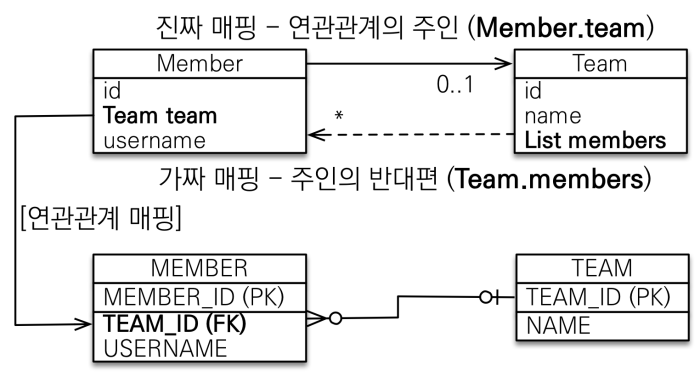

# 5. 연관관계 매핑 기초
> ‘객체지향 설계의 목표는 자율적인 객체들의
협력 공동체를 만드는 것이다.’ –조영호(객체지향의 사실과 오해)


----
## 단방향 연관관계
### 객체 지향 모델링 (객체 연관관계 사용)

```java
@Entity
public class Member { 
    @Id @GeneratedValue
    private Long id;
    @Column(name = "USERNAME")
    private String name;
    
    // @Column(name = "TEAM_ID")
    // private Long teamId;
    @ManyToOne
    @JoinColumn(name = "TEAM_ID")
    private Team team;
    … 
```
## <span style="color:orange">**양방향 연관관계와 연관관계의 주인**</span>

> 객체 참조는 양쪽으로 다 세팅해줘야 한다 vs 테이블은 외래 키 하나로 양쪽 참조 가능 
### 연관관계의 주인과 `mappedBy`
- mappedBy = JPA의 멘탈붕괴 난이도
- mappedBy는 처음에는 이해하기 어렵다.
- 객체와 테이블간에 연관관계를 맺는 차이를 이해해야 한다.

### 객체와 테이블이 관계를 맺는 차이
- 객체 연관관계 = 2개
  - 회원 -> 팀 연관관계 1개(단방향)
  - 팀 -> 회원 연관관계 1개(단방향)
- 테이블 연관관계 = 1개
  - 회원 <-> 팀의 연관관계 1개(양방향)

### 둘 중 하나로 외래 키를 관리해야 한다.


### 연관관계의 주인(Owner)
- 양방향 매핑 규칙
  - 객체의 두 관계중 하나를 **연관관계의 주인**으로 지정
  - 연관관계의 **주인만이 외래 키를 관리**(등록, 수정)
  - 주인이 아닌쪽은 읽기만 가능
  - 주인은 mappedBy 속성 사용X
  - 주인이 아니면 mappedBy 속성으로 주인 지정

### 누구를 주인으로?
- <span style="color:red">**외래 키가 있는 곳을 주인으로 정해라**</span>
- 여기서는 Member.team이 연관관계의 주인



### 양방향 매핑시 가장 많이 하는 실수
- 연관관계의 주인에 값을 입력하지 않음
```java
Team team = new Team();
team.setName("TeamA");
em.persist(team);
Member member = new Member();
member.setName("member1");
//역방향(주인이 아닌 방향)만 연관관계 설정
team.getMembers().add(member);
em.persist(member);
```
#### **양방향 매핑시 순수 객체 상태를 고려해서 항상 양쪽에 값을 설정하자**
- 연관 관계 편의 메소드 생성 (`team.addMembers()`)
- <span style="color:red">무한 루프 조심!!</span>
  - ex) `toString()`, `lombok`, JSON 생성 라이브러리(Controller에서 반환할 때 객체 자체로 반환하는 경우)

### 양방향 매핑 정리
- <span style="color:red">**단반향 매핑만으로도 이미 연관관계 매핑은 완료**</span>
- 양방향 매핑은 반대 방향으로 조회하기 위해 추간된 것일 뿐!!
- JPQL에서는 역방향 조회가 많을 수 있음
- <span style="color:red">즉, 처음 설계는 단반향으로 완료하고 추후에 역방향으로 조회할 기능이 필요하면 그때 추가할 것</span>
----  

###### References: 김영한 - [자바 ORM 표준 JPA 프로그래밍 - 기본편]
