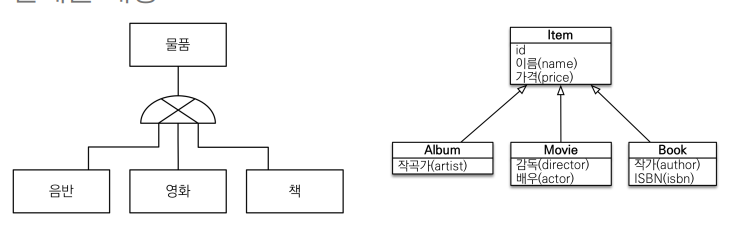
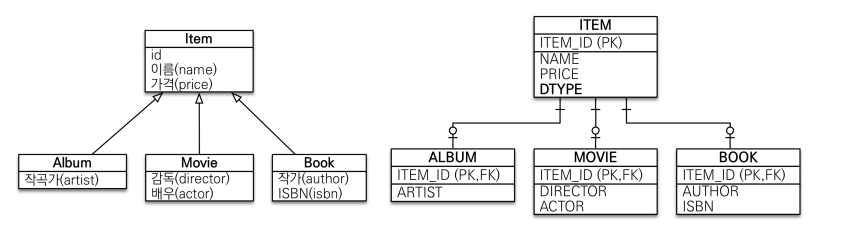
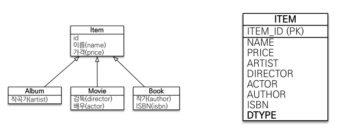
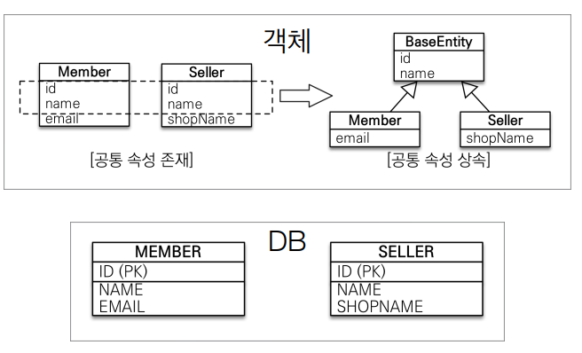

# 7. 고급 매핑

----

## 상속 관계 매핑
- 관계형 데이터 베이스는 상속 관계 X
- 슈퍼 타입 서브 타입 관계가 객체 상속과 유사
- 상속관계 매핑: 객체의 상속과 구조와 DB의 슈퍼타입 서브타입
  관계를 매핑

### 전략
- 각각 테이블로 변환 -> 조인 전략
- 통합 테이블 하나로 변환 -> 단일 테이블 전략
- 서브 타입 테이블로 전환 -> 구현 클래스마다 테이블 전략

### 주요 어노테이션
- `@Inheritance(strategy=InheritanceType.XXX)`
  - JOINED: 조인 전략
  - SINGLE_TABLE: 단일 테이블 전략
  - TABLE_PER_CLASS: 구현 클래스마다 테이블 전략
- `@DiscriminatorColumn(name=“DTYPE”)`
- `@DiscriminatorValue(“XXX”)`
- 조인, 단일 -> Item을 추상 클래스로 정의하고 이를 상속받아 객체로 구현

### 조인 전략 (가장 기본으로 사용)

- 장점
  - 테이블 정규화 
  - 외래 키 참조 무결성 제약조건 활용가능
  - 저장공간 효율화
- 단점
  - 조회시 조인을 많이 사용, 성능 저하
  - 조회 쿼리가 복잡합
  - 데이터 저장시 INSERT SQL 2번 호출

### 단일 테이블 전략 (크지 않는 데이터 혹은 변경 가능성이 적을 때 사용)

- 장점
  - 조인이 필요 없으므로 일반적으로 조회 성능이 빠름 
  - 조회 쿼리가 단순함
- 단점
  - 자식 엔티티가 매핑한 칼럼은 모두 null 허용
  - 단일 테이블에 모든 것을 저장하므로 테이블이 커질 수 있다. 상황에 따라서 조회 성능이 오히려 느려질 수 있다.

## `@MapppedSuperclass`
- 공통 매핑 정보가 필요할 때 사용 (id,name)

- 상속 관계 매핑 X
- 엔티티 X, 테이블과 매핑 X
- 부모 클래스를 상속 받는 **자식 클래스에 매핑 정보만 제공**
- 조회, 검색 불가
- 직접 생성해서 사용하지 않으므로 **추상 클래스로 구현 권장**
- `@MappedSuperclass` 어노테이션을 단 추상 클래스를 상속받아 구현된 자식 클래스들은 저 부모 클래스가 갖고 있는 매핑 정보를 공통으로 가진다.

----  

###### References: 김영한 - [자바 ORM 표준 JPA 프로그래밍 - 기본편]
