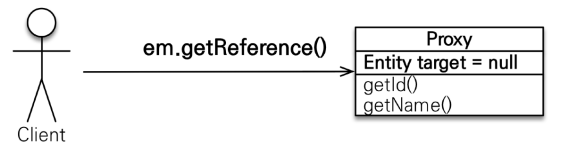
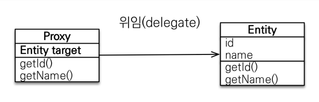
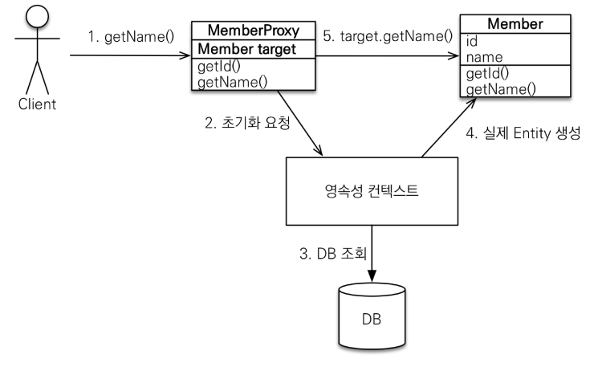
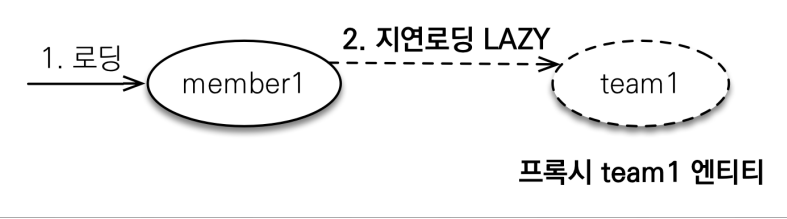
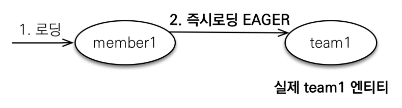

# 8. 프록시와 연관관계 관리

----

## 프록시

### 프록시 기초
- `em.find()` vs `em.getReference()`
- `em.find()`: 데이터베이스를 통해서 실제 엔티티 객체 조회
- `em.getReference()`: **데이터베이스 조회를 미루는 가짜(프록시) 엔티티 객체 조회**


### 프록시 특징
- 실제 클래스를 상속 받아서 만들어짐
- 실제 클래스와 겉모습이 같다
- 사용하는 입장에서는 뭔지 모르고 사용하면 됨 
- 프록시 객체는 실체 객체의 참조(target)을 보관
- 프록시 객체를 호출하면 프록시 객체는 실체 객체의 메소드 호출


### 프록시 객체의 초기화
```java
Member member = em.getReference(Member.class, “id1”);
member.getName();
```

0. `em.getReference`를 통해 영속성 컨텍스트에 프록시 객체가 생성 됨 (지연 로딩을 위해)
1. `getName`을 통해 프록시 객체든 아니든 메소드를 호출함 (값을 요청)
2. 프록시 객체는 영속성 컨텍스트에게 값이 필요하다고 초기화 요청을 함 (실제 객체를 요청)
3. 영속성 컨텍스트는 db에서 실제 값을 가져옴 (실제 값을 가져와서)
4. 실제 값으로 실제 Entity를 생성함 (실제 객체를 반환)
5. 프록시의 `target`은 실제 객체를 가르키게 됨 (실제 객체를 가르킬 수 있게 됨)

### 프록시의 특징
- 프록시 객체는 처음 사용할 때 한번만 초기화 됨
- 프록시 객체를 초기화 할 때, 프록시 객체가 실제 엔티티로 바뀌는 것은 아님, <span style="color:red">**초기화되면 프록시 객체를 통해서 실제 엔티티에 접근 가능(target)**</span>
- 프록시 객체는 원본 엔티티를 상속받음, 따라서 타입 체크시 주의해야함 (== 비
  교 실패, 대신 `instance of` 사용)
- 영속성 컨텍스트에 찾는 엔티티가 이미 있으면 `em.getReference()`를 호출해
  도 실제 엔티티 반환 -> 이미 프록시가 아닌 실제 객체인데 1차 캐시를 사용하지 않을 이유 없음!!
- 영속성 컨텍스트의 도움을 받을 수 없는 준영속 상태일 때, 프록시를 초기화하면
  문제 발생 (하이버네이트는 `org.hibernate.LazyInitializationException` 예외를 터트림)
-> 같은 영속성 컨텍스트에 속해 있지 않는데(종료, 관리 X) 프록시 객체를 초기화를 요청하면 없는 프록시를 초기화를 하는 것이니 에러 발생

### 프록시 확인
- 프록시 인스턴스의 초기화 여부 확인
`PersistenceUnitUtil.isLoaded(Object entity)`
- 프록시 클래스 확인 방법
`entity.getClass().getName() 출력(..javasist.. or
HibernateProxy…)`
- 프록시 강제 초기화
`org.hibernate.Hibernate.initialize(entity);`
- 참고: JPA 표준은 강제 초기화 없음
강제 호출: `member.getName()`

## 즉시 로딩과 지연 로딩

### 지연 로딩
- `fetch = FetchType.LAZY`
- 지연 로딩 LAZY를 사용해서 프록시로 조회
- member를 조회할 때 team을 가끔 조회한다




### 즉시 로딩
- `fetch = FetchType.EAGER`
- 즉시 로딩 EAGER를 사용해서 실제 객체 조회
- member를 조회할 때 team을 자주 조회한다



### 프록시와 즉시로딩 주의
- <span style="color:red">**가급적 지연 로딩만 사용(특히 실무에서)**</span>
- 즉시 로딩 사용시 예측하지 못한 SQL이 발생
- **즉시 로딩은 JPQL에서 N+1 문제를 일으킨다.** (jpql에서는 sql문을 만들어서 사용하는 데 먼저 member를 조회하고 그 이후 team을 다시 조회하는 n+1 문제 발생)
- <span style="color:red">**`@ManyToOne`, `@OneToOne`은 기본이 즉시 로딩
  -> LAZY로 설정**</span>
- `@OneToMany`, `@ManyToMany`는 기본이 지연 로딩

### 지연 로딩 활용 - 실무
- <span style="color:yellow">모든 연관관계에 지연 로딩을 사용해라!</span>
- <span style="color:red">실무에서 즉시 로딩을 사용하지 마라!</span>
- **JPQL fetch 조인이나, 엔티티 그래프 기능을 사용해라**
- **즉시 로딩은 상상하지 못한 쿼리가 나간다.**

## 영속성 전이: CASCADE
- 특정 엔티티를 영속 상태로 만들 때 연관된 엔티티도 함께 영속 상태로 만듬
- ex) 부모 엔티티를 저장할 때 자식 엔티티도 함께 저장

### 영속성 전이: 저장
`@OneToMany(mappedBy="parent", cascade=CascadeType.PERSIST)`
- 영속성 전이는 연관관계 매핑과 아무 관련 없음
- 편리함을 제공할 뿐

### CASCADE의 종류
- **ALL: 모두 적용**
- **PERSIST: 영속**
- **REMOVE: 삭제**
- MERGE: 병합
- REFRESH: REFRESH
- DETACH: DETACH

## 고아 객체
- 고아 객체 제거: 부모 엔티티와 연관관계가 끊어진 자식 엔티티를 자동으로 삭제
- **orphanRemoval = true**
- Parent parent1 = em.find(Parent.class, id); 
- parent1.getChildren().remove(0);
  //자식 엔티티를 컬렉션에서 제거
- -> 자식 엔티티 DELETE문 자동으로 실행

### 고아 객체 - 주의
- **참조하는 곳이 하나일 때 사용해야함!**
- **특정 엔티티가 개인 소유(부모 - 자식)하는 관계일 때 사용**
- `@OneToOne`, `@OneToMany`만 사용
> `CascasdeType.REMOVE`처럼 동작

## 영속성 전이 + 고아 객체, 생명주기
- `CascadeType.ALL + orphanRemoval=true`
- 두 옵션을 모두 활성화 -> 부모 엔티티를 통해서 자식의 생명 주기 관리
- DDD의 Aggregate Root 개념을 구현할 때 유용

----  

###### References: 김영한 - [자바 ORM 표준 JPA 프로그래밍 - 기본편]
