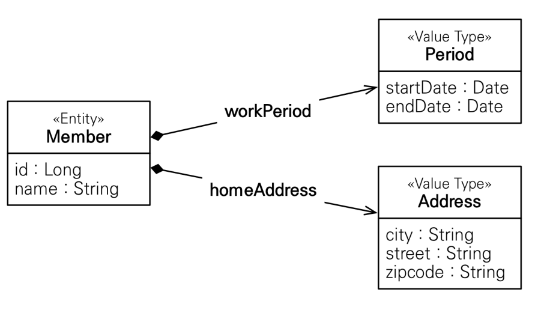
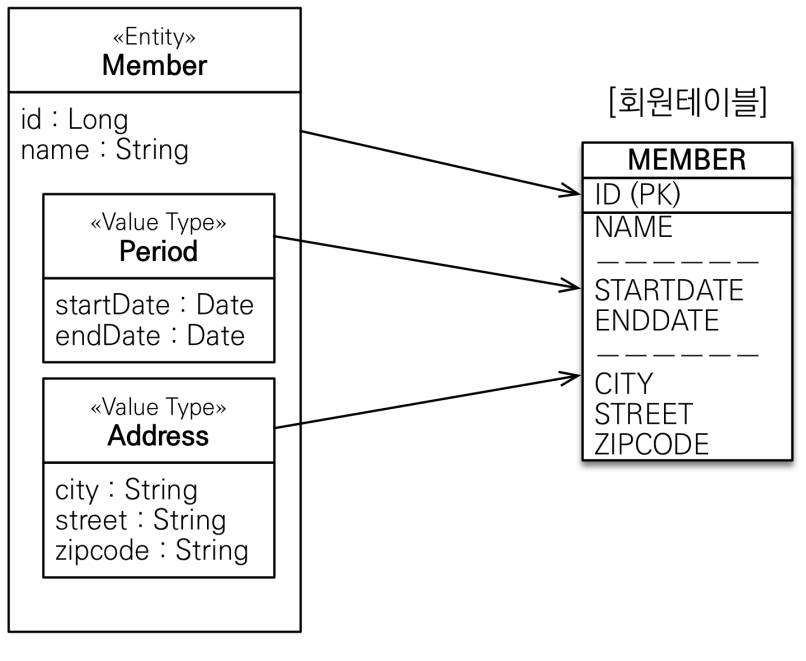
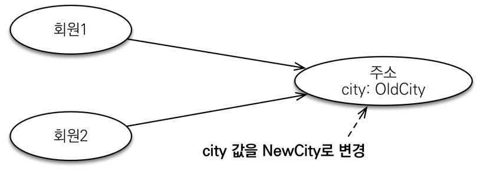

# 9. 값 타입

----

## 기본값 타입

### JPA의 데이터 타입 분류
- **엔티티 타입**
  - `@Entity`로 정의하는 객체
  - 데이터가 변해도 식별자로 지속해서 추적 가능
  - ex) 회원 엔티티의 키나 나이 값을 변경해도 식별자로(id) 인식 가능
- **값 타입**
  - int, Integer, String 처럼 단순히 값으로 사용하는 자바 기본 타입이나 객체
  - 식별자가 없고 값만 있으므로 변경시 추적 불가
  - ex) 숫자 100을 200으로 변경하면 완전히 다른 값으로 대체

### 값 타입 분류
- **기본값 타입**
  - 자바 기본 타입(int, double)
  - 래퍼 클래스(Integer, Long)
  - String
- **임베디드 타입**(embedded type, 복합 값 타입)
- **컬렉션 값 타입**(collection value type)

### 기본값 타입
- ex) String name, int age
- 생명주기를 엔티티의 의존
  - ex) 회원을 삭제하면 이름, 나이 필드도 함께 삭제
- 값 타입은 공유하면 X
  - ex) 회원 이름 변경시 다른 회원의 이름도 함께 변경되면 안됨

### 참고: 자바의 기본 타입은 절대 공유 X
- int, double 같은 기본 타입(primitive type)은 절대 공유 X
- 기본 타입은 항상 값을 복사함
- Integer 같은 래퍼 클래스나 String 같은 특수한 클래스는 공유 가능한 객체이지만 변경 X

### 임베디드 타입(복합 값 타입)
- 새로운 값 타입을 직접 정의할 수 있음
- JPA는 임베디드 타입이라 함
- 주로 기본 값 타입을 모아서 만들어서 복합 값 타입이라고도 함
- int, String과 같은 값 타입

- startDate, endDate 같은 기본 값 타입을 모아서 Period라는 임베디드 타입으로 사용

### 임베디드 타입 사용법
- `@Embeddable`: 값 타입을 정의하는 곳에 표시
- `@Embedded`: 값 타입을 사용하는 곳에 표시
- 기본 생성자 필수

### 임베디드 타입의 장점
- 재사용
- 높은 응집도
- Period.work()처럼 해당 값 타입만 사용하는 의미 있는 메소드를 만들 수 있음
- 임베디드 타입을 포함한 모든 값 타입은, 값 타입을 소유한 엔티티의 생명주기를 의존함

### 임베디드 타입과 테이블 매핑

- 임베디드 타입은 엔티티의 값일 뿐
- 임베디드 타입을 사용하기 전과 후에 **매핑하는 테이블은 같다**
- 객체와 테이블을 아주 세밀하게 매핑하는 것이 가능
- 잘 설계한 ORM 애플리케이션은 매핑한 테이블의 수보다 클래스의 수가 더 많음

### @AttributeOverride: 속성 재정의
- 한 엔티티에서 같은 값 타입을 사용하면?
- 컬럼 명이 중복됨
- `@AttribueOverrides, @AttributeOveride`를 사용해서 컬럼 명 속성을 재정의

## 값 타입과 불변 객체
>값 타입은 복잡한 객체 세상을 조금이라도 단순화하려고
만든 개념이다. 따라서 값 타입은 단순하고 안전하게 다
룰 수 있어야 한다.

### 값 타입 공유 참조
- 임베디드 타입 같은 값 타입을 여러 엔티티에서 공유하면 위험함
- 부작용 발생

### 값 타입 복사
- 값 타입의 실제 인스턴스인 값을 공유하는 것은 위험
- 대신 값을 복사해서 사용

### 객체 타입의 한계
- 항상 값을 복사해서 사용하면 부작용을 피할 수 있다
- **문제는 임베디드 타입처럼 직접 정의한 값 타입은 자바의 기본 타입이 아니라 객체 타입이다**
- **객체 타입은 참조 값을 직접 대입하는 것을 막을 방법이 없다**
- **객체의 공유 참조는 피할 수 없다**

### 불변 객체
- 부작용을 원천 차단하는 방법
- **값 타입은 불변 객체로 설계해야 함**
- **불변 객체: 생성 시점 이후 절대 값을 변경할 수 없는 객체**
- 생성자로만 값을 설정하고 수정자(Setter)를 만들지 않으면 됨
- 참고: Integer, String은 자바가 제공하는 대표저긴 불변 객체

## 값 타입의 비교
- 값 타입: 인스턴스가 달라도 그 안에 값이 같으면 같은 것으로 봐
  야 함
- **동일성(identity) 비교**: 인스턴스의 참조 값을 비교, == 사용
- **동등성(equivalence) 비교**: 인스턴스의 값을 비교, equals() 사용
- 값 타입은 equals를 사용해야함 -> equals() 메소드를 적절하게 재정의(주로 모든 필드 사용)

## 값 타입 컬렉션
- 값 타입을 하나 이상 저장할 때 사용
- @ElementCollection, @CollectionTable 사용
- 데이터베이스는 컬렉션을 같은 테이블에 저장할 수 없다.
- 컬렉션을 저장하기 위한 별도의 테이블이 필요함

### 값 타입 컬렉션의 제약사항
- 값 타입은 엔티티와 다르게 식별자 개념이 없다
- 값은 변경하면 추적이 어렵다
- 값 타입 컬렉션에 변경 사항이 발생하면, 주인 엔티티와 연관된 모든 값 타입 컬렉션에 있는 데이터를 삭제하교, 값 타입 컬렉션에 있는 현재 값을 모두 다시 저장한다.
- 값 타입 컬렉션을 매핑하는 테이블은 모든 칼럼을 묶어서 기본 키를 구성해야 함: **null 입력 X, 중복 저장 X**

### 값 타입 컬렉션 대안
- 실문에서는 **일대다 관계를 고려**
- 일대다 관계를 위한 엔티티를 만들고, 여기에서 값 타입을 사용

## 정리
- **엔티티 타입의 특징**
  - 식별자 O
  - 생명 주기 관리
  - 공유
- **값 타입의 특징**
  - 식별자 X
  - 생명 주기를 엔티티에 의존
  - 공유하지 않는 것이 안전(복사해서 사용)
  - 불변 객체로 만드는 것이 안전

- **값 타입은 정말 값 타입이라 판단될 때만 사용**
- **엔티티와 값 타입을 혼동해서 엔티티를 값 타입으로 만들면 안됨**
- **식별자가 필요하고, 지속해서 값을 추적, 변경해야 한다면 그것
은 값 타입이 아닌 엔티티**

----  

###### References: 김영한 - [자바 ORM 표준 JPA 프로그래밍 - 기본편]
