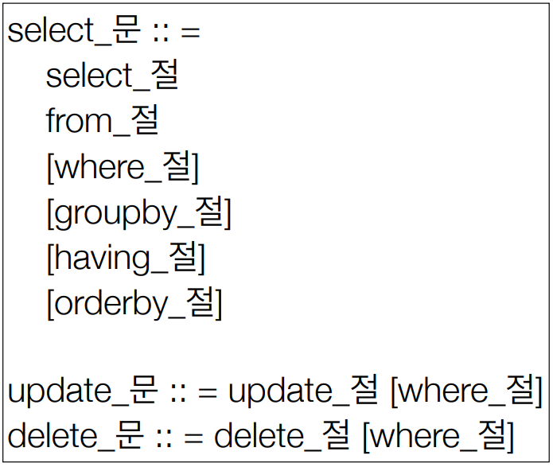
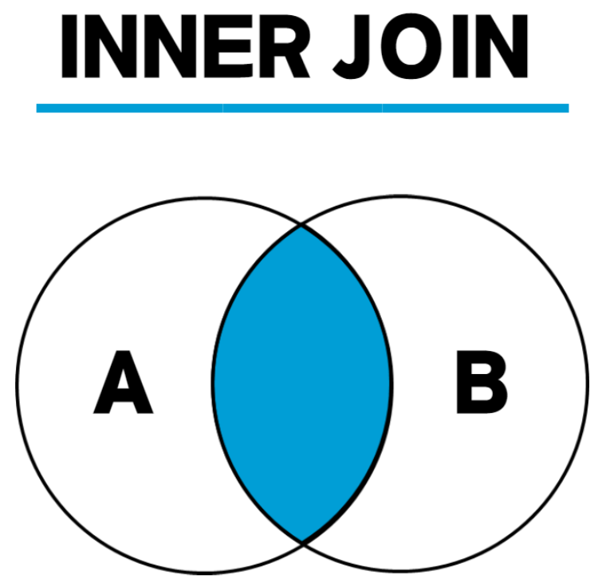
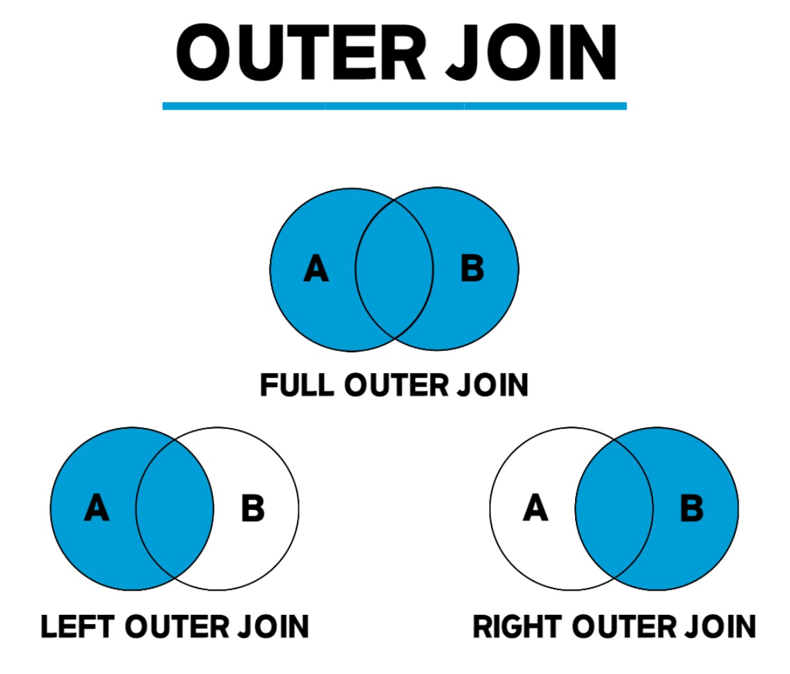
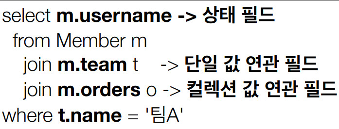
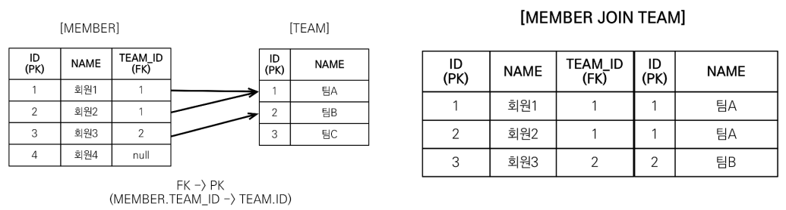
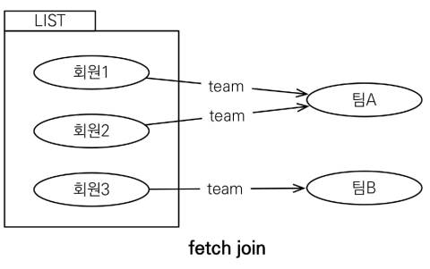
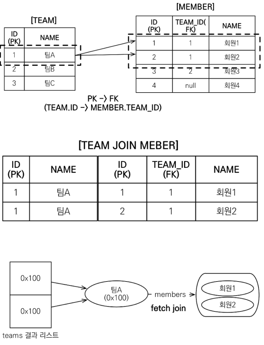

# 10. 객체지향 쿼리 언어

----

## 객체지향 쿼리 언어(JPQL)
### JPA는 다양항 쿼리 방법을 지원
- **JPQL**
- JPA Criteria
- **QueryDSL**
- 네이티브 SQL
- JDBC API 직접 사용, MyBatis, SpringJdbcTemplate 함께 사용

### JPQL
- JPA를 사용하면 엔티티 객체를 중심으로 개발
- 문제는 검색 쿼리
- 검색을 할 때도 **테이블이 아닌 엔티티 객체를 대상으로 검색**
- 모든 DB 데이터를 객체로 변환해서 검색하는 것은 불가능
- SQL이 필요!!

## JPQL
- JPA는 SQL을 추상화한 JPQL 이라는 객체 지향 쿼리 언어를 제공
- SQL과 문법 유사
- JPQL은 엔티티 객체를 대상으로 쿼리
- SQL은 데이터베이스 테이블을 대상으로 쿼리
- 테이블이 아닌 객체를 대상으로 검색하는 객체 지향 쿼리
- SQL을 추상화해서 특정 데이터베이스 SQL에 의존 X
- JPQL을 한마디로 정의하면 객체 지향 SQL

### Criteria 소개
- 문자가 아닌 자바코드로 JPQL로 작성
- <span style="color:red">단점: 너무 복잡하고 실용성이 없다.</span>

## QueryDSL 소개

```java
//JPQL
//select m from Member m where m.age > 18
JPAFactoryQuery query = new JPAQueryFactory(em);
        QMember m = QMember.member;

List<Member> list =
        query.selectFrom(m)
             .where(m.age.gt(18))
             .orderBy(m.name.desc())
             .fetch();
```

- 문자가 아닌 자바코드로 JPQL을 작성
- 컴파일 시점에 문법 오류 찾을 수 있음
- 동적쿼리 작성 편리함
- **단순하고 쉬움**
- <span style="color:green">**실무 사용 권장**</span>

### 네이티브 SQL 소개
- JPA가 제공하는 SQL을 직접 사용하는 기능
- JPQL로 해결할 수 없는 특정 데이터베이스에 의존적인 기능

### JDBC 직접 사용, SpringJdbcTemplate 등
- JPA를 사용하면서 JDBC 커넥션을 직접 사용하거나, 스프링 JdbcTemplate, 마이바티스 등을 함께 사용 가능
- 단 영속성 컨텍스트를 적절한 시점에 강제로 플러시 필요

## JPQL(Java Persistence Query Language)

### JPQS - 기본 문법과 기능
### JPQL 문법

- select m from **Member** as m where m.age > 18
- 엔티티와 속성은 대소문자 구분 O (Member, age)
- JPQL 키워드는 대소문자 구분 X (SELECT, FROM, where)
- 엔티티 이름 사용, 테이블 이름이 아님(Member)
- **별칭은 필수(m)**(as는 생략가능)
### TypeQuery, Query
- TypeQuery: 반환 타입이 명확할 때 사용
- Query: 반환 타입이 명확하지 않을 때 사용
```java
TypedQuery<Member> query = em.createQuery("SELECT m FROM Member m", Member.class);
```
```java
Query query = em.createQuery("SELECT m.username, m.age from Member m");
```
### 결과 조회 API
- `query.getResultList()`:** 결과가 하나 이상일 때**, 리스트 반환
  - 결과가 없으면 빈 리스트 반환
- `query.getSingleResult()`: **결과가 정확히 하나**, 단일 객체 반환
  - 결과가 없으면: `javax.persistence.NoResultException`
  - 둘 이상이면: `javax.persistence.NonUniqueResultException`

### 파라미터 바인딩 - 이름 기준, 위치 기준
- 이름 기준 사용할 것 나중에 위치가 바뀌면 골치 아픔!
```java
SELECT m FROM Member m where m.username=:username 
query.setParameter("username", usernameParam);
```
```java
SELECT m FROM Member m where m.username=?1
query.setParameter(1, usernameParam);
```

### 프로젝션
- SELECT 절에 조회할 대상을 지정하는 것
- `SELECT m FROM Member m` -> 엔티티 프로젝션
- `SELECT m.team FROM Member m` -> 엔티티 프로젝션
- `SELECT m.address FROM Member m` -> 임베디드 타입 프로젝션
- `SELECT m.username, m.age FROM Member m` -> 스칼라 타입 프로젝션
- `DISTINCT`로 중복 제거

### 프로젝션 - 여러 값 조회
- `SELECT m.username, m.age FROM Member m`
1. Query 타입으로 조회
2. Object[] 타입으로 조회
3. new 명령어로 조회
   - 단순 값을 DTO로 바로 조회
   - SELECT **new** jpabook.jpql.UesrDTO(m.username, m.age) FROM Member m
   - 패키지 명을 포함한 전체 클래스 명 입력
   - 순서와 타입이 일치하는 생성자 필요

### 페이징 API
- JPA는 페이징을 다음 두 API로 추상화
- **setFirstResult**: 조회 시작 위치(0부터)
- **setMaxResults**: 조회할 데이터 수
```java
//페이징 쿼리
String jpql = "select m from Member m order by m.name desc";
List<Member> resultList = em.createQuery(jpql, Member.class)
                            .setFirstResult(10)
                            .setMaxResults(20)
                            .getResultList();
```

### 조인
- 내부 조인: SELECT m FROM Member m [INNER] JOIN m.team t
- 외부 조인: SELECT m FROM Member m LEFT [OUTER] JOIN m.team t
- 세타 조인: select count(m) from Member m, Team t where m.username = t.name

### 조인 - ON 절
- ON절을 활용한 조인
  1. 조인 대상 필터링
  2. 연관관계 없는 엔티티 외부 조인

#### 조인 부가 설명
1. 내부 조인 
2. 외부 조인 


### 1. 조인 대상 필터링
- ex) 회원과 팀을 조인하면서, 팀 이름이 A인 팀만 조인
- JPQL: SELECT m, t FROM Member m LEFT JOIN m.team t **on** t.name = 'A'
- SQL: SELECT m.*, t.* FROM Member m LEFT JOIN Team t ON m.TEAM_ID = t.id and t.name = 'A'

### 2. 연관 관계 없는 엔티티 외부 조인
- ex) 회원의 이름과 팀의 이름이 같은 대상 외부 조인
- JPQL: SELECT m, t FROM Member m LEFT JOIN Team t **on** m.username = t.name
- SQL: SELECT m.*, t.* FROM Member m LEFT JOIN Team t ON m.username = t.name

### 서브 쿼리
- 나이가 평균보다 많은 회원
- `select m from Member m where m.age > (select avg(m2.age) from Member m2)`
- 한 건이라도 주문한 고객
- `select m from Member m where (select count(o) from Order o whrer m = o.member) > 0`

### 서브 쿼리 지원 함수
- [NOT] EXISTS: 서브 쿼리에 결과가 존재하면 참
  - { ALL | ANY | SOME }
  - ALL 모두 만족하면 참
  - ANY, SOME: 조건을 하나라도 만족하면 참
- [NOT] IN: 서브 쿼리의 결과 중 하나라도 같은 것이 있으면 참

### 서브 쿼리 - 예제
- 팀 A 소속인 회원
- `select m from Member m where exists (select t from m.team t where t.name = '팀 A`)
- 전체 상품 각각의 재고보다 주문량이 많은 주문들
- `select o from Order o whre o.orderAmount > ALL (select p.stockAmount from Product p)`
- 어떤 팀이든 팀에 소속된 회원
- `select m from Member m where m.team = ANY (select t from Team t)`

### JPQL 타입 표현
- 문자: ‘HELLO’, ‘She’’s’
- 숫자: 10L(Long), 10D(Double), 10F(Float)
- Boolean: TRUE, FALSE
- ENUM: jpabook.MemberType.Admin (패키지명 포함)
- 엔티티 타입: TYPE(m) = Member (상속 관계에서 사용)

### JPQL 기타
- SQL과 문법이 같은 식
- EXISTS, IN
- AND, OR, NOT
- =, >, >=, <, <=, <>
- BETWEEN, LIKE, IS NULL

### 조건식 - CASE 식
- 기본 CASE 식
  - ```java
    select
        case when m.age <= 10 then '학생요금'
             when m.age >= 60 then '경로요금'
             else '일반요금'
        end
    from Member m
    ```
- 단순 CASE 식
  - ```java
    select
        case t.name
            when '팀A' then '인센티브110%'
            when '팀B' then '인센티브120%'
            else '인센티브105%'
        end
    from Team t
    ```

### 조건식 - CASE 식
- COALESCE: 하니씩 조회해서 null이 아니면 반환
- ex) 사용자 이름이 없으면 이름 없는 회원을 반환
- `
    select coalesce(m.username,'이름 없는 회원') from Member m
    `
- NULLIF: 두 값이 같으면 null 반환, 다르면 첫번째 값 반환
- ex) 사용자 이름이 '관리자'면 null을 반환하고 나머지는 본인의 이름을 반환
- `select NULLIF(m.username, '관리자') from Member m`

### JPQL 기본 함수
- CONCAT
- SUBSTRING
- TRIM
- LOWER, UPPER
- LENGTH
- LOCATE
- ABS, SQRT, MOD
- SIZE, INDEX(JPA 용도)

### 사용자 정의 함수 호출
- 하이버네이트는 사용전 방언에 추가해야 한다
  - 사용하는 DB 방언을 상속 받고, 사용자 정의 함수를 등록한다.
  - `select function('group_concat', i.name) from Item i`

### JPQL - 경로 표현식
### 경로 표현식
- .(점)을 찍어 객체 그래프를 탐색하는 것


### 경로 표현식 용어 정리
- **상태 필드**(state field): 단순히 값을 저장하기 위한 필드 (m.username)
- **연관 필드**(associatio field): 연관관계를 위한 필드
  - **단일 값 연관 필드**: @ManyToOne, @OneToOne, 대상이 엔티티(m.team)
  - **컬렉션 값 연관 필드**: @OneToMany, @ManyToMany, 대상이 걸렉션(m.orders)

### 경로 표현식 특징
- **상태 필드**(state field): 경로 탐색의 끝, 탐색 X
- **단일 값 연관 경로**: 묵시적 내부 조인(inner join) 발생, 탐색 O
- **컬렉션 값 연관 경로**: 묵시적 내부 조인 발생, 탐색 X
  - FROM 절에서 명시적 조인을 통해 별칭을 얻으면 별칭을 통해 탐색 가능

### 단일 값 연관 경로 탐색
- JPQL: select **o.member** from Order o
- SQL: select m.* from Orders o **inner join Member m on o.member_id = m.id**

### 명시적 조인, 묵시적 조인
- 명시적 조인: join 키워드 직접 사용
  - select m from Member m join m.team t
- 묵시적 조인: 경로 표현식에 의해 묵시적으로 SQL 조인 발생(내부 조인만 가능)
  - select **m.team** from Member m

### 경로 탐색을 사용한 묵시적 조인 시 주의사항
- 항상 내부 조인
- 컬렉션은 경로 탐색의 끝, 명시적 조인을 통해 별칭을 얻어야함
- 경로 탐색은 주로 SELECT, WHERE 절에서 사용하지만 묵시적 조인으로 인해 SQL의 FROM(JOIN) 절에 영향을 줌

### **실무 조언**
- <span style="color:red">**가급적 묵시적 조인 대신에 명시적 조인 사용**</span>
- 조인은 SQL 튜닝에 중요 포인트
- 묵시적 조인은 조인이 일어나는 상황을 한눈에 파악하기 어려움

## <span style="color:yellow">JPQL - 페치 조인(fetch join)</span>
### 실무에서 매우 중요함 ( N + 1 문제 해결 위해)
### 페치 조인(fetch join)
- SQL 조인 종류 X
- JPQL에서 **성능 최적화**를 위해 제공하는 기능
- 연관된 엔티티나 컬렉션을 **SQL 한 번에 함께 조회**하는 기능
- join fetch 명령어 사용

### 엔티티 페치 조인
- 회원을 조회하면서 연관된 팀도 함께 조회(SQL 한번에)
- SQL을 보면 회원 뿐만 아니라 **팀**도 함께 **SELECT**
- [JPQL] select m from Member m **join fetch** m.team
- [SQL] select M.\*, T.\* FROM MEMBER M **INNER JOIN TEAM T** ON M.TEAM_ID=T.ID



### 페치 조인 사용 코드
```JAVA
String jpql = "select m from Member m join fetch m.team";
List<Member> members = em.createQuery(jpql, Member.class)
                         .getResultList();
for (Member member : members) {
    //페치 조인으로 회원과 팀을 함께 조회해서 지연 로딩X
    System.out.println("username = " + member.getUsername() + ", " +
                       "teamName = " + member.getTeam().name()); 
}
```
> 이때 select 문은 한번만 나간다 
>> 그 이유는? fetch join을 해서 즉시 로딩(EAGER fetch)로 연관된 엔티티를 한번의 select 문으로 가져오기 때문에!!

### 컬렉션 페치 조인
- 일대다 관계, 컬렉션 페치 조인
- [JPQL] select t from Team t **join fetch t.members** where t.name = '팀A'
- [SQL] SELECT T.\*, M.\* FROM TEAM T INNER JOIN MEMBER M ON T.ID = M.TEAM_ID WHERE T.NAME = '팀A'

### 컬렉션 페치 조인 사용 코드
```java
String jpql = "select t from Team t join fetch t.members where t.name = '팀A'"
List<Team> teams = em.createQuery(jpql, Team.class).getResultList();

for(Team team : teams) {
    System.out.println("teamname = " + team.getName() + ", team = " + team);
    for (Member member : team.getMembers()) {
        //페치 조인으로 팀과 회원을 함께 조회해서 지연 로딩 발생 안함
        System.out.println(“-> username = " + member.getUsername()+ ", member = " + member);
    }
}
```
- <span style="color:red">이때 가져오는 데이터를 보면 중복 엔티티가 발생한다.</span>

### 페치 조인과 DISTINCT
- SQL의 DISTINCT는 중복된 결과를 제거하는 명령
- JPQL의 DISTINCT는 2가지 기능 제공
  - SQL에 DISTINCT를 추가
  - 애플리케이션에서 엔티티 중복 제거
- **하이버네이트 6 부터는 DISTINCT 명령어를 사용하지 않아도 애플리케이션에서 중복 제거가 자동으로 적용됩니다.**

### 페치 조인과 일반 조인의 차이
- 일반 조인으로 SELECT을 할 때는 연관된 엔티티의 프록시를 가져와서 연관된 엔티티의 값을 사용할 때 프록시를 초기화, 즉 SELECT 문을 한번 더 사용해야 한다.
- 페치 조인을 사용할 때만 연관된 엔티티도 함께 **조회(즉시 로딩**
- **페치 조인은 객체 그래프를 SQL 한번에 조회하는 개념**

### 페치 조인의 한계
- **페치 조인 대상에는 별칭을 줄 수 없다.**
  - 하이버네이트는 가능, 가급적 사용 X
- **둘 이상의 컬렉션은 페치 조인 할 수 없다.**
- **컬렉션을 패치 조인하면 페이징 API를 사용할 수 없다.**

### 페치 조인의 특징
- 연관된 엔티티들을 SQL 한 번으로 조회 - 성능 최적화
- 엔티티에 직접 적용하는 글로벌 로딩 전략보다 우선함
- 실무에서 글로벌 로딩 전략은 모두 지연 로딩
- 최적화가 필요한 곳은 페치 조인 적용

### 페치 조인 - 정리
- 모든 것을 페치 조인으로 해결할 수는 없음
- 페치 조인은 객체 그래프를 유지할 때 사용하면 효과적
- 여러 테이블을 조인해서 엔티티가 가진 모양이 아닌 전혀 다른 결과를 내야 하면, 페치 조인보다는 일반 조인을 사용하고 필요한 데이터들만 조회해서 DTO로 반환하는 것이 효과적

### Named 쿼리 - 정적 쿼리
- 미리 정의해서 이름을 부여해두고 사용하는 JPQL
- 정적 쿼리
- 어노테이션, XML에 정의 
- 애플리케이션 로딩 시점에 초기화 후 재사용 -> 1차 캐시
- **애플리케이션 로딩 시점에 쿼리를 검증**

### JPQL - 벌크 연산
- 재고가 10개 미만인 모든 상품의 가격을 인상하려고 하면?
- JPA 변경 감지 기능으로 실행하려면 너무 많은 SQL 실행
  1. 재고가 10개 미만인 상품을 리스트로 조회한다.
  2. 상품 엔티티의 가격을 인상한다.
  3. 트랜잭션 커밋 시점에 변경 감지가 동작한다.
- 변경된 데이터가 100건이라면 100번의 UPDATE SQL 실행

### 벌크 연산 예제
- 쿼리 한 번으로 여러 테이블 로우 변경(엔티티)
- **excuteUpdate()의 결과는 영향 받은 엔티티 수 반환**
- **UPDATE, DELETE 지원**
- INSERT(insert into .. select, 하이버네이트 지원)
```java
String qlString = "update Product p " +
                  "set p.price = p.price * 1.1 " + 
                  "where p.stockAmount < :stockAmount"; 
int resultCount = em.createQuery(qlString)
                    .setParameter("stockAmount", 10) 
                    .executeUpdate();
```

### 벌크 연산 주의
- 벌크 연산은 영속성 컨텍스트를 무시하고 **DB에 직접 쿼리**
  - 해결 방법
    - 벌크 연산을 먼저 실행하고 영속성 컨테스트 실행
    - **벌크 연산 수행 후 영속성 컨텍스트 초기화**
      - spring data jpa 에서 `@Modifying` 라는 어노테이션으로 자동으로 초기화 지원

----  

###### References: 김영한 - [자바 ORM 표준 JPA 프로그래밍 - 기본편]
