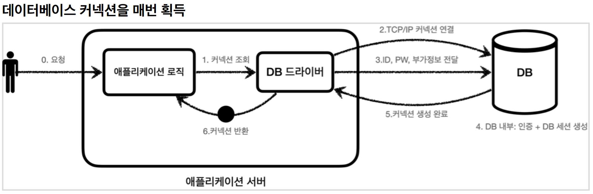
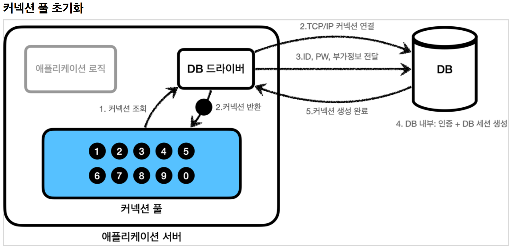
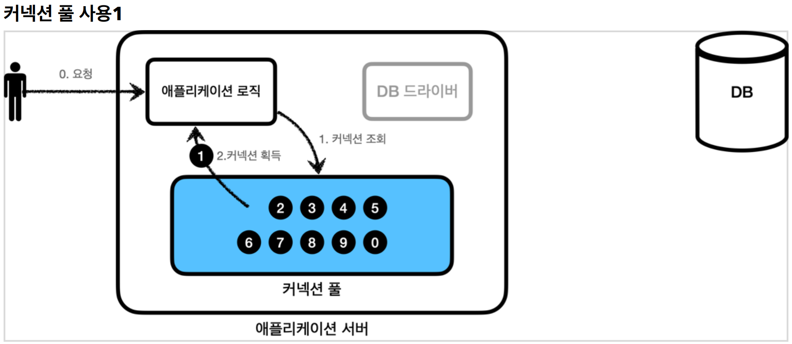
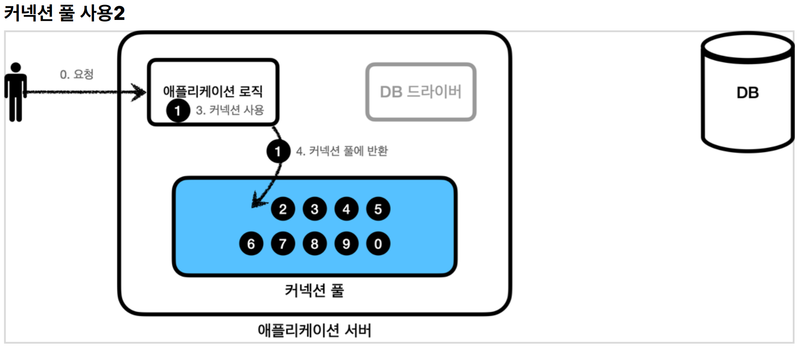
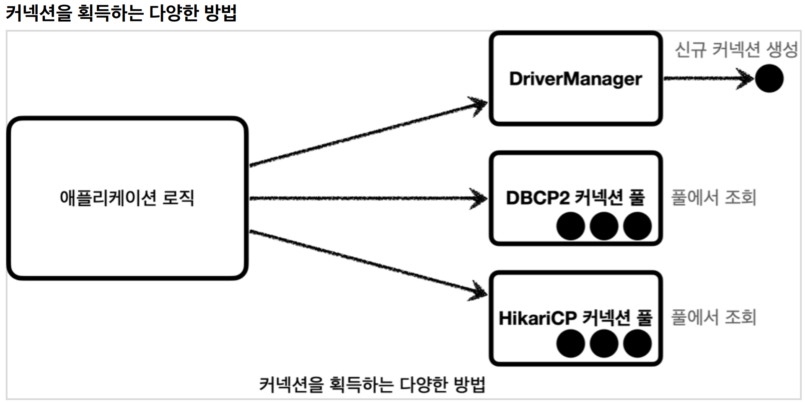
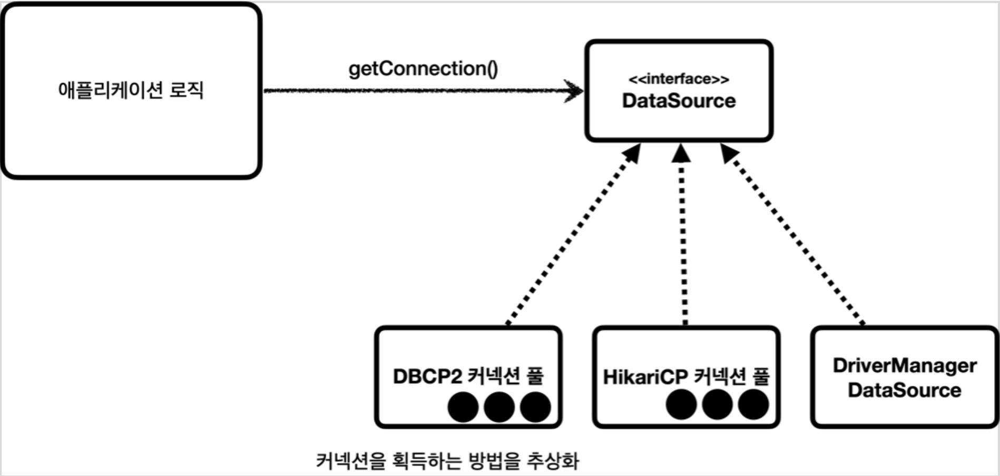

# 2. 커넥션풀과 데이터소스 이해

----

## 커넥션 풀 이해

#### 데이터베이스 커넥션을 획득할 때는 다음과 같은 복잡한 과정을 거친다.
1. 애플리케이션 로직은 DB 드라이버를 통해 커넥션을 조회한다.
2. DB 드라이버는 DB와 TCP/IP 커넥션을 연결한다. 물론 이 과정에서 3 way handshake 같은 TCP/IP
연결을 위한 네트워크 동작이 발생한다.
3. DB 드라이버는 TCP/IP 커넥션이 연결되면 ID, PW와 기타 부가정보를 DB에 전달한다.
4. DB는 ID, PW를 통해 내부 인증을 완료하고, 내부에 DB 세션을 생성한다.
5. DB는 커넥션 생성이 완료되었다는 응답을 보낸다.
6. DB 드라이버는 커넥션 객체를 생성해서 클라이언트에 반환한다.  
#### 이렇게 커넥션을 새로 만드는 것은 과정도 복잡하고 시간도 많이 많이 소모되는 일이다.
#### DB는 물론이고 애플리케이션 서버에서도 TCP/IP 커넥션을 새로 생성하기 위한 리소스를 매번 사용해야 한다.
#### 진짜 문제는 고객이 애플리케이션을 사용할 때, SQL을 실행하는 시간 뿐만 아니라 커넥션을 새로 만드는 시간이 추가되기 때문에 결과적으로 응답 속도에 영향을 준다. 이것은 사용자에게 좋지 않은 경험을 줄 수 있다.
 

## 커넥션 풀
#### 커넥션 풀은 커넥션을 미리 생성해두고 사용하는 방법이다. (쓰레드 풀과 비슷하다고 생각하면 됨)

* 애플리케이션을 시작하는 시점에 커넥션 풀은 필요한 만큼 커넥션을 미리 확보해서 풀에 보관한다. 보통 얼마나 보관할 지는 서비스의 특징과 서버 스펙에 따라 다르지만 기본값은 보통 10개이다.

#### 커넥션 풀의 연결 상태
* 커넥션 풀에 들어 있는 커넥션은 TCP/IP로 DB와 커넥션이 연결되어 있는 상태이기 때문에 언제든지 즉시 SQL을 DB에 전달할 수 있다.

* 애플리케이션 로직에서 이제는 DB 드라이버를 통해서 새로운 커넥션을 획득하는 것이 아니다.
* 이제는 커넥션 풀을 통해 이미 생성되어 있는 커넥션을 객체 참조로 그냥 가져다 쓰기만 하면 된다.
* 커넥션 풀에 커넥션을 요청하면 커넥션 풀은 자신이 가지고 있는 커넥션 중에 하나를 반환한다.

* 애플리케이션 로직은 커넥션 풀에서 받은 커넥션을 사용해서 SQL을 데이터베이스에 전달하고 그 결과를
받아서 처리한다.
* 커넥션을 모두 사용하고 나면 이제는 커넥션을 종료하는 것이 아니라, 다음에 다시 사용할 수 있도록 해당
커넥션을 그대로 커넥션 풀에 반환하면 된다. 여기서 주의할 점은 커넥션을 종료하는 것이 아니라 커넥션이
살아있는 상태로 커넥션 풀에 반환해야 한다는 것이다.
 

## DataSource 이해
#### 커넥션을 얻는 방법은 앞서 학습한 JDBC `DriverManager` 를 직접 사용하거나, 커넥션 풀을 사용하는 등 다양한 방법이 존재한다.

* 애플리케이션 로직에서 `DriverManager` 를 사용해서 커넥션을 획득하다가 `HikariCP` 같은
커넥션 풀을 사용하도록 변경하면 커넥션을 획득하는 애플리케이션 코드도 함께 변경해야 한다. 의존관계가
`DriverManager` 에서 `HikariCP` 로 변경되기 때문이다.

#### 커넥션을 획득하는 방법 추상화

* 자바에서는 이런 문제를 해결하기 위해 `javax.sql.DataSource` 라는 인터페이스를 제공한다.
* `DataSource` 는 **커넥션을 획득하는 방법을 추상화** 하는 인터페이스이다.
* 이 인터페이스의 핵심 기능은 커넥션 조회 하나이다. (다른 일부 기능도 있지만 크게 중요하지 않다.)

#### **정리**
* 대부분의 커넥션 풀은 `DataSource` 인터페이스를 이미 구현해두었다. 따라서 개발자는 `DBCP2 커넥션 풀` ,
`HikariCP 커넥션 풀` 의 코드를 직접 의존하는 것이 아니라 `DataSource` 인터페이스에만 의존하도록
애플리케이션 로직을 작성하면 된다. 
* 커넥션 풀 구현 기술을 변경하고 싶으면 해당 구현체로 갈아끼우기만 하면 된다.
* `DriverManager` 는 `DataSource` 인터페이스를 사용하지 않는다. 따라서 `DriverManager` 는 직접
사용해야 한다. 따라서 `DriverManager` 를 사용하다가 `DataSource` 기반의 커넥션 풀을 사용하도록
변경하면 관련 코드를 다 고쳐야 한다. 이런 문제를 해결하기 위해 **스프링은 `DriverManager` 도
`DataSource` 를 통해서 사용할 수 있도록 `DriverManagerDataSource` 라는 `DataSource` 를 구현한
클래스를 제공**한다.
* 자바는 `DataSource` 를 통해 커넥션을 획득하는 방법을 추상화했다. 이제 **애플리케이션 로직은
`DataSource` 인터페이스에만 의존**하면 된다. 덕분에 `DriverManagerDataSource` 를 통해서
`DriverManager` 를 사용하다가 커넥션 풀을 사용하도록 코드를 변경해도 애플리케이션 로직은 변경하지
않아도 된다.

#### **DriverManager**
#### **설정과 사용의 분리**
* **설정**: `DataSource` 를 만들고 필요한 속성들을 사용해서 `URL , USERNAME , PASSWORD` 같은 부분을
입력하는 것을 말한다. 이렇게 설정과 관련된 속성들은 한 곳에 있는 것이 향후 변경에 더 유연하게 대처할
수 있다.
* **사용**: 설정은 신경쓰지 않고, `DataSource` 의 `getConnection()` 만 호출해서 사용하면 된다.

#### **설정과 사용의 분리 설명**
* 이 부분이 작아보이지만 큰 차이를 만들어내는데, 필요한 데이터를 `DataSource` 가 만들어지는 시점에
미리 다 넣어두게 되면, `DataSource` 를 사용하는 곳에서는 `dataSource.getConnection()` 만 호출하면
되므로, `URL , USERNAME , PASSWORD` 같은 속성들에 의존하지 않아도 된다. 그냥 `DataSource` 만
주입받아서 `getConnection()` 만 호출하면 된다.
* 쉽게 이야기해서 리포지토리(Repository)는 `DataSource` 만 의존하고, 이런 속성을 몰라도 된다.
* 애플리케이션을 개발해보면 보통 설정은 한 곳에서 하지만, 사용은 수 많은 곳에서 하게 된다.
* 덕분에 객체를 설정하는 부분과, 사용하는 부분을 좀 더 명확하게 분리할 수 있다.
   
    
    
#### **커넥션 풀 - HikariCP 커넥션 풀**
#### **MyPool connection adder**
#### 별도의 쓰레드 사용해서 커넥션 풀에 커넥션을 채우고 있는 것을 확인할 수 있다. 이 쓰레드는 커넥션 풀에
#### 커넥션을 최대 풀 수( `10` )까지 채운다.
#### 그렇다면 왜 별도의 쓰레드를 사용해서 커넥션 풀에 커넥션을 채우는 것일까?
#### 커넥션 풀에 커넥션을 채우는 것은 상대적으로 오래 걸리는 일이다. 애플리케이션을 실행할 때 **커넥션 풀을 채울 때 까지 마냥 대기하고 있다면 애플리케이션 실행 시간이 늦어진다.** 따라서 이렇게 **별도의 쓰레드를 사용해서 커넥션 풀을 채워야 애플리케이션 실행 시간에 영향을 주지 않는다.**
 

#### **DI**
#### `DriverManagerDataSource` -> `HikariDataSource` 로 변경해도 `MemberRepositoryV1` 의 코드는 전혀 변경하지 않아도 된다. `MemberRepositoryV1` 는 `DataSource` 인터페이스에만 의존하기 때문이다. 
#### 이것이 `DataSource` 를 사용하는 장점이다.(DI + OCP)

----  

###### References: 김영한 - [스프링 DB 1편 - 데이터 접근 핵심 원리]
