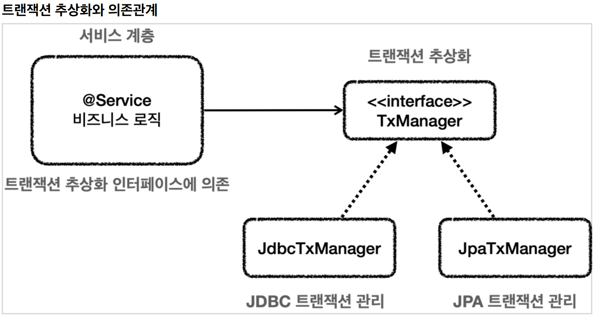
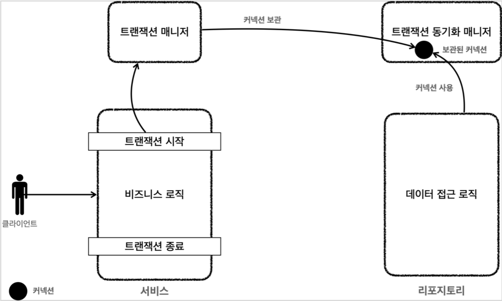
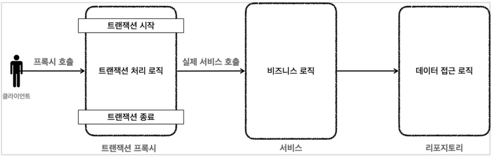
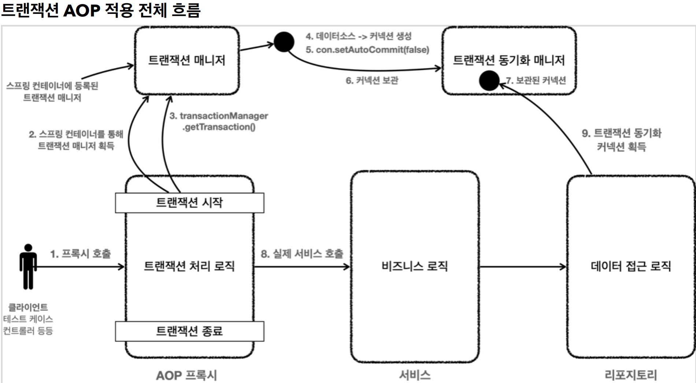

# 4. 스프링과 문제 해결 - 트랜잭션

----

## 애플리케이션 구조
#### 여러가지 애플리케이션 구조가 있지만, 가장 단순하면서 많이 사용하는 방법은 역할에 따라 3가지 계층으로 나누는 것이다.


* **프레젠테이션 계층**
  * UI와 관련된 처리 담당
  * 웹 요청과 응답
  * 사용자 요청을 검증
  * 주 사용 기술: 서블릿과 HTTP 같은 웹 기술, 스프링 MVC
* **서비스 계층**
  * 비즈니스 로직을 담당
  * 주 사용 기술: 가급적 특정 기술에 의존하지 않고, 순수 자바 코드로 작성
* **데이터 접근 계층**
  * 실제 데이터베이스에 접근하는 코드
  * 주 사용 기술: JDBC, JPA, File, Redis, Mongo ...
<br> 

#### **순수한 서비스 계층**
* 여기서 가장 중요한 곳은 어디일까? 바로 핵심 비즈니스 로직이 들어있는 서비스 계층이다. 시간이 흘러서
UI(웹)와 관련된 부분이 변하고, 데이터 저장 기술을 다른 기술로 변경해도, 비즈니스 로직은 최대한
변경없이 유지되어야 한다.
* 이렇게 하려면 서비스 계층을 특정 기술에 종속적이지 않게 개발해야 한다.
  * 이렇게 계층을 나눈 이유도 서비스 계층을 최대한 순수하게 유지하기 위한 목적이 크다. 기술에
종속적인 부분은 프레젠테이션 계층, 데이터 접근 계층에서 가지고 간다.
  * 프레젠테이션 계층은 클라이언트가 접근하는 UI와 관련된 기술인 웹, 서블릿, HTTP와 관련된 부분을
담당해준다. 그래서 서비스 계층을 이런 UI와 관련된 기술로부터 보호해준다. 예를 들어서 HTTP API
를 사용하다가 GRPC 같은 기술로 변경해도 프레젠테이션 계층의 코드만 변경하고, 서비스 계층은
변경하지 않아도 된다.
  * 데이터 접근 계층은 데이터를 저장하고 관리하는 기술을 담당해준다. 그래서 JDBC, JPA와 같은
구체적인 데이터 접근 기술로부터 서비스 계층을 보호해준다. 예를 들어서 JDBC를 사용하다가 JPA
로 변경해도 서비스 계층은 변경하지 않아도 된다. 물론 서비스 계층에서 데이터 접근 계층을 직접
접근하는 것이 아니라, 인터페이스를 제공하고 서비스 계층은 이 인터페이스에 의존하는 것이 좋다. 
그래야 서비스 코드의 변경 없이 JdbcRepository 를 JpaRepository 로 변경할 수 있다.
* 서비스 계층이 특정 기술에 종속되지 않기 때문에 비즈니스 로직을 유지보수 하기도 쉽고, 테스트 하기도
쉽다.
* 정리하자면 **서비스 계층은 가급적 비즈니스 로직만 구현하고 특정 구현 기술에 직접 의존해서는 안된다.** 
이렇게 하면 향후 구현 기술이 변경될 때 변경의 영향 범위를 최소화 할 수 있다.
<br>

## 문제점 3가지
* 트랜잭션 문제
* 예외 누수 문제
* JDBC 반복 문제

#### **트랜잭션 문제**
가장 큰 문제는 트랜잭션을 적용하면서 생긴 다음과 같은 문제들이다.  

* JDBC 구현 기술이 서비스 계층에 누수되는 문제
  * 트랜잭션을 적용하기 위해 JDBC 구현 기술이 서비스 계층에 누수되었다.
  * 서비스 계층은 순수해야 한다. -> 구현 기술을 변경해도 서비스 계층 코드는 최대한 유지할 수 있어야
한다. (변화에 대응)
    * 그래서 데이터 접근 계층에 JDBC 코드를 다 몰아두는 것이다.
    * 물론 데이터 접근 계층의 구현 기술이 변경될 수도 있으니 데이터 접근 계층은 인터페이스를
제공하는 것이 좋다.
  * 서비스 계층은 특정 기술에 종속되지 않아야 한다. 지금까지 그렇게 노력해서 데이터 접근 계층으로
JDBC 관련 코드를 모았는데, 트랜잭션을 적용하면서 결국 서비스 계층에 JDBC 구현 기술의 누수가
발생했다.
* 트랜잭션 동기화 문제
  * 같은 트랜잭션을 유지하기 위해 커넥션을 파라미터로 넘겨야 한다.
  * 이때 파생되는 문제들도 있다. 똑같은 기능도 트랜잭션용 기능과 트랜잭션을 유지하지 않아도 되는
기능으로 분리해야 한다.
* 트랜잭션 적용 반복 문제
  * 트랜잭션 적용 코드를 보면 반복이 많다. `try` , `catch` , `finally` ...

#### **예외 누수**
* 데이터 접근 계층의 JDBC 구현 기술 예외가 서비스 계층으로 전파된다.
* `SQLException` 은 체크 예외이기 때문에 데이터 접근 계층을 호출한 서비스 계층에서 해당 예외를 잡아서
처리하거나 명시적으로 `throws` 를 통해서 다시 밖으로 던져야한다.
* `SQLException` 은 JDBC 전용 기술이다. 향후 JPA나 다른 데이터 접근 기술을 사용하면, 그에 맞는 다른
예외로 변경해야 하고, 결국 서비스 코드도 수정해야 한다.


#### **JDBC 반복 문제**
* 지금까지 작성한 `MemberRepository` 코드는 순수한 JDBC를 사용했다.
* 이 코드들은 유사한 코드의 반복이 너무 많다. 
  * `try` , `catch` , `finally` ...
  * 커넥션을 열고, `PreparedStatement` 를 사용하고, 결과를 매핑하고... 실행하고, 커넥션과 리소스를
정리한다.

## 트랜잭션 추상화
#### 구현 기술에 따른 트랜잭션 사용법
* 트랜잭션은 원자적 단위의 비즈니스 로직을 처리하기 위해 사용한다.
* 구현 기술마다 트랜잭션을 사용하는 방법이 다르다.
  * JDBC : `con.setAutoCommit(false)`
  * JPA : `transaction.begin()`

#### **트랜잭션 추상화 인터페이스**
```java
public interface TxManager {
    begin();
    commit();
    rollback();
}
```
#### 트랜잭션은 사실 단순하다. 트랜잭션을 시작하고, 비즈니스 로직의 수행이 끝나면 커밋하거나 롤백하면 된다.
<br>

#### 그리고 다음과 같이 TxManager 인터페이스를 기반으로 각각의 기술에 맞는 구현체를 만들면 된다.
* `JdbcTxManager `: JDBC 트랜잭션 기능을 제공하는 구현체
* `JpaTxManager` : JPA 트랜잭션 기능을 제공하는 구현체



* 서비스는 특정 트랜잭션 기술에 직접 의존하는 것이 아니라, `TxManager` 라는 추상화된 인터페이스에
의존한다. 이제 원하는 구현체를 DI를 통해서 주입하면 된다. 예를 들어서 JDBC 트랜잭션 기능이 필요하면
`JdbcTxManager` 를 서비스에 주입하고, JPA 트랜잭션 기능으로 변경해야 하면 `JpaTxManager` 를
주입하면 된다.
* 클라이언트인 서비스는 인터페이스에 의존하고 DI를 사용한 덕분에 OCP 원칙을 지키게 되었다. 이제
트랜잭션을 사용하는 서비스 코드를 전혀 변경하지 않고, 트랜잭션 기술을 마음껏 변경할 수 있다.

#### 스프링의 트랜잭션 추상화
#### 스프링은 이미 이런 고민을 다 해두었다. 우리는 스프링이 제공하는 트랜잭션 추상화 기술을 사용하면 된다.  
#### 심지어 데이터 접근 기술에 따른 트랜잭션 구현체도 대부분 만들어두어서 가져다 사용하기만 하면 된다. 
#### 스프링 트랜잭션 추상화의 핵심은 `PlatformTransactionManager` 인터페이스이다.
<br>

## 트랜잭션 동기화
#### 스프링이 제공하는 트랜잭션 매니저는 크게 2가지 역할을 한다.
* 트랜잭션 추상화
* 리소스 동기화
> 트랜잭션을 유지하려면 트랜잭션의 시작부터 끝까지 같은 데이터베이스 커넥션을 유지해아한다. 결국 같은
커넥션을 동기화(맞추어 사용)하기 위해서 이전에는 파라미터로 커넥션을 전달하는 방법을 사용했다.
파라미터로 커넥션을 전달하는 방법은 코드가 지저분해지는 것은 물론이고, 커넥션을 넘기는 메서드와
넘기지 않는 메서드를 중복해서 만들어야 하는 등 여러가지 단점들이 많다.

#### **트랜잭션 매니저와 트랜잭션 동기화 매니저**



* 스프링은 **트랜잭션 동기화 매니저**를 제공한다. 이것은 쓰레드 로컬( `ThreadLocal` )을 사용해서 커넥션을
동기화해준다. 트랜잭션 매니저는 내부에서 이 트랜잭션 동기화 매니저를 사용한다.
* 트랜잭션 동기화 매니저는 쓰레드 로컬을 사용하기 때문에 멀티쓰레드 상황에 안전하게 커넥션을 동기화 할
수 있다. 따라서 커넥션이 필요하면 트랜잭션 동기화 매니저를 통해 커넥션을 획득하면 된다. 따라서
이전처럼 파라미터로 커넥션을 전달하지 않아도 된다.

#### 동작 방식
1. 트랜잭션을 시작하려면 커넥션이 필요하다. 트랜잭션 매니저는 데이터소스를 통해 커넥션을 만들고
트랜잭션을 시작한다.
2. 트랜잭션 매니저는 트랜잭션이 시작된 커넥션을 트랜잭션 동기화 매니저에 보관한다.
3. 리포지토리는 트랜잭션 동기화 매니저에 보관된 커넥션을 꺼내서 사용한다. 따라서 파라미터로 커넥션을
전달하지 않아도 된다.
4. 트랜잭션이 종료되면 트랜잭션 매니저는 트랜잭션 동기화 매니저에 보관된 커넥션을 통해 트랜잭션을
종료하고, 커넥션도 닫는다.

#### **DataSourceUtils.getConnection()**
* `getConnection()` 에서 `DataSourceUtils.getConnection()` 를 사용하도록 변경된 부분을 특히
주의해야 한다.
* `DataSourceUtils.getConnection()` 는 다음과 같이 동작한다.
  * **트랜잭션 동기화 매니저가 관리하는 커넥션이 있으면 해당 커넥션을 반환한다.**
  * 트랜잭션 동기화 매니저가 관리하는 커넥션이 없는 경우 새로운 커넥션을 생성해서 반환한다.
<br>

#### **DataSourceUtils.releaseConnection()**
* `close()` 에서 `DataSourceUtils.releaseConnection()` 를 사용하도록 변경된 부분을 특히 주의해야
한다. 커넥션을 `con.close()` 를 사용해서 직접 닫아버리면 커넥션이 유지되지 않는 문제가 발생한다. 이
커넥션은 이후 로직은 물론이고, 트랜잭션을 종료(커밋, 롤백)할 때 까지 살아있어야 한다.
* `DataSourceUtils.releaseConnection()` 을 사용하면 커넥션을 바로 닫는 것이 아니다. 
  * **트랜잭션을 사용하기 위해 동기화된 커넥션은 커넥션을 닫지 않고 그대로 유지해준다.**
  * 트랜잭션 동기화 매니저가 관리하는 커넥션이 없는 경우 해당 커넥션을 닫는다.
<br>

## 트랜잭션 문제 해결 - 트랜잭션 템플릿

#### **트랜잭션 템플릿**
#### 템플릿 콜백 패턴을 적용하려면 템플릿을 제공하는 클래스를 작성해야 하는데, 스프링은
`TransactionTemplate` 라는 템플릿 클래스를 제공한다.

* 트랜잭션 템플릿 덕분에 트랜잭션을 시작하고, 커밋하거나 롤백하는 코드가 모두 제거되었다.
* 트랜잭션 템플릿의 기본 동작은 다음과 같다.
  * 비즈니스 로직이 정상 수행되면 커밋한다.
  * 언체크 예외가 발생하면 롤백한다. 그 외의 경우 커밋한다.
* 코드에서 예외를 처리하기 위해 `try~catch` 가 들어갔는데, `bizLogic()` 메서드를 호출하면
`SQLException` 체크 예외를 넘겨준다. 해당 람다에서 체크 예외를 밖으로 던질 수 없기 때문에 언체크
예외로 바꾸어 던지도록 예외를 전환했다.

#### 정리
* 트랜잭션 템플릿 덕분에, 트랜잭션을 사용할 때 반복하는 코드를 제거할 수 있었다.
* 하지만 이곳은 서비스 로직인데 비즈니스 로직 뿐만 아니라 트랜잭션을 처리하는 기술 로직이 함께
포함되어 있다.
* 애플리케이션을 구성하는 로직을 핵심 기능과 부가 기능으로 구분하자면 서비스 입장에서 비즈니스 로직은
핵심 기능이고, 트랜잭션은 부가 기능이다.
* 이렇게 비즈니스 로직과 트랜잭션을 처리하는 기술 로직이 한 곳에 있으면 두 관심사를 하나의 클래스에서
처리하게 된다. 결과적으로 코드를 유지보수하기 어려워진다.
* 서비스 로직은 가급적 핵심 비즈니스 로직만 있어야 한다. 하지만 트랜잭션 기술을 사용하려면 어쩔 수 없이
트랜잭션 코드가 나와야 한다. 어떻게 하면 이 문제를 해결할 수 있을까?
<br>

## 트랜잭션 문제 해결 - 트랜잭션 AOP 이해



#### **스프링이 제공하는 트랜잭션 AOP**
* 스프링이 제공하는 AOP 기능을 사용하면 프록시를 매우 편리하게 적용할 수 있다. 
* 물론 스프링 AOP를 직접 사용해서 트랜잭션을 처리해도 되지만, 트랜잭션은 매우 중요한 기능이고, 전세계
누구나 다 사용하는 기능이다. 스프링은 트랜잭션 AOP를 처리하기 위한 모든 기능을 제공한다. 스프링
부트를 사용하면 트랜잭션 AOP를 처리하기 위해 필요한 스프링 빈들도 자동으로 등록해준다.
* 개발자는 트랜잭션 처리가 필요한 곳에 `@Transactional` 애노테이션만 붙여주면 된다. 스프링의
트랜잭션 AOP는 이 애노테이션을 인식해서 트랜잭션 프록시를 적용해준다.

```java
/**
 * 트랜잭션 - @Transactional AOP
 */
@Slf4j
@RequiredArgsConstructor
public class MemberServiceV3_3 {
    
    private final MemberRepositoryV3 memberRepository;
    
    @Transactional
    public void accountTransfer(String fromId, String toId, int money) throws SQLException {
        bizLogic(fromId, toId, money);
    }
    
    private void bizLogic(String fromId, String toId, int money) throws SQLException {
        Member fromMember = memberRepository.findById(fromId);
        Member toMember = memberRepository.findById(toId);
        memberRepository.update(fromId, fromMember.getMoney() - money);
        validation(toMember);
        memberRepository.update(toId, toMember.getMoney() + money);
    }
    
    private void validation(Member toMember) {
        if (toMember.getMemberId().equals("ex")) {
            throw new IllegalStateException("이체중 예외 발생");
        }
    }
}
```

* 순수한 비즈니스 로직만 남기고, 트랜잭션 관련 코드는 모두 제거했다.
* 스프링이 제공하는 트랜잭션 AOP를 적용하기 위해 `@Transactional` 애노테이션을 추가했다.
* `@Transactional` 애노테이션은 메서드에 붙여도 되고, 클래스에 붙여도 된다. 클래스에 붙이면 외부에서
호출 가능한 public 메서드가 AOP 적용 대상이 된다.

* `@SpringBootTest` : 스프링 AOP를 적용하려면 스프링 컨테이너가 필요하다. 이 애노테이션이 있으면
테스트시 스프링 부트를 통해 스프링 컨테이너를 생성한다. 그리고 테스트에서 `@Autowired` 등을 통해
스프링 컨테이너가 관리하는 빈들을 사용할 수 있다.
* `@TestConfiguration` : 테스트 안에서 내부 설정 클래스를 만들어서 사용하면서 이 에노테이션을 붙이면, 
스프링 부트가 자동으로 만들어주는 빈들에 추가로 필요한 스프링 빈들을 등록하고 테스트를 수행할 수
있다.
* `TestConfig`
  * `DataSource` 스프링에서 기본으로 사용할 데이터소스를 스프링 빈으로 등록한다. 추가로 트랜잭션
매니저에서도 사용한다.
  * `DataSourceTransactionManager` 트랜잭션 매니저를 스프링 빈으로 등록한다.
    * 스프링이 제공하는 트랜잭션 AOP는 스프링 빈에 등록된 트랜잭션 매니저를 찾아서 사용하기
때문에 트랜잭션 매니저를 스프링 빈으로 등록해두어야 한다

## 트랜잭션 문제 해결 - 트랜잭션 AOP 정리




## 스프링 부트의 자동 리소스 등록

#### **데이터소스 - 자동 등록**
* 스프링 부트는 데이터소스( `DataSource` )를 스프링 빈에 자동으로 등록한다.
* 자동으로 등록되는 스프링 빈 이름: `dataSource`
* 참고로 개발자가 직접 데이터소스를 빈으로 등록하면 스프링 부트는 데이터소스를 자동으로 등록하지
않는다

#### 이때 스프링 부트는 다음과 같이 `application.properties` 에 있는 속성을 사용해서 `DataSource` 를 생성한다. 그리고 스프링 빈에 등록한다.

`application.properties`  
```java
spring.datasource.url=jdbc:h2:tcp://localhost/~/test
spring.datasource.username=sa
spring.datasource.password=
```
* 스프링 부트가 기본으로 생성하는 데이터소스는 커넥션풀을 제공하는 `HikariDataSource` 이다. 
커넥션풀과 관련된 설정도 `application.properties` 를 통해서 지정할 수 있다.
* `spring.datasource.url` 속성이 없으면 내장 데이터베이스(메모리 DB)를 생성하려고 시도한다.

#### **트랜잭션 매니저 - 자동 등록**
* 스프링 부트는 적절한 트랜잭션 매니저( `PlatformTransactionManager` )를 자동으로 스프링 빈에
등록한다.
* 자동으로 등록되는 스프링 빈 이름: `transactionManager`
* 참고로 개발자가 직접 트랜잭션 매니저를 빈으로 등록하면 스프링 부트는 트랜잭션 매니저를 자동으로
등록하지 않는다.  
#### 어떤 트랜잭션 매니저를 선택할지는 현재 등록된 라이브러리를 보고 판단하는데, JDBC를 기술을 사용하면 `DataSourceTransactionManager` 를 빈으로 등록하고, JPA를 사용하면 `JpaTransactionManager` 를 빈으로 등록한다. 둘다 사용하는 경우 `JpaTransactionManager` 를 등록한다. 참고로 `JpaTransactionManager` 는 `DataSourceTransactionManager` 가 제공 는 기능도 대부분 지원한다.


----  

###### References: 김영한 - [스프링 DB 1편 - 데이터 접근 핵심 원리]
