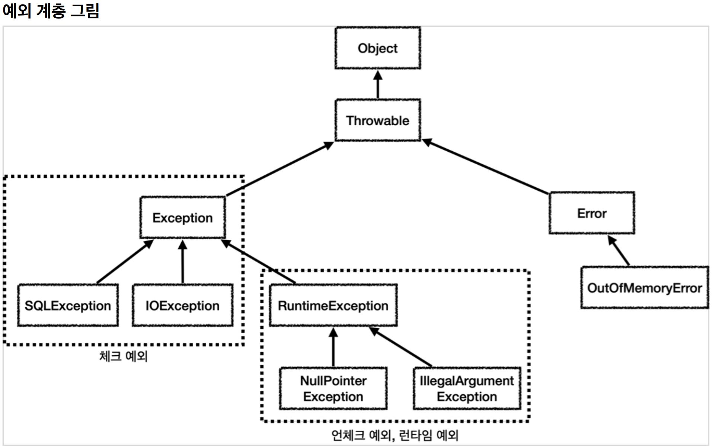
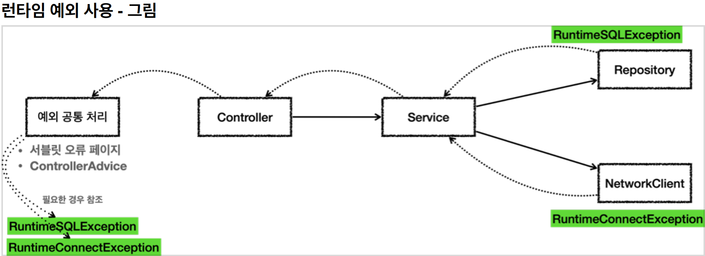

# 5. 자바 예외 이해

----

## 예외 계층



* `Object` : 예외도 객체이다. 모든 객체의 최상위 부모는 `Object` 이므로 예외의 최상위 부모도 Obje`ct
이다.
* `Throwable` : 최상위 예외이다. 하위에 `Exception` 과 `Error` 가 있다.
* `Error` : 메모리 부족이나 심각한 시스템 오류와 같이 애플리케이션에서 복구 불가능한 시스템 예외이다. 
애플리케이션 개발자는 이 예외를 잡으려고 해서는 안된다.
  * 상위 예외를 `catch` 로 잡으면 그 하위 예외까지 함께 잡는다. 따라서 애플리케이션 로직에서는
`Throwable` 예외도 잡으면 안되는데, 앞서 이야기한 `Error` 예외도 함께 잡을 수 있기 때문이다. 
애플리케이션 로직은 이런 이유로 `Exception` 부터 필요한 예외로 생각하고 잡으면 된다.
  * 참고로 `Error` 도 언체크 예외이다.
* `Exception` : 체크 예외
  * 애플리케이션 로직에서 사용할 수 있는 실질적인 최상위 예외이다.
  * `Exception` 과 그 하위 예외는 모두 컴파일러가 체크하는 체크 예외이다. 단 `RuntimeException` 은
예외로 한다.
* `RuntimeException` : 언체크 예외, 런타임 예외
  * 컴파일러가 체크 하지 않는 언체크 예외이다.
  * `RuntimeException` 과 그 자식 예외는 모두 언체크 예외이다.
  * `RuntimeException` 의 이름을 따라서 `RuntimeException` 과 그 하위 언체크 예외를 **런타임
예외**라고 많이 부른다. 여기서도 앞으로는 런타임 예외로 종종 부르겠다.

#### **예외에 대해서는 2가지 기본 규칙을 기억하자.**
1. 예외는 잡아서 처리하거나 던져야 한다.
2. 예외를 잡거나 던질 때 지정한 예외뿐만 아니라 그 예외의 자식들도 함께 처리된다.
예를 들어서 `Exception` 을 `catch` 로 잡으면 그 하위 예외들도 모두 잡을 수 있다.
예를 들어서 `Exception` 을 `throws` 로 던지면 그 하위 예외들도 모두 던질 수 있다.


> **참고: 예외를 처리하지 못하고 계속 던지면 어떻게 될까?**  
>* 자바 main() 쓰레드의 경우 예외 로그를 출력하면서 시스템이 종료된다.
>* 웹 애플리케이션의 경우 여러 사용자의 요청을 처리하기 때문에 하나의 예외 때문에 시스템이 종료되면
안된다. WAS가 해당 예외를 받아서 처리하는데, 주로 사용자에게 개발자가 지정한, 오류 페이지를
보여준다.

#### **체크 예외의 장단점**
#### 체크 예외는 예외를 잡아서 처리할 수 없을 때, 예외를 밖으로 던지는 `throws 예외` 를 필수로 선언해야 한다. 그렇지 않으면 컴파일 오류가 발생한다. 이것 때문에 장점과 단점이 동시에 존재한다.
* 장점: 개발자가 실수로 예외를 누락하지 않도록 컴파일러를 통해 문제를 잡아주는 훌륭한 안전 장치이다.
* 단점: 하지만 실제로는 개발자가 모든 체크 예외를 반드시 잡거나 던지도록 처리해야 하기 때문에, 너무
번거로운 일이 된다. 크게 신경쓰고 싶지 않은 예외까지 모두 챙겨야 한다. 추가로 의존관계에 따른 단점도
있다.

## **언체크 예외 기본 이해**
* `RuntimeException `과 그 하위 예외는 언체크 예외로 분류된다.
* 언체크 예외는 말 그대로 컴파일러가 예외를 체크하지 않는다는 뜻이다.
* 언체크 예외는 체크 예외와 기본적으로 동일하다. 차이가 있다면 예외를 던지는 throws 를 선언하지 않고, 
생략할 수 있다. 이 경우 자동으로 예외를 던진다.

#### **체크 예외 VS 언체크 예외**
* 체크 예외: 예외를 잡아서 처리하지 않으면 항상 throws 에 던지는 예외를 선언해야 한다.
* 언체크 예외: 예외를 잡아서 처리하지 않아도 throws 를 생략할 수 있다.

#### **언체크 예외의 장단점**
#### 언체크 예외는 예외를 잡아서 처리할 수 없을 때, 예외를 밖으로 던지는 throws 예외 를 생략할 수 있다. 
#### 이것 때문에 장점과 단점이 동시에 존재한다.
* 장점: 신경쓰고 싶지 않은 언체크 예외를 무시할 수 있다. 체크 예외의 경우 처리할 수 없는 예외를 밖으로
던지려면 항상 throws 예외 를 선언해야 하지만, 언체크 예외는 이 부분을 생략할 수 있다. 이후에
설명하겠지만, 신경쓰고 싶지 않은 예외의 의존관계를 참조하지 않아도 되는 장점이 있다.
* 단점: 언체크 예외는 개발자가 실수로 예외를 누락할 수 있다. 반면에 체크 예외는 컴파일러를 통해 예외
누락을 잡아준다.

> 체크 예외와 언체크 예외의 차이는 사실 예외를 처리할 수 없을 때 예외를 밖으로 던지는 부분에 있다. 이 부분을 필수로 선언해야 하는가 생략할 수 있는가의 차이다.

#### **체크 예외 활용**
그렇다면 언제 체크 예외를 사용하고 언제 언체크(런타임) 예외를 사용하면 좋을까?
#### **기본 원칙은 다음 2가지를 기억하자.**
* 기본적으로 언체크(런타임) 예외를 사용하자.
* 체크 예외는 비즈니스 로직상 의도적으로 던지는 예외에만 사용하자.
  * 이 경우 해당 예외를 잡아서 반드시 처리해야 하는 문제일 때만 체크 예외를 사용해야 한다. 예를
들어서 다음과 같은 경우가 있다. 
  * 체크 예외 예)
    * 계좌 이체 실패 예외
    * 결제시 포인트 부족 예외
    * 로그인 ID, PW 불일치 예외
* 물론 이 경우에도 100% 체크 예외로 만들어야 하는 것은 아니다. 다만 계좌 이체 실패처럼 매우
심각한 문제는 개발자가 실수로 예외를 놓치면 안된다고 판단할 수 있다. 이 경우 체크 예외로 만들어
두면 컴파일러를 통해 놓친 예외를 인지할 수 있다.

#### **체크 예외의 문제점**
#### 체크 예외는 컴파일러가 예외 누락을 체크해주기 때문에 개발자가 실수로 예외를 놓치는 것을 막아준다.  그래서 항상 명시적으로 예외를 잡아서 처리하거나, 처리할 수 없을 때는 예외를 던지도록 `method() throws 예외` 로 선언해야 한다.
#### 지금까지 이야기를 들어보면 체크 예외가 런타임 예외보다 더 안전하고 좋아보이는데, 왜 체크 예외를 기본으로 사용하는 것이 문제가 될까?


* 리포지토리는 DB에 접근해서 데이터를 저장하고 관리한다. 여기서는 `SQLException` 체크 예외를 던진다.
* `NetworkClient` 는 외부 네트워크에 접속해서 어떤 기능을 처리하는 객체이다. 여기서는
`ConnectException` 체크 예외를 던진다.
* 서비스는 리포지토리와 `NetworkClient` 를 둘다 호출한다.
  * 따라서 두 곳에서 올라오는 체크 예외인 `SQLException` 과 `ConnectException` 을 처리해야 한다.
  * 그런데 서비스는 이 둘을 처리할 방법을 모른다. `ConnectException` 처럼 연결이 실패하거나,
`SQLException` 처럼 데이터베이스에서 발생하는 문제처럼 심각한 문제들은 대부분 애플리케이션
로직에서 처리할 방법이 없다.
* 서비스는 `SQLException` 과 `ConnectException` 를 처리할 수 없으므로 둘다 밖으로 던진다.
  * 체크 예외이기 때문에 던질 경우 다음과 같이 선언해야 한다.
  * `method() throws SQLException, ConnectException`
* 컨트롤러도 두 예외를 처리할 방법이 없다.
  * 다음을 선언해서 예외를 밖으로 던진다.
  * `method() throws SQLException, ConnectException`
* 웹 애플리케이션이라면 서블릿의 오류 페이지나, 또는 스프링 MVC가 제공하는 `ControllerAdvice` 에서
이런 예외를 공통으로 처리한다.
  * 이런 문제들은 보통 사용자에게 어떤 문제가 발생했는지 자세히 설명하기가 어렵다. 그래서
사용자에게는 "서비스에 문제가 있습니다." 라는 일반적인 메시지를 보여준다. ("데이터베이스에 어떤
오류가 발생했어요" 라고 알려주어도 일반 사용자가 이해할 수 없다. 그리고 보안에도 문제가 될 수
있다.)
  * API라면 보통 HTTP 상태코드 500(내부 서버 오류)을 사용해서 응답을 내려준다.
  * 이렇게 해결이 불가능한 공통 예외는 별도의 오류 로그를 남기고, 개발자가 오류를 빨리 인지할 수
있도록 메일, 알림(문자, 슬랙)등을 통해서 전달 받아야 한다. 예를 들어서 `SQLException` 이 잘못된
SQL을 작성해서 발생했다면, 개발자가 해당 SQL을 수정해서 배포하기 전까지 사용자는 같은 문제를
겪게 된다.

#### 2가지 문제
1. 복구 불가능한 예외
2. 의존 관계에 대한 문제

#### **1. 복구 불가능한 예외**
#### 대부분의 예외는 복구가 불가능하다. 일부 복구가 가능한 예외도 있지만 아주 적다.
#### `SQLException` 을 예를 들면 데이터베이스에 무언가 문제가 있어서 발생하는 예외이다. SQL 문법에 문제가 있을 수도 있고, 데이터베이스 자체에 뭔가 문제가 발생했을 수도 있다. 데이터베이스 서버가 중간에 다운 되었을 수도 있다. 이런 문제들은 대부분 복구가 불가능하다. 특히나 대부분의 서비스나 컨트롤러는 이런 문제를 해결할 수는 없다. 따라서 이런 문제들은 일관성 있게 공통으로 처리해야 한다. 오류 로그를 남기고 개발자가 해당 오류를 빠르게 인지하는 것이 필요하다. 서블릿 필터, 스프링 인터셉터, 스프링의 `ControllerAdvice` 를 사용하면 이런 부분을 깔끔하게 공통으로 해결할 수 있다.

#### 2. 의존 관계에 대한 문제
#### 체크 예외의 또 다른 심각한 문제는 예외에 대한 의존 관계 문제이다.
#### 앞서 대부분의 예외는 복구 불가능한 예외라고 했다. 그런데 체크 예외이기 때문에 컨트롤러나 서비스 입장에서는 본인이 처리할 수 없어도 어쩔 수 없이 `throws` 를 통해 던지는 예외를 선언해야 한다.

#### `throws SQLException, ConnectException` 처럼 예외를 던지는 부분을 코드에 선언하는 것이 왜 문제가 될까?  
#### 바로 서비스, 컨트롤러에서 `java.sql.SQLException` 을 의존하기 때문에 문제가 된다.  
<br>

#### 향후 리포지토리를 JDBC 기술이 아닌 다른 기술로 변경한다면, 그래서 SQLException 이 아니라 예를 들어서 `JPAException` 으로 예외가 변경된다면 어떻게 될까? `SQLException` 에 의존하던 모든 서비스, 컨트롤러의 코드를 `JPAException` 에 의존하도록 고쳐야 한다.
<br>

#### 서비스나 컨트롤러 입장에서는 어차피 본인이 처리할 수 도 없는 예외를 의존해야 하는 큰 단점이 발생하게 된다.
#### 결과적으로 OCP, DI를 통해 클라이언트 코드의 변경 없이 대상 구현체를 변경할 수 있다는 장점이 체크 예외 때문에 발목을 잡게 된다.
<br>

## 언체크 예외 활용



* `SQLException` 을 런타임 예외인 `RuntimeSQLException` 으로 변환했다.
* `ConnectException` 대신에 `RuntimeConnectException` 을 사용하도록 바꾸었다.
* 런타임 예외이기 때문에 서비스, 컨트롤러는 해당 예외들을 처리할 수 없다면 별도의 선언 없이 그냥 두면
된다.

#### **런타임 예외 - 대부분 복구 불가능한 예외**
#### 시스템에서 발생한 예외는 대부분 복구 불가능 예외이다. 런타임 예외를 사용하면 서비스나 컨트롤러가 이런 복구 불가능한 예외를 신경쓰지 않아도 된다. 물론 이렇게 복구 불가능한 예외는 일관성 있게 공통으로 처리해야 한다.  
<br>

#### **런타임 예외 - 의존 관계에 대한 문제**
#### 런타임 예외는 해당 객체가 처리할 수 없는 예외는 무시하면 된다. 따라서 체크 예외 처럼 예외를 강제로 의존하지 않아도 된다.
<br>

## 런타임 예외는 문서화
* 런타임 예외는 놓칠 수 있기 때문에 문서화가 중요하다.
* 또는 코드에 `throws 런타임예외` 을 남겨서 중요한 예외를 인지할 수 있게 해준다.

#### 스프링 JdbcTemplate
```java
/**
 * Issue a single SQL execute, typically a DDL statement.
 * @param sql static SQL to execute
 * @throws DataAccessException if there is any problem
 */
void execute(String sql) throws DataAccessException;
```
* 예) `method() throws DataAccessException` 와 같이 문서화 + 코드에도 명시
  * 런타임 예외도 `throws` 에 선언할 수 있다. 물론 생략해도 된다.
  * 던지는 예외가 명확하고 중요하다면, 코드에 어떤 예외를 던지는지 명시되어 있기 때문에 개발자가
IDE를 통해서 예외를 확인하가 편리하다.
  * 물론 컨트롤러나 서비스에서 `DataAccessException` 을 사용하지 않는다면 런타임 예외이기 때문에
무시해도 된다.

## 예외 포함과 스택 트레이스
#### 예외를 전환할 때는 꼭! 기존 예외를 포함해야 한다. 그렇지 않으면 스택 트레이스를 확인할 때 심각한 문제가 발생한다.
```java
public void call() {
    try {
        runSQL();
    } catch (SQLException e) {
        throw new RuntimeSQLException(e); //기존 예외(e) 포함
    }
}
```
* 로그를 출력할 때 마지막 파라미터에 예외를 넣어주면 로그에 스택 트레이스를 출력할 수 있다.
  * 예) `throw new RuntimeSQLException(e)` , 여기에서 마지막에 `e` 를 전달하는 것을 확인할
수 있다. 이렇게 하면 스택 트레이스에 로그를 출력할 수 있다.

> **예외를 전환할 때는 꼭! 기존 예외를 포함하자**

----  

###### References: 김영한 - [스프링 DB 1편 - 데이터 접근 핵심 원리]
