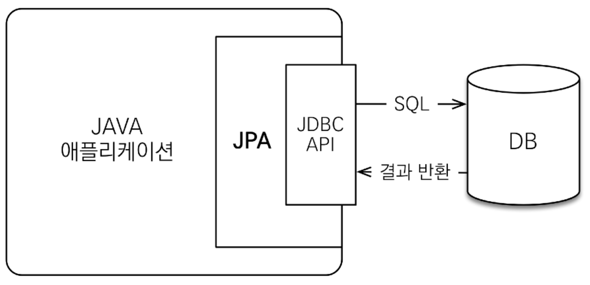
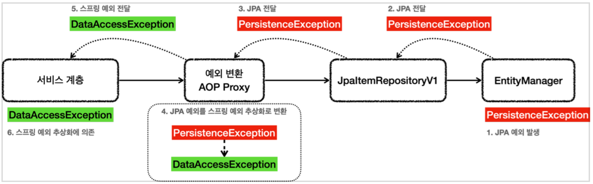

# 5. 데이터 접근 기술 - JPA

----

## JPA 시작
#### 스프링과 JPA는 자바 엔터프라이즈(기업) 시장의 주력 기술이다.
#### 스프링이 DI 컨테이너를 포함한 애플리케이션 전반의 다양한 기능을 제공한다면, JPA는 ORM 데이터 접근 기술을 제공한다.

#### JPA는 스프링 만큼이나 방대하고, 학습해야할 분량도 많다. 하지만 한번 배워두면 데이터 접근 기술에서 매우 큰 생산성 향상을 얻을 수 있다. 대표적으로 JdbcTemplate이나 MyBatis 같은 SQL 매퍼 기술은 SQL을 개발자가 직접 작성해야 하지만, JPA를 사용하면 SQL도 JPA가 대신 작성하고 처리해준다.
#### 실무에서는 JPA를 더욱 편리하게 사용하기 위해 스프링 데이터 JPA와 Querydsl이라는 기술을 함께 사용한다.
#### 중요한 것은 JPA이다. 스프링 데이터 JPA, Querydsl은 JPA를 편리하게 사용하도록 도와주는 도구라 생각하면 된다.
<br>

## JPA와 모던 자바 데이터 저장 기술

#### SQL 중심적인 개발의 문제점
* 무한 반복, 지루한 코드
* SQL에 의존적인 개발을 피하기 어렵다.
* 계층형 아키텍처
  * 진정한 의미의 계층 분할이 어렵다.
* 객체답게 모델링 할수록 매핑 작업만 늘어난다.

## JPA 
* Java Persistence API
- 자바 진영의 ORM 기술 표준

## ORM
- Object-relational mapping(객체 관계 매핑)
- 객체는 객체대로 설계
- 관계형 데이터베이스는 관계형 데이터베이스대로 설계
- ORM 프레임워크가 중간에서 매핑
- 대중적인 언어에는 대부분 ORM 기술이 존재

#### JPA는 애플리케이션과 JDBC 사이에서 동작


#### JPA를 왜 사용해야 하는가?
- SQL 중심적인 개발에서 객체 중심으로 개발
- 생산성
- 유지보수
- 패러다임의 불일치 해결
- 성능
- 데이터 접근 추상화와 벤더 독립성
- 표준

#### 생산성 - JPA와 CRUD
- 저장: **jpa.persist**(member)
- 조회: Member member = **jpa.find**(memberId)
- 수정: **member.setName**(“변경할 이름”)
- 삭제: **jpa.remove**(member)

#### JPA의 성능 최적화 기능
1. 1차 캐시와 동일성(identity) 보장
2. 트랜잭션을 지원하는 쓰기 지연(transactional write-behind)
3. 지연 로딩(Lazy Loading)

####  1차 캐시와 동일성 보장
1. 같은 트랜잭션 안에서는 같은 엔티티를 반환 - 약간의 조회 성능 향상
2. DB Isolation Level이 Read Commit이어도 애플리케이션에서 Repeatable Read 보장
```java
String memberId = "100";
Member m1 = jpa.find(Member.class, memberId); //SQL
Member m2 = jpa.find(Member.class, memberId); //캐시
println(m1 == m2) //true
```
* SQL 1번만 실행

#### 트랜잭션을 지원하는 쓰기 지연 - INSERT
1. 트랜잭션을 커밋할 때까지 INSERT SQL을 모음
2. JDBC BATCH SQL 기능을 사용해서 한번에 SQL 전송
```java
transaction.begin(); // [트랜잭션] 시작

em.persist(memberA);
em.persist(memberB);
em.persist(memberC);
//여기까지 INSERT SQL을 데이터베이스에 보내지 않는다.

//커밋하는 순간 데이터베이스에 INSERT SQL을 모아서 보낸다.
transaction.commit(); // [트랜잭션] 커밋
```
#### 지연 로딩과 즉시 로딩
- 지연 로딩: 객체가 실제 사용될 때 로딩
- 즉시 로딩: JOIN SQL로 한번에 연관된 객체까지 미리 조회

#### **ORM은 객체와 RDB 두 기둥위에 있는 기둥**

## JPA 적용 - 개발
#### JPA에서 가장 중요한 부분은 객체와 테이블을 매핑하는 것이다. JPA가 제공하는 애노테이션을 사용해서 Item 객체와 테이블을 매핑해보자.

```java
@Data
@Entity
public class Item {
    @Id @GeneratedValue(strategy = GenerationType.IDENTITY)
    private Long id;
    
    @Column(name = "item_name", length = 10)
    private String itemName;
    private Integer price;
    private Integer quantity;
    
    public Item() {
    }
    
    public Item(String itemName, Integer price, Integer quantity) {
        this.itemName = itemName;
        this.price = price;
        this.quantity = quantity;
    }
}
```

* `@Entity` : JPA가 사용하는 객체라는 뜻이다. 이 에노테이션이 있어야 JPA가 인식할 수 있다. 이렇게
`@Entity` 가 붙은 객체를 JPA에서는 엔티티라 한다.
* `@Id` : 테이블의 PK와 해당 필드를 매핑한다.
* `@GeneratedValue(strategy = GenerationType.IDENTITY)` : PK 생성 값을 데이터베이스에서
생성하는 `IDENTITY` 방식을 사용한다. 예) MySQL auto increment
* `@Column` : 객체의 필드를 테이블의 컬럼과 매핑한다.
  * `name = "item_name"` : 객체는 `itemName` 이지만 테이블의 컬럼은 `item_name` 이므로 이렇게
매핑했다.
  * `length = 10` : JPA의 매핑 정보로 DDL( `create table` )도 생성할 수 있는데, 그때 컬럼의 길이
값으로 활용된다. ( `varchar 10` ) 
  * `@Column` 을 생략할 경우 필드의 이름을 테이블 컬럼 이름으로 사용한다. 참고로 지금처럼 스프링
부트와 통합해서 사용하면 필드 이름을 테이블 컬럼 명으로 변경할 때 객체 필드의 카멜 케이스를
테이블 컬럼의 언더스코어로 자동으로 변환해준다.
  * `itemName` -> `item_name` , 따라서 위 예제의 `@Column(name = "item_name")` 를 생략해도
된다.
* JPA는 `public` 또는 `protected` 의 기본 생성자가 필수이다. 기본 생성자를 꼭 넣어주자.

#### `JpaItemRepositoryV1`
* `private final EntityManager em` : 생성자를 보면 스프링을 통해 엔티티 매니저( `EntityManager` )
라는 것을 주입받은 것을 확인할 수 있다. JPA의 모든 동작은 엔티티 매니저를 통해서 이루어진다. 엔티티
매니저는 내부에 데이터소스를 가지고 있고, 데이터베이스에 접근할 수 있다.
* `@Transactional` : JPA의 모든 데이터 변경(등록, 수정, 삭제)은 트랜잭션 안에서 이루어져야 한다. 조회는
트랜잭션이 없어도 가능하다. 변경의 경우 일반적으로 서비스 계층에서 트랜잭션을 시작하기 때문에 문제가
없다. 하지만 이번 예제에서는 복잡한 비즈니스 로직이 없어서 서비스 계층에서 트랜잭션을 걸지 않았다. 
JPA에서는 데이터 변경시 트랜잭션이 필수다. 따라서 리포지토리에 트랜잭션을 걸어주었다. 다시한번
강조하지만 일반적으로는 비즈니스 로직을 시작하는 서비스 계층에 트랜잭션을 걸어주는 것이 맞다.

#### update() - 수정
```java
public void update(Long itemId, ItemUpdateDto updateParam) {
    Item findItem = em.find(Item.class, itemId);
    findItem.setItemName(updateParam.getItemName());
    findItem.setPrice(updateParam.getPrice());
    findItem.setQuantity(updateParam.getQuantity());
}
```
#### JPA가 만들어서 실행한 SQL
```sql
update item set item_name=?, price=?, quantity=? where id=?
```
* `em.update()` 같은 메서드를 전혀 호출하지 않았다. 그런데 어떻게 UPDATE SQL이 실행되는 것일까?
* JPA는 트랜잭션이 커밋되는 시점에, 변경된 엔티티 객체가 있는지 확인한다. 특정 엔티티 객체가 변경된
경우에는 UPDATE SQL을 실행한다.
* JPA가 어떻게 변경된 엔티티 객체를 찾는지 명확하게 이해하려면 영속성 컨텍스트라는 JPA 내부 원리를
이해해야 한다. 지금은 트랜잭션 커밋 시점에 JPA가 변경된
엔티티 객체를 찾아서 UPDATE SQL을 수행한다고 이해하면 된다.
* 테스트의 경우 마지막에 트랜잭션이 롤백되기 때문에 JPA는 UPDATE SQL을 실행하지 않는다. 
테스트에서 UPDATE SQL을 확인하려면 `@Commit` 을 붙이면 확인할 수 있다.

## JPQL
#### JPA는 JPQL(Java Persistence Query Language)이라는 객체지향 쿼리 언어를 제공한다. 주로 여러 데이터를 복잡한 조건으로 조회할 때 사용한다.
#### SQL이 테이블을 대상으로 한다면, JPQL은 엔티티 객체를 대상으로 SQL을 실행한다 생각하면 된다.
#### 엔티티 객체를 대상으로 하기 때문에 `from` 다음에 `Item` 엔티티 객체 이름이 들어간다. 엔티티 객체와 속성의 대소문자는 구분해야 한다.

#### 실행된 JPQL
```sql
select i from Item i
where i.itemName like concat('%',:itemName,'%')
 and i.price <= :maxPrice
```
## JPA - 예외 변환
* `EntityManager` 는 순수한 JPA 기술이고, 스프링과는 관계가 없다. 따라서 엔티티 매니저는 예외가
발생하면 JPA 관련 예외를 발생시킨다.

#### **@Repository의 기능**
* `@Repository` 가 붙은 클래스는 컴포넌트 스캔의 대상이 된다.
* `@Repository` 가 붙은 클래스는 예외 변환 AOP의 적용 대상이 된다.
  * 스프링과 JPA를 함께 사용하는 경우 스프링은 JPA 예외 변환기
( `PersistenceExceptionTranslator` )를 등록한다.
  * 예외 변환 AOP 프록시는 JPA 관련 예외가 발생하면 JPA 예외 변환기를 통해 발생한 예외를 스프링
데이터 접근 예외로 변환한다.

#### 예외 변환 후
결과적으로 리포지토리에 `@Repository` 애노테이션만 있으면 스프링이 예외 변환을 처리하는 AOP를
만들어준다.




----  

###### References: 김영한 - [스프링 DB 2편 - 데이터 접근 활용 기술]
