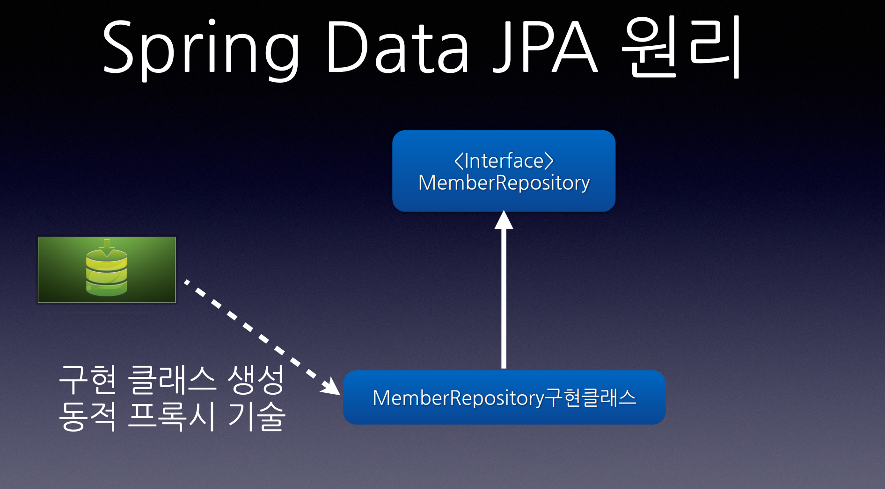
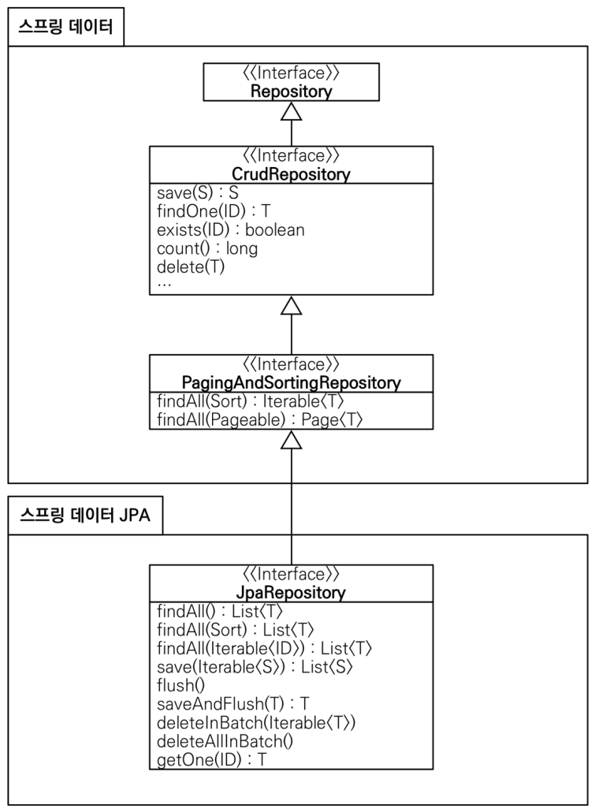

# 6. 데이터 접근 기술 - 스프링 데이터 JPA

----

## Spring Data JPA
#### spring data JPA는 단순한 통합 그 이상이다.
* CRUD + 쿼리
* 동일한 인터페이스
* 페이징 처리
* 메서드 이름으로 쿼리 생성
* 스프링 MVC에서 id 값만 넘겨도 도메인 클래스로 바인딩



#### Spring Data JPA 기능
* 메서드 이름으로 쿼리 생성
```java
public interface MemberRepository extends Repository<Member, Long>{
    List<User> findByEmailAndName(String email, String name)
}
```
    [생성된 JPQL]
    select m from Member m
    where m.email = ?`
        and m.name = ?2

## 스프링 데이터 JPA 주요 기능
#### 스프링 데이터 JPA는 JPA를 편리하게 사용할 수 있도록 도와주는 라이브러리이다.
#### 수많은 편리한 기능을 제공하지만 가장 대표적인 기능은 다음과 같다.
* 공통 인터페이스 기능
* 쿼리 메서드 기능


<br>


#### **공통 인터페이스 기능**



* `JpaRepository` 인터페이스를 통해서 기본적인 CRUD 기능 제공한다.
* 공통화 가능한 기능이 거의 모두 포함되어 있다.
* `CrudRepository` 에서 `fineOne()` -> `findById()` 로 변경되었다.

#### **JpaRepository 사용법**
```java
public interface ItemRepository extends JpaRepository<Member, Long> {
}
```
* `JpaRepository` 인터페이스를 인터페이스 상속 받고, 제네릭에 관리할 `<엔티티, 엔티티ID>` 를 주면 된다.
* 그러면 `JpaRepository` 가 제공하는 기본 CRUD 기능을 모두 사용할 수 있다.


<br>

* `JpaRepository` 인터페이스만 상속받으면 스프링 데이터 JPA가 프록시 기술을 사용해서 구현 클래스를
만들어준다. 그리고 만든 구현 클래스의 인스턴스를 만들어서 스프링 빈으로 등록한다.
* 따라서 개발자는 구현 클래스 없이 인터페이스만 만들면 기본 CRUD 기능을 사용할 수 있다.


<br>

#### **쿼리 메서드 기능**
* 스프링 데이터 JPA는 인터페이스에 메서드만 적어두면, 메서드 이름을 분석해서 쿼리를 자동으로 만들고
실행해주는 기능을 제공한다.

#### 스프링 데이터 JPA
```java
public interface MemberRepository extends JpaRepository<Member, Long> {
    List<Member> findByUsernameAndAgeGreaterThan(String username, int age);
}
```
* 스프링 데이터 JPA는 메서드 이름을 분석해서 필요한 JPQL을 만들고 실행해준다. 물론 JPQL은 JPA가
SQL로 번역해서 실행한다.
* 물론 그냥 아무 이름이나 사용하는 것은 아니고 다음과 같은 규칙을 따라야 한다.


#### 스프링 데이터 JPA가 제공하는 쿼리 메소드 기능
* 조회: `find…By` , `read…By` , `query…By` , `get…By`
  * 예:) `findHelloBy` 처럼 ...에 식별하기 위한 내용(설명)이 들어가도 된다.
* COUNT: `count…By` 반환타입 `long`
* EXISTS: `exists…By` 반환타입 `boolean`
* 삭제: `delete…By` , `remove…By` 반환타입 `long`
* DISTINCT: `findDistinct` , `findMemberDistinctBy`
* LIMIT: `findFirst3` , `findFirst` , `findTop` , `findTop3`

> 동적 쿼리를 사용하면 좋겠지만, 스프링 데이터 JPA는 동적 쿼리에 약하다

#### 예외 변환
#### 스프링 데이터 JPA도 스프링 예외 추상화를 지원한다. 스프링 데이터 JPA가 만들어주는 프록시에서 이미 예외 변환을 처리하기 때문에, `@Repository` 와 관계없이 예외가 변환된다.
----  

###### References: 김영한 - [스프링 DB 2편 - 데이터 접근 활용 기술]
