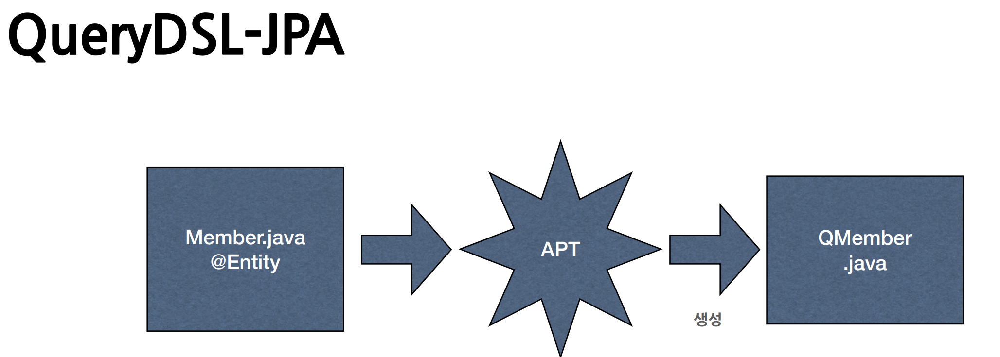
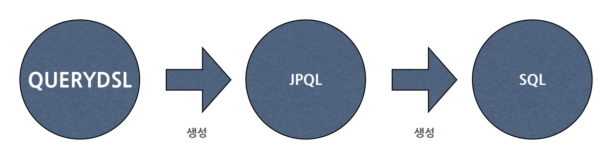

# 7. 데이터 접근 기술 - Querydsl

----

## QueryDSL
#### type-safe query
 
#### QUERY의 문제점
* QUERY는 문자, Type-check 불가능
* 실행하기 전까지 작동여부 확인 불가

#### SQL, JPQL
* 만약 SQL이 클래스처럼 타입이 있고 자바 코드로 작성할 수 있다면?
* type-safe

## QueryDSL
- 쿼리를 java로 type-safe하게 개발할 수 있게 지원하는프레임 워크
- 주로 JPA쿼리(JPQL)에 사용

#### QueryDSL 분석
* Domain(도메인)
* Specific(특화)
* Language(언어)

#### DSL
* 도메인 + 특화 + 언어
* 특정한 도메인에 초점을 맞춘 제한적인 표현력을 가진 컴퓨터 프로그래밍 언어
* 특징: 단순, 간결, 유창
<br>




```java
JPAQueryFactory query = new JPAQueryFactory(entityManager);
QMember m = QMember.member;

List<Member> list = query
    .select(m)
    .from(m)
    .where(
        m.age.between(20,40).and(m.name.like("김%"))
    )
    .orderBy(m.age.desc())
    .limit(3)
    .fetch(m);
```

#### 작동 방식


#### findAll
```java
private final EntityManager em;
private final JPAQueryFactory query;

public JpaItemRepositoryV3(EntityManager em) {
    this.em = em;
    this.query = new JPAQueryFactory(em);
}
```
#### 공통
* Querydsl을 사용하려면 `JPAQueryFactory` 가 필요하다. `JPAQueryFactory` 는 JPA 쿼리인 JPQL을
만들기 때문에 `EntityManager` 가 필요하다.
* 설정 방식은 `JdbcTemplate` 을 설정하는 것과 유사하다. 
* 참고로 `JPAQueryFactory` 를 스프링 빈으로 등록해서 사용해도 된다.
```java
List<Item> result = query
        .select(item)
        .from(item)
        .where(likeItemName(itemName), maxPrice(maxPrice))
        .fetch();
```
* Querydsl에서 `where(A,B)` 에 다양한 조건들을 직접 넣을 수 있는데, 이렇게 넣으면 AND 조건으로
처리된다. 참고로 `where()` 에 `null` 을 입력하면 해당 조건은 무시한다.
* 이 코드의 또 다른 장점은 `likeItemName()` , `maxPrice()` 를 다른 쿼리를 작성할 때 재사용 할 수 있다는
점이다. 쉽게 이야기해서 쿼리 조건을 부분적으로 모듈화 할 수 있다. 자바 코드로 개발하기 때문에 얻을 수
있는 큰 장점이다.

----  

###### References: 김영한 - [스프링 DB 2편 - 데이터 접근 활용 기술]
