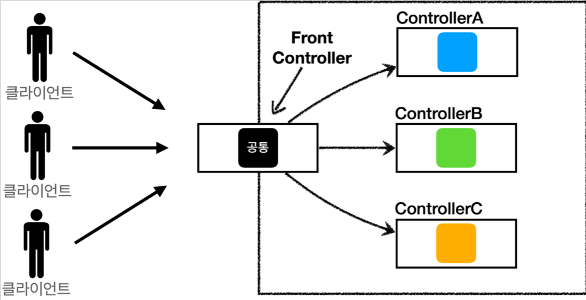

# 4. MVC 프레임워크 만들기

----
## 프론트 컨트롤러 패턴 소개

#### FrontController 패턴 특징
* 프론트 컨트롤러 서블릿 하나로 클라이언트의 요청을 받음
* 프론트 컨트롤러가 요청에 맞는 컨트롤러를 찾아서 호출
* 입구를 하나로!
* 공통 처리 가능
* 프론트 컨트롤러를 제외한 나머지 컨트롤러는 서블릿을 사용하지 않아도 됨

#### 스프링 웹 MVC와 프론트 컨트롤러

#### 스프링 웹 MVC의 핵심도 바로 **FrontController**
#### 스프링 웹 MVC의  **DispatcherServlet**이 FrontController 패턴으로 구현되어 있음

#### 정리  
* v1: 프론트 컨트롤러를 도입
  * 기존 구조를 최대한 유지하면서 프론트 컨트롤러를 도입
* v2: View 분류
  * 단순 반복 되는 뷰 로직 분리
* v3: Model 추가
  * 서블릿 종속성 제거
  * 뷰 이름 중복 제거
* v4: 단순하고 실용적인 컨트롤러
  * v3와 거의 비슷
  * 구현 입장에서 ModelView를 직접 생성해서 반환하지 않도록 편리한 인터페이스 제공
* v5: 유연한 컨트롤러
  * 어댑터 도입
  * 어댑터를 추가해서 프레임워크를 유연하고 확장성 있게 설계  
  

여기에 애노테이션을 사용해서 컨트롤러를 더 편리하게 발전시킬 수도 있다. 만약 애노테이션을 사용해서
컨트롤러를 편리하게 사용할 수 있게 하려면 어떻게 해야할까? 바로 애노테이션을 지원하는 어댑터를
추가하면 된다!
다형성과 어댑터 덕분에 기존 구조를 유지하면서, 프레임워크의 기능을 확장할 수 있다.

----  

###### References: 김영한 - [스프링 MVC 1편 - 백엔드 웹 개발 핵심 기술]
