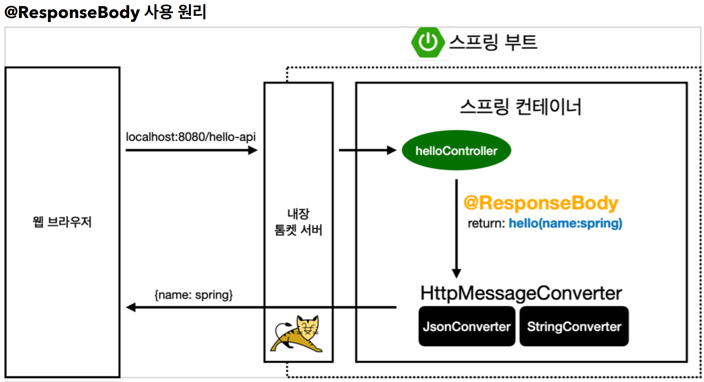
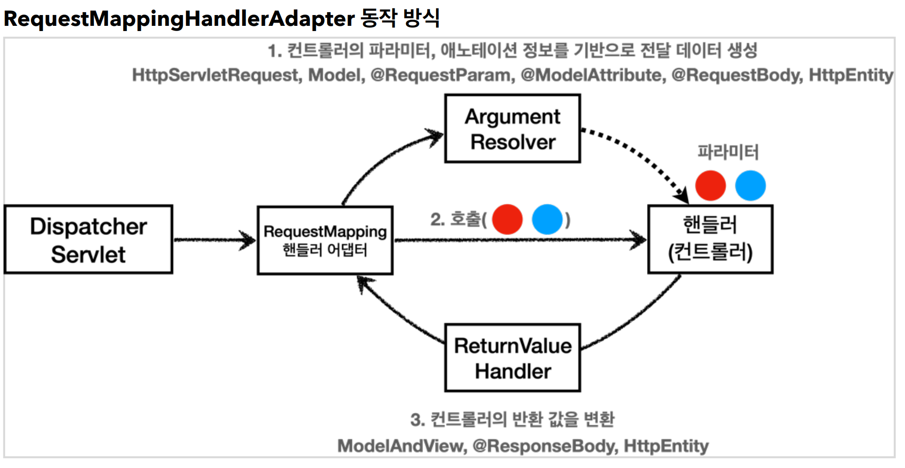
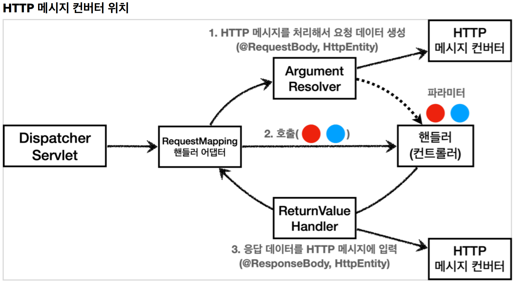

# 6. 스프링 MVC - 기본 기능

----
## 요청 매핑
#### MappingController
```java
@RestController
public class MappingController {
    private Logger log = LoggerFactory.getLogger(getClass());
    
    /**
    * 기본 요청
    * 둘다 허용 /hello-basic, /hello-basic/
    * HTTP 메서드 모두 허용 GET, HEAD, POST, PUT, PATCH, DELETE
    */
    @RequestMapping("/hello-basic")
    public String helloBasic() {
      log.info("helloBasic");
      return "ok";
    }
}
```

#### **매핑정보**
* `@RestController`
  * `@Controller` 는 반환 값이 `String` 이면 뷰 이름으로 인식된다. 그래서 **뷰를 찾고 뷰가 랜더링** 된다.
  * `@RestController` 는 반환 값으로 뷰를 찾는 것이 아니라, **HTTP 메시지 바디**에 바로 입력한다. 
따라서 실행 결과로 ok 메세지를 받을 수 있다.
* `@RequestMapping("/hello-basic")`
  * `/hello-basic` URL 호출이 오면 이 메서드가 실행되도록 매핑한다.
  * 대부분의 속성을 `배열[]` 로 제공하므로 다중 설정이 가능하다. `{"/hello-basic", "/hello-go"}`

#### PathVariable(경로 변수) 사용
```java
/**
* PathVariable 사용
* 변수명이 같으면 생략 가능
* @PathVariable("userId") String userId -> @PathVariable userId
*/
@GetMapping("/mapping/{userId}")
public String mappingPath(@PathVariable("userId") String data) {
    log.info("mappingPath userId={}", data);
    return "ok";
}
```
* 최근 HTTP API는 다음과 같이 리소스 경로에 식별자를 넣는 스타일을 선호한다.
  * `/mapping/userA`
  * `/users/1`
* `@RequestMapping` 은 URL 경로를 템플릿화 할 수 있는데, `@PathVariable` 을 사용하면 매칭 되는 부분을
편리하게 조회할 수 있다.
* `@PathVariable` 의 이름과 파라미터 이름이 같으면 생략할 수 있다.

## HTTP 요청 - 기본, 헤더 조회
```JAVA
@Slf4j
@RestController
public class RequestHeaderController {
    @RequestMapping("/headers")
    public String headers(HttpServletRequest request,
                          HttpServletResponse response,
                          HttpMethod httpMethod,
                          Locale locale,
                          @RequestHeader MultiValueMap<String, String> headerMap,
                          @RequestHeader("host") String host,
                          @CookieValue(value = "myCookie", required = false)
                          String cookie) {
        log.info("request={}", request);
        log.info("response={}", response);
        log.info("httpMethod={}", httpMethod);
        log.info("locale={}", locale);
        log.info("headerMap={}", headerMap);
        log.info("header host={}", host);
        log.info("myCookie={}", cookie);
        return "ok";
    }
}
```


* `HttpServletRequest`
* `HttpServletResponse`
* `HttpMethod` : HTTP 메서드를 조회한다. `org.springframework.http.HttpMethod`
* `Locale` : Locale 정보를 조회한다.
* `@RequestHeader MultiValueMap<String, String> headerMap`
  * 모든 HTTP 헤더를 MultiValueMap 형식으로 조회한다.
* `@RequestHeader("host") String host`
  * 특정 HTTP 헤더를 조회한다.
  * 속성
    * 필수 값 여부: `required`
    * 기본 값 속성: `defaultValue`
* `@CookieValue(value = "myCookie", required = false) String cookie`
  * 특정 쿠키를 조회한다.
  * 속성
    * 필수 값 여부: `required`
    * 기본 값: `defaultValue`

## HTTP 요청 파라미터 - 쿼리 파라미터, HTML Form
#### 요청 파라미터(request parameter) - 쿼리 파라미터, HTML Form

```java
/*
* @RequestParam 사용
* - 파라미터 이름으로 바인딩
* @ResponseBody 추가
* - View 조회를 무시하고, HTTP message body에 직접 해당 내용 입력
*/
@ResponseBody
@RequestMapping("/request-param-v2")
public String requestParamV2(
          @RequestParam("username") String memberName,
          @RequestParam("age") int memberAge) {
    log.info("username={}, age={}", memberName, memberAge);
    return "ok";
}
```
* `@RequestParam` : 파라미터 이름으로 바인딩
* `@ResponseBody` : View 조회를 무시하고, HTTP message body에 직접 해당 내용 입력
**@RequestParam**의 `name(value)` 속성이 파라미터 이름으로 사용
* @RequestParam("**username**") String **memberName**
* -> request.getParameter("**username**")

## HTTP 요청 파라미터 - @ModelAttribute

#### HelloData - 요청 파라미터를 바인딩 받을 객체
```java
@Data
public class HelloData {
    private String username;
    private int age;
}
```
* 롬복 `@Data`
  * `@Getter` , `@Setter` , `@ToString` , `@EqualsAndHashCode` , `@RequiredArgsConstructor` 를
자동으로 적용해준다.
```java
@ResponseBody
@RequestMapping("/model-attribute-v1")
public String modelAttributeV1(@ModelAttribute HelloData helloData) {
    log.info("username={}, age={}", helloData.getUsername(),
    helloData.getAge());
    return "ok";
}
```

#### 스프링MVC는 `@ModelAttribute` 가 있으면 다음을 실행한다.
* `HelloData` 객체를 생성한다.
* 요청 파라미터의 이름으로 `HelloData` 객체의 프로퍼티를 찾는다. 그리고 해당 프로퍼티의 setter를
호출해서 파라미터의 값을 입력(바인딩) 한다.
* 예) 파라미터 이름이 `username` 이면 `setUsername()` 메서드를 찾아서 호출하면서 값을 입력한다.
  

#### **프로퍼티**
> 객체에 `getUsername()` , `setUsername()` 메서드가 있으면, 이 객체는 `username` 이라는 프로퍼티를
가지고 있다.
`username` 프로퍼티의 값을 변경하면 `setUsername()` 이 호출되고, 조회하면 `getUsername()` 이
호출된다.

## HTTP 요청 메시지 - JSON
```java
/**
* @RequestBody 생략 불가능(@ModelAttribute 가 적용되어 버림)
* HttpMessageConverter 사용 -> MappingJackson2HttpMessageConverter (contenttype: application/json)
*
* @ResponseBody 적용
* - 메시지 바디 정보 직접 반환(view 조회X)
* - HttpMessageConverter 사용 -> MappingJackson2HttpMessageConverter 적용
(Accept: application/json)
*/
@ResponseBody
@PostMapping("/request-body-json-v5")
public HelloData requestBodyJsonV5(@RequestBody HelloData data) {
    log.info("username={}, age={}", data.getUsername(), data.getAge());
    return data;
}
```

#### **@RequestBody 객체 파라미터**
* `@RequestBody HelloData data`
* `@RequestBody` 에 직접 만든 객체를 지정할 수 있다.
`HttpEntity` , `@RequestBody` 를 사용하면 HTTP 메시지 컨버터가 HTTP 메시지 바디의 내용을 우리가
원하는 문자나 객체 등으로 변환해준다.
HTTP 메시지 컨버터는 문자 뿐만 아니라 JSON도 객체로 변환해준다.


* `@RequestBody` 요청
  * JSON 요청 -> HTTP 메시지 컨버터 -> 객체
* `@ResponseBody` 응답
  * 객체 -> HTTP 메시지 컨버터 -> JSON 응답

## HTTP 응답 - 정적 리소스, 뷰 템플릿

* 정적 리소스
  * 예) 웹 브라우저에 정적인 HTML, css, js를 제공할 때는, **정적 리소스**를 사용한다.
  * 정적 리소스 경로: `src/main/resources/static`
* 뷰 템플릿 사용
  * 예) 웹 브라우저에 동적인 HTML을 제공할 때는 뷰 템플릿을 사용한다.
  * 뷰 템플릿 경로: `src/main/resources/templates`
* HTTP 메시지 사용
  * HTTP API를 제공하는 경우에는 HTML이 아니라 데이터를 전달해야 하므로, HTTP 메시지 바디에
JSON 같은 형식으로 데이터를 실어 보낸다.

#### **String을 반환하는 경우 - View or HTTP 메시지**
* `@ResponseBody` 가 없으면 뷰를 찾고, 렌더링 한다.
* `@ResponseBody` 가 있으면 뷰 리졸버를 실행하지 않고, HTTP 메시지 바디에 직접 문자가 입력된다.

## HTTP 응답 - HTTP API, 메시지 바디에 직접 입력

#### **@RestController**

`@Controller` 대신에 `@RestController` 애노테이션을 사용하면, 해당 컨트롤러에 모두
`@ResponseBody` 가 적용되는 효과가 있다. 따라서 뷰 템플릿을 사용하는 것이 아니라, HTTP 메시지 바디에
직접 데이터를 입력한다. 이름 그대로 Rest API(HTTP API)를 만들 때 사용하는 컨트롤러이다.

## HTTP 메시지 컨버터
> 뷰 템플릿으로 HTML을 생성해서 응답하는 것이 아니라, HTTP API처럼 JSON 데이터를 HTTP 메시지
바디에서 직접 읽거나 쓰는 경우 HTTP 메시지 컨버터를 사용하면 편리하다.



* `@ResponseBody` 를 사용
  * HTTP의 BODY에 문자 내용을 직접 반환
  * `viewResolver` 대신에 `HttpMessageConverter` 가 동작
  * 기본 문자처리: `StringHttpMessageConverter`
  * 기본 객체처리: `MappingJackson2HttpMessageConverter`
  * byte 처리 등등 기타 여러 `HttpMessageConverter가` 기본으로 등록되어 있음
  > 참고: 응답의 경우 클라이언트의 HTTP Accept 해더와 서버의 컨트롤러 반환 타입 정보 둘을 조합해서
`HttpMessageConverter` 가 선택된다.

* HTTP 요청: `@RequestBody` , `HttpEntity(RequestEntity)`
* HTTP 응답: `@ResponseBody` , `HttpEntity(ResponseEntity)`

#### HTTP 요청 데이터 읽기
* HTTP 요청이 오고, 컨트롤러에서 `@RequestBody` , `HttpEntity` 파라미터를 사용한다.
* 메시지 컨버터가 메시지를 읽을 수 있는지 확인하기 위해 `canRead()` 를 호출한다.
  * 대상 클래스 타입을 지원하는가.
    * 예) `@RequestBody` 의 대상 클래스 ( `byte[] , String , HelloData` )
  * HTTP 요청의 Content-Type 미디어 타입을 지원하는가.
    * 예) `text/plain , application/json , */*`
* `canRead()` 조건을 만족하면 `read()` 를 호출해서 객체 생성하고, 반환한다.


#### HTTP 응답 데이터 생성
* 컨트롤러에서 `@ResponseBody` , `HttpEntity` 로 값이 반환된다. 
* 메시지 컨버터가 메시지를 쓸 수 있는지 확인하기 위해 `canWrite()` 를 호출한다.
  * 대상 클래스 타입을 지원하는가.
    * 예) return의 대상 클래스 ( `byte[] , String , HelloData` )
  * HTTP 요청의 Accept 미디어 타입을 지원하는가.(더 정확히는 @RequestMapping 의 produces )
    * 예) `text/plain , application/json , */*`
* `canWrite()` 조건을 만족하면 `write()` 를 호출해서 HTTP 응답 메시지 바디에 데이터를 생성한다.

## 요청 매핑 헨들러 어뎁터 구조
#### `@RequestMapping` 을 처리하는 핸들러 어댑터인 `RequestMappingHandlerAdapter` (요청 매핑 헨들러 어뎁터)



**ArgumentResolver**  
생각해보면, 애노테이션 기반의 컨트롤러는 매우 다양한 파라미터를 사용할 수 있었다.  
`HttpServletRequest` , `Model` 은 물론이고, `@RequestParam` , `@ModelAttribute` 같은 애노테이션
그리고 `@RequestBody` , `HttpEntity` 같은 HTTP 메시지를 처리하는 부분까지 매우 큰 유연함을
보여주었다.  
이렇게 파라미터를 유연하게 처리할 수 있는 이유가 바로 `ArgumentResolver` 덕분이다.

애노테이션 기반 컨트롤러를 처리하는 `RequestMappingHandlerAdapter` 는 바로 이
`ArgumentResolver` 를 호출해서 컨트롤러(핸들러)가 필요로 하는 다양한 파라미터의 값(객체)을 생성한다.   
그리고 이렇게 파리미터의 값이 모두 준비되면 컨트롤러를 호출하면서 값을 넘겨준다.

**ReturnValueHandler**  
`HandlerMethodReturnValueHandler` 를 줄여서 `ReturnValueHandler` 라 부른다.  
`ArgumentResolver` 와 비슷한데, 이것은 응답 값을 변환하고 처리한다.  
컨트롤러에서 String으로 뷰 이름을 반환해도, 동작하는 이유가 바로 ReturnValueHandler 덕분이다.


## HTTP 메시지 컨버터



HTTP 메시지 컨버터를 사용하는 `@RequestBody` 도 컨트롤러가 필요로 하는 파라미터의 값에 사용된다.  
`@ResponseBody` 의 경우도 컨트롤러의 반환 값을 이용한다.   

**요청의 경우** `@RequestBody` 를 처리하는 `ArgumentResolver` 가 있고, `HttpEntity` 를 처리하는
`ArgumentResolver` 가 있다. 이 `ArgumentResolver` 들이 HTTP 메시지 컨버터를 사용해서 필요한
객체를 생성하는 것이다.  

**응답의 경우** `@ResponseBody` 와 `HttpEntity` 를 처리하는 `ReturnValueHandler` 가 있다. 그리고
여기에서 HTTP 메시지 컨버터를 호출해서 응답 결과를 만든다.  

스프링 MVC는  
`@RequestBody` `@ResponseBody` 가 있으면
`RequestResponseBodyMethodProcessor` (ArgumentResolver)  
`HttpEntity` 가 있으면 `HttpEntityMethodProcessor` (ArgumentResolver)를 사용한다.

----  

###### References: 김영한 - [스프링 MVC 1편 - 백엔드 웹 개발 핵심 기술]
