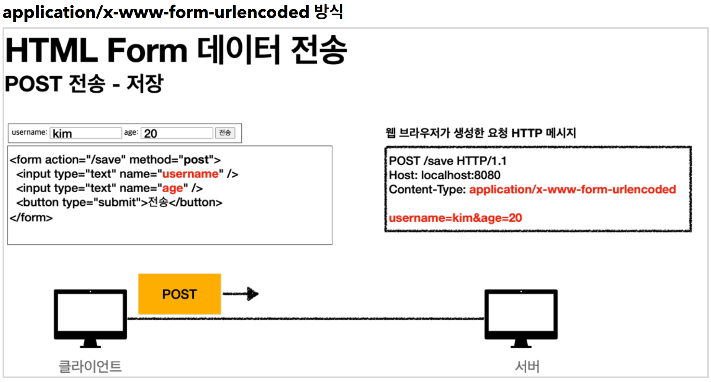
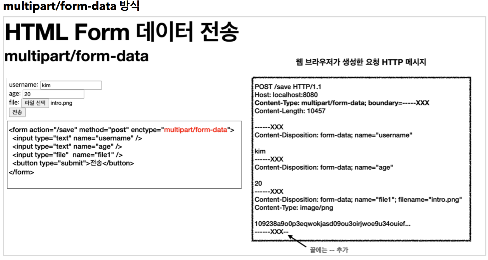

# 11. 파일 업로드

----

## 파일 업로드 소개
#### 일반적으로 사용하는 HTML Form을 통한 파일 업로드를 이해하려면 먼저 폼을 전송하는 다음 두 가지 방식의 차이를 이해해야 한다.

#### **HTML 폼 전송 방식**
* `application/x-www-form-urlencoded`
* `multipart/form-data`



#### `application/x-www-form-urlencoded` 방식은 HTML 폼 데이터를 서버로 전송하는 가장 기본적인 방법이다. Form 태그에 별도의 enctype 옵션이 없으면 웹 브라우저는 요청 HTTP 메시지의 헤더에 다음 내용을 추가한다.<br>

#### `Content-Type: application/x-www-form-urlencoded`  

#### 그리고 폼에 입력한 전송할 항목을 HTTP Body에 문자로 `username=kim&age=20` 와 같이 `&` 로 구분해서 전송한다.

#### 파일을 업로드 하려면 파일은 문자가 아니라 바이너리 데이터를 전송해야 한다. 문자를 전송하는 이 방식으로 파일을 전송하기는 어렵다. 그리고 또 한가지 문제가 더 있는데, 보통 폼을 전송할 때 파일만 전송하는 것이 아니라는 점이다.

#### 문자와 바이너리를 동시에 전송해야 하는 상황이다.
#### 이 문제를 해결하기 위해 HTTP는 `multipart/form-data` 라는 전송 방식을 제공한다.



#### `multipart/form-data` 방식은 다른 종류의 여러 파일과 폼의 내용 함께 전송할 수 있다. 
#### 폼의 입력 결과로 생성된 HTTP 메시지를 보면 각각의 전송 항목이 구분이 되어있다. `Content-Disposition` 이라는 항목별 헤더가 추가되어 있고 여기에 부가 정보가 있다. 예제에서는 `username` ,`age` , `file1` 이 각각 분리되어 있고, 폼의 일반 데이터는 각 항목별로 문자가 전송되고, 파일의 경우 파일 이름과 Content-Type이 추가되고 바이너리 데이터가 전송된다.

#### **Part**
#### `multipart/form-data` 는 `application/x-www-form-urlencoded` 와 비교해서 매우 복잡하고 각각의 부분( `Part` )로 나누어져 있다. 그렇다면 이렇게 복잡한 HTTP 메시지를 서버에서 어떻게 사용할 수 있을까?
<br>

## 서블릿과 파일 업로드
#### 먼저 파일을 업로드를 하려면 실제 파일이 저장되는 경로가 필요하다.
#### **application.properties**
        file.dir=파일 업로드 경로 설정(예): /Users/Hamgeonwook/study/file/

## 스프링과 파일 업로드
#### 스프링은 `MultipartFile` 이라는 인터페이스로 멀티파트 파일을 매우 편리하게 지원한다.

```java
@Controller
@RequestMapping("/spring")
public class SpringUploadController {
    @Value("${file.dir}")
    private String fileDir;
    
    @GetMapping("/upload")
    public String newFile() {
        return "upload-form";
    }
    
    @PostMapping("/upload")
    public String saveFile(@RequestParam String itemName, @RequestParam MultipartFile file, HttpServletRequest request) throws IOException {
        log.info("request={}", request);
        log.info("itemName={}", itemName);
        log.info("multipartFile={}", file);
        if (!file.isEmpty()) {
            String fullPath = fileDir + file.getOriginalFilename();
            log.info("파일 저장 fullPath={}", fullPath);
            file.transferTo(new File(fullPath));
        }
        return "upload-form";
    }
}
```
* `file.getOriginalFilename()` : 업로드 파일 명
* `file.transferTo(...)` : 파일 저장

> 고객이 업로드한 파일명으로 서버 내부에 파일을 저장하면 안된다. 왜냐하면 서로 다른 고객이 같은
파일이름을 업로드 하는 경우 기존 파일 이름과 충돌이 날 수 있다. 서버에서는 저장할 파일명이 겹치지
않도록 내부에서 관리하는 별도의 파일명이 필요하다.

```java
@Component
public class FileStore {
    
    @Value("${file.dir}")
    private String fileDir;
    
    public String getFullPath(String filename) {
        return fileDir + filename;
    }
    
    public List<UploadFile> storeFiles(List<MultipartFile> multipartFiles) throws IOException {
        List<UploadFile> storeFileResult = new ArrayList<>();
        for (MultipartFile multipartFile : multipartFiles) {
        if (!multipartFile.isEmpty()) {
                storeFileResult.add(storeFile(multipartFile));
            }
        }
        return storeFileResult;
    }
    
    public UploadFile storeFile(MultipartFile multipartFile) throws IOException {
        if (multipartFile.isEmpty()) {
            return null;
        }

        String originalFilename = multipartFile.getOriginalFilename();
        String storeFileName = createStoreFileName(originalFilename);
        multipartFile.transferTo(new File(getFullPath(storeFileName)));
        return new UploadFile(originalFilename, storeFileName);
    }
    
    private String createStoreFileName(String originalFilename) {
        String ext = extractExt(originalFilename);
        String uuid = UUID.randomUUID().toString();
        return uuid + "." + ext;
    }
    
    private String extractExt(String originalFilename) {
        int pos = originalFilename.lastIndexOf(".");
        return originalFilename.substring(pos + 1);
    }
}
```

#### 멀티파트 파일을 서버에 저장하는 역할을 담당한다.
* `createStoreFileName()` : 서버 내부에서 관리하는 파일명은 유일한 이름을 생성하는 `UUID` 를 사용해서
충돌하지 않도록 한다.
* `extractExt()` : 확장자를 별도로 추출해서 서버 내부에서 관리하는 파일명에도 붙여준다. 예를 들어서
고객이 `a.png` 라는 이름으로 업로드 하면 `51041c62-86e4-4274-801d-614a7d994edb.png` 와 같이
저장한다.

```java
@Slf4j
@Controller
@RequiredArgsConstructor
public class ItemController {
    
    private final ItemRepository itemRepository;
    private final FileStore fileStore;
    
    @GetMapping("/items/new")
    public String newItem(@ModelAttribute ItemForm form) {
        return "item-form";
    }
    
    @PostMapping("/items/new")
    public String saveItem(@ModelAttribute ItemForm form, RedirectAttributes redirectAttributes) throws IOException {
    
        UploadFile attachFile = fileStore.storeFile(form.getAttachFile());
        List<UploadFile> storeImageFiles = fileStore.storeFiles(form.getImageFiles());
        
        //데이터베이스에 저장
        Item item = new Item();
        item.setItemName(form.getItemName());
        item.setAttachFile(attachFile);
        item.setImageFiles(storeImageFiles);
        itemRepository.save(item);
        
        redirectAttributes.addAttribute("itemId", item.getId());
        return "redirect:/items/{itemId}";
    }

    @GetMapping("/items/{id}")
    public String items(@PathVariable Long id, Model model) {
        Item item = itemRepository.findById(id);
        model.addAttribute("item", item);
        return "item-view";
    }
    
    @ResponseBody
    @GetMapping("/images/{filename}")
    public Resource downloadImage(@PathVariable String filename) throws MalformedURLException {
        return new UrlResource("file:" + fileStore.getFullPath(filename));
    }

    @GetMapping("/attach/{itemId}")
    public ResponseEntity<Resource> downloadAttach(@PathVariable Long itemId) throws MalformedURLException {
    
        Item item = itemRepository.findById(itemId);
        String storeFileName = item.getAttachFile().getStoreFileName();
        String uploadFileName = item.getAttachFile().getUploadFileName();
        
        UrlResource resource = new UrlResource("file:" + fileStore.getFullPath(storeFileName));
        
        log.info("uploadFileName={}", uploadFileName);
        String encodedUploadFileName = UriUtils.encode(uploadFileName,
        StandardCharsets.UTF_8);
        String contentDisposition = "attachment; filename=\"" + encodedUploadFileName + "\"";
        return ResponseEntity.ok()
                    .header(HttpHeaders.CONTENT_DISPOSITION, contentDisposition)
                    .body(resource);
    }
}
```

* `@GetMapping("/items/new")` : 등록 폼을 보여준다.
* `@PostMapping("/items/new")` : 폼의 데이터를 저장하고 보여주는 화면으로 리다이렉트 한다.
* `@GetMapping("/items/{id}")` : 상품을 보여준다.
* `@GetMapping("/images/{filename}")` : `` 태그로 이미지를 조회할 때 사용한다. `UrlResource`
로 이미지 파일을 읽어서 `@ResponseBody` 로 이미지 바이너리를 반환한다.
* `@GetMapping("/attach/{itemId}")` : 파일을 다운로드 할 때 실행한다. 예제를 더 단순화 할 수 있지만, 
파일 다운로드 시 권한 체크같은 복잡한 상황까지 가정한다 생각하고 이미지 `id` 를 요청하도록 했다. 파일
다운로드시에는 고객이 업로드한 파일 이름으로 다운로드 하는게 좋다. 이때는 `Content-Disposition`
해더에 `attachment; filename="업로드 파일명"` 값을 주면 된다.


----  

###### References: 김영한 - [스프링 MVC 2편 - 백엔드 웹 개발 활용 기술]
