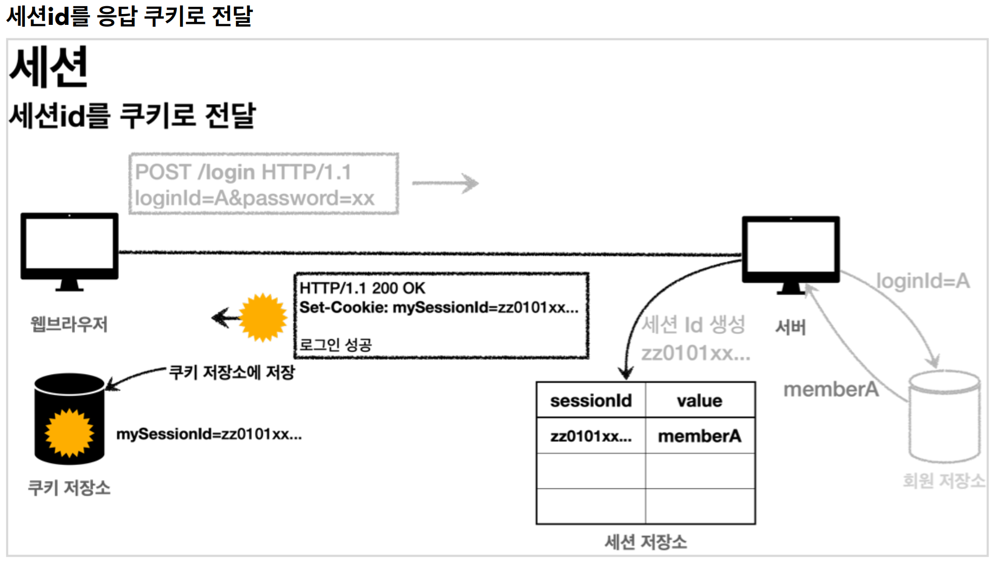

# 6. 로그인 처리1 - 쿠키, 세션

----
## 로그인 요구사항
* 홈 화면 - 로그인 전
  * 회원 가입
  * 로그인
* 홈 화면 - 로그인 후
  * 본인 이름(누구님 환영합니다.)
  * 상품 관리
  * 로그 아웃
* 보안 요구사항
  * 로그인 사용자만 상품에 접근하고, 관리할 수 있음
  * **로그인 하지 않은 사용자가 상품 관리에 접근하면 로그인 화면으로 이동**
* 회원 가입, 상품 관리

#### **도메인이 가장 중요하다.**
도메인 = 화면, UI, 기술 인프라 등등의 영역을 제외한 시스템이 구현해야 하는 핵심 비즈니스 업무 영역을 말한다.  
향후 web을 다른 기술로 바꾸어도 도메인은 그대로 유지할 수 있어야 한다.
이렇게 하려면 web은 domain을 알고있지만 domain은 web을 모르도록 설계해야 한다. 이것을 web은
domain을 의존하지만, domain은 web을 의존하지 않는다고 표현한다. 예를 들어 web 패키지를 모두
삭제해도 domain에는 전혀 영향이 없도록 의존관계를 설계하는 것이 중요하다. 반대로 이야기하면
domain은 web을 참조하면 안된다.

## 로그인 처리하기 - 쿠키 사용

#### 로그인 상태 유지하기 - 쿠키
#### 서버에서 로그인에 성공하면 HTTP 응답에 쿠키를 담아서 브라우저에 전달하자. 그러면 브라우저는 앞으로 해당 쿠키를 지속해서 보내준다.


#### 쿠키에는 영속 쿠키와 세션 쿠키가 있다.
* 영속 쿠키: 만료 날짜를 입력하면 해당 날짜까지 유지
* **세션 쿠키**: 만료 날짜를 생략하면 브라우저 종료시 까지만 유지
  * 브라우저 종료시 로그아웃이 되길 기대하므로, 우리에게 필요한 것은 세션 쿠키이다.

#### 쿠키 생성 로직
```JAVA
Cookie idCookie = new Cookie("memberId", String.valueOf(loginMember.getId()));
response.addCookie(idCookie);
```
로그인에 성공하면 쿠키를 생성하고 `HttpServletResponse` 에 담는다. 쿠키 이름은 `memberId` 이고, 값은
회원의 `id` 를 담아둔다. 웹 브라우저는 종료 전까지 회원의 `id` 를 서버에 계속 보내줄 것이다.

```java
@GetMapping("/")
 public String homeLogin(
 @CookieValue(name = "memberId", required = false) Long memberId, Model model) {
  if (memberId == null) {
    return "home";
  }
  //로그인
  Member loginMember = memberRepository.findById(memberId);
  if (loginMember == null) {
    return "home";
  }
  model.addAttribute("member", loginMember);
  return "loginHome";
 }
```

#### 로직 분석
* `@CookieValue` 를 사용하면 편리하게 쿠키를 조회할 수 있다.
* 로그인 하지 않은 사용자도 홈에 접근할 수 있기 때문에 required = false 를 사용한다.
* 로그인 쿠키( `memberId` )가 없는 사용자는 기존 `home` 으로 보낸다. 추가로 로그인 쿠키가 있어도 회원이
없으면 `home` 으로 보낸다.
* 로그인 쿠키( `memberId` )가 있는 사용자는 로그인 사용자 전용 홈 화면인 `loginHome` 으로 보낸다. 추가로
홈 화면에 화원 관련 정보도 출력해야 해서 `member` 데이터도 모델에 담아서 전달한다.

#### 로그아웃 기능
* 세션 쿠키이므로 웹 브라우저 종료시
* 서버에서 해당 쿠키의 종료 날짜를 0으로 지정
```java
@PostMapping("/logout")
public String logout(HttpServletResponse response) {
    expireCookie(response, "memberId");
    return "redirect:/";
}

private void expireCookie(HttpServletResponse response, String cookieName) {
    Cookie cookie = new Cookie(cookieName, null);
    cookie.setMaxAge(0);
    response.addCookie(cookie);
}
```

## 쿠키와 보안 문제

#### 보안 문제
- 쿠키 값은 임의로 변경할 수 있다.
  - 클라이언트가 쿠키를 강제로 변경하면 다른 사용자가 된다.
  - 실제 웹브라우저 개발자모드 Application -> Cookie 변경으로 확인
  - Cookie: memberId=1 Cookie: memberId=2 (다른 사용자의 이름이 보임)
- 쿠키에 보관된 정보는 훔쳐갈 수 있다.
  - 만약 쿠키에 개인정보나, 신용카드 정보가 있다면?
  - 이 정보가 웹 브라우저에도 보관되고, 네트워크 요청마다 계속 클라이언트에서 서버로 전달된다.
  - 쿠키의 정보가 나의 로컬 PC에서 털릴 수도 있고, 네트워크 전송 구간에서 털릴 수도 있다.
- 해커가 쿠키를 한번 훔쳐가면 평생 사용할 수 있다.
  - 해커가 쿠키를 훔쳐가서 그 쿠키로 악의적인 요청을 계속 시도할 수 있다.


#### 대안
- 쿠키에 중요한 값을 노출하지 않고, 사용자 별로 예측 불가능한 임의의 토큰(랜덤 값)을 노출하고, 서버에서
토큰과 사용자 id를 매핑해서 인식한다. 그리고 서버에서 토큰을 관리한다.
- 토큰은 해커가 임의의 값을 넣어도 찾을 수 없도록 예상 불가능 해야 한다.
- 해커가 토큰을 털어가도 시간이 지나면 사용할 수 없도록 서버에서 해당 토큰의 만료시간을 짧게(예: 30분) 
유지한다. 또는 해킹이 의심되는 경우 서버에서 해당 토큰을 강제로 제거하면 된다.

## 로그인 처리하기 - 세션 동작 방식
#### 서버에 중요한 정보를 보관하고 연결을 유지하는 방법을 세션이라 한다.
#### 세션 동작 방식
* 세션 ID를 생성하는데, 추정 불가능해야 한다.
* **UUID는 추정이 불가능하다.**
  * `Cookie: mySessionId=zz0101xx-bab9-4b92-9b32-dadb280f4b61`
* 생성된 세션 ID와 세션에 보관할 값( `memberA` )을 서버의 세션 저장소에 보관한다.




#### 세션 관리

* **세션 생성**
  * sessionId 생성 (임의의 추정 불가능한 랜덤 값)
  * 세션 저장소에 sessionId와 보관할 값 저장
  * sessionId로 응답 쿠키를 생성해서 클라이언트에 전달
* **세션 조회**
  * 클라이언트가 요청한 sessionId 쿠키의 값으로, 세션 저장소에 보관한 값 조회
* **세션 만료**
  * 클라이언트가 요청한 sessionId 쿠키의 값으로, 세션 저장소에 보관한 sessionId와 값 제거


## 로그인 처리하기 - 서블릿 HTTP 세션
> 서블릿은 세션을 위해 `HttpSession` 이라는 기능을 제공

#### **HttpSession 소개**
#### 서블릿이 제공하는 `HttpSession` 도 결국 우리가 직접 만든 `SessionManager` 와 같은 방식으로 동작한다.  
#### 서블릿을 통해 `HttpSession` 을 생성하면 다음과 같은 쿠키를 생성한다. 쿠키 이름이 `JSESSIONID` 이고, 값은 추정 불가능한 랜덤 값이다.  
#### `Cookie: JSESSIONID=5B78E23B513F50164D6FDD8C97B0AD05`

#### **세션 생성, 조회, 제거**
#### 세션을 생성하려면 `request.getSession(true)` 를 사용하면 된다.
#### `public HttpSession getSession(boolean create);`
#### 세션의 `create` 옵션에 대해 알아보자.
* #### `request.getSession(true)`
  * #### 세션이 있으면 기존 세션을 반환한다.
  * #### 세션이 없으면 새로운 세션을 생성해서 반환한다.
* #### `request.getSession(false)`
  * #### 세션이 있으면 기존 세션을 반환한다.
  * #### 세션이 없으면 새로운 세션을 생성하지 않는다. `null` 을 반환한다.
* #### `request.getSession()` : 신규 세션을 생성하는 `request.getSession(true)` 와 동일하다.
* #### `session.invalidate()` : 세션을 제거한다.

#### **@SessionAttribute**
#### 스프링은 세션을 더 편리하게 사용할 수 있도록 `@SessionAttribute` 을 지원한다.  
> #### 참고로 이 기능은 세션을 생성하지 않는다.

`@SessionAttribute(name = "loginMember", required = false) Member loginMember`

#### 세션의 종료 시점
> 사용자가 서버에 최근에 요청한 시간을 기준으로 30분 정도를
유지해주는 것이다. 이렇게 하면 사용자가 서비스를 사용하고 있으면, 세션의 생존 시간이 30분으로 계속
늘어나게 된다. 따라서 30분 마다 로그인해야 하는 번거로움이 사라진다. `HttpSession` 은 이 방식을
사용한다.
----  

###### References: 김영한 - [스프링 MVC 2편 - 백엔드 웹 개발 활용 기술]
