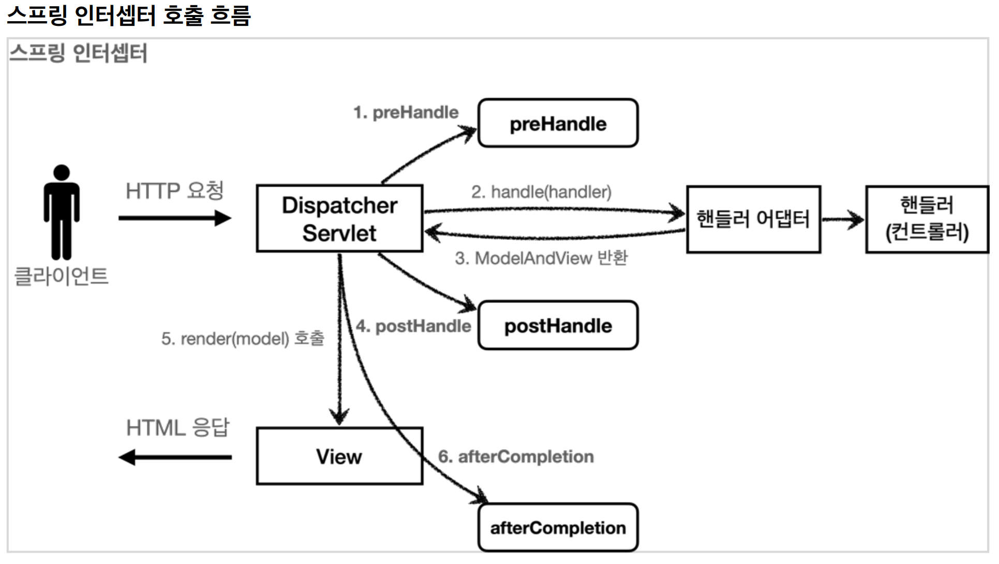
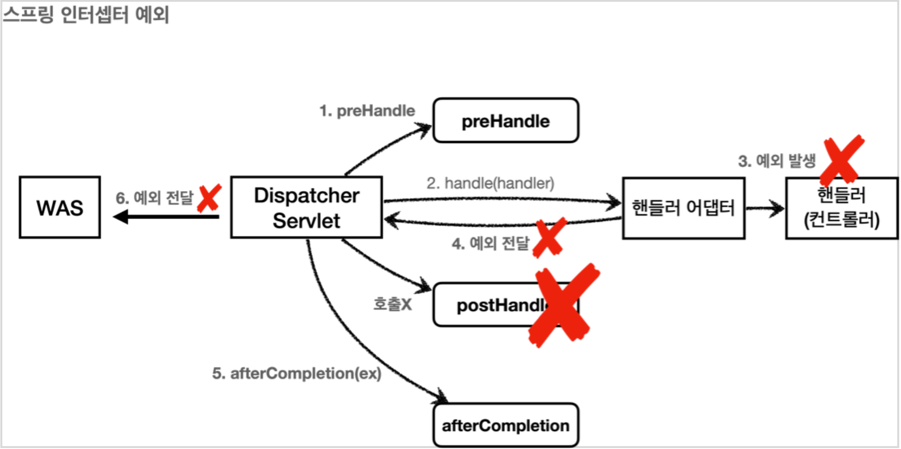

# 7. 로그인 처리2 - 필터, 인터셉터

----
## 서블릿 필터 - 소개

#### 공통 관심 사항
* #### 요구사항을 보면 로그인 한 사용자만 상품 관리 페이지에 들어갈 수 있어야 한다.
* #### 앞에서 로그인을 하지 않은 사용자에게는 상품 관리 버튼이 보이지 않기 때문에 문제가 없어 보인다. 그런데 문제는 로그인 하지 않은 사용자도 다음 URL을 직접 호출하면 상품 관리 화면에 들어갈 수 있다는 점이다.

* #### 여러 로직에서 공통으로 관심이 있는 있는 것을 **공통 관심사**(cross-cutting concern)라고 한다. 여기서는 등록, 수정, 삭제, 조회 등등 여러 로직에서 공통으로 인증에 대해서 관심을 가지고 있다.

* #### 웹과 관련된 공통 관심사를 처리할 때는 HTTP의 헤더나 URL의 정보들이 필요한데, 서블릿 필터나 스프링 인터셉터는 `HttpServletRequest` 를 제공한다.

## 서블릿 필터 소개
> #### 필터는 서블릿이 지원하는 수문장이다. 

#### 필터 제한
    HTTP 요청 -> WAS -> 필터 -> 서블릿 -> 컨트롤러 //로그인 사용자
    HTTP 요청 -> WAS -> 필터(적절하지 않은 요청이라 판단, 서블릿 호출X) //비 로그인 사용자

## 스프링 인터셉터

#### 스프링 인터셉터 흐름
    HTTP 요청 -> WAS -> 필터 -> 서블릿 -> 스프링 인터셉터 -> 컨트롤러 //로그인 사용자
    HTTP 요청 -> WAS -> 필터 -> 서블릿 -> 스프링 인터셉터(적절하지 않은 요청이라 판단, 컨트롤러 호출 X) // 비 로그인 사용자

#### 스프링 인터셉터 인터페이스
#### 스프링의 인터셉터를 사용하려면 `HandlerInterceptor` 인터페이스를 구현하면 된다.

* 서블릿 필터의 경우 단순하게 doFilter() 하나만 제공된다. 인터셉터는 컨트롤러 호출 전( `preHandle` ), 
호출 후( `postHandle` ), 요청 완료 이후( `afterCompletion` )와 같이 단계적으로 잘 세분화 되어 있다.
* 서블릿 필터의 경우 단순히 `request` , `response` 만 제공했지만, 인터셉터는 어떤 컨트롤러( `handler` )가
호출되는지 호출 정보도 받을 수 있다. 그리고 어떤 `modelAndView` 가 반환되는지 응답 정보도 받을 수
있다.



#### 정상 흐름
* `preHandle` : 컨트롤러 호출 전에 호출된다. (더 정확히는 핸들러 어댑터 호출 전에 호출된다.)
  * `preHandle` 의 응답값이 `true` 이면 다음으로 진행하고, `false` 이면 더는 진행하지 않는다. `false`
인 경우 나머지 인터셉터는 물론이고, 핸들러 어댑터도 호출되지 않는다. 그림에서 1번에서 끝이
나버린다.
* `postHandle` : 컨트롤러 호출 후에 호출된다. (더 정확히는 핸들러 어댑터 호출 후에 호출된다.)
* `afterCompletion` : 뷰가 렌더링 된 이후에 호출된다.


#### 예외가 발생시
* `preHandle` : 컨트롤러 호출 전에 호출된다.
* `postHandle` : 컨트롤러에서 예외가 발생하면 `postHandle` 은 호출되지 않는다.
* `afterCompletion` : `afterCompletion` 은 항상 호출된다. 이 경우 예외( `ex` )를 파라미터로 받아서 어떤
예외가 발생했는지 로그로 출력할 수 있다.
#### **afterCompletion은 예외가 발생해도 호출된다.**
* 예외가 발생하면 `postHandle()` 는 호출되지 않으므로 예외와 무관하게 공통 처리를 하려면
`afterCompletion()` 을 사용해야 한다.
* 예외가 발생하면 `afterCompletion()` 에 예외 정보( `ex` )를 포함해서 호출된다.

```java
@Slf4j
public class LoginCheckInterceptor implements HandlerInterceptor {
  @Override
  public boolean preHandle(HttpServletRequest request, HttpServletResponse response, Object handler) throws Exception {
  
    String requestURI = request.getRequestURI();
    
    log.info("인증 체크 인터셉터 실행 {}", requestURI);
    HttpSession session = request.getSession(false);
    
    if (session == null || session.getAttribute(SessionConst.LOGIN_MEMBER) == null) {
        log.info("미인증 사용자 요청");
        //로그인으로 redirect
        response.sendRedirect("/login?redirectURL=" + requestURI);
        return false;
    }
    return true;
  }
}
```
> 인증이라는 것은 컨트롤러 호출 전에만 호출되면 된다. 
따라서 `preHandle` 만 구현하면 된다.

#### 순서 주의, 세밀한 설정 가능

```java
@Configuration
public class WebConfig implements WebMvcConfigurer {
    @Override
    public void addInterceptors(InterceptorRegistry registry) {
      registry.addInterceptor(new LogInterceptor())
              .order(1)
              .addPathPatterns("/**")
              .excludePathPatterns("/css/**", "/*.ico", "/error");
      
      registry.addInterceptor(new LoginCheckInterceptor())
              .order(2)
              .addPathPatterns("/**")
              .excludePathPatterns(
                      "/", "/members/add", "/login", "/logout",
                      "/css/**", "/*.ico", "/error"
              );
    }
    //...
}
```
#### 인터셉터를 적용하거나 하지 않을 부분은 addPathPatterns 와 excludePathPatterns 에 작성하면 된다. 기본적으로 모든 경로에 해당 인터셉터를 적용하되 ( `/**` ), 홈( `/` ), 회원가입( `/members/add` ), 로그인( `/login` ), 리소스 조회( `/css/**` ), 오류( `/error` )와 같은 부분은 로그인 체크 인터셉터를 적용하지 않는다.


## ArgumentResolver 활용

```java
@GetMapping("/")
public String homeLoginV3ArgumentResolver(@Login Member loginMember, Model model) {
    
    //세션에 회원 데이터가 없으면 home
    if (loginMember == null) {
      return "home";
    }
    
    //세션이 유지되면 로그인으로 이동
    model.addAttribute("member", loginMember);
    return "loginHome";
}
```
#### @Login 애노테이션 생성
```java
@Target(ElementType.PARAMETER)
@Retention(RetentionPolicy.RUNTIME)
public @interface Login {
}
```
* `@Target(ElementType.PARAMETER)` : 파라미터에만 사용
* `@Retention(RetentionPolicy.RUNTIME)` : 리플렉션 등을 활용할 수 있도록 런타임까지 애노테이션
정보가 남아있음

#### LoginMemberArgumentResolver
```java
@Slf4j
public class LoginMemberArgumentResolver implements HandlerMethodArgumentResolver {
    
    @Override
    public boolean supportsParameter(MethodParameter parameter) {
      
        log.info("supportsParameter 실행");
        
        boolean hasLoginAnnotation = parameter.hasParameterAnnotation(Login.class);
        boolean hasMemberType = Member.class.isAssignableFrom(parameter.getParameterType());
        
        return hasLoginAnnotation && hasMemberType;
    }

    @Override
    public Object resolveArgument(MethodParameter parameter, ModelAndViewContainer mavContainer, NativeWebRequest webRequest, WebDataBinderFactory binderFactory) throws Exception {
        
        log.info("resolveArgument 실행");
        
        HttpServletRequest request = (HttpServletRequest)
        webRequest.getNativeRequest();
        HttpSession session = request.getSession(false);
        if (session == null) {
          return null;
        }
        return session.getAttribute(SessionConst.LOGIN_MEMBER);
    }
}
```

* `supportsParameter()` : `@Login` 애노테이션이 있으면서 `Member` 타입이면 해당 `ArgumentResolver`
가 사용된다.
* `resolveArgument()` : 컨트롤러 호출 직전에 호출 되어서 필요한 파라미터 정보를 생성해준다. 여기서는
세션에 있는 로그인 회원 정보인 `member` 객체를 찾아서 반환해준다. 이후 스프링MVC는 컨트롤러의
메서드를 호출하면서 여기에서 반환된 `member` 객체를 파라미터에 전달해준다.

#### WebMvcConfigurer
```java
@Configuration
public class WebConfig implements WebMvcConfigurer {
  @Override
  public void addArgumentResolvers(List<HandlerMethodArgumentResolver>
  resolvers) {
      resolvers.add(new LoginMemberArgumentResolver());
  }
  //...
}
```


----  

###### References: 김영한 - [스프링 MVC 2편 - 백엔드 웹 개발 활용 기술]
