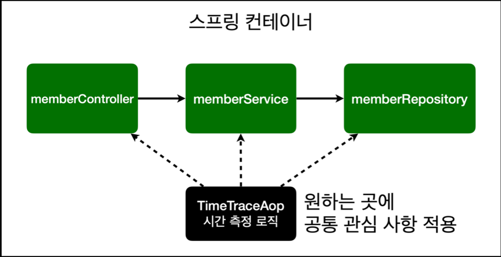
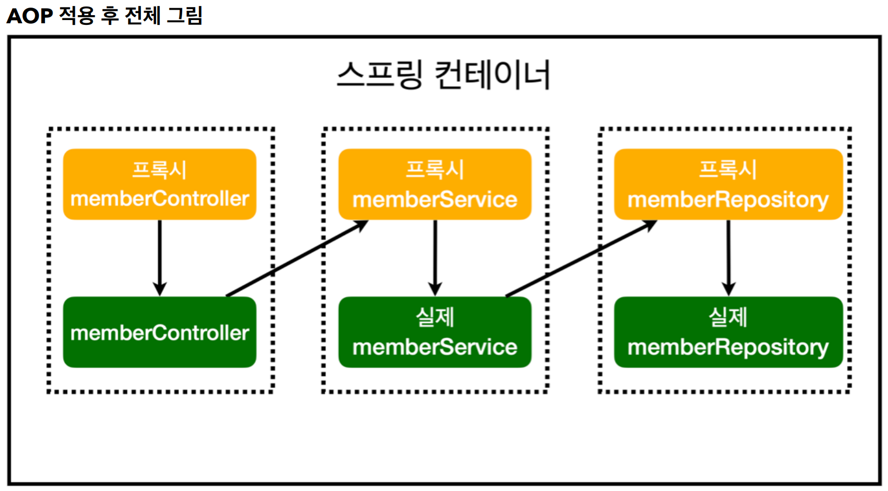

# AOP

-----
#### AOP가 필요한 상황
* 모든 메서드의 호출 시간을 측정하고 싶다면?
* 공통 관심 사항(cross-cutting concern) vs 핵심 관심 사항(core concern)
* 회원 가입 시간, 회원 조회 시간을 측정하고 싶다면?

##### 모든 메서드에 시간 측정 로직 넣었을 때 문제
* 회원가입, 회원 조회에 시간을 측정하는 기능은 핵심 관심 사항이 아니다.
* 시간을 측정하는 로직은 공통 관심 사항이다.
* 시간을 측정하는 로직과 핵심 비즈니스의 로직이 섞여서 유지보수가 어렵다.
* 시간을 측정하는 로직을 별도의 공통 로직으로 만들기 매우 어렵다.
* 시간을 측정하는 로직을 변경할 때 모든 로직을 찾아가면서 변경해야 한다.

#### AOP 적용
* AOP: Aspect Oriented Programming
* 공통 관심 사항(cross-cutting concern) vs 핵심 관심 사항(core concern) 분리


  


```java
@Component
@Aspect
public class TimeTraceAop {
    @Around("execution(* hello.hellospring..*(..))")
    public Object execute(ProceedingJoinPoint joinPoint) throws Throwable {
        long start = System.currentTimeMillis();
        System.out.println("START: " + joinPoint.toString());
        try {
            return joinPoint.proceed();
        } finally {
            long finish = System.currentTimeMillis();
            long timeMs = finish - start;
            System.out.println("END: " + joinPoint.toString()+ " " + timeMs + "ms");
        }
    }
}
```
* 회원가입, 회원 조회등 핵심 관심사항과 시간을 측정하는 공통 관심 사항을 분리한다.
* 시간을 측정하는 로직을 별도의 공통 로직으로 만들었다.
* 핵심 관심 사항을 깔끔하게 유지할 수 있다.
* 변경이 필요하면 이 로직만 변경하면 된다.
* 원하는 적용 대상을 선택할 수 있다.

##### 스프링의 AOP 동작 방식 설명


----
###### References: 김영한 - [스프링 입문 - 코드로 배우는 스프링 부트, 웹 MVC, DB 접근 기술]


