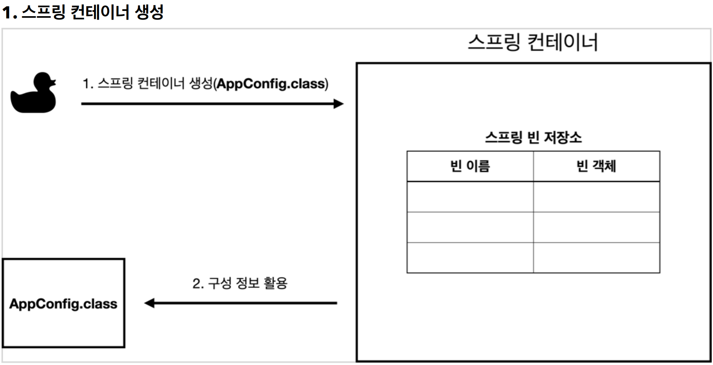
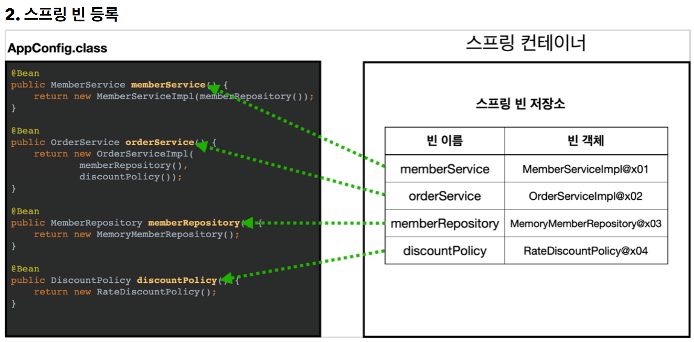
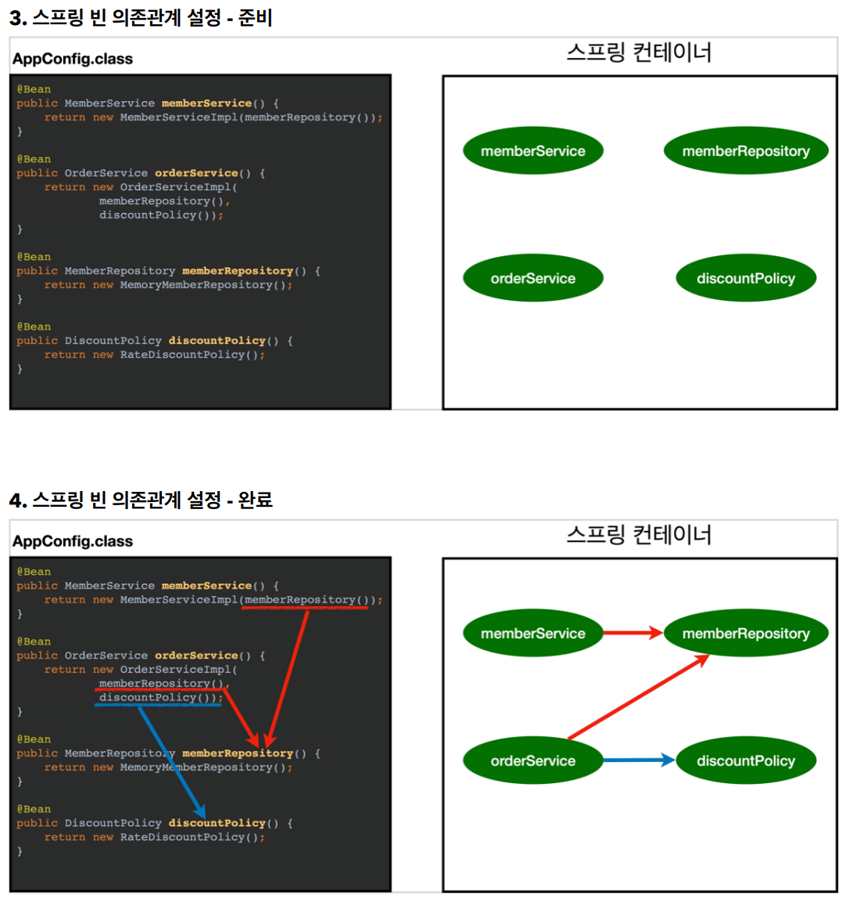
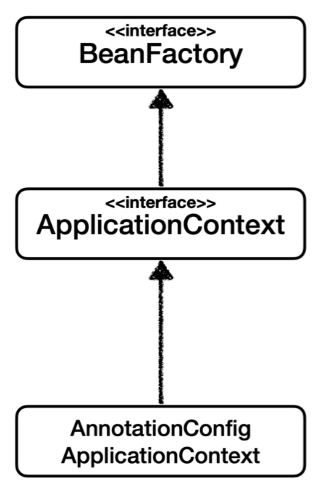

# 4. 스프링 컨테이너와 스프링 빈

----
#### 스프링 컨테이너 생성
```java
ApplicationContext applicationContext = new AnnotationConfigApplicationContext(AppConfig.class);
```
* `AplicationContext`를 스프링 컨테이너라 한다.
* `ApplicationContext`는 인터페이스이다.
* 스프링컨테이너는 XML을 기반으로 만들 수 있고, 애노테이션 기반의 자바 설정 클래스로 만들 수 있다.
* 직전에 `AppConfig`를 사용했던 방식이 애노테이션(`@Configuration`) 기반의 자바 설정 클래스(`AppCofig`)로 스프링 컨테이너를 만든 것이다.
* 위의 코드가 자바 설정 클래스를 기반으로 스프링 컨테이너를 만든 것이다.
  * `new AnnotationConfigApplicationContext(AppConfig.class);`
  * 이 클래스는 `AplicationContext` 인터페이스의 구현체이다.

#### 스프링 컨테이너의 생성 과정


* `new AnnotationConfigApplicationContext(AppConfig.class)`
* 스프링 컨테이너를 생성할 때는 구성 정보를 지정해주어야 한다.
* 여기서는 `AppConfig.class`를 구성 정보로 지정했다.



* 스프링 컨테이너는 파라미터로 넘어온 설정 클래스 정보를 사용해서 스프링 빈을 등록한다.

##### 빈 이름
* 빈 이름은 메서드 이름을 사용한다.
* 빈 이름을 직접 부여할 수 도 있다.
* `@Bean(name="memberService2")`
*  **주의: 빈 이름은 항상 다른 이름을 부여**해야 한다. 같은 이름을 부여하면, 다른 빈이 무시되거나, 기존 빈을
덮어버리거나 설정에 따라 오류가 발생한다.



* 스프링 컨테이너는 설정 정보를 참고해서 의존관계를 주입(DI)한다.
* 단순히 자바 코드를 호출하는 것 같지만, 차이가 있다.

#### 컨테이너에 등록된 모든 빈 조회
* `ApplicationContextInfoTest`
* 모든 빈 출력하기
  * `ac.getBeanDefinitionNames()`: 스프링에 등록된 모든 빈 이름을 조회한다.
  * `ac.getBean()` : 빈 이름으로 빈 객체(인스턴스)를 조회한다.
* 애플리케이션 빈 출력하기
  * 스프링이 내부에서 사용하는 빈은 제외하고, 내가 등록한 빈만 출력해보자.
  * 스프링이 내부에서 사용하는 빈은 `getRole()` 로 구분할 수 있다.
    * `ROLE_APPLICATION` : 일반적으로 사용자가 정의한 빈
    * `ROLE_INFRASTRUCTURE` : 스프링이 내부에서 사용하는 빈

#### 스프링 빈 조회 - 기본
##### 스프링 컨테이너에서 스프링 빈을 찾는 가장 기본적인 조회 방법
* `ac.getBean(빈이름, 타입)`
* `ac.getBean(타입)`

##### 스프링 빈 조회 - 동일한 타입이 둘 이상
* 타입으로 조회시 같은 타입의 스프링 빈이 둘 이상이면 오류가 발생한다. 이때는 빈 이름을 지정하자.
* `ac.getBeansOfType()` 을 사용하면 해당 타입의 모든 빈을 조회할 수 있다.

##### 스프링 빈 조회 - 상속 관계
* 부모 타입으로 조회하면, 자식 타입도 함께 조회한다.
* 그래서 모든 자바 객체의 최고 부모인 `Object`타입으로 조회하면, 모든 스프링 빈을 조회한다.

#### BeanFactory와 ApplicationContext



##### BeanFactory
* 스프링 컨테이너의 최상위 인터페이스
* 스프링 빈을 관리하고 조회하는 역할을 담당
* `getBean()`을 제공

##### ApplicationContext
* BeanFactory 기능을 모두 상속받아서 제공
* 수 많은 부가 기능 제공
  * 메시지 소스를 활용한 국제화
  * 환경변수
  * 애플리케이션 이벤트
  * 편리한 리소스 조회

#### 다양한 설정 형식 지원 - 자바 코드, XML
- 자바 코드, XML, Groovy 등등
    - xml 기반의 설정 정보와 자바 코드로 된 설정 정보를 비교해보면 거의 비슷하다.

##### 스프링 빈 설정 메타 정보 - BeanDefinition
* 다양한 설정 정보 형식 지원 - `BeanDefinition` 추상화
* **역할과 구현을 개념적으로 구분**
  * XML이나 자바 코드를 읽어서 BeanDefinition으로 만드는 것
  * 스프링 컨테이너는 BeanDefinition만 알면 된다.
* `BeanDefinition`을 빈 설정 메타 정보라 한다.
  * `@Bean`,`<bean>` 당 각각 하나씩 메타 정보가 생성
* 스프링 컨테이너는 이 메타정보를 기반으로 스프링 빈을 생성한다.


----

###### References: 김영한 - [스프링 핵심 원리 - 기본편]
